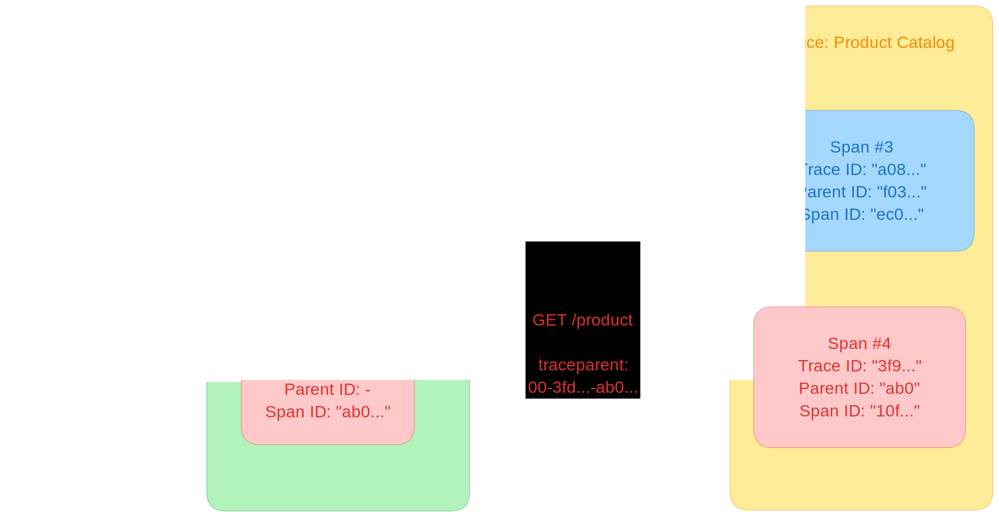

With context propagation, [signals](../signals/) ([traces](../signals/traces/),
[metrics](../signals/metrics/), and [logs](../signals/logs/)) can be correlated
with each other, regardless of where they are generated. Although not limited to
tracing, context propagation allows [traces](../signals/traces/) to build causal
information about a system across services that are arbitrarily distributed
across process and network boundaries.

To understand context propagation, you need to understand two separate concepts:
context and propagation.

## Context

Context is an object that contains the information for the sending and receiving
service, or [execution unit](/docs/specs/otel/glossary/#execution-unit), to
correlate one signal with another.

When Service A calls Service B, Service A includes a trace ID and a span ID as
part of the context. Service B uses these values to create a new span that
belongs to the same trace, setting the span from Service A as its parent. This
makes it possible to track the full flow of a request across service boundaries.

## Propagation

Propagation is the mechanism that moves context between services and processes.
It serializes or deserializes the context object and provides the relevant
information to be propagated from one service to another.

Propagation is usually handled by instrumentation libraries and is transparent
to the user. In the event that you need to manually propagate context, you can
use the [Propagators API](/docs/specs/otel/context/api-propagators/).

OpenTelemetry maintains several official propagators. The default propagator
uses the headers specified by the
[W3C TraceContext](https://www.w3.org/TR/trace-context/) specification.

## Example

A service called `Frontend` that provides different HTTP endpoints such as
`POST /cart/add` and `GET /checkout/` reaches out to a downstream service
`Product Catalog` via an HTTP endpoint `GET /product` to receive details on
products that a user wants to add to the cart or that are part of the checkout.
To understand activities in the `Product Catalog` service within the context of
requests coming from `Frontend`, the context (here: Trace ID and Span ID as
"Parent ID") is propagated using the `traceparent` header as it is defined in
the W3C TraceContext specification. This means the IDs are embedded in the
fields of the header:

```text
<version>-<trace-id>-<parent-id>-<trace-flags>
```

For example:

```text
00-a0892f3577b34da6a3ce929d0e0e4736-f03067aa0ba902b7-01
```

### Traces

As mentioned, context propagation allows traces to build causal information
across services. In this example, the two calls to the HTTP endpoint
`GET /product` of service `Product Catalog` can be correlated with their
upstream calls in service `Frontend` by extracting the remote context from the
`traceparent` header and injecting it into the local context to set the Trace ID
and Parent ID. With that, it is possible in a [backend](/ecosystem/vendors) like
[Jaeger](https://jaegertracing.io) to see two requests as spans of one trace.



### Logs

OpenTelemetry SDKs are able to automatically correlate logs with traces. This
means they can inject context (Trace ID, Span ID) into a log record. This not
only enables you to see logs in the context of the trace and span they belong
to, but it also enables you to see logs that belong together across service or
execution unit boundaries.

### Metrics

In the case of metrics, context propagation enables you to aggregate
measurements in that context. For example, instead of only looking at the
response time of all the `GET /product` requests, you can also get metrics for
combinations of `POST /cart/add > GET /product` and
`GET /checkout < GET /product`.

| Name                            | Calls Per Second | Average Response Time |
| ------------------------------- | ---------------- | --------------------- |
| `* > GET /product`              | 370              | 300ms                 |
| `POST /card/add > GET /product` | 330              | 130ms                 |
| `GET /checkout > GET /product`  | 40               | 1703ms                |

## Custom Context Propagation

For most use cases, you will find
[instrumentation libraries or native library instrumentation](/docs/concepts/instrumentation/libraries/)
that handle the context propagation for you. In some cases no such support is
available and you want to create that support for yourself. To do so you need to
leverage the previously mentioned Propagators API:

- On the side of the sender, the context is
  [injected](/docs/specs/otel/context/api-propagators/#inject) into the carrier,
  for example, into the headers of an HTTP request. In other cases, you need to
  find a place that can store metadata for your request.
- On the receiving side, the context is
  [extracted](/docs/specs/otel/context/api-propagators/#extract) from the
  carrier. Again, in the case of HTTP, this is retrieved from the headers. In
  other cases, you pick the place you chose on the sending side to store the
  context.

Note that it is possible to propagate context in protocols that do not have a
dedicated field for metadata, but you have to make sure that on the receiving
side they are extracted and removed before the data is processed, otherwise you
may create undefined behavior.

For the following languages a step-by-step tutorial exists for custom context
propagation:

- [Erlang](/docs/languages/erlang/propagation/#manual-context-propagation)
- [JavaScript](/docs/languages/js/propagation/#manual-context-propagation)
- [PHP](/docs/languages/php/propagation/#manual-context-propagation)
- [Python](/docs/languages/python/propagation/#manual-context-propagation)

## Support in Language SDKs

For the individual language-specific implementations of the OpenTelemetry API &
SDK, you will find details on the support of context propagation in the
respective documentation pages:

- [C++](/docs/languages/cpp/instrumentation/#context-propagation)
- .NET
- [Erlang](/docs/languages/erlang/propagation/)
- [Go](/docs/languages/go/instrumentation/#propagators-and-context)
- [Java](/docs/languages/java/api/#context-api)
- [JavaScript](/docs/languages/js/propagation/)
- [PHP](/docs/languages/php/propagation/)
- [Python](/docs/languages/python/propagation/)
- [Ruby](/docs/languages/ruby/instrumentation/#context-propagation)
- Rust
- Swift

{}

For languages .NET, Rust, and Swift, the language-specific documentation for
context propagation is missing. If you know any of those languages and are
interested to help, [learn how you can contribute](/docs/contributing/)!

{}

## Specification

To learn more about context propagation, see the
[Context specification](/docs/specs/otel/context/).
