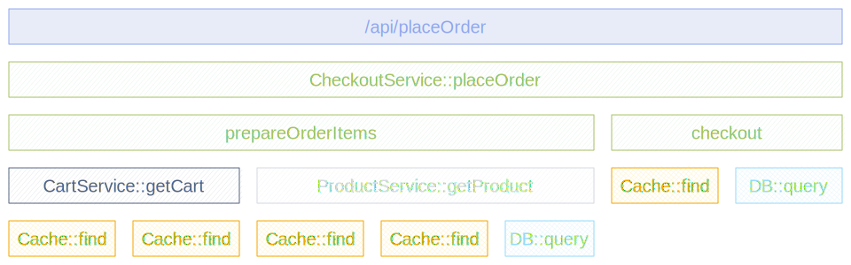

The [Instrumentation Scope](/docs/specs/otel/glossary/#instrumentation-scope)
represents a logical unit within the application code with which the emitted
telemetry can be associated.

It is typically the developer’s choice to decide what denotes a reasonable
instrumentation scope, e.g. a module, a package or a class can be chosen as
instrumentation scope. In the case of a library or framework, it is a common
approach to use an identifier as scope that is unique to the library or
framework, such as a fully qualified name and version of the library or
framework. If the library itself does not have built-in OpenTelemetry instrumentation,
and an Instrumentation Library is used instead, it is recommended to use the
name and version of the Instrumentation Library as the instrumentation scope.

The Instrumentation Scope is defined by a name and version pair when a Tracer,
Meter or Logger instance is obtained from a provider. Each span, metric or log
record created by the instance will be associated with the provided
Instrumentation Scope.

In your observability backend, this allows you to slice and dice your telemetry
data by the Instrumentation Scope, e.g. to see which of your users are using
which version of a library and what the performance of that library version is
or to pin point a problem to a specific module of your application.

The diagram below illustrates a trace with multiple instrumentation scopes. The
different scopes are represented by different colors:

- At the top the `/api/placeOrder` span is generated by the used HTTP framework
- The spans in green (`CheckoutService::placeOrder`, `prepareOrderItems` and
  `checkout`) are application code, grouped by the `CheckoutService` class.
- The spans for `CartService::getCart` and `ProductService::getProduct` are also
  application code, grouped by the `CartService` and `ProductService` classes.
- The spans in orange (`Cache::find`) and light blue (`DB::query`) are library
  code, grouped by the library name and version.

