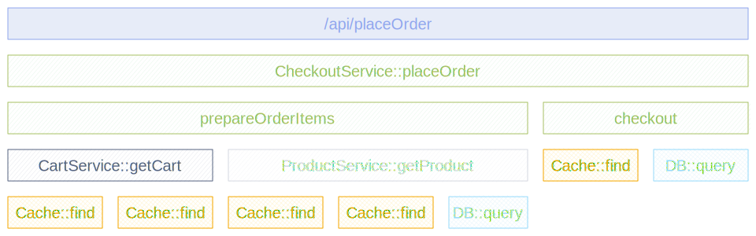

The [Instrumentation scope](/docs/specs/otel/common/instrumentation-scope/)
represents a logical unit within the application code with which the emitted
telemetry can be associated.

Developers can decide what denotes a reasonable instrumentation scope. For
example, they can select a module, a package, or a class as the instrumentation
scope. In the case of a library or framework, a common approach is to use an
identifier as scope that is unique to the library or framework, such as a fully
qualified name and version of the library or framework. If the library itself
doesn't have built-in OpenTelemetry instrumentation, and an instrumentation
library is used instead, use the name and version of the instrumentation library
as the instrumentation scope.

The instrumentation scope is defined by a name and version pair when a tracer,
meter or logger instance is obtained from a provider. Each span, metric, or log
record created by the instance is then associated with the provided
instrumentation scope.

In your observability backend, scoping allows you to slice and dice your
telemetry data by scope, for example to see which of your users are using which
version of a library and what the performance of that library version is or to
pin point a problem to a specific module of your application.

The following diagram illustrates a trace with multiple instrumentation scopes.
The different scopes are represented by different colors:

- At the top the `/api/placeOrder` span is generated by the used HTTP framework.
- The spans in green (`CheckoutService::placeOrder`, `prepareOrderItems` and
  `checkout`) are application code, grouped by the `CheckoutService` class.
- The spans for `CartService::getCart` and `ProductService::getProduct` are also
  application code, grouped by the `CartService` and `ProductService` classes.
- The spans in orange (`Cache::find`) and light blue (`DB::query`) are library
  code, grouped by the library name and version.

