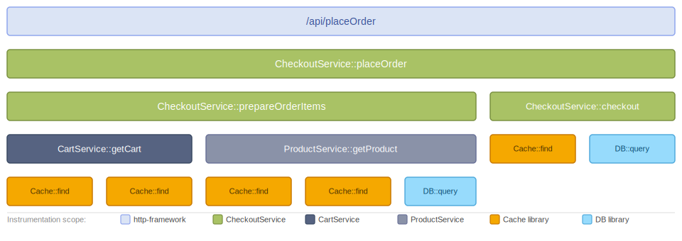

The [instrumentation scope](/docs/specs/otel/common/instrumentation-scope/) is a
logical unit of software with which emitted telemetry is associated. It can
represent a module, package, class, library, or framework — any meaningful
boundary that a developer chooses to distinguish one source of telemetry from
another.

## How a scope is defined

A scope is identified by a `(name, version, schema_url, attributes)` tuple,
where `version`, `schema_url`, and `attributes` are optional. The `name` should
uniquely identify the logical unit of software — for example, the fully
qualified name of a library, class, or module.

You specify the scope when obtaining a tracer, meter, or logger from a provider.
Every span, metric, and log record produced by that instance is then tagged with
the scope:

- **For libraries and frameworks**: use the library's fully qualified name and
  version as the scope. If you are writing an instrumentation library for a
  library that has no built-in OpenTelemetry support, use the name and version
  of the instrumentation library itself.
- **For application code**: a common choice is the class or module name, such as
  `CheckoutService`.

## Why scopes matter

In your observability backend, you can filter, group, and compare telemetry by
scope. This makes it possible to identify which library version is causing
latency, isolate signals from a specific module, or compare behavior across
versions of the same component.

## Scopes in a trace

The following diagram shows a trace with spans from six different
instrumentation scopes, color-coded and identified in the legend:

- The `http-framework` scope produces the root `/api/placeOrder` span.
- The `CheckoutService` scope produces `CheckoutService::placeOrder`,
  `CheckoutService::prepareOrderItems`, and `CheckoutService::checkout`. All
  three spans share the same instrumentation scope because they are created by
  the same tracer instance, obtained with the name `CheckoutService`.
- The `CartService` and `ProductService` scopes each produce a span from their
  respective application components.
- The `Cache library` and `DB library` scopes produce spans from library code,
  grouped by library name and version.

