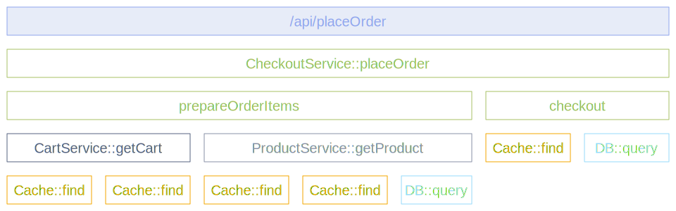

## Introduction

The [Instrumentation Scope](/docs/specs/otel/common/instrumentation-scope/)
represents a logical unit of software with which the emitted telemetry can be
associated. It provides a way to group and identify the source of telemetry
data, making it easier to analyze and troubleshoot issues in your observability
backend.

## Definition

Developers can decide what denotes a reasonable instrumentation scope. Common
choices include:

- A module or package
- A class
- An instrumentation library
- A plugin or extension

The instrumentation scope is defined by a tuple of:

- **Name** (required): A unique identifier for the scope, typically a fully
  qualified name of the software unit (for example, the library name or class name)
- **Version** (optional): The version of the software unit
- **Schema URL** (optional): A URL that identifies the
  [Telemetry Schema](/docs/specs/otel/schemas/) that the emitted telemetry
  conforms to
- **Attributes** (optional): Additional information about the scope, such as a
  repository URL

This tuple should uniquely identify the logical unit of software that emits the
telemetry.

## How it works

The instrumentation scope is used to obtain a
[Tracer](/docs/concepts/signals/traces/#tracer),
[Meter](/docs/concepts/signals/metrics/#meter), or
[Logger](/docs/concepts/signals/logs/#logger) from a provider. Each span,
metric, or log record created by those instances is then associated with the
provided instrumentation scope.

For example, in a library or framework, a common approach is to use the fully
qualified name and version of the library as the instrumentation scope:

```python
from opentelemetry import trace

tracer = trace.get_tracer(
    "com.example.checkout",  # Scope name
    "1.2.3",                 # Scope version
    schema_url="https://opentelemetry.io/schemas/1.21.0"
)
```

If the library itself doesn't have built-in OpenTelemetry instrumentation, and
an instrumentation library is used instead, use the name and version of the
instrumentation library as the instrumentation scope.

## Benefits

In your observability backend, scoping allows you to slice and dice your
telemetry data by scope. This is useful for:

- Seeing which users are using which version of a library
- Analyzing the performance of specific library versions
- Pinpointing problems to a specific module of your application
- Filtering telemetry by the component that generated it

## Example: Trace with multiple scopes

The following diagram illustrates a trace with multiple instrumentation scopes.
The different scopes are represented by different colors:

- At the top, the `/api/placeOrder` span (light blue) is generated by the HTTP
  framework, using its own instrumentation scope.
- The spans in green (`CheckoutService::placeOrder`,
  `CheckoutService::prepareOrderItems`, and `CheckoutService::checkout`) are
  application code. These spans share the same instrumentation scope, identified
  by the `CheckoutService` class name and version.
- The spans for `CartService::getCart` and `ProductService::getProduct` (gray)
  are also application code, each grouped by their respective class names as
  instrumentation scopes.
- The spans in orange (`Cache::find`) and light blue (`DB::query`) are from
  library code, each using their library name and version as the
  instrumentation scope.



## Common use cases

Here are some typical scenarios for using instrumentation scopes:

- **Instrumentation libraries**: Use the library name, version, and attributes
  containing additional library information as the scope.
- **Database instrumentation**: Database access can be instrumented with its own
  name and version (for example, `db.system.name`). This is useful for APIs that
  abstract access to different underlying databases, such as JDBC or SQLAlchemy.
- **Message consumers/producers**: Clients consuming or producing messages can
  use their name, version, and client ID to define the instrumentation scope.
- **Internal application components**: Components emitting their own telemetry
  can rely on instrumentation scope attributes to differentiate themselves when
  multiple instances of the same type exist.
