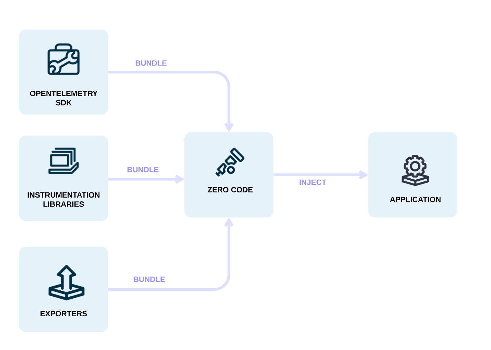

As [ops](/docs/getting-started/ops/) you might want to add observability to one
or more applications without having to edit the source. OpenTelemetry lets you
quickly gain some observability for a service without having to use the
OpenTelemetry API & SDK for
[code-based instrumentation](/docs/concepts/instrumentation/code-based).

**Automatic instrumentation** (or **Zero-Code Instrumentation**) adds the
OpenTelemetry API and SDK capabilities to your application typically as an agent
or agent-like installation. The specific mechanisms involved may differ by
language, ranging from bytecode manipulation, monkey patching, or eBPF to inject
calls to the OpenTelemetry API and SDK into your application.

Typically, automatic instrumentation adds instrumentation for the libraries
you're using. This means that requests and responses, database calls, message
queue calls, and so forth are what are instrumented. Your application's code,
however, is not typically instrumented. To instrument your code, you'll need to
use [code-based instrumentation](/docs/concepts/instrumentation/code-based).

Additionally, automatic instrumentation lets you configure the
[Instrumentation Libraries](/docs/concepts/instrumentation/libraries) and
[exporters](/docs/concepts/components/#exporters) loaded.

You can configure automatic instrumentation through environment variables and
other language-specific mechanisms, such as system properties or arguments
passed to initialization methods. To get started, you only need a service name
configured so that you can identify the service in the observability backend of
your choice.

Other configuration options are available, including:

- Data source specific configuration
- Exporter configuration
- Propagator configuration
- Resource configuration

The OpenTelemetry project provides Automatic Instrumentation solutions for many
technologies, you can learn more about these on the page
[Automatic & Assisted Instrumentation](/automatic).
