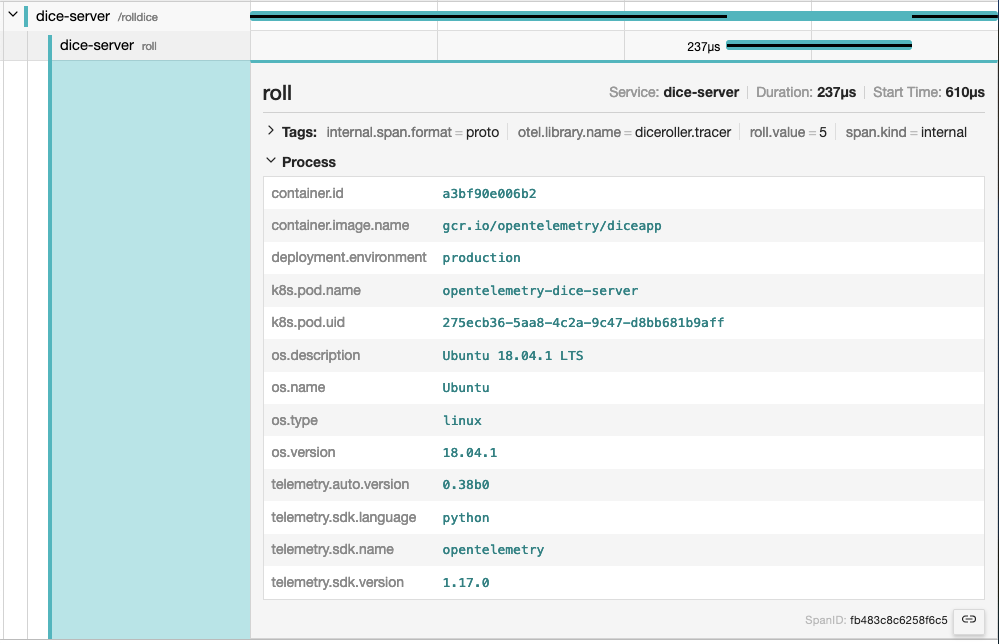

## Introduction

{}

If you use [Jaeger](https://www.jaegertracing.io/) as your observability
backend, resource attributes are grouped under the **Process** tab:



In practice a resource will be associated with the `TraceProvider` or
`MetricProvider` when they are created. The association can not be changed
later. When associated, all metrics and spans produced from a `Tracer` or
`Meter` from the provider will have the resource associated with them.

## Semantic Attributes with SDK-provided Default Value

There are attributes which must be provided by the OpenTelemetry SDK. One of
them is the `service.name`, which represents the logical name of the service.
The SDK will provide a default value for this attribute, but it is recommended
to set it explicitly, either in code or via populating the environment variable
`OTEL_SERVICE_NAME`

Additionally, the SDK will also provide a resource with attributes
`telemetry.sdk.name`, `telemetry.sdk.language` and `telemetry.sdk.version` to
identify itself.

## Resource Detectors

Most language-specific SDKs provide a set of resource detectors that can be used
to automatically detect resource information from the environment. Common
resource detectors include:

- [Operating System](/docs/specs/semconv/resource/os/)
- [Host](/docs/specs/semconv/resource/host/)
- [Process and Process Runtime](/docs/specs/semconv/resource/process/)
- [Container](/docs/specs/semconv/resource/container/)
- [Kubernetes](/docs/specs/semconv/resource/k8s/)
- [Cloud-Provider-Specific Attributes](/docs/specs/semconv/resource/#cloud-provider-specific-attributes)
- [and more](/docs/specs/semconv/resource/)

## Custom resources

You can also provide your own resource attributes. You can either provide them
in code or via populating the environment variable `OTEL_RESOURCE_ATTRIBUTES`.
If applicable, use the
[semantic conventions for your resource attributes](https://opentelemetry.io/docs/specs/semconv/resource).
For example, you can provide the name of your
[deployment environment](/docs/specs/semconv/resource/deployment-environment/)
using `deployment.environment`:

```shell
env OTEL_RESOURCE_ATTRIBUTES=deployment.environment=production yourApp
```
