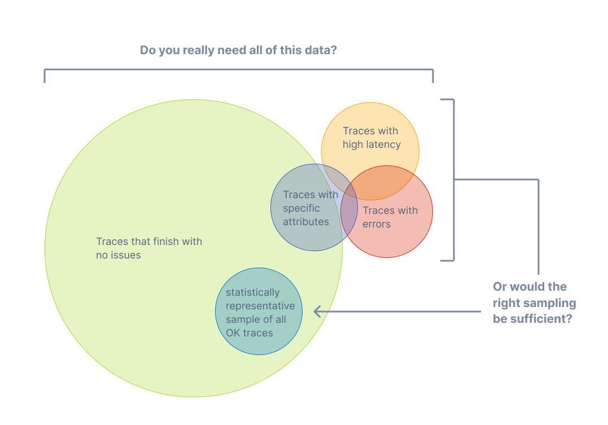
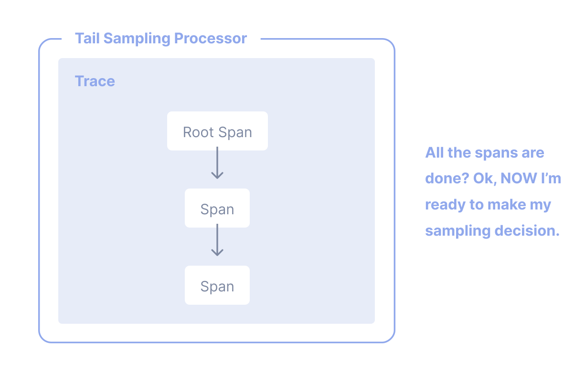

With [traces](/docs/concepts/signals/traces), you can observe requests as they
move from one service to another in a distributed system. Tracing is highly
practical for both high-level and in-depth analysis of systems.

However, if the large majority of your requests are successful and finish with
acceptable latency and no errors, you do not need 100% of your traces to
meaningfully observe your applications and systems. You just need the right
sampling.

## Terminology

It's important to use consistent terminology when discussing sampling. A trace
or span is considered "sampled" or "not sampled":

- **Sampled**: A trace or span is processed and exported. Because it is chosen
  by the sampler as a representative of the population, it is considered
  "sampled".
- **Not sampled**: A trace or span is not processed or exported. Because it is
  not chosen by the sampler, it is considered "not sampled".

Sometimes, the definitions of these terms get mixed up. You might find someone
states that they are "sampling out data" or that data not processed or exported
is considered "sampled". These are incorrect statements.

## Why sampling?

Sampling is one of the most effective ways to reduce the costs of observability
without losing visibility. Although there are other ways to lower costs, such as
filtering or aggregating data, these other methods do not adhere to the concept
of representativeness, which is crucial when performing in-depth analysis of
application or system behavior.

Representativeness is the principle that a smaller group can accurately
represent a larger group. Additionally, representativeness can be mathematically
verified, meaning that you can have high confidence that a smaller sample of
data accurately represents the larger group.

Additionally, the more data you generate, the less data you actually need to
have a representative sample. For high-volume systems, it is quite common for a
sampling rate of 1% or lower to very accurately represent the other 99% of data.

### When to sample

Consider sampling if you meet any of the following criteria:

- You generate 1000 or more traces per second.
- Most of your trace data represents healthy traffic with little variation in
  data.
- You have some common criteria, like errors or high latency, that usually means
  something is wrong.
- You have domain-specific criteria you can use to determine relevant data
  beyond errors and latency.
- You can describe some common rules that determine if data should be sampled or
  dropped.
- You have a way to tell your services apart, so that high- and low-volume
  services are sampled differently.
- You have the ability to route unsampled data (for "just in case" scenarios) to
  low-cost storage systems.

Finally, consider your overall budget. If you have limited budget for
observability, but can afford to spend time to effectively sample, then sampling
can generally be worth it.

### When not to sample

Sampling might not be appropriate for you. You might want to avoid sampling if
you meet any of the following criteria:

- You generate very little data (tens of small traces per second or lower).
- You only use observability data in aggregate, and can thus pre-aggregate data.
- You are bound by circumstances such as regulation that prohibit dropping data
  (and cannot route unsampled data to low-cost storage).

Finally, consider the following three costs associated with sampling:

1. The direct cost of compute to effectively sample data, such as a tail
   sampling proxy.
2. The indirect engineering cost of maintaining effective sampling methodologies
   as more applications, systems, and data are involved.
3. The indirect opportunity cost of missing critical information with
   ineffective sampling techniques.

Sampling, while effective at reducing observability costs, might introduce other
unexpected costs if not performed well. It could be cheaper to allocate more
resources for observability instead, either with a vendor or compute when
self-hosting, depending on your observability backend, the nature of your data,
and your attempts to sample effectively.

## Head Sampling

Head sampling is a sampling technique used to make a sampling decision as early
as possible. A decision to sample or drop a span or trace is not made by
inspecting the trace as a whole.

For example, the most common form of head sampling is
[Consistent Probability Sampling](/docs/specs/otel/trace/tracestate-probability-sampling/#consistent-sampling-decision).
This is also referred to as Deterministic Sampling. In this case, a sampling
decision is made based on the trace ID and the desired percentage of traces to
sample. This ensures that whole traces are sampled - no missing spans - at a
consistent rate, such as 5% of all traces.

The upsides to head sampling are:

- Easy to understand
- Easy to configure
- Efficient
- Can be done at any point in the trace collection pipeline

The primary downside to head sampling is that it is not possible to make a
sampling decision based on data in the entire trace. For example, you cannot
ensure that all traces with an error within them are sampled with head sampling
alone. For this situation and many others, you need tail sampling.

## Tail Sampling

Tail sampling is where the decision to sample a trace takes place by considering
all or most of the spans within the trace. Tail Sampling gives you the option to
sample your traces based on specific criteria derived from different parts of a
trace, which isn’t an option with Head Sampling.

Some examples of how you can use Tail Sampling include:

- Always sampling traces that contain an error
- Sampling traces based on overall latency
- Sampling traces based on the presence or value of specific attributes on one
  or more spans in a trace; for example, sampling more traces originating from a
  newly deployed service
- Applying different sampling rates to traces based on certain criteria, such as
  when traces only come from low-volume services versus traces with high-volume
  services.

As you can see, tail sampling allows for a much higher degree of sophistication
in how you sample data. For larger systems that must sample telemetry, it is
almost always necessary to use Tail Sampling to balance data volume with the
usefulness of that data.

There are three primary downsides to tail sampling today:

1. Tail sampling can be difficult to implement. Depending on the kind of
   sampling techniques available to you, it is not always a "set and forget"
   kind of thing. As your systems change, so too will your sampling strategies.
   For a large and sophisticated distributed system, rules that implement
   sampling strategies can also be large and sophisticated.
2. Tail sampling can be difficult to operate. The component(s) that implement
   tail sampling must be stateful systems that can accept and store a large
   amount of data. Depending on traffic patterns, this can require dozens or
   even hundreds of compute nodes that all utilize resources differently.
   Furthermore, a tail sampler might need to "fall back" to less computationally
   intensive sampling techniques if it is unable to keep up with the volume of
   data it is receiving. Because of these factors, it is critical to monitor
   tail-sampling components to ensure that they have the resources they need to
   make the correct sampling decisions.
3. Tail samplers often end up as vendor-specific technology today. If you're
   using a paid vendor for Observability, the most effective tail sampling
   options available to you might be limited to what the vendor offers.

Finally, for some systems, tail sampling might be used in conjunction with Head
Sampling. For example, a set of services that produce an extremely high volume
of trace data might first use head sampling to sample only a small percentage of
traces, and then later in the telemetry pipeline use tail sampling to make more
sophisticated sampling decisions before exporting to a backend. This is often
done in the interest of protecting the telemetry pipeline from being overloaded.

## Support

### Collector

The OpenTelemetry Collector includes the following sampling processors:

- [Probabilistic Sampling Processor](https://github.com/open-telemetry/opentelemetry-collector-contrib/tree/main/processor/probabilisticsamplerprocessor)
- [Tail Sampling Processor](https://github.com/open-telemetry/opentelemetry-collector-contrib/tree/main/processor/tailsamplingprocessor)

### Language SDKs

For the individual language-specific implementations of the OpenTelemetry API &
SDK, you will find support for sampling in the respective documentation pages:

{}

### Vendors

Many [vendors](/ecosystem/vendors) offer comprehensive sampling solutions that
incorporate head sampling, tail sampling, and other features that can support
sophisticated sampling needs. These solutions may also be optimized specifically
for the vendor's backend. If you are sending telemetry to a vendor, consider
using their sampling solutions.
