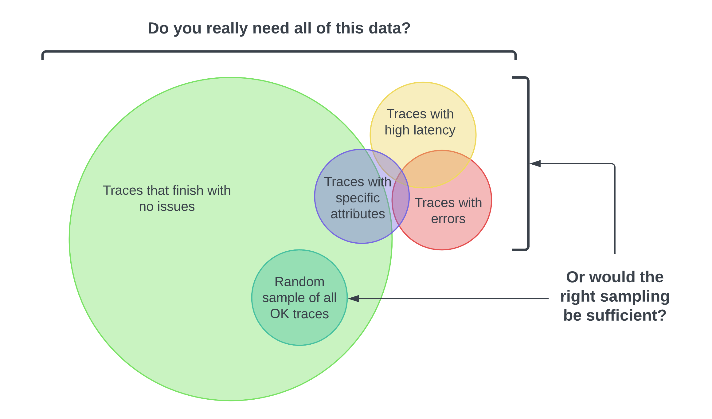

With distributed tracing, you observe requests as they move from one service to
another in a distributed system. It’s superbly practical for a number of
reasons, such as understanding your service connections and diagnosing latency
issues, among many other benefits.

However, if the majority of all your requests are successful 200s and finish
without unacceptable latency or errors, do you really need all that data? Here’s
the thing—you don’t always need a ton of data to find the right insights. _You
just need the right sampling of data._

The idea behind sampling is to control the spans you send to your observability
backend, resulting in lower ingest costs. Different organizations will have
their own reasons for not just _why_ they want to sample, but also _what_ they
want to sample. You might want to customize your sampling strategy to:

- **Manage costs**: If you have a high volume of telemetry, you risk incurring
  heavy charges from a telemetry backend vendor or cloud provider to export and
  store every span.
- **Focus on interesting traces**: For example, your frontend team may only want
  to see traces with specific user attributes.
- **Filter out noise**: For example, you may want to filter out health checks.

## Terminology

It's important to use consistent terminology when discussing sampling. A trace
or span is considered "sampled" or "not sampled":

- **Sampled**: A trace or span is processed and exported. Because it is chosen
  by the sampler as a representive of the population, it is considered
  "sampled".
- **Not sampled**: A trace or span is not processed or exported. Because it is
  not chosen by the sampler, it is considered "not sampled".

Sometimes, the definitions of these terms get mixed up. You may find someone
state that they are "sampling out data" or that data not processed or exported
is considered "sampled". These are incorrect statements.

## Head Sampling

Head Sampling is a sampling technique used to make a sampling decision as early
as possible. A decision to sample or drop a span or trace is not made by
inspecting the trace as a whole.

For example, the most common form of Head Sampling is Consistent Probability
Sampling. It may also be referred to as Deterministic Sampling. In this case, a
sampling decision is made based on the trace ID and a desired percentage of
traces to sample. This ensures that whole traces are sampled - no missing
spans - at a consistent rate, such as 5% of all traces.

The upsides to Head Sampling are:

- Easy to understand
- Easy to configure
- Efficient
- Can be done at any point in the trace collection pipeline

The primary downside to Head Sampling is that it is not possible make a sampling
decision based on data in the entire trace. This means that Head Sampling is
effective as a blunt instrument, but is wholly insufficient for sampling
strategies that must take whole-system information into account. For example, it
is not possible to use Head Sampling to ensure that all traces with an error
within them are sampled. For this, you need Tail Sampling.

## Tail Sampling

Tail Sampling is where the decision to sample a trace happens _after_ all the
spans in a request have been completed. Tail Sampling gives you the option to
sample your traces based on specific criteria, which isn’t an option with Head
Sampling.

Some examples of how you can use Tail Sampling include:

- Always sampling traces that contain an error
- Sampling traces based on overall latency
- Sampling traces based on the presence or value of specific attributes on one
  or more spans in a trace; for example, sampling more traces originating from a newly deployed service
- Applying different sampling rates to traces based on certain criteria

As you can see, Tail Sampling allows for a much higher degree of sophistication.
For larger systems that must sample telemetry, it is almost always necessary to
use Tail Sampling to balance data volume with usefulness of that data.

There are three primary downsides to Tail Sampling today:

- Tail Sampling can be sophisticated to implement. Depending on the kind of
  sampling techniques available to you, it is not always a "set and forget" kind
  of setting. As your systems change, so too will your sampling strategies. For
  a larger and more sophisticated your distributed system, sampling strategies
  can be large and sophisticated.
- Tail Sampling can be sophisticated to operate. The component(s) that implement
  Tail Sampling must be stateful systems that can accept and store a large
  amount of data. Depending on traffic patterns, this can require dozens or even
  hundreds of nodes that all utilize resources differently. Furthermore, a Tail
  Sampler may need to "fall back" to less computationally-intensive sampling
  techniques if it is unable to keep up with the volume of data it is receiving.
  Because of these factors, it is critical to monitor Tail Sampling components
  to ensure that they have the resources they need to make the correct sampling
  decisions.
- Tail Samplers often end up being in the domain of vendor-specific technology
  today. If you're using a paid vendor for Observability, the most effective
  Tail Sampling options available to you may be limited to what the vendor
  offers.

Finally, for some systems, Tail Sampling may be used in conjunction with Head
Sampling. For example, a set of services that produce an extremely high volume
of trace data may first use Head Sampling to only sample a small percentage of
traces, and then later in the telemetry pipeline use Tail Sampling to make more
sophisticated decisions about which traces to sample. This is often done in the
interest of protecting the telemetry pipeline from being overloaded.
