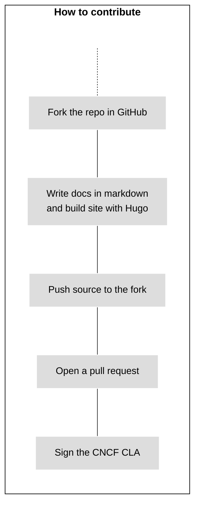
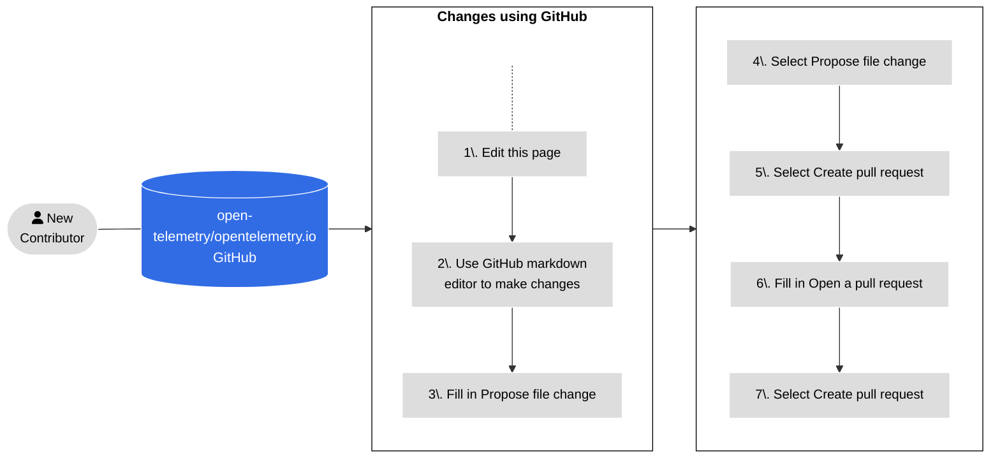
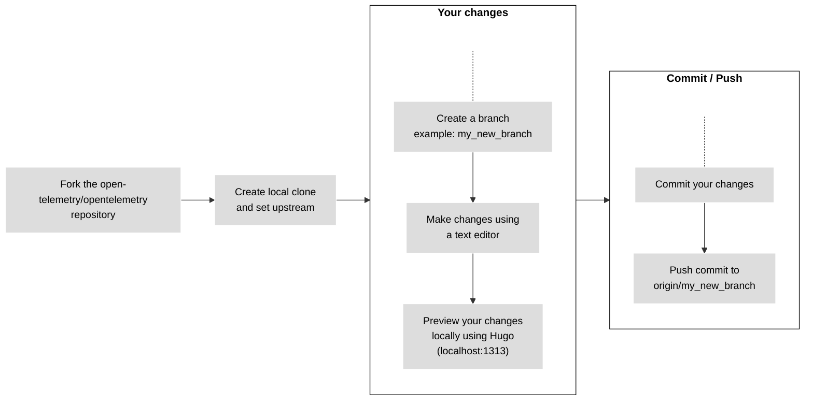
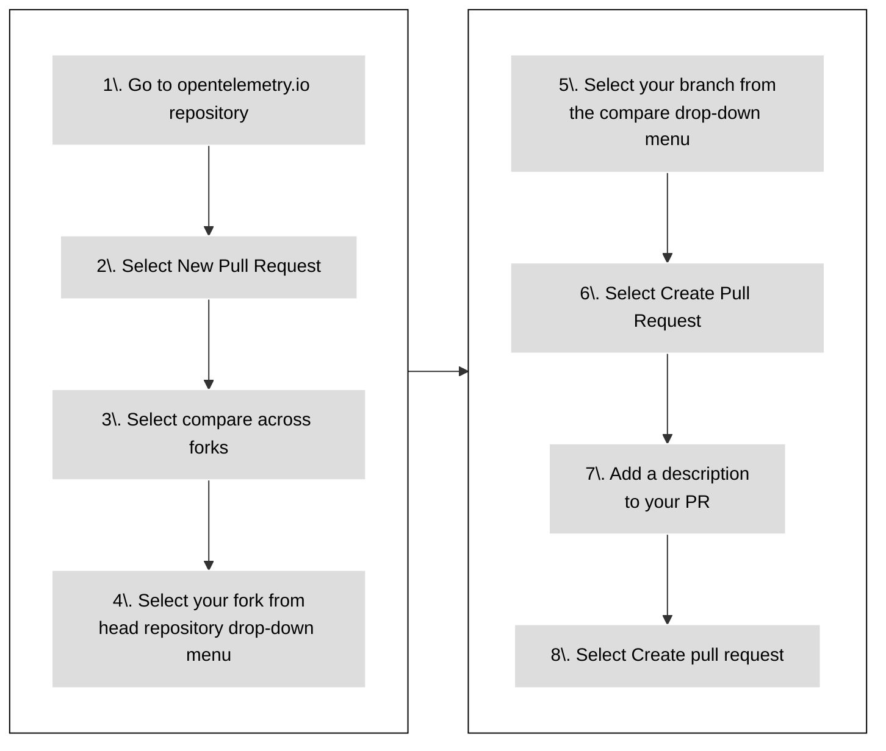

To contribute new or improve existing documentation, submit a [pull request][PR]
(PR):

- If your change is small, or you're unfamiliar with [Git], see
  [Using GitHub](#changes-using-github) to learn how to edit a page.
- Otherwise, see [Work from a local fork](#fork-the-repo) to learn how to make
  changes in your own local development environment.

{}

All contributors are required to [sign a Contributor License Agreement
(CLA)][CLA] before changes can be reviewed and merged.

[CLA]: ../prerequisites/#cla

{}

{}

Set the status of your pull request to **Draft** to let maintainers know that
the content isn't ready for review yet. Maintainers may still comment or do
high-level reviews, though they won't review the content in full until you
remove the draft status.

{}

The following figure illustrates how to contribute new documentation.



_Figure 1. Contributing new content._

## Using GitHub {#changes-using-github}

### Edit and submit changes from your browser {#page-edit-from-browser}

If you're less experienced with Git workflows, here's an easier method of
preparing and opening a new pull request (PR). Figure 2 outlines the steps and
the details follow.



_Figure 2. Steps for opening a PR using GitHub._

1. On the page where you see the issue, select the **Edit this page** option in
   the right-hand side navigation panel.

1. If you're not a member of the project, GitHub offers to create a fork of the
   repository. Select **Fork this repository**.

1. Make your changes in the GitHub editor.

1. Fill in the **Propose file change** form.

1. Select **Propose file change**.

1. Select **Create pull request**.

1. The **Open a pull request** screen appears. Your description helps reviewers
   understand your change.

1. Select **Create pull request**.

Before merging a pull request, OpenTelemetry community members review and
approve it.

If a reviewer asks you to make changes:

1. Go to the **Files changed** tab.
1. Select the pencil (edit) icon on any files changed by the pull request.
1. Make the changes requested. If there's a code suggestion, apply it.
1. Commit the changes.

When your review is complete, a reviewer merges your PR and your changes goes
live a few minutes later.

### Fixing PR check failures {#fixing-prs-in-github}

After you've submitted a PR, GitHub runs some build checks. Certain check
failures, like formatting issues, can be fixed automatically.

Add the following comment to your PR:

```text
/fix:all
```

This will trigger the OpenTelemetry bot to try to fix build issues. Or you can
issue one of the following fix commands to address a specific failure:

```text
fix:dict
fix:expired
fix:filenames
fix:format
fix:htmltest-config
fix:i18n
fix:markdown
fix:refcache
fix:submodule
fix:text
```

{}

You can also run the `fix` commands locally. For the complete list of fix
commands, run `npm run -s '_list:fix:*'`.

{}

## Working locally {#fork-the-repo}

If you're more experienced with Git, or if your changes are larger than a few
lines, work from a local fork.

Make sure you have [`git` installed] on your computer. You can also use a user
interface for Git.

Figure 3 shows the steps to follow when you work from a local fork. The details
for each step follow.



_Figure 3. Working from a local fork to make your changes._

### Fork the repository

1. Navigate to the
   [`opentelemetry.io`](https://github.com/open-telemetry/opentelemetry.io/)
   repository.
1. Select **Fork**.

### Clone and set upstream

1. In a terminal window, clone your fork and install the requirements:

   ```shell
   git clone git@github.com:<your_github_username>/opentelemetry.io.git
   cd opentelemetry.io
   npm install
   ```

1. Set the `open-telemetry/opentelemetry.io` repository as the `upstream`
   remote:

   ```shell
   git remote add upstream https://github.com/open-telemetry/opentelemetry.io.git
   ```

1. Confirm your `origin` and `upstream` repositories:

   ```shell
   git remote -v
   ```

   Output is similar to:

   ```none
   origin	git@github.com:<your_github_username>/opentelemetry.io.git (fetch)
   origin	git@github.com:<your_github_username>/opentelemetry.io.git (push)
   upstream	https://github.com/open-telemetry/opentelemetry.io.git (fetch)
   upstream	https://github.com/open-telemetry/opentelemetry.io.git (push)
   ```

1. Fetch commits from your fork's `origin/main` and
   `open-telemetry/opentelemetry.io`'s `upstream/main`:

   ```shell
   git fetch origin
   git fetch upstream
   ```

   This makes sure your local repository is up to date before you start making
   changes. Push changes from upstream to origin regularly to keep your fork in
   sync with upstream.

### Create a branch

1. Create a new branch. This example assumes the base branch is `upstream/main`:

   ```shell
   git checkout -b <my_new_branch> upstream/main
   ```

1. Make your changes using a code or text editor.

At any time, use the `git status` command to see what files you've changed.

### Commit your changes

When you are ready to submit a pull request, commit your changes.

1. In your local repository, check which files you need to commit:

   ```shell
   git status
   ```

   Output is similar to:

   ```none
   On branch <my_new_branch>
   Your branch is up to date with 'origin/<my_new_branch>'.

   Changes not staged for commit:
   (use "git add <file>..." to update what will be committed)
   (use "git checkout -- <file>..." to discard changes in working directory)

   modified:   content/en/docs/file-you-are-editing.md

   no changes added to commit (use "git add" and/or "git commit -a")
   ```

1. Add the files listed under **Changes not staged for commit** to the commit:

   ```shell
   git add <your_file_name>
   ```

   Repeat this for each file.

1. After adding all the files, create a commit:

   ```shell
   git commit -m "Your commit message"
   ```

1. Push your local branch and its new commit to your remote fork:

   ```shell
   git push origin <my_new_branch>
   ```

1. Once the changes are pushed, GitHub lets you know that you can create a PR.

### Open a new PR {#open-a-pr}

Figure 4 shows the steps to open a PR from your fork to
[opentelemetry.io](https://github.com/open-telemetry/opentelemetry.io).



_Figure 4. Steps to open a PR from your fork to_
[opentelemetry.io](https://github.com/open-telemetry/opentelemetry.io).

1. In a web browser, go to the
   [`opentelemetry.io`](https://github.com/open-telemetry/opentelemetry.io)
   repository.
1. Select **New Pull Request**.
1. Select **compare across forks**.
1. From the **head repository** drop-down menu, select your fork.
1. From the **compare** drop-down menu, select your branch.
1. Select **Create Pull Request**.
1. Add a description for your pull request:
   - **Title** (50 characters or less): Summarize the intent of the change.
   - **Description**: Describe the change in more detail.
     - If there is a related GitHub issue, include `Fixes #12345` or
       `Closes #12345` in the description so that GitHub's automation closes the
       mentioned issue after merging the PR. If there are other related PRs,
       link those as well.
     - If you want advice on something specific, include any questions you'd
       like reviewers to think about in your description.

1. Select the **Create pull request** button.

Your pull request is available in
[Pull requests](https://github.com/open-telemetry/opentelemetry.io/pulls).

After opening a PR, GitHub runs automated tests and tries to deploy a preview
using [Netlify](https://www.netlify.com/).

- If the Netlify build fails, select **Details** for more information.
- If the Netlify build succeeds, select **Details** to open a staged version of
  the OpenTelemetry website with your changes applied. This is how reviewers
  check your changes.

Other checks might also fail. See the [list of all PR checks](../pr-checks).

### Fix issues {#fix-issues}

Before submitting a change to the repository, run the following command and (i)
address any reported issues, (ii) commit any files changed by the script:

```sh
npm run test-and-fix
```

To separately test and fix all issues with your files, run:

```sh
npm run test    # Checks but does not update any files
npm run fix:all # May update files
```

To list available NPM scripts, run `npm run`. See [PR checks](../pr-checks) for
more information on pull request checks and how to fix errors automatically.

### Preview your changes {#preview-locally}

Preview your changes locally before pushing them or opening a pull request. A
preview lets you catch build errors or Markdown formatting problems.

To build and serve the site locally with Hugo, run the following command:

```shell
npm run serve
```

Navigate to <http://localhost:1313> in your web browser to see the local
preview. Hugo watches for changes and rebuilds the site as needed.

To stop the local Hugo instance, go back to the terminal and type `Ctrl+C`, or
close the terminal window.

### Site deploys and PR previews

If you submit a PR, Netlify creates a [deploy preview][] so that you can review
your changes. Once your PR is merged, Netlify deploys the updated site to the
production server.

> **Note**: PR previews include _draft pages_, but production builds do not.

To see deploy logs and more, visit the project's [dashboard][] -- Netlify login
required.

### PR guidelines

Before a PR gets merged, it sometimes requires a few iterations of
review-and-edit. To help us and yourself make this process as easy as possible,
we ask that you adhere to the following:

- If your PR isn't a quick fix, then **work from a fork**: Click the
  [Fork](https://github.com/open-telemetry/opentelemetry.io/fork) button at the
  top of the repository and clone the fork locally. When you are ready, raise a
  PR with the upstream repository.
- **Do not work from the `main`** branch of your fork, but create a PR-specific
  branch.
- Ensure that maintainers are
  [allowed to apply changes to your pull request](https://docs.github.com/en/pull-requests/collaborating-with-pull-requests/working-with-forks/allowing-changes-to-a-pull-request-branch-created-from-a-fork).

### Changes from reviewers

Sometimes reviewers commit to your pull request. Before making any other
changes, fetch those commits.

1. Fetch commits from your remote fork and rebase your working branch:

   ```shell
   git fetch origin
   git rebase origin/<your-branch-name>
   ```

1. After rebasing, force-push new changes to your fork:

   ```shell
   git push --force-with-lease origin <your-branch-name>
   ```

You can also solve merge conflicts from the GitHub UI.

### Merge conflicts and rebasing

If another contributor commits changes to the same file in another PR, it can
create a merge conflict. You must resolve all merge conflicts in your PR.

1. Update your fork and rebase your local branch:

   ```shell
   git fetch origin
   git rebase origin/<your-branch-name>
   ```

   Then force-push the changes to your fork:

   ```shell
   git push --force-with-lease origin <your-branch-name>
   ```

1. Fetch changes from `open-telemetry/opentelemetry.io`'s `upstream/main` and
   rebase your branch:

   ```shell
   git fetch upstream
   git rebase upstream/main
   ```

1. Inspect the results of the rebase:

   ```shell
   git status
   ```

   This results in a number of files marked as conflicted.

1. Open each conflicted file and look for the conflict markers: `>>>`, `<<<`,
   and `===`. Resolve the conflict and delete the conflict marker.

   For more information, see
   [How conflicts are presented](https://git-scm.com/docs/git-merge#_how_conflicts_are_presented).

1. Add the files to the changeset:

   ```shell
   git add <filename>
   ```

1. Continue the rebase:

   ```shell
   git rebase --continue
   ```

1. Repeat steps 2 to 5 as needed.

   After applying all commits, the `git status` command shows that the rebase is
   complete.

1. Force-push the branch to your fork:

   ```shell
   git push --force-with-lease origin <your-branch-name>
   ```

   The pull request no longer shows any conflicts.

### Merge requirements

Pull requests are merged when they comply with the following criteria:

- All reviews by approvers, maintainers, technical committee members, or subject
  matter experts have the status "Approved".
- No unresolved conversations.
- Approved by at least one approver.
- No failing PR checks.
- PR branch is up-to-date with the base branch.
- Doc page changes [do not span locales][].

[do not span locales]: ../localization/#prs-should-not-span-locales

> **Important**
>
> Do not worry too much about failing PR checks. Community members will help you
> to get them fixed, by either providing you with instructions how to fix them
> or by fixing them on your behalf.

[dashboard]: https://app.netlify.com/sites/opentelemetry/overview
[deploy preview]:
  https://www.netlify.com/blog/2016/07/20/introducing-deploy-previews-in-netlify/
[Git]: https://docs.github.com/en/get-started/using-git/about-git
[`git` installed]: https://git-scm.com/book/en/v2/Getting-Started-Installing-Git
[PR]: https://docs.github.com/en/pull-requests
