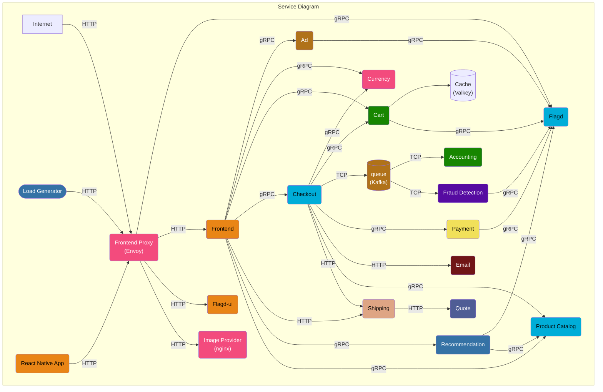
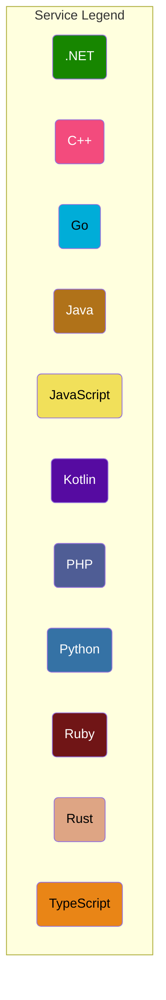
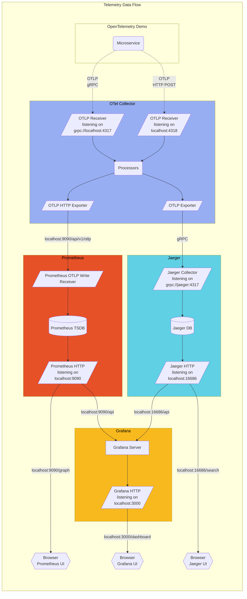

**OpenTelemetry Demo** is composed of microservices written in different
programming languages that talk to each other over gRPC and HTTP; and a load
generator which uses [Locust](https://locust.io/) to fake user traffic.

Follow these links for the current state of
[metric](/docs/demo/telemetry-features/metric-coverage/) and
[trace](/docs/demo/telemetry-features/trace-coverage/) instrumentation of the
demo applications.

The collector is configured in
[otelcol-config.yml](https://github.com/open-telemetry/opentelemetry-demo/blob/main/src/otel-collector/otelcol-config.yml),
alternative exporters can be configured here.

Find the **Protocol Buffer Definitions** in the `/pb/` directory.
