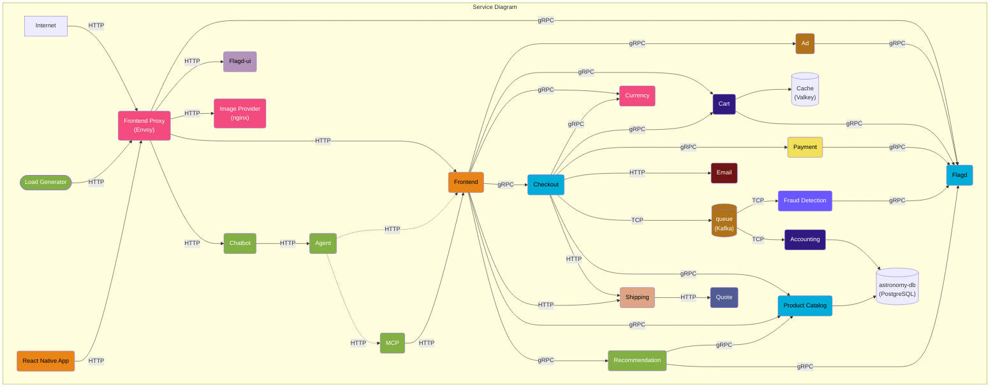
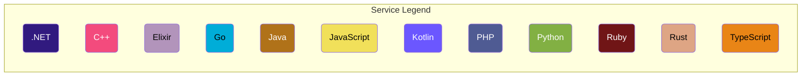
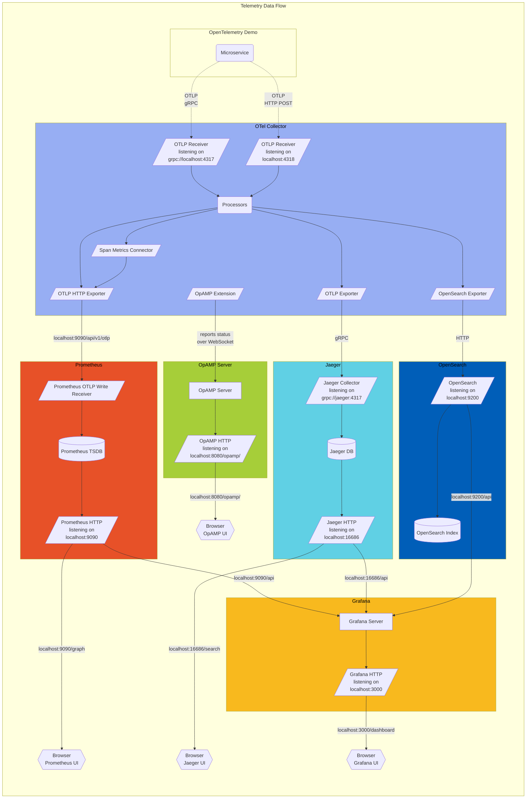

**OpenTelemetry Demo** is composed of microservices written in different
programming languages that talk to each other over gRPC and HTTP; and a load
generator which uses [Locust](https://locust.io/) to fake user traffic.

```mermaid
graph TD
subgraph Service Diagram
accounting(Accounting):::dotnet
ad(Ad):::java
agent(Agent):::python
cache[(Cache<br/>&#40Valkey&#41)]
cart(Cart):::dotnet
chatbot(Chatbot):::python
checkout(Checkout):::golang
currency(Currency):::cpp
email(Email):::ruby
flagd(Flagd):::golang
flagd-ui(Flagd-ui):::elixir
fraud-detection(Fraud Detection):::kotlin
frontend(Frontend):::typescript
frontend-proxy(Frontend Proxy <br/>&#40Envoy&#41):::cpp
image-provider(Image Provider <br/>&#40nginx&#41):::cpp
load-generator([Load Generator]):::python
mcp(MCP):::python
payment(Payment):::javascript
product-catalog(Product Catalog):::golang
quote(Quote):::php
recommendation(Recommendation):::python
shipping(Shipping):::rust
queue[(queue<br/>&#40Kafka&#41)]:::java
react-native-app(React Native App):::typescript
postgresql[(astronomy-db<br/>&#40PostgreSQL&#41)]

chatbot -->|HTTP| agent
agent -.->|HTTP| frontend
agent -.->|HTTP| mcp

ad --->|gRPC| flagd

checkout -->|gRPC| currency
checkout -->|gRPC| cart
cart --> cache
cart --->|gRPC| flagd

checkout --->|gRPC| payment
checkout --->|HTTP| email
checkout -->|TCP| queue
checkout ---->|gRPC| product-catalog
checkout -->|HTTP| shipping
shipping -->|HTTP| quote

fraud-detection --->|gRPC| flagd

frontend -->|gRPC| ad
frontend ---->|gRPC| cart
frontend -->|gRPC| currency
frontend -->|gRPC| checkout
frontend -->|HTTP| shipping
frontend -->|gRPC| product-catalog
frontend --->|gRPC| recommendation

frontend-proxy -->|gRPC| flagd
frontend-proxy -->|HTTP| flagd-ui
frontend-proxy -->|HTTP| image-provider
frontend-proxy -->|HTTP| frontend
frontend-proxy -->|HTTP| chatbot

mcp -->|HTTP| frontend

payment --->|gRPC| flagd

queue -->|TCP| fraud-detection

recommendation -->|gRPC| product-catalog
recommendation ----->|gRPC| flagd

product-catalog --> postgresql

Internet -->|HTTP| frontend-proxy
load-generator -->|HTTP| frontend-proxy
react-native-app -->|HTTP| frontend-proxy
accounting --> postgresql
queue -->|TCP| accounting

end

classDef dotnet fill:#311a7f,color:white;
classDef cpp fill:#f34b7d,color:white;
classDef elixir fill:#b294bb,color:black;
classDef golang fill:#00add8,color:black;
classDef java fill:#b07219,color:white;
classDef javascript fill:#f1e05a,color:black;
classDef kotlin fill:#6b57ff,color:white;
classDef php fill:#4F5B93,color:white;
classDef python fill:#82b043,color:white;
classDef ruby fill:#701516,color:white;
classDef rust fill:#dea584,color:black;
classDef typescript fill:#e98516,color:black;
```

```mermaid
graph LR
subgraph Service Legend
  dotnetsvc(.NET):::dotnet
  cppsvc(C++):::cpp
  elixirsvc(Elixir):::elixir
  golangsvc(Go):::golang
  javasvc(Java):::java
  javascriptsvc(JavaScript):::javascript
  kotlinsvc(Kotlin):::kotlin
  phpsvc(PHP):::php
  pythonsvc(Python):::python
  rubysvc(Ruby):::ruby
  rustsvc(Rust):::rust
  typescriptsvc(TypeScript):::typescript
end

classDef dotnet fill:#311a7f,color:white;
classDef cpp fill:#f34b7d,color:white;
classDef elixir fill:#b294bb,color:black;
classDef golang fill:#00add8,color:black;
classDef java fill:#b07219,color:white;
classDef javascript fill:#f1e05a,color:black;
classDef kotlin fill:#6b57ff,color:white;
classDef php fill:#4F5B93,color:white;
classDef python fill:#82b043,color:white;
classDef ruby fill:#701516,color:white;
classDef rust fill:#dea584,color:black;
classDef typescript fill:#e98516,color:black;
```

Follow these links for the current state of
[log](/docs/demo/telemetry-features/log-coverage/),
[metric](/docs/demo/telemetry-features/metric-coverage/) and
[trace](/docs/demo/telemetry-features/trace-coverage/) instrumentation of the
demo applications.

The collector is configured in
[otelcol-config.yml](https://github.com/open-telemetry/opentelemetry-demo/blob/main/src/otel-collector/otelcol-config.yml),
alternative exporters can be configured here.

When running with the observability stack, the Collector also connects to the
demo's OpAMP server through the
[OpAMP extension](https://github.com/open-telemetry/opentelemetry-collector-contrib/tree/main/extension/opampextension)
and reports its health, version, attributes, and effective configuration. Open
the OpAMP UI at <http://localhost:8080/opamp/> and select the Collector instance
to view the reported status.

```mermaid
graph TB
subgraph tdf[Telemetry Data Flow]
    subgraph subgraph_padding [ ]
        style subgraph_padding fill:none,stroke:none;
        %% padding to stop the titles clashing
        subgraph od[OpenTelemetry Demo]
        ms(Microservice)
        end

        ms -.->|"OTLP<br/>gRPC"| oc-grpc
        ms -.->|"OTLP<br/>HTTP POST"| oc-http

        subgraph oc[OTel Collector]
            style oc fill:#97aef3,color:black;
            oc-grpc[/"OTLP Receiver<br/>listening on<br/>grpc://localhost:4317"/]
            oc-http[/"OTLP Receiver<br/>listening on <br/>localhost:4318<br/>"/]
            oc-proc(Processors)
            oc-spanmetrics[/"Span Metrics Connector"/]
            oc-prom[/"OTLP HTTP Exporter"/]
            oc-otlp[/"OTLP Exporter"/]
            oc-opensearch[/"OpenSearch Exporter"/]

            oc-grpc --> oc-proc
            oc-http --> oc-proc

            oc-proc --> oc-prom
            oc-proc --> oc-otlp
            oc-proc --> oc-opensearch
            oc-proc --> oc-spanmetrics
            oc-spanmetrics --> oc-prom

            oc-opamp[/"OpAMP Extension"/]

        end

        oc-prom -->|"localhost:9090/api/v1/otlp"| pr-sc
        oc-otlp -->|gRPC| ja-col
        oc-opensearch -->|HTTP| os-http

        subgraph op[OpAMP Server]
            style op fill:#a6ce39,color:black;
            op-srv["OpAMP Server"]
            op-http[/"OpAMP HTTP<br/>listening on<br/>localhost:8080/opamp/"/]

            op-srv --> op-http
        end

        oc-opamp -->|"reports status<br/>over WebSocket"| op-srv

        op-b{{"Browser<br/>OpAMP UI"}}
        op-http -->|"localhost:8080/opamp/"| op-b

        subgraph pr[Prometheus]
            style pr fill:#e75128,color:black;
            pr-sc[/"Prometheus OTLP Write Receiver"/]
            pr-tsdb[(Prometheus TSDB)]
            pr-http[/"Prometheus HTTP<br/>listening on<br/>localhost:9090"/]

            pr-sc --> pr-tsdb
            pr-tsdb --> pr-http
        end

        pr-b{{"Browser<br/>Prometheus UI"}}
        pr-http ---->|"localhost:9090/graph"| pr-b

        subgraph ja[Jaeger]
            style ja fill:#60d0e4,color:black;
            ja-col[/"Jaeger Collector<br/>listening on<br/>grpc://jaeger:4317"/]
            ja-db[(Jaeger DB)]
            ja-http[/"Jaeger HTTP<br/>listening on<br/>localhost:16686"/]

            ja-col --> ja-db
            ja-db --> ja-http
        end

        subgraph os[OpenSearch]
            style os fill:#005eb8,color:black;
            os-http[/"OpenSearch<br/>listening on<br/>localhost:9200"/]
            os-db[(OpenSearch Index)]

            os-http ---> os-db
        end

        subgraph gr[Grafana]
            style gr fill:#f8b91e,color:black;
            gr-srv["Grafana Server"]
            gr-http[/"Grafana HTTP<br/>listening on<br/>localhost:3000"/]

            gr-srv --> gr-http
        end

        pr-http --> |"localhost:9090/api"| gr-srv
        ja-http --> |"localhost:16686/api"| gr-srv
        os-http --> |"localhost:9200/api"| gr-srv

        ja-b{{"Browser<br/>Jaeger UI"}}
        ja-http ---->|"localhost:16686/search"| ja-b

        gr-b{{"Browser<br/>Grafana UI"}}
        gr-http -->|"localhost:3000/dashboard"| gr-b
    end
end
```

Find the **Protocol Buffer Definitions** in the `/pb/` directory.
