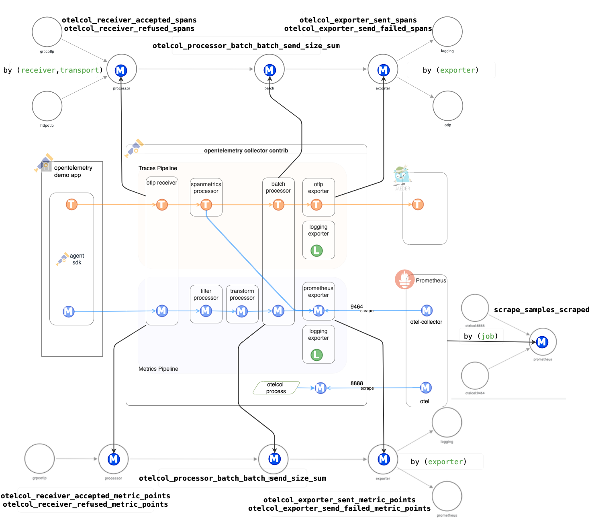

# Collector Data Flow Dashboard

Monitoring data flow through the OpenTelemetry Collector is crucial for several
reasons. Gaining a macro-level perspective on incoming data, such as sample
counts and cardinality, is essential for comprehending the collector's internal
dynamics. However, when delving into the details, the interconnections can
become complex. The Collector Data Flow Dashboard aims to demonstrate the
capabilities of the OpenTelemetry demo application, offering a solid foundation
for users to build upon.

## Overview

The diagram above provides an overview of the system components, showcasing the
configuration derived from the OpenTelemetry Collector (otelcol) configuration
file utilized by the OpenTelemetry demo application. Additionally, it highlights
the observability data (traces and metrics) flow within the system.

## Ingress/Egress Metrics

 The metrics depicted in the
diagram above are employed to monitor both egress and ingress data flows. These
metrics are generated by the otelcol process, exported on port 8888, and
subsequently scraped by Prometheus. The namespace associated with these metrics
is "otelcol," and the job name is labeled as "otel."

Labels serve as a valuable tool for identifying specific metric sets (such as
exporter, receiver, or job), enabling differentiation among metric sets within
the overall namespace. It is important to note that you will only encounter
refused metrics if the memory limits, as defined in the memory delimiter
processor, are exceeded.

### Ingress Traces Pipeline

- `otelcol_receiver_accepted_spans`
- `otelcol_receiver_refused_spans`
- `by (receiver,transport)`

### Ingress Metrics Pipeline

- `otelcol_receiver_accepted_metric_points`
- `otelcol_receiver_refused_metric_points`
- `by (receiver,transport)`

### Processor

Only batch processor is currently present in the demo application. And the
processor is used by both traces and metrics pipelines.

- `otelcol_processor_batch_batch_send_size_sum`

### Egress Traces Pipeline

- `otelcol_exporter_sent_spans`
- `otelcol_exporter_send_failed_spans`
- `by (exporter)`

### Egress Metrics Pipeline

- `otelcol_exporter_sent_metric_points`
- `otelcol_exporter_send_failed_metric_points`
- `by (exporter)`

### Prometheus Scraping

- `scrape_samples_scraped`
- `by (job)`

## Dashboard

You can access the dashboard by navigating to the Grafana UI, selecting the
"OpenTelemetry Collector Data Flow" dashboard under browse icon on the left-hand
side of the screen.

Dashboard mainly consists of four sections:

1. Process Metrics
2. Traces Pipeline
3. Metrics Pipeline
4. Prometheus Scraping

Sections 2,3 and 4 represents over all the data flow using the metrics mentioned
above. Additionally, export ratio is calculated for each pipeline to understand
the data flow.

### Export Ratio

Export ratio is basically the ratio between receiver and exporter metrics. You
can notice over the dashboard screenshot above that the export ratio on metrics
is way too high than the received metrics. This is because the demo application
is configured to generate spanmetrics which is a processor that generates
metrics from spans inside collector as illustrated in overview diagram.

### Process Metrics

Very limited but informative process metrics are added to dashboard. For
example, you might observe more than one instance of otelcol running on the
system during restarts or similar. This can be useful for understanding spikes
on dataflow.
