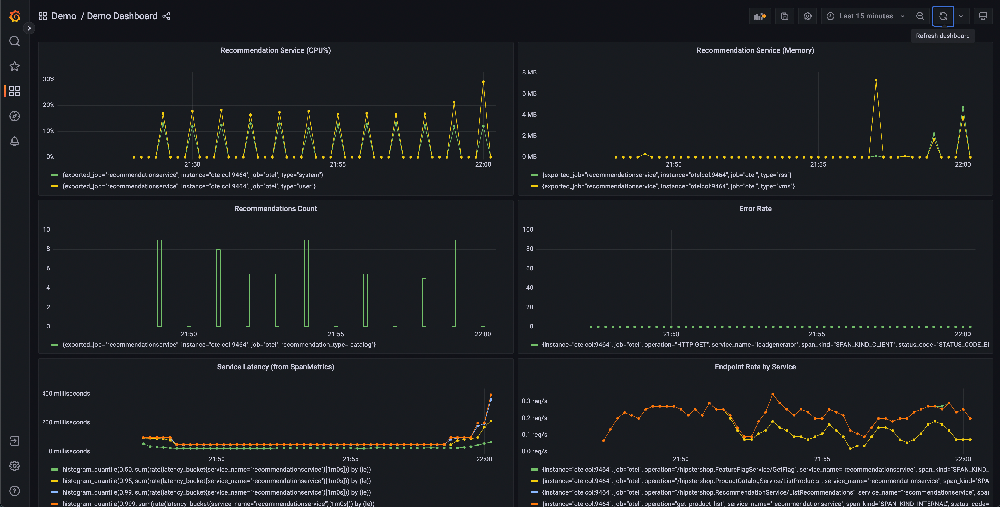
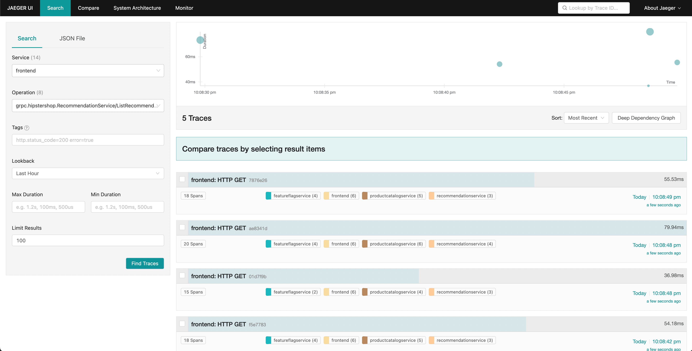
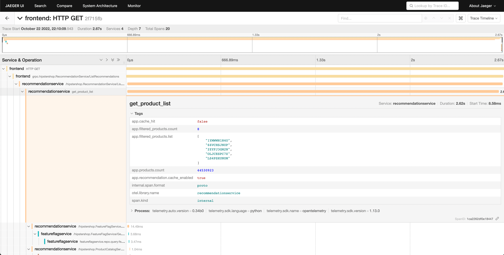

Application telemetry, such as the kind that OpenTelemetry can provide, is very
useful for diagnosing issues in a distributed system. In this scenario, we will
walk through a scenario demonstrating how to move from high-level metrics and
traces to determine the cause of a memory leak.

## Setup

To run this scenario, you will need to deploy the demo application and enable
the `recommendationServiceCacheFailure` feature flag. Let the application run
for about 10 minutes or so after enabling the feature flag to allow for data to
populate.

## Diagnosis

The first step in diagnosing a problem is to determine that a problem exists.
Often the first stop will be a metrics dashboard provided by a tool such as
Grafana.

A [demo dashboard folder](http://localhost:8080/grafana/dashboards) should exist
after launching the demo with two dashboards; One is to monitor your
OpenTelemetry Collector, and the other contains several queries and charts to
analyze latency and request rate from each service.

This dashboard will contain a number of charts, but a few should appear
interesting:

- Recommendation Service (CPU% and Memory)
- Service Latency (from SpanMetrics)
- Error Rate

Recommendation Service charts are generated from OpenTelemetry Metrics exported
to Prometheus, while the Service Latency and Error Rate charts are generated
through the OpenTelemetry Collector Span Metrics processor.

From our dashboard, we can see that there seems to be anomalous behavior in the
recommendation service -- spiky CPU utilization, as well as long tail latency in
our p95, 99, and 99.9 histograms. We can also see that there are intermittent
spikes in the memory utilization of this service.

We know that we're emitting trace data from our application as well, so let's
think about another way that we'd be able to determine that a problem exists.

Jaeger allows us to search for traces and display the end-to-end latency of an
entire request with visibility into each individual part of the overall request.
Perhaps we noticed an increase in tail latency on our frontend requests. Jaeger
allows us to then search and filter our traces to include only those that
include requests to the recommendation service.

By sorting by latency, we're able to quickly find specific traces that took a
long time. Clicking on a trace in the right panel, we're able to view the
waterfall view.

We can see that the recommendation service is taking a long time to complete its
work, and viewing the details allows us to get a better idea of what's going on.

## Confirming the Diagnosis

We can see in our waterfall view that the `app.cache_hit` attribute is set to
`false`, and that the `app.products.count` value is extremely high.

Returning to the search UI, filter to `recommendationservice` in the Service
dropdown, and search for `app.cache_hit=true` in the Tags box. Notice that
requests tend to be faster when the cache is hit. Now search for
`app.cache_hit=false` and compare the latency. You should notice some changes in
the visualization at the top of the trace list.

Now, since this is a contrived scenario, we know where to find the underlying
bug in our code. However, in a real-world scenario, we may need to perform
further searching to find out what's going on in our code, or the interactions
between services that cause it.
