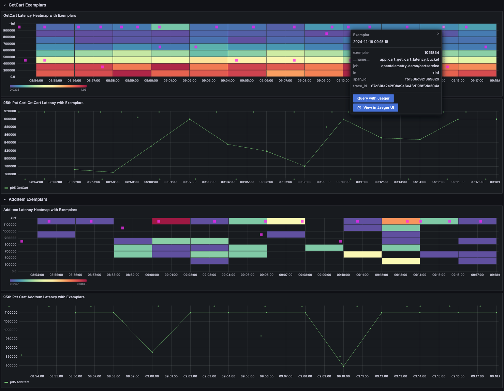

This service maintains items placed in the shopping cart by users. It interacts
with a Redis caching service for fast access to shopping cart data.

[Cart service source](https://github.com/open-telemetry/opentelemetry-demo/blob/main/src/cart/)

> **Note** OpenTelemetry for .NET uses the `System.Diagnostic.DiagnosticSource`
> library as its API instead of the standard OpenTelemetry API for Traces and
> Metrics. `Microsoft.Extensions.Logging.Abstractions` library is used for Logs.

## Traces

### Initializing Tracing

OpenTelemetry is configured in the .NET dependency injection container. The
`AddOpenTelemetry()` builder method is used to configure desired instrumentation
libraries, add exporters, and set other options. Configuration of the exporter
and resource attributes is performed through environment variables.

```cs
Action<ResourceBuilder> appResourceBuilder =
    resource => resource
        .AddContainerDetector()
        .AddHostDetector();

builder.Services.AddOpenTelemetry()
    .ConfigureResource(appResourceBuilder)
    .WithTracing(tracerBuilder => tracerBuilder
        .AddSource("OpenTelemetry.Demo.Cart")
        .AddRedisInstrumentation(
            options => options.SetVerboseDatabaseStatements = true)
        .AddAspNetCoreInstrumentation()
        .AddGrpcClientInstrumentation()
        .AddHttpClientInstrumentation()
        .AddOtlpExporter());
```

### Add attributes to auto-instrumented spans

Within the execution of auto-instrumented code you can get current span
(activity) from context.

```cs
var activity = Activity.Current;
```

Adding attributes (tags in .NET) to a span (activity) is accomplished using
`SetTag` on the activity object. In the `AddItem` function from
`services/CartService.cs` several attributes are added to the auto-instrumented
span.

```cs
activity?.SetTag("app.user.id", request.UserId);
activity?.SetTag("app.product.quantity", request.Item.Quantity);
activity?.SetTag("app.product.id", request.Item.ProductId);
```

### Add span events

Adding span (activity) events is accomplished using `AddEvent` on the activity
object. In the `GetCart` function from `services/CartService.cs` a span event is
added.

```cs
activity?.AddEvent(new("Fetch cart"));
```

## Metrics

### Initializing Metrics

Similar to configuring OpenTelemetry Traces, the .NET dependency injection
container requires a call to `AddOpenTelemetry()`. This builder configures
desired instrumentation libraries, exporters, etc.

```cs
Action<ResourceBuilder> appResourceBuilder =
    resource => resource
        .AddContainerDetector()
        .AddHostDetector();

builder.Services.AddOpenTelemetry()
    .ConfigureResource(appResourceBuilder)
    .WithMetrics(meterBuilder => meterBuilder
        .AddMeter("OpenTelemetry.Demo.Cart")
        .AddProcessInstrumentation()
        .AddRuntimeInstrumentation()
        .AddAspNetCoreInstrumentation()
        .SetExemplarFilter(ExemplarFilterType.TraceBased)
        .AddOtlpExporter());
```

### Exemplars

[Exemplars](/docs/specs/otel/metrics/data-model/#exemplars) are configured in
the Cart service with trace-based exemplar filter, which enables the
OpenTelemetry SDK to attach exemplars to metrics.

First it creates a `CartActivitySource`, `Meter` and two `Histograms`. The
histogram keeps track from the latency of the methods `AddItem` and `GetCart`,
as those are two important methods in the Cart service.

Those two methods are critical to the Cart service as users shouldn't wait too
long when adding an item to the cart, or when viewing their cart before moving
to the checkout process.

```cs
private static readonly ActivitySource CartActivitySource = new("OpenTelemetry.Demo.Cart");
private static readonly Meter CartMeter = new Meter("OpenTelemetry.Demo.Cart");
private static readonly Histogram<long> addItemHistogram = CartMeter.CreateHistogram<long>(
    "app.cart.add_item.latency",
    advice: new InstrumentAdvice<long>
    {
        HistogramBucketBoundaries = [ 500000, 600000, 700000, 800000, 900000, 1000000, 1100000 ]
    });
private static readonly Histogram<long> getCartHistogram = CartMeter.CreateHistogram<long>(
    "app.cart.get_cart.latency",
    advice: new InstrumentAdvice<long>
    {
        HistogramBucketBoundaries = [ 300000, 400000, 500000, 600000, 700000, 800000, 900000 ]
    });
```

Note that a custom bucket boundary is also defined, as the default values don't
fit the microseconds results Cart service has.

Once the variables are defined, the latency of the execution of each method is
tracked with a `StopWatch` as follows:

```cs
var stopwatch = Stopwatch.StartNew();

(method logic)

addItemHistogram.Record(stopwatch.ElapsedTicks);
```

To connect it all together, in the Traces pipeline, it is required to add the
created source. (Already present in the snippet above, but added here to
reference):

```cs
.AddSource("OpenTelemetry.Demo.Cart")
```

And, in the Metrics pipeline, the `Meter` and the `ExemplarFilter`:

```cs
.AddMeter("OpenTelemetry.Demo.Cart")
.SetExemplarFilter(ExemplarFilterType.TraceBased)
```

To visualize the Exemplars, navigate to Grafana
<http://localhost:8080/grafana> > Dashboards > Demo > Cart Service Exemplars.

Exemplars appear as special "diamond-shaped dots" on the 95th percentile chart
or as small squares on the heatmap chart. Select any exemplar to view its data,
which includes the timestamp of the measurement, the raw value, and the trace
context at the time of recording. The `trace_id` enables navigation to the
tracing backend (Jaeger, in this case).



## Logs

Logs are configured in the .NET dependency injection container on
`LoggingBuilder` level by calling `AddOpenTelemetry()`. This builder configures
desired options, exporters, etc.

```cs
builder.Logging
    .AddOpenTelemetry(options => options.AddOtlpExporter());
```
