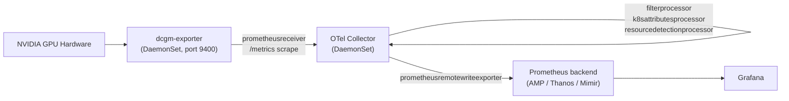
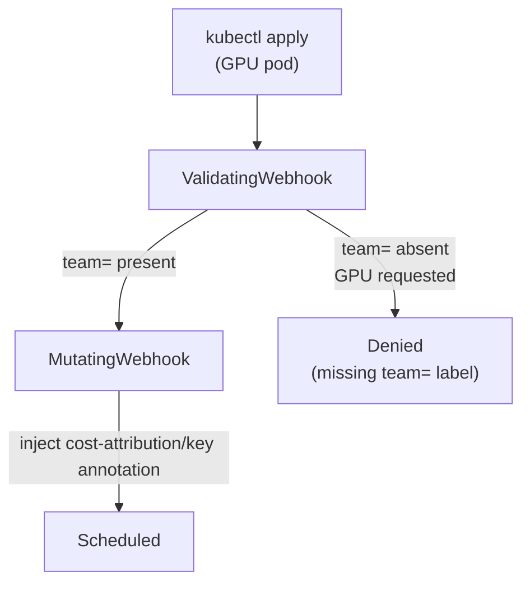

## Summary

This blueprint covers end-to-end observability for AI inference platforms running on Kubernetes. It addresses three distinct challenges that general-purpose Kubernetes observability guidance does not resolve: GPU hardware opacity, context propagation gaps across multi-agent AI system boundaries, and per-tenant cost attribution for shared GPU clusters.

**Target audience:** Platform engineers, MLOps teams, and SREs operating GPU-accelerated LLM inference workloads on managed Kubernetes (EKS, GKE, AKS).

**Applies when:**

- You run NVIDIA GPU-accelerated pods on Kubernetes and need visibility beyond what `kubectl top` and standard `node_exporter` provide.
- You operate multi-agent AI systems (LangGraph, CrewAI, Strands Agents) where a single user request fans out across multiple LLM calls, tool invocations, and retrieval steps.
- You need per-namespace or per-team cost attribution for GPU workloads in a shared cluster.

**Does not apply when:**

- Single-GPU developer workstations or single-node inference deployments.
- CPU-only inference (ONNX Runtime, OpenVINO) — the GPU metrics layer is unnecessary.
- Model training workloads — the tracing and autoscaling patterns differ significantly from inference.

---

## Common challenges

**Challenge 1 — GPU hardware opacity.** Kubernetes exposes GPU *allocation* (`nvidia.com/gpu: 1` in a pod spec) but not *utilization*. A pod holding an A100 may be running at 8% SM utilization or 95%. Without hardware-level metrics from NVIDIA DCGM (Data Center GPU Manager), autoscaling signals and cost attribution are meaningless. Standard `node_exporter` does not expose DCGM counters.

**Challenge 2 — Context propagation gaps across agent boundaries.** Agent frameworks orchestrate sequences of LLM calls, tool invocations, and RAG retrieval steps. Without explicit OTel instrumentation, each step is an opaque HTTP call: failures are silent at the orchestration layer, latency cannot be attributed to individual steps, and multi-hop tool chains (agent → MCP server → external API) have no trace correlation. LLM SDKs do not propagate `traceparent` headers across boundaries by default.

**Challenge 3 — Per-tenant cost attribution without label enforcement.** Attributing GPU cost to specific teams requires DCGM hardware metrics, Kubernetes namespace labels, and billing aggregations to be in alignment. Label consistency is not enforced at admission time. One pod deployed without a `team=` label produces GPU metrics that cannot be attributed, breaking chargeback for the entire namespace.

**Challenge 4 — High-cardinality GPU metrics at scale.** DCGM exposes 200+ counters per GPU per second. At 100-GPU scale this is approximately 1.2 million samples per minute. Without cardinality management at the collector, Prometheus TSDB exhaustion occurs within weeks and remote write to managed Prometheus services hits per-tenant ingestion limits.

**Challenge 5 — Disaggregated inference observability.** Modern LLM serving systems split inference into separate prefill workers (KV-cache computation, SM-bound) and decode workers (token generation, HBM-bound). Autoscaling both worker types on the same metric is incorrect. An observability pipeline that does not distinguish worker role produces misleading dashboards and misfires autoscaling.

---

## General guidelines

### 1. GPU metrics pipeline: DCGM → OTel Collector → Prometheus backend

**Challenges addressed:** Challenge 1, Challenge 4, Challenge 5

Deploy the DCGM Exporter as a DaemonSet. Route its `/metrics` endpoint through an OTel Collector DaemonSet that applies resource enrichment, cardinality filtering, and remote write to a Prometheus-compatible backend.

Retain only the key DCGM counters using `filterprocessor` — drop the rest to control cardinality:

| Counter | Measures | Purpose |
|---|---|---|
| `DCGM_FI_PROF_GR_ENGINE_ACTIVE` | SM utilization (0–1) | Prefill autoscaling |
| `DCGM_FI_DEV_FB_USED` / `FB_FREE` | HBM used / free bytes | Decode autoscaling |
| `DCGM_FI_DEV_POWER_USAGE` | Power draw (watts) | Cost attribution |
| `DCGM_FI_DEV_GPU_TEMP` | Temperature (°C) | Thermal alerting |
| `DCGM_FI_PROF_PIPE_TENSOR_ACTIVE` | Tensor core utilization | Model efficiency |

**Checklist:**

- [ ] DCGM Exporter DaemonSet deployed on GPU node pools only (use `nodeSelector` with `nvidia.com/gpu.present: "true"`)
- [ ] OTel Collector `k8sattributesprocessor` attached so every metric carries `k8s.namespace.name` and `k8s.pod.name`
- [ ] `filterprocessor` configured to retain ≤ 15 DCGM counters
- [ ] Remote write configured with per-namespace label (`namespace`) for cost query compatibility

### 2. KEDA autoscaling on DCGM signals

**Challenges addressed:** Challenge 1, Challenge 5

Use KEDA ScaledObjects with the Prometheus external scaler to autoscale inference workers on actual GPU utilization rather than proxy signals like queue depth.

Prefill workers are SM-bound — scale on SM utilization with a 70% threshold. Decode workers are HBM-bound — scale on HBM pressure with an 80% threshold. The asymmetry is deliberate: prefill latency degrades sharply above 70% SM saturation, while 80% HBM pressure is a safe operational ceiling before OOM risk.

Set `minReplicaCount: 2` for both worker types — LLM model loading time (loading weights into GPU HBM) ranges from 30 to 120 seconds for 7B+ parameter models, making scale-from-zero unacceptable for interactive inference.

**Checklist:**

- [ ] Separate ScaledObjects for prefill (SM threshold) and decode (HBM threshold)
- [ ] `minReplicaCount: 2` to avoid cold-start latency spikes
- [ ] `cooldownPeriod: 120` to prevent thrashing during bursty traffic
- [ ] KEDA `TriggerAuthentication` using workload identity (not hardcoded credentials) for Prometheus access

**Documentation:**

- [KEDA Prometheus scaler](https://keda.sh/docs/scalers/prometheus/)
- [CNCF KEDA PR #5315 — AMP scaler reference implementation](https://github.com/kedacore/keda/pull/5315)

### 3. Admission webhooks for label enforcement

**Challenges addressed:** Challenge 3

Deploy a `ValidatingWebhookConfiguration` that rejects GPU pod creation if the `team=` label is absent. Use `failurePolicy: Fail` — if the webhook is unavailable, GPU pod creation fails visibly rather than silently passing unlabeled pods through and corrupting attribution data.

A complementary `MutatingWebhookConfiguration` injects the `cost-attribution/key` annotation (a composite of namespace and team label) at admission time, enriching DCGM metrics for downstream recording rules without requiring application code changes.

**Checklist:**

- [ ] Webhook deployed with `podAntiAffinity` across 3+ nodes to minimize availability impact of `failurePolicy: Fail`
- [ ] `namespaceSelector` scoped to namespaces with `gpu-chargeback: enabled` label — avoids blocking system namespace pods
- [ ] Webhook certificate rotation automated via `cert-manager`
- [ ] Integration test: verify that a GPU pod without `team=` is rejected with a descriptive error message

### 4. OTel instrumentation for multi-agent AI systems

**Challenges addressed:** Challenge 2

Instrument each agent node and tool call boundary with OTel spans using the Python or JavaScript SDK. Two boundary types require explicit instrumentation:

**Agent node spans** — wrap each LangGraph or CrewAI node with a span that records the node name, model ID, input token count, output token count, and number of tool calls. This makes per-node latency and token cost visible in traces.

**MCP server spans** — instrument the [Model Context Protocol](https://modelcontextprotocol.io) server boundary rather than each tool individually. MCP decouples tool implementations from agent frameworks, so instrumenting the MCP layer provides uniform coverage regardless of which agent framework calls the tool.

For context propagation across HTTP boundaries, use the OTel SDK's `requests` or `httpx` instrumentation libraries — these inject `traceparent` headers automatically. For MCP servers called via stdio transport, manually extract and inject the context at each boundary using `opentelemetry.propagate.inject` and `extract`.

**Checklist:**

- [ ] Span created for each agent node (`agent.node.<name>`) with `agent.input_tokens` and `agent.output_tokens` attributes
- [ ] Span created for each MCP tool call (`mcp.tool.<name>`) with `k8s.namespace.name` attribute for cost correlation
- [ ] `traceparent` propagation verified end-to-end with a test trace spanning agent → MCP server → LLM API
- [ ] `SpanExporter` configured to send traces to the same OTel Collector used for GPU metrics — unified backend

**Documentation:**

- [OpenTelemetry Python SDK](https://opentelemetry.io/docs/languages/python/)
- [Model Context Protocol specification](https://modelcontextprotocol.io/specification)

### 5. Per-namespace cost attribution with recording rules

**Challenges addressed:** Challenge 3, Challenge 4

Define Prometheus recording rules that aggregate DCGM power metrics into cost-ready time series at ingest time. This avoids expensive query-time joins and ensures FinOps dashboards remain fast at scale.

The rule chain: GPU power per pod → average per namespace (joined with `kube_pod_labels` on the `team` label) → hourly cost estimate → 24-hour rolling total for chargeback reports.

Expose a Grafana variable `$team` backed by `label_values(namespace:gpu_cost_usd:rate1h, team)` so FinOps teams can filter to their namespace without writing PromQL.

**Checklist:**

- [ ] Recording rules evaluate at 60s interval — faster evaluation does not improve precision and increases backend load
- [ ] Cost-per-GPU-hour constant externalized as a Prometheus external label or AlertManager annotation, not hardcoded in the rule, so it can be updated as instance pricing changes
- [ ] Alert on `namespace:gpu_cost_usd:sum24h > threshold` for budget guardrails
- [ ] `kube_pod_labels` federation enabled if metrics and label data are in separate Prometheus instances

---

## Implementation

### Reference implementation

A complete reference implementation is available at:

- **GitHub:** `github.com/sguruvar/ai-inference-observability-eks`
  - `scripts/` — Step-by-step EKS cluster setup with GPU node groups, DCGM, OTel Collector
  - `manifests/` — KEDA ScaledObjects, ValidatingWebhookConfiguration, ArgoCD Applications, Istio configs
  - `mcp-server/` — FastMCP server with OTel-instrumented GPU observability tools (`get_gpu_utilization`, `get_agent_cost`)
  - `manifests/dashboards/` — Grafana dashboard JSON (FinOps, SRE, KEDA scaling personas)

### Related resources

- [GPU Cost Attribution for Disaggregated LLM Inference with NVIDIA Dynamo](https://aws-observability.github.io/observability-best-practices/recipes/eks-gpu-cost-attribution/) — AWS Observability Best Practices portal
- [End-to-End Observability for Multi-Agent AI Systems on Kubernetes](https://medium.com/@sivagurunath/end-to-end-observability-for-multi-agent-ai-systems-on-kubernetes-e4133dd111d6) — Medium, June 2026
- [Per-Namespace GPU Cost Attribution on EKS with NVIDIA MIG](https://medium.com/@sivagurunath/per-namespace-gpu-cost-attribution-on-eks-with-nvidia-mig-9dde0f82b6e4) — Medium
- [CNCF KEDA + AMP Prometheus scaler (PR #5315)](https://github.com/kedacore/keda/pull/5315) — merged, in production use

### Relationship to existing blueprints

| Blueprint | Relationship |
|---|---|
| Infrastructure and Processes in Non-K8s Environments | Complementary — this blueprint covers Kubernetes-specific GPU workloads |

---

## Appendix

### DCGM metric → autoscaling signal mapping

| Metric | Threshold | Action | Worker type |
|---|---|---|---|
| `DCGM_FI_PROF_GR_ENGINE_ACTIVE` | > 70% | Scale out | Prefill (SM-bound) |
| HBM pressure (`FB_USED / (FB_USED + FB_FREE)`) | > 80% | Scale out | Decode (HBM-bound) |
| `DCGM_FI_PROF_GR_ENGINE_ACTIVE` | < 20% for 10m | Scale in | Prefill |
| HBM pressure | < 40% for 10m | Scale in | Decode |

### OTel span naming conventions

| Component | Span name | Key attributes |
|---|---|---|
| LangGraph / CrewAI node | `agent.node.<node_name>` | `agent.model`, `agent.input_tokens`, `agent.output_tokens` |
| MCP tool call | `mcp.tool.<tool_name>` | `mcp.tool.name`, `k8s.namespace.name` |
| RAG retrieval step | `rag.retrieve` | `rag.query`, `rag.document_count` |
| LLM API call | `llm.completions` | `llm.model`, `llm.prompt_tokens`, `llm.completion_tokens` |

### Admission webhook decision matrix

| Condition | Webhook | Action | Reason |
|---|---|---|---|
| GPU pod, `team=` label present | Mutating | Inject `cost-attribution/key` annotation | Enrich for recording rules |
| GPU pod, `team=` label absent | Validating | Deny with descriptive error | Attribution impossible |
| Non-GPU pod | Both | Allow (bypass GPU check) | No attribution needed |
| Webhook unavailable | Validating (`failurePolicy: Fail`) | Block GPU pod creation | Prefer visible failure over silent attribution gaps |
