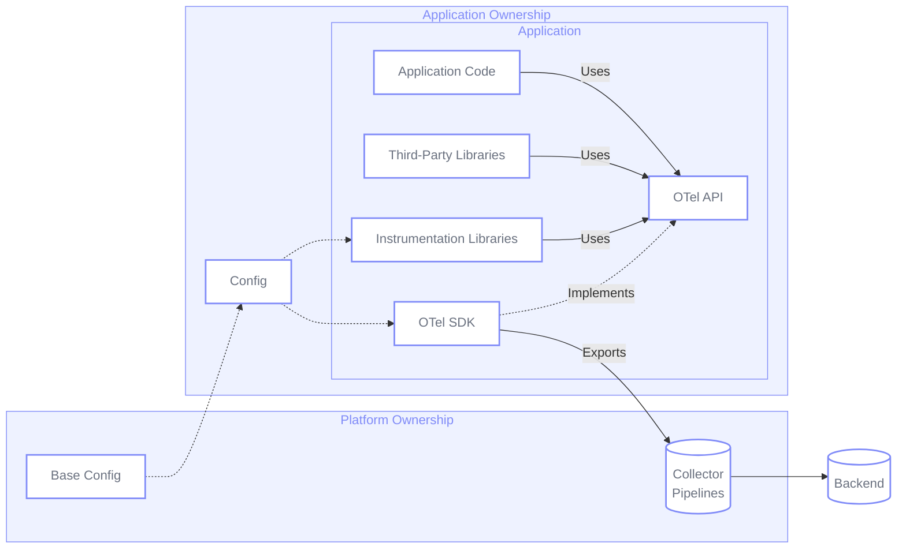
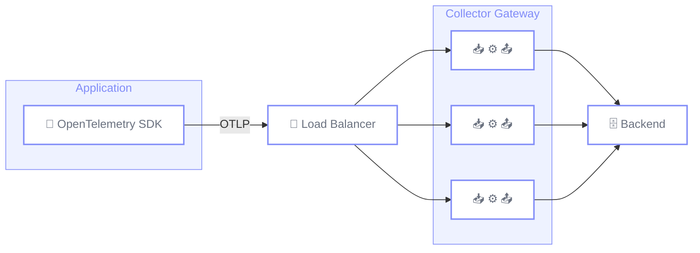
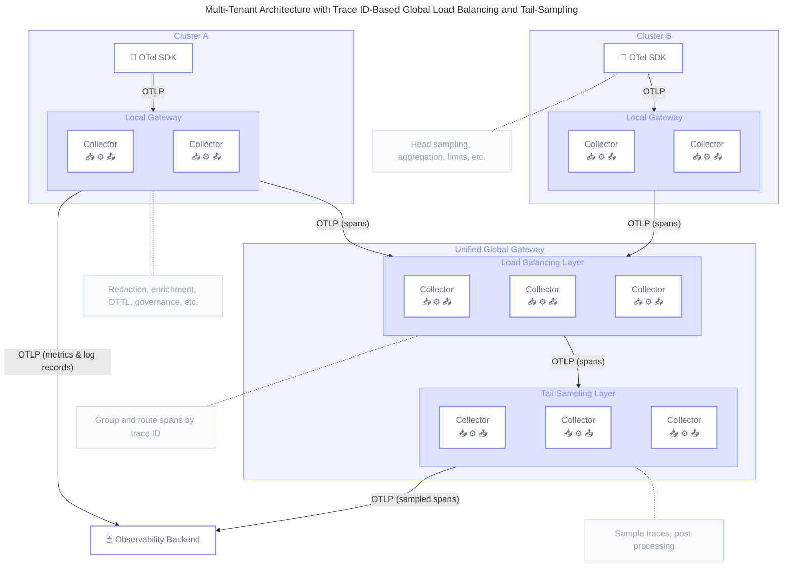

## Summary

This blueprint provides strategic guidance for organizations that wish to ease
adoption of OpenTelemetry across their engineering teams by following Platform
Engineering practices, providing centrally managed telemetry platforms inclusive
of self-serve tooling to be used “as-a-service” by product engineering teams.

It is aimed at organizations operating in medium-to-large scale cloud and
Kubernetes environments, aiming to provide a consistent, scalable, and governed
telemetry platform across workloads owned by highly autonomous product teams,
achieving the following outcomes:

- Consistent SDK and instrumentation configuration, improving time-to-value by
  facilitating adoption of organization-specific standards across all workloads,
  reducing cognitive load for product teams.
- Cohesive semantic conventions that allow for telemetry correlation between
  signals, applications, and domains, from client-side to infrastructure,
  providing high-quality telemetry to be utilized by manual or automatic
  analysis.
- Elimination of Collector configuration sprawl, reducing operational toil
  through consolidation of telemetry pipelines.
- Resilient, scalable, and reliable ingest pipelines for all telemetry signals
  avoiding single points of failure.
- Centralized telemetry governance and data optimization to reduce operational
  costs and carbon emissions by minimizing storage, network transfer, and
  compute requirements of telemetry processing.

## Background

As organizations increase the rate of adoption of cloud native standards and
modern software delivery practices, they often adopt federated models where
teams, or business units, operate with high autonomy and are made responsible
for the full Software Development Lifecycle (SDLC) of their systems, from
designing to operating software in production.

This “you build, you run it” model is designed to empower product delivery,
however it can inadvertently create fragmented service management practices and
cluttered observability landscapes that fail to reap the benefits of
OpenTelemetry and modern observability tooling. Product teams prioritize feature
delivery over Non-Functional Requirements (NFRs), like telemetry
instrumentation, and see these tasks as a burden on their delivery goals.

To address this, organizations are widely adopting cloud native Platform
Engineering models to reduce cognitive load and abstract complexity. By treating
observability as a curated internal [platform product][1], organizations can
offer a paved road, or a golden path, that ensures high-quality, contextual
observability with minimal friction, while allowing teams to remain focused on
instrumenting domain-specific concepts impossible to capture in out-of-the-box
telemetry.

## Common challenges

Organizations operating in these federated, distributed environments typically
face a distinct set of challenges that hinder effective observability and cloud
native maturity.

### 1. Inconsistent configuration and low adoption of organization standards {#challenge-1}

In environments where product teams operate with maximum autonomy, distinct ways
of configuring individual applications and services for observability may
coexist, while still operating under a shared compute layer. This includes
setting up OpenTelemetry SDKs for applications, configuring agents and
instrumentation libraries, or deciding how to propagate observability context
from/to their dependencies.

Telemetry instrumentation is frequently treated as an afterthought or
implemented retroactively as a checkbox exercise, leading to poor quality
instrumentation. When considered, this instrumentation is focused on a
particular application without considering the overall distributed system in a
holistic way, across service boundaries and different infrastructure layers.

```mermaid
---
config:
  flowchart:
    curve: basis
---
flowchart TB
  subgraph Cluster["Kubernetes Cluster"]
    direction TB
    AppA["Application A<br>(starts trace X)"]:::node
    AppB["Application B<br>(starts trace Y)"]:::node
    Collector["Collector kubeletstats<br>(k8s.cluster.name=cluster-1)"]:::node
  end

  subgraph Backend["Telemetry Backend"]
    direction TB
    Traces[("Traces")]:::node
    Metrics[("Metrics")]:::node
  end

  User(("User")):::node -- Inbound request --> AppA
  AppA -. "Broken context<br>(incompatible propagators)" .-x AppB
  Traces x-. "Broken correlation<br>(missing k8s.* attributes)" .-x Metrics
  AppA == "Exports spans" ==> Traces
  AppB == "Exports spans" ==> Traces
  Collector == "Exports utilization metrics" ==> Metrics

  linkStyle 1 stroke:#D50000, fill:none
  linkStyle 2 stroke:#cc0000, fill:none
  linkStyle 3 stroke:#C8E6C9, fill:none
  linkStyle 4 stroke:#C8E6C9, fill:none
  linkStyle 5 stroke:#C8E6C9, fill:none

  classDef node fill:#ffffff, stroke:#818cf8, stroke-width:2px, color:#6b7280
  style Cluster fill:#eef2ff, stroke:#818cf8, stroke-width:1px, color:#818cf8
  style Backend fill:#eef2ff, stroke:#818cf8, stroke-width:1px, color:#818cf8
```

This leads to:

- **Inconsistent [Semantic Conventions][2]:** Telemetry lacks common
  [Resource][3] attributes (e.g., `service.version` , `k8s.cluster.name`,
  `org.cost.center`), breaking correlation across different signals,
  applications, and system layers, and limiting the usefulness of observability
  data for automatic analysis.
- **Context silos:** Without consistent [context propagation][4] (e.g. W3C Trace
  Context or Baggage) baked into every SDK, distributed traces break at service
  boundaries, making it impossible to tie backend performance regressions to
  customer-facing business impact.
- **SDK version fragmentation**: Largely different versions of OpenTelemetry
  SDKs running in production, introducing maintenance and security concerns.
- **High cognitive load:** Developers must manually configure SDKs and
  instrumentation packages for every new service, increasing toil and the risk
  of misconfiguration.

### 2. Collector configuration sprawl across clusters {#challenge-2}

As OpenTelemetry adoption scales, and organizations deploy across tens or
hundreds of Kubernetes clusters, managing individual OpenTelemetry Collector
configurations manually across these environments creates a maintenance burden.
This is especially challenging in organizations where different Collector
deployments are handled by different teams.

This leads to:

- **Configuration drift:** Different clusters end up with varying parsing rules,
  filtering logic, and endpoint configurations, causing unpredictable telemetry
  behavior.
- **Lack of separation of concerns:** There is no clear distinction between the
  different types of telemetry processing done at different layers of Collectors
  (e.g. where to transform, where to sample) which can lead to inconsistent or
  incomplete data.
- **Manual toil:** Platform teams spend an excessive amount of time on
  repetitive configuration tasks and manual updates, rather than building
  scalable solutions.
- **Unreliable rollouts:** Without version-controlled, auditable deployments,
  applying a fix or a new configuration across the fleet becomes highly risky
  and error-prone.

### 3. Data pipelines not optimized for observability data requirements {#challenge-3}

In some legacy instrumentation models, applications or instrumentation agents
often export telemetry directly to telemetry backends. This model lacks a way to
process and transform telemetry between the application and the backend,
reducing data sovereignty. It can also add extra complexity if the backend is a
third-party vendor, or any endpoint requiring public traffic or authentication.
Managing credentials across thousands of applications can be challenging, and
sporadic network connectivity issues between a single exporter and a public
endpoint can create service interruptions.

Conversely, in environments where data pipelines are centralized, data
requirements for telemetry data are often mixed with those for other types of
data. This can lead to solutions that are optimized for completeness (e.g. audit
logging, financial data reporting) rather than context-aware transformations and
low-latency processing. This increases the time between data emission and
actionable insights, necessary to maintain reliable operations.

This leads to:

- **Single points of failure:** Direct egress from hundreds of individual
  applications to the internet strips the organization of central network
  governance and load balanced exports.
- **Latency and operational value:** Ultimately, stale observability data is
  almost as good as no observability data. Overly complex logging pipelines can
  introduce significant lag, rendering real-time operational alerts useless
  during a major incident.
- **Lack of central control:** Platform teams cannot easily reroute data, change
  vendors, or apply global network policies when configurations are deeply
  embedded within individual applications.

> [!NOTE] The scope of this blueprint is defined by the challenges related to
> providing pipelines optimized for low-latency and efficient resource usage, as
> these are frequently the problems to solve for observability purposes.
> Completeness or durability guarantees, necessary for cases like audit logging
> or business data reporting, may be covered in future blueprints.

### 4. Lack of telemetry governance and low ROI {#challenge-4}

Without centralized governance and measurable adoption of observability
standards, autonomous teams may generate vast amounts of low-value data,
reducing the signal-to-noise ratio. OpenTelemetry signals are often not used for
their intended purpose, ultimately making their production harder to maintain
for platform teams (e.g. having to ensure fast and accurate querying over days
or weeks of individual logs simply to compute the number of requests for a given
service). As traffic grows and telemetry volume increases, teams in charge of
observability have no scalable way of ensuring data quality across their
landscape.

This leads to:

- **Unattributed data quality issues**: As consistent semantic conventions are
  not enforced, platform teams cannot associate telemetry spend or data quality
  with specific business units or engineering teams.
- **Inefficient data types:** Organizations incur heavy storage and indexing
  costs for raw logs or other signals when not used for their intended purpose,
  while reducing the overall quality of the insights extracted from
  observability data.
- **Unnecessary costs**: Increasing costs associated with data storage, network
  egress, or ingest into a particular backend, incurred from data that does not
  always improve the insights one may require to operate systems reliably.
- **Carbon emissions**: Processing of low-value data can be detrimental to
  achieving green software targets, including scope 3 emissions from embedded
  carbon present into the devices necessary for fast retrieval of observability
  data, e.g. SSDs.
- **High cognitive load**: Large data volumes not only result in unnecessary
  costs, they may also increase noise, forcing users to filter through
  low-quality data to find relevant telemetry.

> [!NOTE] Multi-tenant environments often deal with strict compliance
> requirements (GDPR, HIPAA, PCI). As this is a complex issue in itself, it will
> be targeted in a separate blueprint.

### 5. Low observability and operational efficiency of SDKs and data pipelines {#challenge-5}

One of the challenges of operating OpenTelemetry SDKs and Collectors in
production is identifying if, and when, the default configuration applied for
aspects regarding queuing, retrying, or batching of telemetry data is not
optimal for a particular environment. OpenTelemetry’s sensible defaults may not
be suitable either to implement a leaner approach on resource utilization, or
higher reliability guarantees. This may depend on architectural patterns in use,
e.g. exporting to a local cluster endpoint may require less buffering than a
public internet endpoint.

This leads to:

- **Silent data drops and export failures:** Data exports suffer from failures
  to export to backends, or Collectors, ultimately dropping data, without those
  errors being observed or alerted on.
- **Unnecessary resource utilization:** Operators overprovision resources on
  SDKs and Collectors, increasing resource utilization, potentially affecting
  performance overhead and cost.

## General Guidelines

### 1. Centralize default, extensible configuration for SDKs and instrumentation packages {#guideline-1}

**Challenges addressed**: 1, 4 **Implementation actions**: 1, 2

We recommend teams in charge of observability tooling maintain a set of
resources (see [Action 1][action-1]) to provide basic, out-of-the-box
configuration for [SDKs][5] and [instrumentation libraries][6]. The aim is for
applications deployed in a Kubernetes cluster to emit a basic level of
telemetry, and to propagate context from and to dependencies, with minimal input
required from application owners, e.g. at most adding an annotation, or calling
a shared internal library.

Platform teams should ensure that this base configuration remains extensible,
allowing application owners to control different aspects of the SDK (e.g. buffer
sizes, exporter retries) and instrumentation libraries, to meet the requirements
specific to their applications.

By implementing this guideline, organizations can expect to achieve:

- **Cohesive organization standards:** Specific organization standards (e.g.
  resource attributes, exporter endpoint, etc) are applied automatically across
  the stack.
- **Consistent context propagation:** Trace Context and Baggage are propagated
  between services using compatible propagator configurations.
- **Lower cognitive load:** Application owners can abstract themselves from
  lower-level configuration, such as that related to setting up the
  OpenTelemetry SDK.
- **Easier maintenance:** Effort to adopt best practices in observability is
  minimized, as new standards can be rolled out via version bumps of internal
  tooling.

### 2. Establish ownership, responsibilities, and monitoring for telemetry data production {#guideline-2}

**Challenges addressed**: 4, 5 **Implementation actions**: 1, 2, 5

To balance governance and autonomy, platform teams operating in the environments
described in this blueprint should aim to “shift left” on instrumentation,
ensuring that application owners have full control and ownership of the
telemetry emitted by their applications. Default configurations mentioned in
[Guideline 1][guideline-1] should ensure that provenance of data is guaranteed,
including technical attributes (e.g. cluster, deployment, pod) and
organizational information (e.g. team, business domain), with the aim of making
it trivial to identify the source of telemetry, and the owning team.

OpenTelemetry [client design principles][7] establish a clear separation between
the API, being a no-op implementation by default, and the SDK, which provides an
implementation for that API when registered. This provides a clear separation of
responsibilities, and allows application owners to rely solely on the
OpenTelemetry API, focusing their efforts on enriching telemetry with
domain-specific context (e.g., business transactions, user IDs) that is
impossible to capture generically, while relying on the provided default
configuration to produce telemetry out of the box.

This model relies on OpenTelemetry’s API design to abstract implementation
details. We recommend considering direct usage of the different signal APIs and
avoid building further abstractions around them, unless these provide more value
than simply hiding implementation details. When required, SDK features (e.g.
[Metric Views][8], or [Span Processors][9]) can be utilized to transform
telemetry at the application level (see [Guideline 4][guideline-4]).

> [!NOTE] [Weaver][10] can help teams to manage organization-specific semantic
> convention registries, and to measure and validate adherence to those,
> ensuring instrumentation quality by design. However, these concepts are
> tangential to this blueprint and will be covered in future blueprints. Learn
> more about Weaver in [this blogpost][11].

Ultimately, application owners should remain owners of the telemetry data
emitted by their applications (both manually and automatically instrumented
telemetry), and be accountable for its quality and resiliency. To aid in this
endeavor, platform teams should enable [SDK telemetry][12] out of the box, in
languages that support it. Application owners should make use of this telemetry
to ensure the reliability of the data emitted from their applications, and
optimize their configuration accordingly. This includes configuring SDK
components like the `BatchSpanProcessor` or the `PeriodicMetricReader` to change
buffer sizes, retry queues, or timeouts, if required.

By implementing this guideline, organizations can expect to achieve:

- **Correlation to business outcomes:** Telemetry emitted by applications
  contains the necessary domain and business logic context to correlate user
  experience to technical components and infrastructure.
- **Clear ownership and responsibilities:** Provenance of data is ensured,
  allowing teams to measure telemetry quality and ensure standards are adopted
  at scale.
- **Improved usage of telemetry signals:** As application owners become more
  familiar with OpenTelemetry signals, guided by organization standards, their
  optimal usage of OpenTelemetry APIs will improve.
- **Reliable telemetry production:** Monitoring internal SDK metrics provides
  application or platform owners with the necessary information to optimize
  aspects regarding queuing, retrying, or batching of telemetry data.

### 3. Maintain a set of centrally managed Collector Gateways {#guideline-3}

**Challenges addressed**: 2, 3, 4 **Implementation actions**: 1, 3, 5

We recommend that telemetry in this type of Kubernetes environment is
automatically ingested into a centralized layer deployed as an OpenTelemetry
[Collector Gateway.][13] The base configuration provided as part of [Guideline
1][guideline-1] should ensure that telemetry is exported to this layer using
OTLP.

In multi-tenant environments, multiple Collector Gateways may need to be chained
to accommodate for different scenarios. For instance, multi-cluster setups with
local Gateways per cluster and a global Gateway for tail-sampling (see
[Guideline 4][guideline-4]), or namespace-scoped Gateways managed by independent
teams, feeding into a cluster-wide Gateway in heavily federated environments.

Ideally, base SDK configuration should automatically select the most optimal
Collector endpoint and any necessary credentials according to information
available in the application environment (e.g. locality-based traffic routing,
conditionally changing server address depending on environment name, etc).

Finally, depending on organization-specific conditions, different OpenTelemetry
signals may be given different non-functional requirements. For instance, due to
their stable telemetry volumes and their use in critical alerts, metrics may be
assigned higher reliability requirements than spans, favoring dropping data on
the latter before affecting the former. To accommodate for these conditions
platform teams may consider different options, including:

- **Isolated Gateways for different signals:** Deploying a different Gateway for
  logs, metrics, spans, etc. This can facilitate compute resource allocation,
  however it can make sharing configuration or components between pipelines more
  complex.
- **Multiple memory limiters on a single Gateway:** Defining separate
  [memorylimiter][14] configurations per signal, with different thresholds. This
  relies on the OTLP receiver in front of a `memorylimiter` returning a
  retryable error code to OTLP clients (e.g. SDKs or other Collectors) when
  telemetry is refused, applying backpressure as required. Pipelines with lower
  priority can then be configured with lower memory limiter thresholds in order
  to apply backpressure earlier, leaving memory headroom for higher priority
  pipelines.

Platform engineers should make use of [internal Collector telemetry][15] to
ensure the reliability of the data ingested, processed, and exported by their
pipelines, and optimize their configuration accordingly. This includes
configuring components like the `memorylimiter`, or OTLP options like
`sending_queue` or `retry_on_failure`. These metrics should be used to avoid
default CPU-based autoscaling of Collector Gateways, scaling fleets based on
pipeline queue depth or memory consumption, to handle sudden telemetry spikes.

By implementing this guideline, organizations can expect to achieve:

- **Pipelines optimized for observability data requirements:** By combining OTLP
  exporter and receiver configurations with load-balanced, reliable Collector
  pipelines, teams are able to fulfil their reliability requirements on a
  per-signal basis.
- **Efficient use of compute resources:** Centralizing Collector deployments,
  and load balancing telemetry through horizontally scalable deployments, can
  improve resource utilization in environments where telemetry volumes vary over
  time.
- **Consolidated Collector configuration:** As described in [Action
  3][action-3], this model allows for a consolidated deployment of Collector
  configuration across multiple layers, minimizing maintenance toil and reducing
  risk of change failure.

### 4. Efficiently aggregate, process, and sample telemetry at different layers {#guideline-4}

**Challenges addressed**: 3, 4 **Implementation actions**: 2, 4

At an application level, OpenTelemetry client design decouples instrumentation
APIs and their SDK implementations. This allows instrumentation authors
(including application or library owners) to use the API to [record
measurements][16], [create spans][17], or [emit log records][18], without having
to define how those will be aggregated in memory, processed, and ultimately
exported. This decision can be deferred to the moment when [meter][19],
[tracer][19], and [logger][20] providers are created as part of the SDK setup.
Configuration of these aspects should be shared, with platform teams providing a
basic layer of configuration, and application owners extending that
configuration for their particular use cases.

At a distributed system level, different [trace sampling][21] techniques may be
used to efficiently store the most valuable traces in a consistent manner.
Sampling can be mainly configured at two distinct layers:

- **SDK:** Head sampling configured at the SDK level provides an efficient use
  of compute resources as unsampled traces are never recorded or exported by a
  given application. However, sampling decisions need to be made at span
  creation, normally resulting in probabilistic sampling, which could miss
  critical traces (e.g. those containing errors).
- **Collector**: Collectors empower two main sampling techniques:
  - [_Probabilistic_][22] _sampling:_ Can be configured at any Collector layer
    and does not require coordination between Collectors as long as the same
    algorithm and seed are in use for the same trace.
  - [_Tail_][23] _sampling:_ A single Collector replica must store all spans for
    a given trace in memory before making a decision. As single replica
    deployment is not recommended in production environments, this model
    normally requires one layer of Collectors to load balance spans according to
    trace ID and another to perform sampling.

Tail sampling requires more resources to operate and maintain. However, it
provides a richer way of defining sampling policies that allow organizations to
efficiently store only the traces that are critical for their services
operations. For instance, traces with durations longer than a particular
threshold, or those containing errors across any span in a given trace.

When sampling is implemented, consistent use of semantic conventions becomes
crucial, with metrics providing complete (yet aggregated) views of telemetry,
and sampled traces providing the high granularity for a given operation, which
can then link to logs and other telemetry signals. Using standard semantic
conventions and consistent _Resource_ attributes empowers correlation between
these signals, allowing operators to “zoom in” from long-term, aggregated metric
streams to highly-granular, contextual traces.

The following diagram provides a summary of different layers where aggregation,
processing, and sampling may be configured in a tail-sampling, muti-cluster
scenario.

As a rule of thumb, processing of telemetry should be done as close as possible
to the application layer, avoiding compute and transfer costs. However,
deferring processing decisions to different Collector layers may be desirable in
certain situations, such as facilitating maintenance, enforcing standards,
performing advanced filtering/transformations with [OTTL][24], aggregating
signals into metrics (e.g. [spanmetrics][25] or [signaltometrics][26]
connectors), or securing pipelines with [redaction][27] rules to ensure
sensitive information never reaches a particular backend.

By combining intelligent sampling, metric aggregation at different layers, and
central transform/filter processors to reduce noisy telemetry, this architecture
can reduce transfer and compute costs while preserving operational visibility
for engineering teams.

By implementing this guideline, organizations can expect to achieve:

- **Efficient telemetry volumes:** Optimal use of OpenTelemetry signals,
  sampling, and aggregation provide telemetry volumes that allow organizations
  to balance between high-granularity, cost, and observability requirements.
- **Efficient use of compute resources:** Position data processing at different
  levels limits data transfer and compute resources associated with data that
  can be aggregated or filtered at early stages.
- **Central governance and guardrails:** Platform teams have a central point to
  control data emissions, allowing them to filter, transform, redact, or
  completely block telemetry that does not follow organization standards or
  adhere to data volume limits, safeguarding the organization from emitting
  unwanted data to backends.

## Implementation

### 1. Use OpenTelemetry Operator, or internal shared packages, for application-level configuration {#action-1}

**Guidelines implemented:** 1

If the environment in scope is in the supported [Kubernetes versions][28] and
[instrumented languages][29], we recommend prioritizing the use of the
[OpenTelemetry Operator for Kubernetes][30]. This involves:

- [Installing][31] the OpenTelemetry Operator.
- [Creating][32] the relevant `Instrumentation` CRs to configure SDKs and
  instrumentation.
- [Adding annotations][33] to individual pods or namespaces (to instrument all
  pods in a namespace).

If deploying the OpenTelemetry Operator is not possible/compatible, we recommend
providing application owners with build-time resources to easily configure the
OpenTelemetry SDK and instrumentation libraries. This can be implemented
following two main models:

- For languages supported by [zero-code instrumentation][34], we recommend
  providing base container images to download instrumentation agents/libraries,
  provide default configuration, and configure the base `CMD` on the resulting
  container image to utilize these settings.
- For languages not supported by zero-code instrumentation, we recommend
  providing shared [language-specific libraries][35] that take care of
  configuring the OpenTelemetry SDK and instrumentation libraries
  programmatically, providing hooks for users of said libraries to extend this
  configuration as required.

This non-operator model puts application owners in charge of using these base
container images or shared libraries in their codebase. While it may initially
require more effort than auto-attached instrumentation, it provides a mechanism
for platform teams to manage phased upgrades or configuration changes with minor
version bumps of their internal libraries, requiring no further code changes
from application owners.

When managing centralized configuration in base container images or internal
libraries, and when supported by the language, we recommend standardizing on the
use of [declarative configuration][36]. Although currently not fully supported
by all languages, this YAML-based configuration model provides consistency in
SDK and instrumentation configuration.

Finally, in environments were the OpenTelemetry Operator cannot be deployed, and
were providing base container images is not a possibility, we recommend
deploying the [OpenTelemetry eBPF Instrumentation (OBI)][37], which can provide
a zero-code option for teams not in charge of build or deployment pipelines.

### 2. Include organization standards into default, extensible application-level configuration {#action-2}

**Guidelines implemented:** 1, 2, 4

Regardless of how the configuration is delivered as part of [Action
1][action-1], we recommend the platform team to include the following minimum
base configuration as part of their offering:

- **Exporters:** OTLP HTTP/protobuf (default) or OTLP gRPC configured to export
  to the most optimal Collector (e.g. local Gateway in the same cluster).
  Backend/SaaS endpoints or API keys should not be included in application-level
  configuration, as we recommend handling these at a Collector Gateway. See
  [Action 3][action-3] and [Appendix 1][appendix-1] for more details on side
  effects of OTLP gPRC used with standard Kubernetes Services.
- **Propagators:** W3C Trace Context (`tracecontext`) and W3C Baggage
  (`baggage`) to ensure distributed traces do not break across service
  boundaries. If necessary, include legacy formats as secondary options
  (Propagators API will prioritize in the order they are configured).
- **Resource detectors:** Auto-detectors for the underlying infrastructure
  (e.g., cloud provider, Kubernetes, OS, container) to achieve consistency with
  no manual input.
- **Instrumentation libraries**: Ensure a minimal set of instrumentation
  libraries are configured out of the box. Prioritize client and server
  instrumentation (e.g. gRPC, HTTP, messaging, database).
- **Processors, readers and views**: Settings specific to the backend in use
  (e.g. aggregation temporality, export intervals, attribute limits) or
  organization-wide standards (e.g. span/metric attributes).
- **Organization-specific resource attributes:** Standard conventions critical
  for routing, billing, and ownership. At a minimum, we recommend:
  - `service.name` ideally extracted from existing environment variables or
    labels injected via CI/CD tooling.
  - `service.namespace` or `service.owner` for resource ownership.
  - `deployment.environment.name` (e.g. `production`, `staging`)

Depending on the methods established in [Action 1][action-1] for providing OTel
configuration, the platform team must document exactly how developers inherit
the baseline and how they can extend it:

- **OpenTelemetry Operator**: The platform team provisions a central
  `Instrumentation` CR in the cluster. Application owners can opt in or out via
  pod/namespace annotations.
  - _Basic overrides:_ Application owners can override specific baseline
    properties by injecting standard [environment variables][38] directly into
    their Pod spec. The [compliance matrix][39] details support for different
    environment variables per language. Additionally, some language
    implementations (e.g. [Java][40]) support configuring instrumentation
    libraries via library-specific environment variables.
  - _Complex overrides:_ If teams need to modify the `Instrumentation` CR itself
    (e.g., to add custom samplers or specific auto-instrumentation libraries),
    the platform team should manage the CR via Helm or Kustomize. This allows
    the platform to maintain a base template while application owners provide
    local overrides or value files that are merged before deployment into the
    cluster.
- **Base container images**: Similarly to above, teams may override specific
  aspects via environment variables overriding defaults set in the base image.
- **Internal libraries:** Internal shared libraries should provide the necessary
  hooks for users to pass in standard configuration blocks as required. For
  instance, in JavaScript a wrapper library to set up a Node SDK should allow
  the user to provide standard [NodeSDKConfiguration][41] configurations like
  `resource` or `traceExporter`.
- **Declarative configuration**: Platform teams may utilize the environment
  variable interpolation features of the file-based configuration and allow
  application owners to set local environment variables that the base YAML file
  reads, or, as the file-based configuration standard matures, use configuration
  merging to blend a developer-provided `custom-otel.yaml` with the platform's
  `base-otel.yaml`.

### 3. Use OpenTelemetry Operator or Helm Charts to deploy Collector Gateways {#action-3}

**Guidelines implemented:** 3

To deploy centralized Gateway tiers, platform teams should standardize on either
the [OpenTelemetry Operator][30] or the official [OpenTelemetry Helm
Charts][42]. Both support GitOps workflows, but they require specific
architectural considerations for enterprise workloads:

- **OpenTelemetry Operator**: Ideal if the Operator is already used for
  application auto-instrumentation ([Action 1][action-1]). The Gateway can be
  deployed by creating an `OpenTelemetryCollector` CR and setting
  `mode: deployment` or `mode: statefulset` (depending on requirements). The
  Operator abstracts away much of the Kubernetes boilerplate. See the Operator
  [documentation][43] for further guidance on how to enable autoscaling.
- **Official Helm Charts**: A better option if infrastructure teams prefer
  granular control over native Kubernetes manifests (e.g., specific `Ingress`
  configurations, `PodDisruptionBudgets`, or complex affinity rules) without
  relying on CRDs.

Regardless of the deployment tool chosen, the Gateway tier is a critical point,
and owners should ensure resiliency is configured from the start:

- **Configure [memorylimiter][44]**: As the first processor in Collector
  pipelines, this prevents Out-of-Memory (OOM) crashes during massive telemetry
  spikes by forcing the Collector to drop data and/or apply backpressure when
  memory usage hits a configure threshold. As mentioned in [Guideline
  3][guideline-3], different `memorylimiter` processors per signal may be
  required.
- **Configure [OTLP exporter][45]:** Ensure queues and retries are aligned with
  expectations on reliability vs resource consumption, handling transient
  backend failures before dropping data.
- **Consider [filestorage][46] extension**: If dropping data on extended
  observability backend service interruptions is critical to the functioning of
  the business, consider the [filestorage][46] extension. This requires
  deploying the Gateway as a `StatefulSet` with `PersistentVolumeClaims`. If the
  backend is unavailable or rate-limits exports, the Collector will buffer data
  to disk and automatically retry, preventing data loss. As with OTLP exporter
  settings, operators must balance between the criticality of dropping data (in
  this case potentially stale data) and the cost of maintenance.
- **gRPC load balancing**: OTLP/gPRC can be very efficient, but standard
  Kubernetes service routing can make it inefficient. See [Appendix
  1][appendix-1] to implement gRPC load balancing, or consider OTLP/HTTP (the
  default for most SDKs).
- **Scale on memory and internal telemetry:** Utilize the Kubernetes Horizontal
  Pod Autoscaler (HPA) combined with custom metrics (see [Action 5][action-5]).
  Configure the cluster to scale Gateway replicas based on memory utilization,
  active connections, or pipeline queue depth.
- **Configuration as code**: Store the Helm values or Operator CRs in a central
  Git repository and use tools like ArgoCD or Flux to deploy them. This provides
  an audit trail and allows for phased rollouts and instant rollbacks.

### 4. Configure Collector processors for efficient telemetry volumes {#action-4}

**Guidelines implemented:** 4

To enrich telemetry with infrastructure context, reduce transfer and ingestion
costs from low-value telemetry data, and enforce compliance before data leaves
the corporate network, the platform team should consider configuring pipelines
in Collector Gateways to execute the following processing steps (in order):

- [**k8sattributes**][47] **processor:** While Kubernetes resource details (like
  pod and namespace names) should ideally be appended at the application level
  via SDK Resource Detectors (see [Action 2][action-2]), the platform team must
  ensure 100% compliance for unmanaged workloads. Configure this processor to
  extract and append `k8s.namespace.name`, `k8s.pod.name`,
  `k8s.deployment.name`, or `k8s.cluster.name` based on the incoming
  connection's pod IP. If using a proxy, ensure pass-through mode is enabled so
  the Gateway sees the original Pod IP of the application, not the proxy's IP.
- **Processors to filter and transform data:** As a fallback measure on
  applications that could not apply these changes at source, use processors like
  [attributes][48], [filter][49], [redaction][27], [resource][50], or
  [transform][51] to define rules to:
  - Drop single-span traces and access logs for routine endpoints (`/health`,
    `/metrics`, `/ready`) or non-actionable debug logs (`level=DEBUG` or
    `level=TRACE`).
  - Remove specific noisy attributes (e.g. `process.command_line`) that may be
    less useful in Kubernetes environments where these attributes are present in
    CI/CD pipelines.
  - Any other processing to remove low-value, noisy telemetry.
- [**spanmetrics**][25] **or [signaltometrics][26] connectors:** Ensure
  completeness of golden signals (i.e. R.E.D. metrics) from applications, even
  if traces are heavily sampled downstream, especially if the SDK or
  client/server libraries cannot produce these metrics. Route the raw trace
  stream through these connectors before any sampling occurs.
- [**tailsampling**][52] **processor:** Define strict retention policies, for
  instance keeping 100% of traces containing errors (`otel.status_code=ERROR`),
  100% of traces exceeding certain duration, and a small baseline (e.g., 5%) of
  successful, normal-duration requests. As documented in [Guideline
  4][guideline-4], this requires two layers of collectors, using the
  [loadbalancing][53] exporter on the first layer to route traces to the second
  layer based on Trace ID. See more information about load balancing exporting
  in our [documentation][54].

This is not an exhaustive list, and OpenTelemetry Collectors have many
[processors][55] and [connectors][56] that allow organizations to extract more
value out of their telemetry data.

### 5. Monitor SDKs and Collectors to ensure reliability requirements {#action-5}

**Guidelines implemented:** 2, 3

OpenTelemetry SDKs and Collectors export standard telemetry describing the
internal state of their components in operation. Application owners and platform
teams should ensure these are produced reliably, monitored, and actioned as
required.

To identify and monitor data loss occurring before telemetry even leaves the
application process (e.g., if the SDK's internal queue fills up), we recommend:

- Where supported by the language ecosystem (e.g. Java via the
  `opentelemetry-sdk` instrumentation library, or .NET with the
  `OpenTelemetry-Sdk` `EventSource`), enable SDK self-metrics to expose internal
  queue capacities, dropped spans, and exporter latency. [OpenTelemetry SDK
  Semantic Conventions][57] define the telemetry to be produced by SDKs, but
  support varies depending on language.
- For languages lacking native SDK metric support, enable error logging on the
  OTel SDK's global error handler.

To monitor the health of the aggregation and processing tiers, the platform team
must actively capture and alert on internal [Collector telemetry][15]. We
recommend following these steps:

- **Export internal telemetry via OTLP:** Configure the `telemetry` block within
  the Collector’s `service` section to emit internal metrics. In enterprise
  Kubernetes environments, this often requires a dual approach:
  - _OTLP_: Emit metrics directly to the observability backend via OTLP for
    long-term retention, global dashboards, and centralized alerting, following
    company wide standards. Please note, this OTLP configuration is separate
    from the OTLP exporter configured on Collector pipelines.
  - _Prometheus_: Simultaneously expose a Prometheus endpoint so that
    cluster-local metric servers (like KEDA or Prometheus Adapter) can rapidly
    scrape metrics like `otelcol_exporter_queue_size` to trigger Horizontal Pod
    Autoscaling (HPA) without relying on an external internet round-trip.
- **Monitor and troubleshoot:** Follow advice present in the [monitor][58] and
  [troubleshoot][59] sections of Collector documentation, and create the
  necessary high-priority alerts to detect resource exhaustion and failed
  receiving/exporting before data is dropped by individual replicas.

## Reference Implementations {#reference-implementations}

- [Adobe: An OpenTelemetry pipeline designed for simplicity at scale][60]
- [Mastodon: Running OpenTelemetry Collectors in production with a small
  team][61]
- [Skyscanner: Managing OpenTelemetry Collectors across 24 production
  clusters][62]

## Appendix {#appendix}

### 1. gRPC load balancing {#appendix-1}

gRPC relies on HTTP/2, multiplexing many requests over a single, long-lived TCP
connection. Standard Kubernetes Services operate at Layer 4 (TCP) using
`kube-proxy`, so they balance _connections_, not individual _requests_. When an
SDK or a local Collector or application connects to a Gateway via a standard
Kubernetes Service, it establishes one TCP connection and holds it open
indefinitely. As a result, 100% of the telemetry from that agent will stream to
a single Gateway pod.

In high-throughput environments, this may cause hot spots in specific Collectors
(triggering Out-Of-Memory crashes on specific pods) and may break horizontal
autoscaling, as newly spun-up Gateway pods will receive zero traffic.

To distribute telemetry evenly, platform teams should consider one of the two
following patterns:

#### Client-side load balancing {#client-side-load-balancing}

In this approach, the OTLP exporter on the sending side (the application or
local Collector) performs the load balancing itself. It queries Kubernetes DNS
to discover the IPs of all available Gateway pods and distributes requests in a
round-robin fashion across them.

The Gateway tier should be deployed with a Headless Service so that DNS queries
return a list of pod IPs rather than a single virtual IP.

- **OpenTelemetry Operator:** If you deploy an `OpenTelemetryCollector` CR in
  `statefulset` mode, the Operator automatically generates a headless service
  named `{collector-name}-collector-headless.{namespace}.svc.cluster.local`. If
  deployed as a `deployment`, you will have to manually create a headless
  Kubernetes Service with `ClusterIP: None`.
- **Helm Chart:** Set `service.clusterIP: None` when deploying the Gateway.

The sending OTLP exporter must be configured to use the DNS resolver and the
round-robin balancer. When configuring the OTLP exporter on the Collector (e.g.
from local Collector to a Gateway):

- **`endpoint`** must start with `dns:///` to instruct the gRPC client to
  perform continuous DNS resolution.
- **`balancer_name`** should be set to `round_robin`.

Specific client SDKs may configure gRPC clients in different ways. Refer to
individual client implementations to configure client-side gRPC load balancing.

#### Layer 7 Proxy / Service Mesh {#layer-7-proxy-service-mesh}

In this approach, a HTTP/2-aware Layer 7 proxy is placed between the SDKs, or
local Collectors, and the Gateway tier. Because the proxy operates at Layer 7,
it understands the HTTP/2 frames. It accepts the single long-lived TCP
connection, inspects the individual gRPC requests, and distributes them evenly
across all backend Gateway pods.

**Implementation Methods:**

- **Service Mesh (e.g., Istio, Linkerd):** If the cluster already runs a service
  mesh, gRPC load balancing is handled automatically. The mesh sidecar (or
  equivalent) intercepts the egress traffic from the edge agent and balances it
  across the Gateway pods.
- **Standalone Proxy (e.g., Envoy, NGINX):** Deploy an Envoy or NGINX proxy
  (configured for `grpc_pass`) directly in front of the Gateway tier. The edge
  agents point to the Proxy's Kubernetes Service, and the Proxy balances the
  traffic to the Gateways.
- **Ingress Controllers:** If SDKs or local Collectors are sending telemetry
  from outside the cluster (or across clusters), ensure the Ingress Controller
  (e.g., NGINX Ingress, Traefik, AWS ALB) is explicitly configured to support
  gRPC and HTTP/2 backend routing.

If the organization in scope already runs a Service Mesh, relying on this option
requires zero configuration on the OpenTelemetry side and works flawlessly. If
there is no Service Mesh and traffic remains entirely within the same cluster,
use client-side load balancing, or consider using HTTP/protobuf (see [Action
2][action-2]).

<!-- Section references -->

[guideline-1]: #guideline-1
[guideline-3]: #guideline-3
[guideline-4]: #guideline-4
[action-1]: #action-1
[action-2]: #action-2
[action-3]: #action-3
[action-5]: #action-5
[appendix-1]: #appendix-1

<!-- Link references -->

[1]: https://platformengineering.org/talks-library/platform-as-a-product
[2]: /docs/concepts/semantic-conventions/
[3]: /docs/concepts/resources/
[4]: /docs/concepts/context-propagation/
[5]: /docs/languages/sdk-configuration/
[6]: /docs/concepts/instrumentation/libraries/
[7]: /docs/specs/otel/library-guidelines/#opentelemetry-client-generic-design
[8]: /docs/specs/otel/metrics/sdk/#view
[9]: /docs/specs/otel/trace/sdk/#span-processor
[10]: https://github.com/open-telemetry/weaver
[11]: /blog/2025/otel-weaver/
[12]: /docs/specs/semconv/otel/sdk-metrics/
[13]: /docs/collector/deploy/gateway/
[14]:
  https://github.com/open-telemetry/opentelemetry-collector/tree/main/processor/memorylimiterprocessor
[15]: /docs/collector/internal-telemetry/
[16]: /docs/specs/otel/metrics/#programming-model
[17]: /docs/specs/otel/trace/api/#span-creation
[18]: /docs/specs/otel/logs/api/#emit-a-logrecord
[19]: /docs/specs/otel/metrics/sdk/#meterprovider
[20]: /docs/specs/otel/logs/sdk/#loggerprovider
[21]: /docs/concepts/sampling/
[22]:
  https://github.com/open-telemetry/opentelemetry-collector-contrib/tree/main/processor/probabilisticsamplerprocessor
[23]:
  https://github.com/open-telemetry/opentelemetry-collector-contrib/tree/main/processor/tailsamplingprocessor
[24]:
  https://github.com/open-telemetry/opentelemetry-collector-contrib/blob/main/pkg/ottl/README.md
[25]:
  https://github.com/open-telemetry/opentelemetry-collector-contrib/tree/main/connector/spanmetricsconnector
[26]:
  https://github.com/open-telemetry/opentelemetry-collector-contrib/tree/main/connector/signaltometricsconnector
[27]:
  https://github.com/open-telemetry/opentelemetry-collector-contrib/tree/main/processor/redactionprocessor
[28]:
  https://github.com/open-telemetry/opentelemetry-operator/blob/main/docs/compatibility.md#compatibility-matrix
[29]:
  https://github.com/open-telemetry/opentelemetry-operator#opentelemetry-auto-instrumentation-injection
[30]: /docs/platforms/kubernetes/operator/
[31]: /docs/platforms/kubernetes/operator/automatic/#installation
[32]:
  /docs/platforms/kubernetes/operator/automatic/#configure-automatic-instrumentation
[33]:
  /docs/platforms/kubernetes/operator/automatic/#add-annotations-to-existing-deployments
[34]: /docs/zero-code/
[35]: /docs/languages/
[36]: /docs/languages/sdk-configuration/declarative-configuration/
[37]: /docs/zero-code/obi/
[38]: /docs/specs/otel/configuration/sdk-environment-variables/
[39]:
  https://github.com/open-telemetry/opentelemetry-specification/blob/main/spec-compliance-matrix.md#environment-variables
[40]:
  /docs/zero-code/java/agent/configuration/#configuring-with-environment-variables
[41]:
  https://github.com/open-telemetry/opentelemetry-js/blob/main/experimental/packages/opentelemetry-sdk-node/src/types.ts#L25
[42]: /docs/platforms/kubernetes/helm/
[43]: /docs/platforms/kubernetes/operator/horizontal-pod-autoscaling/
[44]:
  https://github.com/open-telemetry/opentelemetry-collector/tree/main/processor/memorylimiterprocessor
[45]:
  https://github.com/open-telemetry/opentelemetry-collector/tree/main/exporter/otlpexporter#getting-started
[46]:
  https://github.com/open-telemetry/opentelemetry-collector-contrib/tree/main/extension/storage/filestorage
[47]:
  https://github.com/open-telemetry/opentelemetry-collector-contrib/tree/main/processor/k8sattributesprocessor
[48]:
  https://github.com/open-telemetry/opentelemetry-collector-contrib/tree/main/processor/attributesprocessor
[49]:
  https://github.com/open-telemetry/opentelemetry-collector-contrib/tree/main/processor/filterprocessor
[50]:
  https://github.com/open-telemetry/opentelemetry-collector-contrib/tree/main/processor/resourceprocessor
[51]:
  https://github.com/open-telemetry/opentelemetry-collector-contrib/tree/main/processor/transformprocessor
[52]:
  https://github.com/open-telemetry/opentelemetry-collector-contrib/tree/main/processor/tailsamplingprocessor
[53]:
  https://github.com/open-telemetry/opentelemetry-collector-contrib/tree/main/exporter/loadbalancingexporter
[54]: /docs/collector/deploy/gateway/#load-balancing-exporter
[55]: /docs/collector/components/processor/
[56]: /docs/collector/components/connector/
[57]: /docs/specs/semconv/otel/
[58]:
  /docs/collector/internal-telemetry/#use-internal-telemetry-to-monitor-the-collector
[59]: /docs/collector/troubleshooting/
[60]: /docs/guidance/reference-implementations/adobe/
[61]: /docs/guidance/reference-implementations/mastodon/
[62]: /docs/guidance/reference-implementations/skyscanner/
