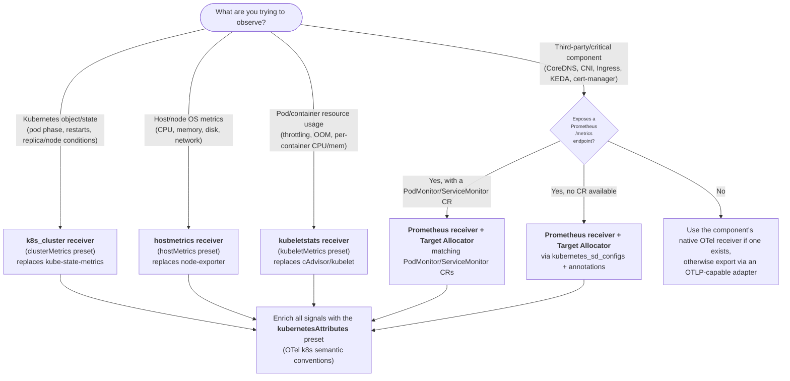

## Summary

This blueprint outlines a reference for Platform Engineering and SRE teams responsible for providing observability infrastructure in Kubernetes clusters. It covers two verticals: resource usage and operational state of workloads, and health of Kubernetes critical components (DNS, networking, ingress).

By implementing the patterns in this blueprint, organizations can expect to achieve:

- Out-of-the-box visibility into workload resource usage, OOM events, probe failures, and pod lifecycle state without application-side changes.
- Path to reliable monitoring of Kubernetes critical components (CoreDNS, CNI plugins, Ingress controllers, KEDA, etc)
- Uniform metadata enrichment using OTel semantic conventions, enabling correlated investigation across metrics, logs, and traces.
- Self-monitoring of the telemetry collection infrastructure so silent data gaps are detected before they affect incident response.

### When to use OpenTelemetry-native receivers vs. Prometheus scraping

Use this decision tree to choose a collection method for any signal source in the
cluster. The guiding principle: prefer OTel-native receivers for workload,
host, and cluster-state metrics, and fall back to Prometheus scraping (via the
Target Allocator) for third-party components that only expose a `/metrics`
endpoint.

## Background

Kubernetes clusters host two classes of observable entities:

1) **Workloads** — application containers and the Kubernetes primitives (Statefulset, Deployment, Daemonset, ReplicaSet, etc) managing them - emit signals via OTel SDKs, but their resource utilization and operational state (CPU throttling, OOM kills, pod phase, probe results) are only visible through Kubernetes-specific APIs. 

2) **Critical infrastructure components** - CoreDNS, CNI plugins, Ingress controllers, volume subsystems, KEDA, and similar platform services — are (generally) platform-owned, expose Prometheus metrics natively, and require dedicated scrape configurations.

This blueprint focuses on *what* to collect and *how to label it*. Collector pipeline topology is referenced only when needed to observe Kubernetes specific components, recommendation of Collector Topologies for your own telemetry is documented separately

// TODO: add reference to other Blueprint/documentation on collector topologies

## Common Challenges

### 1. Workload Telemetry Is Incomplete

CPU throttling, OOM kills, pod phase transitions, and probe failures are not emitted by application code. They are only accessible through the Kubernetes API server, sources the platform team must explicitly collect.

This leads to:

- **Invisible resource pressure**: CPU throttling at the cgroup level surfaces only as increased latency, with no infrastructure attribution.
- **OOM kills appear as application crashes**: Without a correlated OOM signal, operators cannot distinguish a memory misconfiguration from an application bug.
- **Throttled versus OOM is indistinguishable**: Both cause pod restarts. Without container restart and last-terminated-reason signals (`k8s.container.restarts` from the API server) correlated with kubelet CPU/memory metrics, there is no basis for remediation.

### 2. Metadata Is Inconsistent Across Signals and Layers

Each scraper attaches different label schemas (`pod_name`, `pod`, `kubernetes_namespace`, `namespace`). OTel semantic convention attributes (`k8s.pod.name`, `k8s.namespace.name`) are not applied automatically.

This leads to:
- **Disjointed Infra telemetry from App telemetry**: Increases cognitive load on operators to troubleshoot if a certain issue is caused by the app/container or infra/resources
- **Alert rules break silently on scraper changes**: An alert written against `pod_name` stops matching when a new scraper uses `pod`.
- **Organizational context is absent**: Team ownership, environment, and tier labels from pod annotations are rarely in telemetry, making alert routing and cost attribution manual.

### 3. Critical Cluster Components Are Not Observable by Default

CoreDNS, CNI plugins, Ingress controllers, KEDA, cert-manager **and many others** each expose metrics with no standard discovery mechanism.

Some examples of what this leads to:

- **DNS latency spikes look like application problems**: CoreDNS slowdowns appear as upstream timeouts, indistinguishable from a slow downstream service without a DNS-layer metric.
- **CNI packet drops are unattributed**: Packets dropped at the network policy layer surface as intermittent pod connectivity failures with no network-layer attribution.
- **KEDA failures leave workloads silently under-provisioned**: A scaler that cannot reach its source metric stops autoscaling without producing any user-visible error.

### 4. Telemetry Collection Infrastructure Has No Self-Monitoring

The OTel Collector and its receivers are the foundation of all cluster observability. When they fail, the resulting gaps are silent - dashboards show "no data" and no alert fires on the absence of metrics.

This leads to:

- **A crashed cluster-metrics Collector removes all workload-state visibility**: The `k8s.pod.*` and `k8s.deployment.*` families disappear silently; operators may not notice until mid-incident.
- **Tainted nodes have no DaemonSet Collector coverage**: GPU or spot nodes without DaemonSet tolerations have no CPU, memory, or filesystem metrics.
- **The Collector drops data silently under backpressure**: SLO calculations based on incomplete data produce false confidence.

## General Guidelines

### 1. Use OTel native exporters to collect Workload and Infrastructure signals
<small>Challenges Addressed: 1, 2</small>

Up until recently, teams had to use Prometheus components like kube-state-metrics and node-exporter to get telemetry from workloads and resource usage.

Now, the recommended best practice is to use Otel native receivers:

| OpenTelemetry Collector component | Helm chart preset | Analog Prometheus/Kubernetes component | What it covers                                                                                                                                   |
| --------------------------------- | ----------------- | -------------------------------------- | ------------------------------------------------------------------------------------------------------------------------------------------------ |
| **`k8s_cluster` receiver**        | `clusterMetrics`  | **kube-state-metrics**                 | Kubernetes object/state metrics from the Kubernetes API, such as pods, nodes, namespaces, workloads, quotas, and conditions.                     |
| **`hostmetrics` receiver**        | `hostMetrics`     | **node-exporter**                      | Host/node OS metrics such as CPU, memory, filesystem, disk I/O, network, load, paging, processes, and system metrics.                            |
| **`kubeletstats` receiver**       | `kubeletMetrics`  | **cAdvisor / kubelet metrics**         | Node, pod, container, and volume resource metrics from the kubelet. This is the closest OTel-native analog for cAdvisor-style container metrics. |

Outcomes:
- Complete workload-level resource coverage (throttling, OOM, pod phase, probe failures) without any application code changes.

### 2. Apply Uniform Metadata Enrichment Using OpenTelemetry Semantic Conventions
<small>Challenges Addressed: 2</small>

All telemetry signals, regardless of origin, must be enriched with OTel Kubernetes resource attributes before reaching the backend. This is done via the `k8sattributesprocessor` in the Collector, which resolves pod metadata from the Kubernetes API at collection time. Enrichment must cover well-known OTel attributes (`k8s.pod.name`, `k8s.namespace.name`, `k8s.node.name`, `k8s.deployment.name`, `k8s.cluster.name`) and organization-specific labels promoted from pod annotations (team, environment, tier).

Outcomes:
- Metrics, logs, and traces from any source join on consistent attributes with no per-query remapping.
- Opentelemetry semantics are adhered, making adoption of Observability tools easier

### 3. Use the OpenTelemetry Operator as the Control Plane for Collector Lifecycle and Distributed Prometheus Scraping
<small>Challenges Addressed: 3</small>

The OpenTelemetry Operator must manage all OTel Collectors in the cluster. It provides two capabilities essential for correct Kubernetes observability:

**TargetAllocator**: Without coordination, each Collector replica independently discovers and scrapes *all* Prometheus targets — N replicas produce N× the data volume, making `sum(rate(...))` aggregations incorrect. The TargetAllocator acts as a single service discovery coordinator: it builds the full target list once and distributes targets across replicas such that each target is scraped by exactly one replica.

**`OpenTelemetryCollector` CRD**: Declares Collector configuration as a Kubernetes object, enabling GitOps workflows, versioned rollouts, and per-namespace scoping. The Operator also manages Collector deployment modes — **Deployment** for cluster-scoped scraping with TargetAllocator, **DaemonSet** for node-level collection — each appropriate for different collection patterns in this blueprint.

The Operator additionally introduces the `Instrumentation` CRD for zero-code auto-instrumentation injection. While that is out of scope here, it makes the Operator the correct foundational dependency for the full cluster observability stack.

Outcomes:
- Each Prometheus target scraped exactly once regardless of Collector replica count.
- Collector lifecycle is managed automatically w/ autohealing

### 4. Self-Monitor All Telemetry Collection Components
<small>Challenges Addressed: 4</small>

The OTel Collector and its receivers must be monitored for their own internal health metrics and alerted on using the same pipeline as primary data. 

Outcomes:
- Silent data gaps are paged before affecting incident response or SLO calculations.
- An observability coverage SLO is enforceable (e.g., "99.9% of Availability for Observability Components").

### 5. Provide Reference Deployment Architectures for Each Telemetry Component
<small>Challenges Addressed: 1, 2, 3</small>

While the topology of collectors are mainly managed by the Helm Chart - which already have optimized deployment types for each telemetry shape, this blueprint looks to explain why any given preset has a recoommended deployment type (daemon, singleton, etc)

## Implementation

### 1. Deploy the OpenTelemetry Operator and the Collector Helm Chart
<small>Guidelines Supported: 1, 2</small>

First, deploy the OTel Operator using the `opentelemetry-operator` Helm chart. The Operator and its TargetAllocator remain responsible for distributed **Prometheus scraping of critical components** (Implementation step 6).

Then deploy Collectors with the `opentelemetry-collector` Helm chart. Rather than hand-writing receiver, processor, and RBAC configuration, this blueprint enables the chart's **presets** — each preset wires the matching receiver/processor into the pipeline and generates the required RBAC, volumes, and mounts automatically. The remaining steps are `values.yaml` fragments for this chart.

Because the native receivers have different deployment requirements (see Guideline 2), install the chart as **two releases**:

- a single-replica **Deployment** for cluster-wide metrics (`clusterMetrics`, Step 1)
- a **DaemonSet** for per-node host and kubelet metrics (`hostMetrics` + `kubeletMetrics`, Step 2)

Both releases enable the `kubernetesAttributes` preset (Step 3).

Documentation:
- [OpenTelemetry Operator Helm chart](https://opentelemetry.io/docs/platforms/kubernetes/helm/operator/)
- [OpenTelemetry Collector Helm chart](https://opentelemetry.io/docs/platforms/kubernetes/helm/collector/)
- [TargetAllocator](https://opentelemetry.io/docs/platforms/kubernetes/operator/target-allocator/)

### 2. Collect Cluster-State Metrics with the `clusterMetrics` Preset
<small>Guidelines Supported: 1, 2</small>

The `k8s_cluster` receiver provides object state (pod phase, restart counts, replica state, node conditions) by watching the Kubernetes API — the OTel-native replacement for kube-state-metrics. It does not provide resource consumption; that comes from the kubelet (Step 2).

Because the receiver gathers cluster-wide telemetry, run it in a **single-replica Deployment** Collector. Multiple replicas produce duplicate data. Use the `opentelemetry-collector` Helm chart with the `clusterMetrics` preset, which adds the `k8s_cluster` receiver and the required RBAC automatically:

// TODO: Add deployment diagram

This emits OTel-native equivalents such as `k8s.pod.phase`, `k8s.container.restarts`, `k8s.deployment.available`/`k8s.deployment.desired`, `k8s.node.condition_ready`, and quota/replica state.

Documentation: [Cluster Metrics preset](https://opentelemetry.io/docs/platforms/kubernetes/helm/collector/#cluster-metrics-preset), [Kubernetes Cluster Receiver](https://opentelemetry.io/docs/platforms/kubernetes/collector/components/#kubernetes-cluster-receiver)

### 3. Collect Host and Kubelet Metrics with the `hostMetrics` and `kubeletMetrics` Presets
<small>Guidelines Supported: 1, 2</small>

Host/node OS metrics (the node-exporter replacement) come from the `hostmetrics` receiver, and node/pod/container resource consumption (the cAdvisor/kubelet replacement) comes from the `kubeletstats` receiver. Both must run **once per node**, so deploy them together in a single **DaemonSet** Collector with both presets enabled:

// TODO: Add Daemonset diagram

The `hostMetrics` preset enables the `cpu`, `load`, `memory`, `disk`, `filesystem`, and `network` scrapers and mounts the host root filesystem at `/hostfs`. The `kubeletMetrics` preset adds the `kubeletstats` receiver (with `metric_groups: [node, pod, container]`) and its RBAC. Both presets add the necessary volumes/RBAC automatically and require a Collector image that includes the receivers (such as the Contrib distribution).

Important: To guarantee coverage on control-plane and tainted nodes (GPU, spot), add tolerations to the DaemonSet so every node is scraped - any node without a Collector pod is a coverage gap.

Documentation: [Host Metrics preset](https://opentelemetry.io/docs/platforms/kubernetes/helm/collector/#host-metrics-preset), [Kubelet Metrics preset](https://opentelemetry.io/docs/platforms/kubernetes/helm/collector/#kubelet-metrics-preset), [Host Metrics Receiver](https://opentelemetry.io/docs/platforms/kubernetes/collector/components/#host-metrics-receiver), [Kubeletstats Receiver](https://opentelemetry.io/docs/platforms/kubernetes/collector/components/#kubeletstats-receiver)

### 4. Apply Metadata Enrichment with the `kubernetesAttributes` Preset
<small>Guidelines Supported: 2</small>

Enable the `kubernetesAttributes` preset on every Collector to wire the `k8sattributesprocessor` into all pipelines and add the required RBAC. For full control over which attributes and labels are extracted, configure the processor explicitly in all pipelines:

If `k8s.cluster.name` is not resolvable from cloud metadata, inject it as a static resource attribute via the `resourceprocessor`.

Documentation: [Kubernetes Attributes preset](https://opentelemetry.io/docs/platforms/kubernetes/helm/collector/#kubernetes-attributes-preset), [k8sattributesprocessor](https://github.com/open-telemetry/opentelemetry-collector-contrib/tree/main/processor/k8sattributesprocessor), [K8s semantic conventions](https://opentelemetry.io/docs/specs/semconv/resource/k8s/)

### 5. Configure Prometheus Scraping w/ Autodiscovery 
<small>Guidelines Supported: 3</small>

Adding manual scrape targets using the Prometheus receiver is prone to double-scraping which inflates the value of metrics making them unreliable. 

The recommended implementation is to configure the Target Allocator to match your Metrics collectors. It overrides existing scrape_configs in the Prometheus Receiver, making the definition of scrape targets centralized.

The Target Allocator works by discovering scrape targets and assigning them to existing Opentelemetry collectors by spreading the workload and ensuring no double-scraping happens.

Whenever possible, it is preferable to configure the Target Allocator to match existing Prometheus CR like PodMonitor/ServiceMonitor, by doing this, you'll ensure that every new component will be observed by default, provided that this components declares a PodMonitor/ServiceMonitor. [Example](https://github.com/open-telemetry/opentelemetry-operator/blob/main/docs/target-allocator/README.md#podservice-monitor-selectors).

If a Prometheus CR is not available, using the Prometheus Receiver `kubernetes_sd_configs` config to scrape targets that has specific annotations is the recommended practice [Example](https://github.com/open-telemetry/opentelemetry-collector-contrib/blob/main/receiver/prometheusreceiver/README.md#getting-started)

### 5. Enable and Monitor OTel Collector Internal Telemetry
<small>Guidelines Supported: 4</small>

Enabling self-telemetry from OTel is a recommended best practice so you can observe pipeline behavior and alert on missing telemetry, increased error in receiver/processor/exporter.

Documentation: [Collector internal telemetry](https://opentelemetry.io/docs/collector/internal-telemetry/)

## Reference Architectures

The patterns described above have been successfully implemented by the following end-users:

// TODO: Add Reference Architectures

## Appendix
