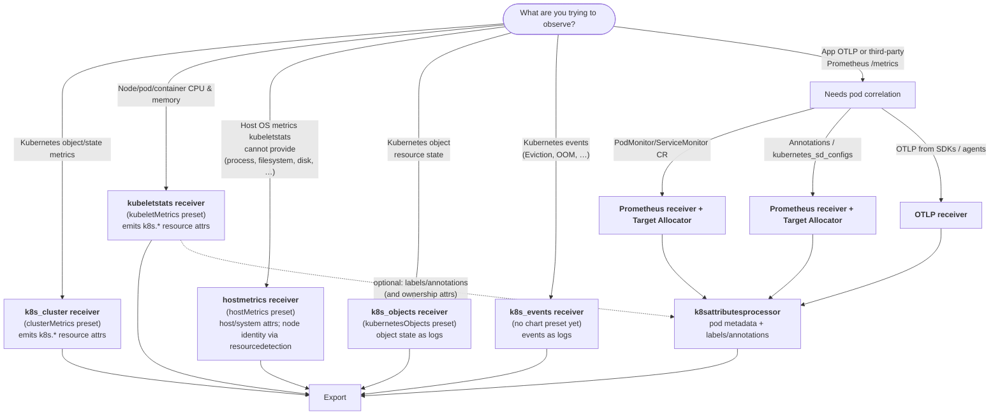

---
title: Kubernetes Observability
linkTitle: Kubernetes Observability

## Summary

This blueprint outlines a reference for Platform Engineering and SRE teams responsible for providing observability infrastructure in Kubernetes clusters. It covers two verticals: resource usage and operational state of workloads, and health of Kubernetes critical components (DNS, networking, ingress).

By implementing the patterns in this blueprint, organizations can expect to achieve:

- Out-of-the-box visibility into workload resource usage, OOM events, probe failures, and pod lifecycle state without application-side changes.
- Path to reliable monitoring of Kubernetes critical components (CoreDNS, CNI plugins, Ingress controllers, KEDA, etc)
- Uniform metadata enrichment using OTel semantic conventions, enabling correlated investigation across metrics, logs, and traces.
- Self-monitoring of the telemetry collection infrastructure so silent data gaps are detected before they affect incident response.

## Background

Kubernetes clusters host two classes of observable entities:

1. **Workloads** — application containers and the Kubernetes primitives (Statefulset, Deployment, Daemonset, ReplicaSet, etc) managing them - emit signals via OTel SDKs, but their resource utilization and operational state (CPU throttling, OOM kills, pod phase, probe results) are only visible through Kubernetes-specific APIs. Additionally, some of those components are managed in the node level, like pods and containers, while others are managed in the cluster/control-plane level like ReplicaSet states, HPAs and so on.
2. **Critical infrastructure components** - CoreDNS, CNI plugins, Ingress controllers, volume subsystems, KEDA, and similar platform services — are (generally) platform-owned, expose Prometheus metrics natively, and require dedicated scrape configurations.

This blueprint focuses on *what* to collect and *how to label it*. Collector pipeline topology is referenced only when needed to observe Kubernetes specific components; recommendations for Collector topologies for your own telemetry are documented separately in the Managed Telemetry Platforms Blueprint.

Documentation:

- [Managed Telemetry Platforms for Kubernetes Workloads](managed-telemetry-platforms-for-k8s-workloads/)

## Common Challenges

### 1. Workload Telemetry Is Incomplete

CPU throttling, OOM kills, pod phase transitions, and probe failures are not emitted by application code. They are only accessible through the Kubernetes API server, sources the platform team must explicitly collect.

This leads to:

- **Invisible resource pressure**: CPU throttling at the cgroup level surfaces only as increased latency, with no infrastructure attribution.
- **OOM kills appear as application crashes**: Without a correlated OOM signal, operators cannot distinguish a memory misconfiguration from an application bug.
- **Throttled versus OOM is indistinguishable**: Both cause pod restarts. Without container restart and last-terminated-reason signals (`k8s.container.restarts` from the API server) correlated with kubelet CPU/memory metrics, there is no basis for remediation.

### 2. Metadata Is Inconsistent Across Signals and Layers

Each scraper attaches different label schemas (`pod_name`, `pod`, `kubernetes_namespace`, `namespace`). OTel semantic convention attributes (`k8s.pod.name`, `k8s.namespace.name`) are not applied automatically.

This leads to:

- **Disjointed Infra telemetry from App telemetry**: Increases cognitive load on operators to troubleshoot if a certain issue is caused by the app/container or infra/resources
- **Alert rules break silently on scraper changes**: An alert written against `pod_name` stops matching when a new scraper uses `pod`.
- **Organizational context is absent**: Team ownership, environment, and tier labels from pod annotations are rarely in telemetry, making alert routing and cost attribution manual.

### 3. Critical Cluster Components Are Not Observable by Default

CoreDNS, CNI plugins, Ingress controllers, KEDA, cert-manager **and many others** each expose metrics with no standard discovery mechanism.

Some examples of what this leads to:

- **DNS latency spikes look like application problems**: CoreDNS slowdowns appear as upstream timeouts, indistinguishable from a slow downstream service without a DNS-layer metric.
- **CNI packet drops are unattributed**: Packets dropped at the network policy layer surface as intermittent pod connectivity failures with no network-layer attribution.
- **KEDA failures leave workloads silently under-provisioned**: A scaler that cannot reach its source metric stops autoscaling without producing any user-visible error.

### 4. Telemetry Collection Infrastructure Has No Self-Monitoring

Silent gaps in Collector and SDK pipelines — crashed scrapers, export failures, and data drops under backpressure — are covered in Challenge 5 of the Managed Telemetry Platforms for Kubernetes Workloads blueprint.

Documentation:

- [Challenge 5: Low observability and operational efficiency of SDKs and data pipelines](managed-telemetry-platforms-for-k8s-workloads/#challenge-5)
- [Managed Telemetry Platforms for Kubernetes Workloads](managed-telemetry-platforms-for-k8s-workloads/)

## General Guidelines

### 1. Use OTel native receivers to collect Workload and Infrastructure signals

Challenges Addressed: 1, 2

This blueprint recommends the usage of Otel native receivers:

| OpenTelemetry Collector component | Helm chart preset                     | Analog Prometheus/Kubernetes component | What it covers                                                                                                                     |
| --------------------------------- | ------------------------------------- | -------------------------------------- | ---------------------------------------------------------------------------------------------------------------------------------- |
| `k8s_cluster` **receiver**        | `clusterMetrics`                      | `kube-state-metrics`                   | Kubernetes object/state metrics from the Kubernetes API, such as pods, nodes, namespaces, workloads, quotas, and conditions.       |
| `kubeletstats` **receiver**       | `kubeletMetrics`                      | **cAdvisor / kubelet metrics**         | Preferred source for node, pod, and container CPU/memory (and volume) resource metrics from the kubelet.                           |
| `hostmetrics` **receiver**        | `hostMetrics`                         | `node-exporter` (partial)              | Host OS metrics that `kubeletstats` does not cover — for example process, filesystem, disk I/O, network, load, and paging metrics. |
| `k8s_objects` **receiver**        | `kubernetesObjects`                   | N/A                                    | Kubernetes object resource state (pull and/or watch) as logs from the API server.                                                  |
| `k8s_events` **receiver**         | N/A - chart preset is being worked on | N/A                                    | Cluster events as they occur (Eviction, OOM, etc)                                                                                  |

Outcomes:

- Complete workload-level resource coverage (throttling, OOM, pod phase, probe failures) without any application code changes.

### 2. Apply Uniform Metadata Enrichment Using OpenTelemetry Semantic Conventions

Challenges Addressed: 2

Telemetry that reaches the backend should carry consistent OTel Kubernetes resource attributes so signals can join without remapping. How that metadata is obtained depends on the source:

- **OTel-native Kubernetes receivers** (`k8s_cluster`, `kubeletstats`, `k8s_objects`, `k8s_events`) already emit the core identity attributes (`k8s.pod.name`, `k8s.namespace.name`, `k8s.node.name`, workload UIDs, and similar). Prefer those receivers' built-in attributes rather than re-deriving them.
- **Application OTLP and Prometheus-scraped telemetry** typically lack that context — enrich them with the `k8sattributesprocessor`, which associates data to pods and adds standard `k8s.`* attributes.
- **Organizational labels/annotations** (team, environment, tier) are not emitted by the infra receivers; extract them via `k8sattributesprocessor` `extract.labels` / `extract.annotations` when you need them on app or pod-scoped signals.

Outcomes:

- Metrics, logs, and traces join on consistent attributes with no per-query remapping.
- OpenTelemetry semantic conventions are adhered to, making adoption of observability tools easier

### 3. Use the OpenTelemetry Operator as the Control Plane for Collector Lifecycle and Distributed Prometheus Scraping

Challenges Addressed: 3

The OpenTelemetry Operator must manage all OTel Collectors in the cluster. It provides two capabilities essential for correct Kubernetes observability:

- `TargetAllocator`: Without coordination, each Collector replica independently discovers and scrapes *all* Prometheus targets — N replicas produce N× the data volume, making `sum(rate(...))` aggregations incorrect. The `TargetAllocator` acts as a single service discovery coordinator: it builds the full target list once and distributes targets across replicas such that each target is scraped by exactly one replica.
- `OpenTelemetryCollector` **CRD**: Declares Collector configuration as a Kubernetes object, enabling GitOps workflows, versioned rollouts, and per-namespace scoping. The Operator also manages Collector deployment modes — **Deployment** for cluster-scoped scraping with TargetAllocator, **DaemonSet** for node-level collection — each appropriate for different collection patterns in this blueprint.

The Operator additionally introduces the `Instrumentation` CRD for zero-code auto-instrumentation injection. While that is out of scope here, it makes the Operator the correct foundational dependency for the full cluster observability stack.

Outcomes:

- Each Prometheus target scraped exactly once regardless of Collector replica count.
- Collector lifecycle is managed automatically w/ autohealing

## Implementation

Use this decision tree to choose a collection method for any signal source in the
cluster. The guiding principle: prefer OTel-native receivers for workload,
host, cluster-state, and Kubernetes events/object logs — those receivers already
set core `k8s.*` (or host) identity attributes. Use `k8sattributesprocessor`
for application OTLP and Prometheus-scraped telemetry that lack that context,
and optionally to attach pod labels/annotations onto pod-scoped metrics.

```mermaid
flowchart TD
  Start(["`What are you trying to observe?`"]) -->|"`Kubernetes object/state metrics<br/>`"| Cluster["`**k8s_cluster receiver**<br/>(clusterMetrics preset)<br/>emits k8s.* resource attrs`"]
  Start -->|"`Node/pod/container CPU & memory<br/>`"| Kubelet["`**kubeletstats receiver**<br/>(kubeletMetrics preset)<br/>emits k8s.* resource attrs`"]
  Start -->|"`Host OS metrics kubeletstats<br/>cannot provide<br/>(process, filesystem, disk, …)`"| Host["`**hostmetrics receiver**<br/>(hostMetrics preset)<br/>host/system attrs; node identity via resourcedetection`"]
  Start -->|"`Kubernetes object<br/>resource state`"| Objects["`**k8s_objects receiver**<br/>(kubernetesObjects preset)<br/>object state as logs`"]
  Start -->|"`Kubernetes events<br/>(Eviction, OOM, …)`"| Events["`**k8s_events receiver**<br/>(no chart preset yet)<br/>events as logs`"]
  Start -->|"`App OTLP or third-party<br/>Prometheus /metrics`"| Scraped["`Needs pod correlation`"]

  Scraped -->|"`PodMonitor/ServiceMonitor CR`"| TAcr["`**Prometheus receiver + Target Allocator**`"]
  Scraped -->|"`Annotations / kubernetes_sd_configs`"| TAann["`**Prometheus receiver + Target Allocator**`"]
  Scraped -->|"`OTLP from SDKs / agents`"| OTLP["`**OTLP receiver**`"]

  Cluster --> Export
  Kubelet --> Export
  Host --> Export
  Objects --> Export
  Events --> Export

  TAcr --> K8sAttr["`**k8sattributesprocessor**<br/>pod metadata + labels/annotations`"]
  TAann --> K8sAttr
  OTLP --> K8sAttr
  Kubelet -.->|"`optional: labels/annotations<br/>(and ownership attrs)`"| K8sAttr
  K8sAttr --> Export
```

### 1. Deploy the OpenTelemetry Kube Stack

Guidelines Supported: 1, 2, 3

Deploy the `opentelemetry-kube-stack` Helm chart as the foundation for this blueprint. The chart installs the OpenTelemetry Operator together with a suite of Collectors managed as `OpenTelemetryCollector` CRs — so you do not need separate `opentelemetry-operator` and `opentelemetry-collector` chart releases.

Out of the box, the chart deploys a **DaemonSet** collector with the presets this blueprint relies on (`hostMetrics`, `kubeletMetrics`, `kubernetesAttributes`, `kubernetesEvents`, and `clusterMetrics`, among others). Cluster-wide metrics use leader election on that DaemonSet so only one replica emits them; if leader election is not an option, use the chart's no-leader-election alternative, which separates cluster-scoped collection. The Operator's TargetAllocator remains available for distributed Prometheus scraping of critical components (Implementation step 6).

Rather than hand-writing receiver, processor, and RBAC configuration, configure collection through the chart's **presets** under `collectors.`* — each preset wires the matching receiver/processor into the pipeline and generates the required RBAC, volumes, and mounts. The remaining steps are `values.yaml` fragments for this chart.

Documentation:

- [OpenTelemetry Kube Stack Helm chart](https://github.com/open-telemetry/opentelemetry-helm-charts/tree/main/charts/opentelemetry-kube-stack)
- [No-leader-election alternative setup](https://github.com/open-telemetry/opentelemetry-helm-charts/tree/main/charts/opentelemetry-kube-stack/examples/no-leader-election-extension)
- [OpenTelemetry Operator](https://opentelemetry.io/docs/platforms/kubernetes/operator/)
- [TargetAllocator](https://opentelemetry.io/docs/platforms/kubernetes/operator/target-allocator/)

### 2. Collect Cluster-State Metrics with the `clusterMetrics` Preset

Guidelines Supported: 1, 2

The `k8s_cluster` receiver provides object state (pod phase, restart counts, replica state, node conditions) by watching the Kubernetes API — the OTel-native replacement for `kube-state-metrics`. It does not provide resource consumption; that comes from the kubelet (Implementation step 3).

Because the receiver gathers cluster-wide telemetry, only one collector replica should emit it. With `opentelemetry-kube-stack`, enable the `clusterMetrics` preset on the DaemonSet collector (`collectors.daemon.presets.clusterMetrics`); leader election ensures a single replica produces the data. If leader election is not available, use the chart's separated cluster collector instead. The preset adds the `k8s_cluster` receiver and the required RBAC automatically.

This emits OTel-native equivalents such as `k8s.pod.phase`, `k8s.container.restarts`, `k8s.deployment.available`/`k8s.deployment.desired`, `k8s.node.condition_ready`, and quota/replica state.

Documentation:

- [Cluster Metrics preset](https://opentelemetry.io/docs/platforms/kubernetes/helm/collector/#cluster-metrics-preset)
- [Kubernetes Cluster Receiver](https://opentelemetry.io/docs/platforms/kubernetes/collector/components/#kubernetes-cluster-receiver)

### 3. Prefer `kubeletstats` for Resource Usage; Use `hostmetrics` Only for Gaps

Guidelines Supported: 1, 2

Both the `kubeletstats` and `hostmetrics` receivers can report node CPU and memory. Prefer `kubeletstats` for node, pod, and container resource usage — it is the kubelet/cAdvisor-aligned source and avoids duplicating the same CPU/memory series from `hostmetrics`. Enable it on the kube-stack **DaemonSet** collector (`collectors.daemon.presets.kubeletMetrics`) with `metric_groups: [node, pod, container]`.

Use `hostmetrics` (`collectors.daemon.presets.hostMetrics`) only for signals `kubeletstats` cannot provide — typically process metrics, plus host-level filesystem, disk I/O, network, load, and paging. When both presets are enabled, disable the overlapping `cpu` and `memory` scrapers in `hostmetrics` so those come solely from `kubeletstats`.

Both receivers must run **once per node** on the DaemonSet. The presets add the necessary volumes/RBAC automatically and require a Collector image that includes the receivers (such as the Contrib or `opentelemetry-collector-k8s` distribution).

Important: To guarantee coverage on control-plane and tainted nodes (GPU, spot), add tolerations to the DaemonSet so every node is scraped — any node without a Collector pod is a coverage gap.

Documentation:

- [Host Metrics preset](https://opentelemetry.io/docs/platforms/kubernetes/helm/collector/#host-metrics-preset)
- [Kubelet Metrics preset](https://opentelemetry.io/docs/platforms/kubernetes/helm/collector/#kubelet-metrics-preset)
- [Host Metrics Receiver](https://opentelemetry.io/docs/platforms/kubernetes/collector/components/#host-metrics-receiver)
- [Kubeletstats Receiver](https://opentelemetry.io/docs/platforms/kubernetes/collector/components/#kubeletstats-receiver)

### 4. Collect Kubernetes Events and Object State with the `k8s_objects` Receiver

Guidelines Supported: 1, 2

The `k8s_objects` receiver collects Kubernetes API data as logs. Use it for two complementary signals:

- **Events** — via the `kubernetesEvents` preset (`collectors.daemon.presets.kubernetesEvents`): watches cluster events as they happen (scheduling failures, probe failures, OOM kills, volume attach errors, and similar operational signals that metrics alone often miss).
- **Object resource state** — via the `kubernetesObjects` preset (`collectors.daemon.presets.kubernetesObjects`): periodically pulls (and optionally watches) Kubernetes objects such as pods, deployments, nodes, and related resources so you retain object state history as logs.

Both presets wire the same `k8s_objects` receiver into the logs pipeline and merge object lists when enabled together. Because this is cluster-scoped data, only one collector replica should emit it — rely on kube-stack leader election on the DaemonSet, or use a single-replica Deployment/StatefulSet collector if leader election is not available.

Enable `kubernetesObjects` explicitly if you need object state beyond events; configure its resource groups (`core`, `rbac`, `storage`, `networking`, `autoscaling`, and so on) to match what you want to retain, and set `watch: true` when you need near-real-time object change streams in addition to pull.

Documentation:

- [Kubernetes Events preset](https://opentelemetry.io/docs/platforms/kubernetes/helm/collector/#kubernetes-events-preset)
- [Kubernetes Objects Receiver](https://opentelemetry.io/docs/platforms/kubernetes/collector/components/#kubernetes-objects-receiver)

### 5. Use `k8sattributes` for App/Scrape Telemetry — and Optionally for Labels on Pod Metrics

Guidelines Supported: 2

`k8s_cluster`, `kubeletstats`, and `k8s_objects` already emit the core Kubernetes identity attributes (`k8s.pod.name`, `k8s.namespace.name`, `k8s.node.name`, workload UIDs, and similar) from the API/kubelet. `hostmetrics` is host/system-scoped; use resource detection / node identity there, not pod enrichment. Routing those pipelines through `k8sattributesprocessor` does not meaningfully improve their built-in identity metadata.

Use the `kubernetesAttributes` preset (`collectors.daemon.presets.kubernetesAttributes`) where it matters most:

- **Required** for application OTLP and Prometheus-scraped metrics/logs/traces that lack Kubernetes resource attributes — the processor associates by pod IP/UID and adds standard `k8s.`* metadata.
- **Optional** on pod-scoped `kubeletstats` (and similar) when you want organizational **labels and annotations** (team, environment, tier) or ownership attributes such as `k8s.deployment.name` that the receiver does not emit.

Configure `extract.labels` / `extract.annotations` explicitly for the organizational keys you care about. If `k8s.cluster.name` is not resolvable from cloud metadata, inject it as a static resource attribute via the `resourceprocessor` (or set `clusterName` in the kube-stack values).

Documentation:

- [Kubernetes Attributes preset](https://opentelemetry.io/docs/platforms/kubernetes/helm/collector/#kubernetes-attributes-preset)
- [k8sattributesprocessor](https://github.com/open-telemetry/opentelemetry-collector-contrib/tree/main/processor/k8sattributesprocessor)
- [K8s semantic conventions](https://opentelemetry.io/docs/specs/semconv/resource/k8s/)

### 6. Configure Prometheus Scraping w/ Autodiscovery

Guidelines Supported: 3

Adding manual scrape targets using the Prometheus receiver is prone to double-scraping which inflates the value of metrics making them unreliable. 

The recommended implementation is to configure the Target Allocator to match your Metrics collectors. It overrides existing scrape_configs in the Prometheus Receiver, making the definition of scrape targets centralized.

The Target Allocator works by discovering scrape targets and assigning them to existing Opentelemetry collectors by spreading the workload and ensuring no double-scraping happens.

Whenever possible, it is preferable to configure the Target Allocator to match existing Prometheus CR like PodMonitor/ServiceMonitor, by doing this, you'll ensure that every new component will be observed by default, provided that this components declares a PodMonitor/ServiceMonitor.

If a Prometheus CR is not available, using the Prometheus Receiver `kubernetes_sd_configs` config to scrape targets that has specific annotations is the recommended practice.

Documentation:

- [Target Allocator PodMonitor/ServiceMonitor selectors](https://github.com/open-telemetry/opentelemetry-operator/blob/main/docs/target-allocator/README.md#podservice-monitor-selectors)
- [Prometheus Receiver getting started](https://github.com/open-telemetry/opentelemetry-collector-contrib/blob/main/receiver/prometheusreceiver/README.md#getting-started)
- [TargetAllocator](https://opentelemetry.io/docs/platforms/kubernetes/operator/target-allocator/)

## Reference Architectures

The patterns described above have been successfully implemented by the following end-users:

## Appendix

