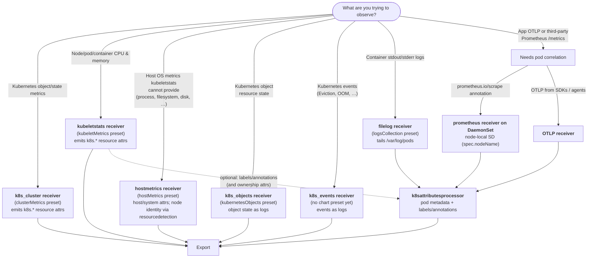

## Summary

This blueprint outlines a reference for Platform Engineering and SRE teams
responsible for providing observability infrastructure in Kubernetes clusters.
It covers two verticals: resource usage and operational state of workloads, and
health of Kubernetes critical components (DNS, networking, ingress).

By implementing the patterns in this blueprint, organizations can expect to
achieve:

- Out-of-the-box visibility into workload resource usage, OOM events, probe
  failures, and pod lifecycle state without application-side changes.
- Path to reliable monitoring of Kubernetes critical components (CoreDNS, CNI
  plugins, Ingress controllers, KEDA, etc)
- Uniform metadata enrichment using OTel semantic conventions, enabling
  correlated investigation across metrics, logs, and traces.
- Self-monitoring of the telemetry collection infrastructure so silent data gaps
  are detected before they affect incident response.

## Background

Kubernetes clusters host two classes of observable entities:

1. **Workloads** — application containers and the Kubernetes primitives
   (Statefulset, Deployment, Daemonset, ReplicaSet, etc) managing them - emit
   signals via OTel SDKs, but their resource utilization and operational state
   (CPU throttling, OOM kills, pod phase, probe results) are only visible
   through Kubernetes-specific APIs. Additionally, some of those components are
   managed in the node level, like pods and containers, while others are managed
   in the cluster/control-plane level like ReplicaSet states, HPAs and so on.
2. **Critical infrastructure components** - CoreDNS, CNI plugins, Ingress
   controllers, volume subsystems, KEDA, and similar platform services — are
   (generally) platform-owned, expose Prometheus metrics natively, and require
   dedicated scrape configurations.

This blueprint focuses on _what_ to collect and _how to label it_. Collector
pipeline topology is referenced only when needed to observe Kubernetes specific
components; recommendations for Collector topologies for your own telemetry are
documented separately in the
[Managed Telemetry Platforms Blueprint](/docs/guidance/blueprints/managed-telemetry-platforms-for-k8s-workloads/).

## Common challenges

### 1. Workload telemetry is incomplete

CPU throttling, OOM kills, pod phase transitions, and probe failures are not
emitted by application code. They are only accessible through the Kubernetes API
server, sources the platform team must explicitly collect.

This leads to:

- **Invisible resource pressure**: CPU throttling at the cgroup level surfaces
  only as increased latency, with no infrastructure attribution.
- **OOM kills appear as application crashes**: Without a correlated OOM signal,
  operators cannot distinguish a memory misconfiguration from an application
  bug.
- **Throttled versus OOM is indistinguishable**: Both cause pod restarts.
  Without container restart and last-terminated-reason signals
  (`k8s.container.restarts` from the API server) correlated with kubelet
  CPU/memory metrics, there is no basis for remediation.

### 2. Metadata is inconsistent across signals and layers

Each scraper attaches different label schemas (`pod_name`, `pod`,
`kubernetes_namespace`, `namespace`). OTel semantic convention attributes
(`k8s.pod.name`, `k8s.namespace.name`) are not applied automatically.

This leads to:

- **Disjointed infra telemetry from app telemetry**: Increases cognitive load on
  operators to troubleshoot if a certain issue is caused by the app/container or
  infra/resources
- **Alert rules break silently on scraper changes**: An alert written against
  `pod_name` stops matching when a new scraper uses `pod`.
- **Organizational context is absent**: Team ownership, environment, and tier
  labels from pod annotations are rarely in telemetry, making alert routing and
  cost attribution manual.

### 3. Critical cluster components are not observable by default

CoreDNS, CNI plugins, Ingress controllers, KEDA, cert-manager **and many
others** each expose metrics with no standard discovery mechanism.

Some examples of what this leads to:

- **DNS latency spikes look like application problems**: CoreDNS slowdowns
  appear as upstream timeouts, indistinguishable from a slow downstream service
  without a DNS-layer metric.
- **CNI packet drops are unattributed**: Packets dropped at the network policy
  layer surface as intermittent pod connectivity failures with no network-layer
  attribution.
- **KEDA failures leave workloads silently under-provisioned**: A scaler that
  cannot reach its source metric stops autoscaling without producing any
  user-visible error.

### 4. Telemetry collection infrastructure has no self-monitoring

Silent gaps in Collector and SDK pipelines — crashed scrapers, export failures,
and data drops under backpressure — are covered in
[Challenge 5](/docs/guidance/blueprints/managed-telemetry-platforms-for-k8s-workloads/#challenge-5)
of the
[Managed Telemetry Platforms for Kubernetes Workloads](/docs/guidance/blueprints/managed-telemetry-platforms-for-k8s-workloads/)
blueprint.

## General guidelines

### 1. Use OTel native receivers to collect workload and infrastructure signals

**Challenges addressed:** 1, 2

This blueprint recommends the usage of OTel native receivers:

| OpenTelemetry Collector component | Helm chart preset   | Analog Prometheus/Kubernetes component | What it covers                                                                                                                     |
| --------------------------------- | ------------------- | -------------------------------------- | ---------------------------------------------------------------------------------------------------------------------------------- |
| `k8s_cluster` **receiver**        | `clusterMetrics`    | `kube-state-metrics`                   | Kubernetes object/state metrics from the Kubernetes API, such as pods, nodes, namespaces, workloads, quotas, and conditions.       |
| `kubeletstats` **receiver**       | `kubeletMetrics`    | **cAdvisor / kubelet metrics**         | Preferred source for node, pod, and container CPU/memory (and volume) resource metrics from the kubelet.                           |
| `hostmetrics` **receiver**        | `hostMetrics`       | `node-exporter` (partial)              | Host OS metrics that `kubeletstats` does not cover — for example process, filesystem, disk I/O, network, load, and paging metrics. |
| `filelog` **receiver**            | `logsCollection`    | Fluent Bit / node log agents           | Container stdout/stderr written by the runtime under `/var/log/pods/*/*/*.log`. Collect once per node via a DaemonSet.             |
| `k8s_objects` **receiver**        | `kubernetesObjects` | N/A                                    | Kubernetes object resource state (pull and/or watch) as logs from the API server.                                                  |
| `k8s_events` **receiver**         | `kubernetesEvents`  | N/A                                    | Cluster events as they occur (Eviction, OOM, etc)                                                                                  |

Outcomes:

- Complete workload-level resource coverage (throttling, OOM, pod phase, probe
  failures) without any application code changes.

### 2. Apply uniform metadata enrichment using OpenTelemetry semantic conventions

**Challenges addressed:** 2

Telemetry that reaches the backend should carry consistent OTel Kubernetes
resource attributes so signals can join without remapping. How that metadata is
obtained depends on the source:

- **OTel-native Kubernetes receivers** (`k8s_cluster`, `kubeletstats`,
  `k8s_objects`, `k8s_events`) already emit the core identity attributes
  (`k8s.pod.name`, `k8s.namespace.name`, `k8s.node.name`, workload UIDs, and
  similar). Prefer those receivers' built-in attributes rather than re-deriving
  them.
- **Application OTLP and Prometheus-scraped telemetry** typically lack that
  context — enrich them with the `k8sattributesprocessor`, which associates data
  to pods and adds standard `k8s.`* attributes.
- **Organizational labels/annotations** (team, environment, tier) are not
  emitted by the infra receivers; extract them via `k8sattributesprocessor`
  `extract.labels` / `extract.annotations` when you need them on app or
  pod-scoped signals.

Outcomes:

- Metrics, logs, and traces join on consistent attributes with no per-query
  remapping.
- OpenTelemetry semantic conventions are adhered to, making adoption of
  observability tools easier

### 3. Use the OpenTelemetry operator as the collector control plane, and scrape Prometheus targets node-locally

**Challenges addressed:** 3

The OpenTelemetry Operator must manage all OTel Collectors in the cluster. The
`OpenTelemetryCollector` CRD declares Collector configuration as a Kubernetes
object, enabling GitOps workflows, versioned rollouts, and the deployment modes
this blueprint uses — **DaemonSet** for per-node collection and optional
**Deployment** for cluster-scoped work when leader election is not available.

Scraping Prometheus-native cluster components (CoreDNS, CNI plugins, Ingress
controllers, KEDA, cert-manager, and similar `/metrics` endpoints) does **not**
require the Target Allocator. Each DaemonSet Collector pod should discover and
scrape only targets on **its own node**, using Kubernetes pod service discovery
filtered by `spec.nodeName` (kube-stack injects `${OTEL_K8S_NODE_NAME}` on
DaemonSet collectors). Pods opt in with the classic Prometheus annotations
(`prometheus.io/scrape=true`, plus optional `prometheus.io/port`,
`prometheus.io/path`, and `prometheus.io/scheme`).

Because a given pod lives on exactly one node, each target is scraped by exactly
one Collector replica — no cluster-wide target list, no Target Allocator, and no
double-scraping from overlapping ServiceMonitor/PodMonitor jobs. Do not combine
this node-local pattern with Target Allocator (or any other cluster-wide scrape)
against the same endpoints.

The Operator additionally introduces the `Instrumentation` CRD for zero-code
auto-instrumentation injection. While that is out of scope here, it makes the
Operator the correct foundational dependency for the full cluster observability
stack.

Outcomes:

- Each Prometheus target scraped exactly once, by the Collector on the node
  where the target runs.
- Collector lifecycle is managed automatically w/ autohealing

## Implementation

Use this decision tree to choose a collection method for any signal source in
the cluster. The guiding principle: prefer OTel-native receivers for workload,
host, cluster-state, container logs, and Kubernetes events/object logs — those
receivers already set core `k8s.*` (or host) identity attributes. Use
`k8sattributesprocessor` for application OTLP, container logs, and
Prometheus-scraped telemetry that lack that context, and optionally to attach
pod labels/annotations onto pod-scoped metrics.

```mermaid
flowchart TD
  Start(["`What are you trying to observe?`"]) -->|"`Kubernetes object/state metrics<br/>`"| Cluster["`**k8s_cluster receiver**<br/>(clusterMetrics preset)<br/>emits k8s.* resource attrs`"]
  Start -->|"`Node/pod/container CPU & memory<br/>`"| Kubelet["`**kubeletstats receiver**<br/>(kubeletMetrics preset)<br/>emits k8s.* resource attrs`"]
  Start -->|"`Host OS metrics kubeletstats<br/>cannot provide<br/>(process, filesystem, disk, …)`"| Host["`**hostmetrics receiver**<br/>(hostMetrics preset)<br/>host/system attrs; node identity via resourcedetection`"]
  Start -->|"`Kubernetes object<br/>resource state`"| Objects["`**k8s_objects receiver**<br/>(kubernetesObjects preset)<br/>object state as logs`"]
  Start -->|"`Kubernetes events<br/>(Eviction, OOM, …)`"| Events["`**k8s_events receiver**<br/>(no chart preset yet)<br/>events as logs`"]
  Start -->|"`Container stdout/stderr logs<br/>`"| Logs["`**filelog receiver**<br/>(logsCollection preset)<br/>tails /var/log/pods`"]
  Start -->|"`App OTLP or third-party<br/>Prometheus /metrics`"| Scraped["`Needs pod correlation`"]

  Scraped -->|"`prometheus.io/scrape annotation`"| Prom["`**prometheus receiver on DaemonSet**<br/>node-local SD (spec.nodeName)`"]
  Scraped -->|"`OTLP from SDKs / agents`"| OTLP["`**OTLP receiver**`"]

  Cluster --> Export
  Kubelet --> Export
  Host --> Export
  Objects --> Export
  Events --> Export

  Prom --> K8sAttr["`**k8sattributesprocessor**<br/>pod metadata + labels/annotations`"]
  OTLP --> K8sAttr
  Logs --> K8sAttr
  Kubelet -.->|"`optional: labels/annotations<br/>(and ownership attrs)`"| K8sAttr
  K8sAttr --> Export
```

### 1. Deploy the opentelemetry-kube-stack

**Guidelines supported:** 1, 2, 3

Deploy the `opentelemetry-kube-stack`
[Helm chart](https://github.com/open-telemetry/opentelemetry-helm-charts/tree/main/charts/opentelemetry-kube-stack)
as the foundation for this blueprint. The chart installs the
[OpenTelemetry Operator](/docs/platforms/kubernetes/operator/) together with a
suite of Collectors managed as `OpenTelemetryCollector` CRs — so you do not need
separate `opentelemetry-operator` and `opentelemetry-collector` chart releases.

Out of the box, the chart deploys a **DaemonSet** collector with the presets
this blueprint relies on (`hostMetrics`, `kubeletMetrics`,
`kubernetesAttributes`, `kubernetesEvents`, and `clusterMetrics`,
`logsCollection`, among others). Cluster-wide metrics use leader election on
that DaemonSet so only one replica emits them; if leader election is not an
option, use the chart's
[no-leader-election alternative](https://github.com/open-telemetry/opentelemetry-helm-charts/tree/main/charts/opentelemetry-kube-stack/examples/no-leader-election-extension),
which separates cluster-scoped collection. The same DaemonSet scrapes
Prometheus-native components on the local node (Implementation step 6).

Rather than hand-writing receiver, processor, and RBAC configuration, configure
collection through the chart's **presets** under `collectors.`* — each preset
wires the matching receiver/processor into the pipeline and generates the
required RBAC, volumes, and mounts. The remaining steps are `values.yaml`
fragments for this chart.

### 2. Collect cluster state metrics with the `clusterMetrics` preset

**Guidelines supported:** 1, 2

The `k8s_cluster`
[receiver](/docs/platforms/kubernetes/collector/components/#kubernetes-cluster-receiver)
provides object state (pod phase, restart counts, replica state, node
conditions) by watching the Kubernetes API — the OTel-native replacement for
`kube-state-metrics`. It does not provide resource consumption; that comes from
the kubelet (Implementation step 3).

Because the receiver gathers cluster-wide telemetry, only one collector replica
should emit it. With `opentelemetry-kube-stack`, enable the `clusterMetrics`
[preset](/docs/platforms/kubernetes/helm/collector/#cluster-metrics-preset) on
the DaemonSet collector (`collectors.daemon.presets.clusterMetrics`); leader
election ensures a single replica produces the data. If leader election is not
available, use the chart's separated cluster collector instead. The preset adds
the `k8s_cluster` receiver and the required RBAC automatically.

This emits OTel-native equivalents such as `k8s.pod.phase`,
`k8s.container.restarts`, `k8s.deployment.available`/`k8s.deployment.desired`,
`k8s.node.condition_ready`, `k8s.pod.status_reason` and
`k8s.container.status.reason`. Status reason are specially important to
understand why a pod might be failing, although, they are optional metrics,
please check the `k8s_cluster`
[receiver optional metrics documentation](https://github.com/open-telemetry/opentelemetry-collector-contrib/blob/main/receiver/k8sclusterreceiver/documentation.md#optional-metrics)
on how to enable it.

### 3. Prefer `kubeletstats` for resource usage; use `hostmetrics` only for gaps

**Guidelines supported:** 1, 2

Both the `kubeletstats`
[receiver](/docs/platforms/kubernetes/collector/components/#kubeletstats-receiver)
and `hostmetrics`
[receiver](/docs/platforms/kubernetes/collector/components/#host-metrics-receiver)
can report node CPU and memory. Prefer `kubeletstats` for node, pod, and
container resource usage — it is the kubelet/cAdvisor-aligned source and avoids
duplicating the same CPU/memory series from `hostmetrics`. Enable it on the
kube-stack **DaemonSet** collector (`collectors.daemon.presets.kubeletMetrics`)
with `metric_groups: [node, pod, container]`.

Use `hostmetrics`
[preset](/docs/platforms/kubernetes/helm/collector/#host-metrics-preset) only
for signals `kubeletstats`
[preset](/docs/platforms/kubernetes/helm/collector/#kubelet-metrics-preset)
cannot provide — typically process metrics, plus host-level filesystem, disk
I/O, network, load, and paging. When both presets are enabled, disable the
overlapping `cpu` and `memory` scrapers in `hostmetrics` so those come solely
from `kubeletstats`.

Important: To guarantee coverage on control-plane and tainted nodes (GPU, spot),
add tolerations to the DaemonSet so every node is scraped — any node without a
Collector pod is a coverage gap.

### 4. Collect Kubernetes events and object state with the `k8s_objects` receiver

**Guidelines supported:** 1, 2

The `k8s_objects` receiver collects Kubernetes API data as logs. Use it for two
complementary signals:

- **Events** — via the `kubernetesEvents`
  [preset](/docs/platforms/kubernetes/helm/collector/#kubernetes-events-preset):
  watches cluster events as they happen (scheduling failures, probe failures,
  OOM kills, volume attach errors, and similar operational signals that metrics
  alone often miss).
- **Object resource state** — via the `kubernetesObjects`
  [preset](/docs/platforms/kubernetes/collector/components/#kubernetes-objects-receiver):
  periodically pulls (and optionally watches) Kubernetes objects such as pods,
  deployments, nodes, and related resources so you retain object state history
  as logs.

Important: Both must run as a Deployment (single-replica), use leader-election
for multiple replica resiliency, if needed.

### 5. Use `k8sattributesprocessor` to enrich telemetry with required and optional organizational labels

**Guidelines supported:** 2

The `kubernetesAttributes`
[preset](/docs/platforms/kubernetes/helm/collector/#kubernetes-attributes-preset)
enriches telemetry with relevant Kubernetes metadata, some of them are required
for proper observability like `k8s.pod.name`, `k8s.namespace.name`, and
`k8s.node.name`.

Configure `extract.labels` / `extract.annotations` explicitly for the
organizational keys you care about like `team`, `squad`, `owner`, etc. If
`k8s.cluster.name` is not resolvable from cloud metadata, inject it as a static
resource attribute via the `resourceprocessor` (or set `clusterName` in the
kube-stack values).

Important: Never use a custom label where the
[K8s semantic conventions](/docs/specs/semconv/resource/k8s/) has an option for
it already.

### 6. Scrape Prometheus-native components node-locally on the DaemonSet

**Guidelines supported:** 3

Manual, cluster-wide scrape targets on the
[Prometheus receiver](https://github.com/open-telemetry/opentelemetry-collector-contrib/blob/main/receiver/prometheusreceiver/README.md#getting-started)
are prone to double-scraping, which inflates metric values and makes them
unreliable. The Target Allocator solves that by sharding targets across
Collector replicas, but it is unnecessary when every Collector already runs as a
DaemonSet and discovery is restricted to the same node the collector runs on.

The recommended implementation is the
[opentelemetry-kube-stack](https://github.com/open-telemetry/opentelemetry-helm-charts/tree/main/charts/opentelemetry-kube-stack)
DaemonSet pattern: the Prometheus receiver uses Kubernetes pod service discovery
restricted to the local node (`spec.nodeName=${OTEL_K8S_NODE_NAME}`). Each
Collector pod scrapes only annotated pods on that node. A pod lives on one node,
so it is scraped once.

Out of the box, kube-stack loads
`collectors.daemon.scrape_configs_file: daemon_scrape_configs.yaml`, which
already includes a job for pods carrying `prometheus.io/scrape=true`. To get the
same behavior without the scrape file, set `scrape_configs_file: ""` and enable
`collectors.daemon.presets.prometheus.podAnnotations` — those presets are
mutually exclusive with `scrape_configs_file` and require `mode: daemonset`.

Ensure critical cluster components (CoreDNS, CNI plugins, Ingress controllers,
KEDA, cert-manager, and similar) expose a `/metrics` endpoint and carry
`prometheus.io/scrape=true`. Do **not** also scrape those same endpoints via
Target Allocator, ServiceMonitor, or PodMonitor — overlapping discovery is what
reintroduces double-scraping.

## Reference architectures

> If you have a production-grade OpenTelemetry architecture and would like to be
> featured in this page, please get in touch with the OTel End-User SIG!
