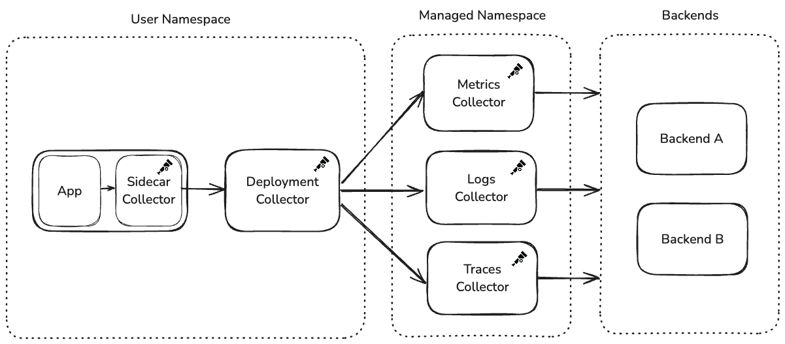

Date: April 8, 2026

This reference implementation features [Adobe](https://www.adobe.com/), a global
software company. Adobe's observability team has built an OpenTelemetry-based
telemetry pipeline designed for simplicity at massive scale, with thousands of
Collectors running per signal type across the company's infrastructure.

## Organizational structure

Adobe's central observability team is responsible for providing observability
infrastructure across the company. However, as
[Bogdan Stancu](https://github.com/bogdan-st), Senior Software Engineer,
explained, Adobe's history of acquisitions means the landscape is not fully
consolidated. Some large product groups have their own dedicated observability
teams, while the central team serves as the primary provider.

The OpenTelemetry-based pipeline was introduced as a new option alongside
existing monitoring solutions, designed primarily for new applications and
deployments. Adoption is voluntary, not mandated. Existing applications with
established monitoring have not been migrated.

## OpenTelemetry adoption

The decision to adopt OpenTelemetry was driven by alignment between the
project's capabilities and the team's goals. The observability team needed a
solution that could serve Adobe's diverse technology landscape, support multiple
backends, and remain simple for service teams to adopt.

> "It matched everything that we wanted," Bogdan said.

The [OpenTelemetry Operator](/docs/platforms/kubernetes/operator/), the
Collector's component model, and community Helm charts provided the building
blocks for a platform-level observability offering that could scale without
requiring deep OpenTelemetry expertise from individual service teams.

## Architecture: A three-tier collector pipeline

Adobe's collector architecture follows a three-tier design: a user-facing Helm
chart containing two collectors, a centralized managed namespace with per-signal
collector deployments, and the observability backends.



### Tier 1: The user Helm chart

The observability team provides a Helm chart that service teams deploy into
their own namespaces. This chart creates two collectors:

**Sidecar Collector (in the application pod)**: Runs alongside the application
container and is intentionally locked down. Service teams cannot modify its
configuration. It collects all telemetry: metrics, logs, traces, regardless of
what the team has chosen to export downstream. The configuration is immutable to
prevent application restarts caused by configuration changes.

**Deployment Collector (standalone)**: Receives telemetry from the sidecar over
OTLP and handles routing and export. Unlike the sidecar, this collector _is_
configurable through Helm values. The observability team provides sensible
defaults, but service teams can customize exporters and add new destinations.
When configuration changes, only the deployment collector restarts. The
application pod and its sidecar remain untouched.

### Tier 2: The managed namespace

The deployment collectors forward telemetry to a centralized namespace managed
entirely by the observability team. A key architectural decision here is
signal-level isolation: the managed namespace runs a separate collector
deployment for each telemetry type: one for metrics, one for logs, and one for
traces.

If a backend becomes rate-limited or starts rejecting data for one signal type,
the others continue flowing uninterrupted. Despite handling thousands of
collectors' worth of upstream traffic, these managed deployments have generally
operated at default replica counts without requiring aggressive auto-scaling.

Service teams configure their desired backend through Helm values, which sets an
HTTP header on OTLP exports. The managed namespace collectors use this header
with the
[routing connector](https://github.com/open-telemetry/opentelemetry-collector-contrib/tree/6aff35ab5351482a4664f29a7d5428cedcf61a92/connector/routingconnector?from_branch=main)
to direct telemetry to the correct exporter.

### Tier 3: The observability backends

The managed namespace collectors export telemetry to backend destinations
managed by the observability team. Multiple backends are supported, and teams
select their destination through the Helm chart's values file.

## Auto-instrumentation: Two lines and it works

Adobe leverages the OpenTelemetry Operator for auto-instrumentation across the
languages supported by OpenTelemetry. The Operator is deployed to every cluster,
and service teams enable instrumentation by adding two annotations to their
Kubernetes deployment manifests:

```yaml
instrumentation.opentelemetry.io/inject-java: 'true'
sidecar.opentelemetry.io/inject: 'true'
```

> "People add two lines in their deployment. And it just works," Bogdan said.

Teams select their language in the Helm values, and the Operator handles the
rest. While teams are free to add manual SDK instrumentation—the sidecar accepts
all OTLP data—the observability team's supported path focuses on the
auto-instrumentation experience. The Operator has handled the scale of managing
sidecars and auto-instrumentation across the deployment fleet without issues.

This design philosophy runs through the entire platform: make the default path
require as little effort as possible, while leaving the door open for advanced
use cases.

## Custom distribution and components

Adobe builds its own OpenTelemetry Collector distribution to include only the
components they use, avoiding unnecessary dependencies from Contrib. This custom
distribution is the default in the Helm chart provided to service teams.
However, teams can manually switch to the Contrib distribution if they need
components not included in the custom build.

Adobe also maintains custom components, most notably an extension addressing a
fundamental challenge in their chained collector architecture.

### The chain collector problem

When collectors are chained, error visibility becomes a problem. The OTLP
transaction between the user's deployment collector and the managed namespace
collector completes with a 200 response _before_ the managed namespace collector
attempts to export to the backend. If the backend rejects the data, the error is
only visible in the managed namespace collector's logs.

> "The user would just see 200s. Metrics exported, all good," Bogdan explained.
> "Which we didn't want."

To address this, Bogdan built a custom extension that acts as a circuit breaker
for backend authentication. The extension runs in the managed namespace
collector's receiver, proactively sending mock authentication requests to the
backend and caching results. If authentication fails, it returns a 401 to the
upstream collector before the OTLP transaction completes, propagating the error
back to where users can see it.

Building this extension was one of Bogdan's first Go projects. The experience of
trying to contribute upstream sparked deeper involvement with the OpenTelemetry
community. Looking ahead, Bogdan would welcome a more general back-pressure
mechanism in the Collector, where exporter failures propagate upstream through
chained collectors.

## Deployment and lifecycle management

The observability team upgrades their collector distribution and the
OpenTelemetry Operator on a quarterly cadence. Upgrade issues have been rare.

When the Helm chart is updated, service teams pick up the new collector version
on their next deployment. However, the observability team has encountered a
compatibility challenge between the Operator and older collector versions: when
the Operator is upgraded, it can modify the `OpenTelemetryCollector` custom
resource to align with new configuration expectations. If a service team is
running a significantly older collector version, these changes can be
incompatible, preventing collectors from starting.

The resolution is straightforward—upgrading the collector fixes the issue—but it
has caused confusion for teams whose collectors suddenly break without any
changes on their end.

### Navigating component deprecations

Adobe's deployment has also navigated component deprecations as OpenTelemetry
evolves. The team originally used the routing processor to direct telemetry to
different backends based on HTTP headers, but migrated to the routing connector
when the processor was deprecated.

While the migration required work, the team views this as an expected part of
working with a rapidly evolving project.

> "This is a risk we knew about, the whole OpenTelemetry landscape is changing
> constantly and the benefits outweigh the 'issues' if you can call fast
> development an issue," Bogdan explained.

## What works well

The overall experience has been positive. The Collector's component model, the
auto-instrumentation experience via the Operator, and the Helm chart-based
deployment model have all worked reliably. The plug-and-play nature of the
platform, where teams go from zero to full observability with minimal
configuration, has been positively received by adopting teams.

## Advice for others

Based on Adobe's experience building a platform-level observability pipeline:

- **Treat OpenTelemetry as a platform to build on**: Don't expect it to solve
  all your problems out of the box. It's designed to be extended and customized
  for your specific needs.
- **Don't be afraid to build custom components**: The Collector's architecture
  makes it straightforward to build extensions tailored to your needs.
- **Design for user simplicity**: Make the default path require minimal effort.
  The teams consuming your platform are not observability experts.
- **Plan for error visibility in chained collectors**: OTLP transaction success
  does not guarantee end-to-end delivery. Consider how errors will surface to
  users.

## Takeaways

Adobe's story illustrates how a central observability team can offer a scalable,
self-service OpenTelemetry pipeline across a large and diverse organization. By
combining the Operator, Helm charts, sidecars, and per-signal collector
deployments, they've created a platform where service teams get observability
with minimal effort, while the observability team retains control over
centralized infrastructure.
