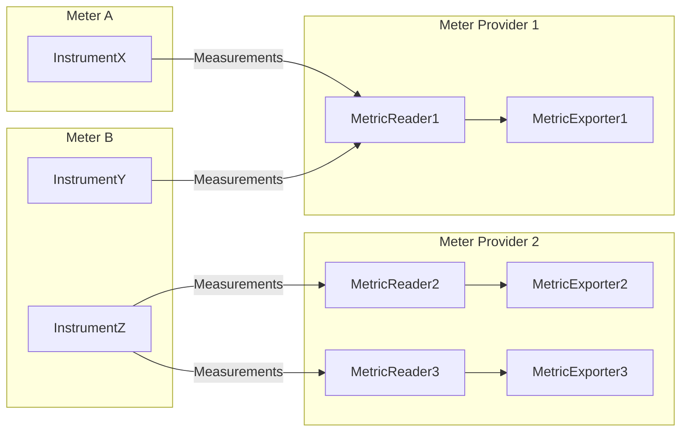
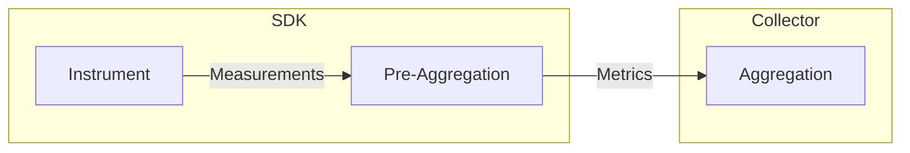
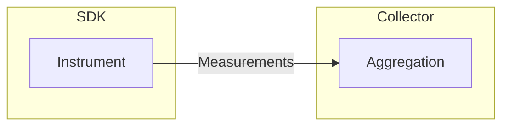

Follow these best practices to get the most out of OpenTelemetry .NET for
metrics.

## Package version

Use the
[System.Diagnostics.Metrics](https://learn.microsoft.com/dotnet/api/system.diagnostics.metrics)
APIs from the latest stable version of
[System.Diagnostics.DiagnosticSource](https://www.nuget.org/packages/System.Diagnostics.DiagnosticSource/)
package, regardless of the .NET runtime version being used:

- If you are using the latest stable version of OpenTelemetry .NET SDK, you do
  not have to worry about the version of `System.Diagnostics.DiagnosticSource`
  package because it is already taken care of for you via package dependency.
- The .NET runtime team is holding a high bar for backward compatibility on
  `System.Diagnostics.DiagnosticSource` even during major version bumps, so
  compatibility is not a concern here.
- Refer to the
  [.NET official document](https://learn.microsoft.com/dotnet/core/diagnostics/compare-metric-apis#systemdiagnosticsmetrics)
  for more information about `System.Diagnostics.Metrics`.

## Metrics API

### Meter

Avoid creating
[`System.Diagnostics.Metrics.Meter`](https://learn.microsoft.com/dotnet/api/system.diagnostics.metrics.meter)
too frequently. `Meter` is fairly expensive and meant to be reused throughout
the application. For most applications, it can be modeled as static readonly
field or singleton through dependency injection.

Use dot-separated [UpperCamelCase](https://en.wikipedia.org/wiki/Camel_case) as
the
[`Meter.Name`](https://learn.microsoft.com/dotnet/api/system.diagnostics.metrics.meter.name).
In many cases, using the fully qualified class name might be a good option. For
example:

```csharp
static readonly Meter MyMeter = new("MyCompany.MyProduct.MyLibrary", "1.0");
```

### Instruments

Understand and pick the right instrument type.

{} .NET runtime has provided several instrument types
based on the
[OpenTelemetry Specification](/docs/specs/otel/metrics/api/#instrument). Picking
the right instrument type for your use case is crucial to ensure the correct
semantics and performance. Check the
[Instrument Selection](/docs/specs/otel/metrics/supplementary-guidelines#instrument-selection)
section from the supplementary guidelines for more information.

> {}

| OpenTelemetry Specification                                                            | .NET Instrument Type                                                                                                        |
| -------------------------------------------------------------------------------------- | --------------------------------------------------------------------------------------------------------------------------- |
| [Asynchronous Counter](/docs/specs/otel/metrics/api/#asynchronous-counter)             | [`ObservableCounter<T>`](https://learn.microsoft.com/dotnet/api/system.diagnostics.metrics.observablecounter-1)             |
| [Asynchronous Gauge](/docs/specs/otel/metrics/api/#asynchronous-gauge)                 | [`ObservableGauge<T>`](https://learn.microsoft.com/dotnet/api/system.diagnostics.metrics.observablegauge-1)                 |
| [Asynchronous UpDownCounter](/docs/specs/otel/metrics/api/#asynchronous-updowncounter) | [`ObservableUpDownCounter<T>`](https://learn.microsoft.com/dotnet/api/system.diagnostics.metrics.observableupdowncounter-1) |
| [Counter](/docs/specs/otel/metrics/api/#counter)                                       | [`Counter<T>`](https://learn.microsoft.com/dotnet/api/system.diagnostics.metrics.counter-1)                                 |
| [Gauge](/docs/specs/otel/metrics/api/#gauge)                                           | [`Gauge<T>`](https://learn.microsoft.com/dotnet/api/system.diagnostics.metrics.gauge-1)                                     |
| [Histogram](/docs/specs/otel/metrics/api/#histogram)                                   | [`Histogram<T>`](https://learn.microsoft.com/dotnet/api/system.diagnostics.metrics.histogram-1)                             |
| [UpDownCounter](/docs/specs/otel/metrics/api/#updowncounter)                           | [`UpDownCounter<T>`](https://learn.microsoft.com/dotnet/api/system.diagnostics.metrics.updowncounter-1)                     |

Avoid creating instruments (for example, `Counter<T>`) too frequently.
Instruments are fairly expensive and meant to be reused throughout the
application. For most applications, instruments can be modeled as static
readonly fields or singleton through dependency injection.

Avoid invalid instrument names.

{} OpenTelemetry will not collect metrics from
instruments that are using invalid names. Refer to the
[OpenTelemetry Specification](/docs/specs/otel/metrics/api/#instrument-name-syntax)
for the valid syntax. {}

Avoid changing the order of tags while reporting measurements. For example:

{} The last line of code has bad
performance since the tags are not following the same order: {}

```csharp
counter.Add(2, new("name", "apple"), new("color", "red"));
counter.Add(3, new("name", "lime"), new("color", "green"));
counter.Add(5, new("name", "lemon"), new("color", "yellow"));
counter.Add(8, new("color", "yellow"), new("name", "lemon")); // bad perf
```

Use TagList properly to achieve the best performance. There are two different
ways of passing tags to an instrument API:

- Pass the tags directly to the instrument API:

  ```csharp
  counter.Add(100, new("Key1", "Value1"), new("Key2", "Value2"));
  ```

- Use
  [`TagList`](https://learn.microsoft.com/dotnet/api/system.diagnostics.taglist):

  ```csharp
  var tags = new TagList
  {
      { "DimName1", "DimValue1" },
      { "DimName2", "DimValue2" },
      { "DimName3", "DimValue3" },
      { "DimName4", "DimValue4" },
  };

  counter.Add(100, tags);
  ```

As a general rule:

- When reporting measurements with 3 tags or less, pass the tags directly to the
  instrument API.
- When reporting measurements with 4 to 8 tags (inclusive), use
  [`TagList`](https://learn.microsoft.com/dotnet/api/system.diagnostics.taglist?#remarks)
  to avoid heap allocation if avoiding GC pressure is a primary performance
  goal. For high performance code which consider reducing CPU utilization more
  important (e.g. to reduce latency, to save battery, etc.) than optimizing
  memory allocations, use profiler and stress test to determine which approach
  is better.
- When reporting measurements with more than 8 tags, the two approaches share
  very similar CPU performance and heap allocation. `TagList` is recommended due
  to its better readability and maintainability.

{} When reporting measurements with more than 8 tags,
the API allocates memory on the hot code path. You SHOULD try to keep the number
of tags less than or equal to 8. If you are exceeding this, check if you can
model some of the tags as Resource, as [shown here](#metrics-enrichment).
{}

## MeterProvider management

Avoid creating `MeterProvider` instances too frequently. `MeterProvider` is
fairly expensive and meant to be reused throughout the application. For most
applications, one `MeterProvider` instance per process would be sufficient. For
example:



Manage the lifecycle of `MeterProvider` instances if they are created by you.

As a general rule:

- If you are building an application with
  [dependency injection (DI)](https://learn.microsoft.com/dotnet/core/extensions/dependency-injection)
  (e.g. [ASP.NET Core](https://learn.microsoft.com/aspnet/core) and
  [.NET Worker](https://learn.microsoft.com/dotnet/core/extensions/workers)), in
  most cases you should create the `MeterProvider` instance and let DI manage
  its lifecycle. Refer to the
  [Getting Started with OpenTelemetry .NET Metrics in 5 Minutes - ASP.NET Core Application](/docs/languages/dotnet/metrics/getting-started-aspnetcore/)
  tutorial to learn more.
- If you are building an application without DI, create a `MeterProvider`
  instance and manage the lifecycle explicitly. Refer to the
  [Getting Started with OpenTelemetry .NET Metrics in 5 Minutes - Console Application](/docs/languages/dotnet/metrics/getting-started-console/)
  tutorial to learn more.
- If you forget to dispose the `MeterProvider` instance before the application
  ends, metrics might get dropped due to the lack of proper flush.
- If you dispose the `MeterProvider` instance too early, any subsequent
  measurements will not be collected.

## Memory management

In OpenTelemetry, [measurements](/docs/specs/otel/metrics/api/#measurement) are
reported via the metrics API. The SDK
[aggregates](/docs/specs/otel/metrics/sdk/#aggregation) metrics using certain
algorithms and memory management strategies to achieve good performance and
efficiency. Here are the rules which OpenTelemetry .NET follows while
implementing the metrics aggregation logic:

1. [**Pre-Aggregation**](#pre-aggregation): aggregation occurs within the SDK.
2. [**Cardinality Limits**](#cardinality-limits): the aggregation logic respects
   [cardinality limits](/docs/specs/otel/metrics/sdk/#cardinality-limits), so
   the SDK does not use indefinite amount of memory when there is cardinality
   explosion.
3. [**Memory Preallocation**](#memory-preallocation): the memory used by
   aggregation logic is allocated during the SDK initialization, so the SDK does
   not have to allocate memory on-the-fly. This is to avoid garbage collection
   being triggered on the hot code path.

### Example

Let us take the following example:

- During the time range (T0, T1]:
  - value = 1, name = `apple`, color = `red`
  - value = 2, name = `lemon`, color = `yellow`
- During the time range (T1, T2]:
  - no fruit has been received
- During the time range (T2, T3]:
  - value = 5, name = `apple`, color = `red`
  - value = 2, name = `apple`, color = `green`
  - value = 4, name = `lemon`, color = `yellow`
  - value = 2, name = `lemon`, color = `yellow`
  - value = 1, name = `lemon`, color = `yellow`
  - value = 3, name = `lemon`, color = `yellow`

If we aggregate and export the metrics using
[Cumulative Aggregation Temporality](/docs/specs/otel/metrics/data-model/#temporality):

- (T0, T1]
  - attributes: {name = `apple`, color = `red`}, count: `1`
  - attributes: {verb = `lemon`, color = `yellow`}, count: `2`
- (T0, T2]
  - attributes: {name = `apple`, color = `red`}, count: `1`
  - attributes: {verb = `lemon`, color = `yellow`}, count: `2`
- (T0, T3]
  - attributes: {name = `apple`, color = `red`}, count: `6`
  - attributes: {name = `apple`, color = `green`}, count: `2`
  - attributes: {verb = `lemon`, color = `yellow`}, count: `12`

If we aggregate and export the metrics using
[Delta Aggregation Temporality](/docs/specs/otel/metrics/data-model/#temporality):

- (T0, T1]
  - attributes: {name = `apple`, color = `red`}, count: `1`
  - attributes: {verb = `lemon`, color = `yellow`}, count: `2`
- (T1, T2]
  - nothing since we do not have any measurement received
- (T2, T3]
  - attributes: {name = `apple`, color = `red`}, count: `5`
  - attributes: {name = `apple`, color = `green`}, count: `2`
  - attributes: {verb = `lemon`, color = `yellow`}, count: `10`

### Pre-aggregation

Taking the [fruit example](#example), there are 6 measurements reported during
`(T2, T3]`. Instead of exporting every individual measurement event, the SDK
aggregates them and only exports the summarized results. This approach, as
illustrated in the following diagram, is called pre-aggregation:



Pre-aggregation brings several benefits:

1. Although the amount of calculation remains the same, the amount of data
   transmitted can be significantly reduced using pre-aggregation, thus
   improving the overall efficiency.
2. Pre-aggregation makes it possible to apply
   [cardinality limits](#cardinality-limits) during SDK initialization, combined
   with [memory preallocation](#memory-preallocation), they make the metrics
   data collection behavior more predictable (e.g. a server under
   denial-of-service attack would still produce a constant volume of metrics
   data, rather than flooding the observability system with large volume of
   measurement events).

There are cases where users might want to export raw measurement events instead
of using pre-aggregation, as illustrated in the following diagram. OpenTelemetry
does not support this scenario at the moment, if you are interested, please join
the discussion by replying to this
[feature ask](https://github.com/open-telemetry/opentelemetry-specification/issues/617).



### Cardinality limits

The number of unique combinations of attributes is called cardinality. Taking
the [fruit example](#example), if we know that we can only have apple/lemon as
the name, red/yellow/green as the color, then we can say the cardinality is 6.
No matter how many apples and lemons we have, we can always use the following
table to summarize the total number of fruits based on the name and color.

| Name  | Color  | Count |
| ----- | ------ | ----- |
| apple | red    | 6     |
| apple | yellow | 0     |
| apple | green  | 2     |
| lemon | red    | 0     |
| lemon | yellow | 12    |
| lemon | green  | 0     |

In other words, we know how much storage and network are needed to collect and
transmit these metrics, regardless of the traffic pattern.

In real world applications, the cardinality can be extremely high. Imagine if we
have a long running service and we collect metrics with 7 attributes and each
attribute can have 30 different values. We might eventually end up having to
remember the complete set of all 21,870,000,000 combinations! This cardinality
explosion is a well-known challenge in the metrics space. For example, it can
cause surprisingly high costs in the observability system, or even be leveraged
by hackers to launch a denial-of-service attack.

[Cardinality limit](/docs/specs/otel/metrics/sdk/#cardinality-limits) is a
throttling mechanism which allows the metrics collection system to have a
predictable and reliable behavior when excessive cardinality happens, whether it
was due to a malicious attack or developer making mistakes while writing code.

OpenTelemetry has a default cardinality limit of `2000` per metric. This limit
can be configured at the individual metric level using the
[View API](/docs/specs/otel/metrics/sdk/#view) and the
`MetricStreamConfiguration.CardinalityLimit` setting.

As of `1.10.0` once a metric has reached the cardinality limit, any new
measurement that could not be independently aggregated will be automatically
aggregated using the
[overflow attribute](/docs/specs/otel/metrics/sdk/#overflow-attribute).

{} In SDK versions `1.6.0` - `1.9.0` the overflow
attribute was an experimental feature that could be enabled by setting the
environment variable
`OTEL_DOTNET_EXPERIMENTAL_METRICS_EMIT_OVERFLOW_ATTRIBUTE=true`. {}

As of `1.10.0` when
[Delta Aggregation Temporality](/docs/specs/otel/metrics/data-model/#temporality)
is used, it is possible to choose a smaller cardinality limit because the SDK
will reclaim unused metric points.

{} In SDK versions `1.7.0` - `1.9.0`, metric point
reclaim was an experimental feature that could be enabled by setting the
environment variable
`OTEL_DOTNET_EXPERIMENTAL_METRICS_RECLAIM_UNUSED_METRIC_POINTS=true`.
{}

### Memory preallocation

OpenTelemetry .NET SDK aims to avoid memory allocation on the hot code path.
When this is combined with [proper use of Metrics API](#metrics-api), heap
allocation can be avoided on the hot code path.

You should measure memory allocation on hot code path, and ideally avoid any
heap allocation while using the metrics API and SDK, especially when you use
metrics to measure the performance of your application (for example, you do not
want to spend 2 seconds doing
[garbage collection](https://learn.microsoft.com/dotnet/standard/garbage-collection/)
while measuring an operation which normally takes 10 milliseconds).

## Metrics correlation

In OpenTelemetry, metrics can be correlated to
[traces](/docs/languages/dotnet/traces/) via
[exemplars](/docs/specs/otel/metrics/sdk/#exemplar). Check the
[Exemplars](/docs/languages/dotnet/metrics/exemplars/) tutorial to learn more.

## Metrics enrichment

When metrics are being collected, they normally get stored in a
[time series database](https://en.wikipedia.org/wiki/Time_series_database). From
storage and consumption perspective, metrics can be multi-dimensional. Taking
the [fruit example](#example), there are two dimensions - "name" and "color".
For basic scenarios, all the dimensions can be reported during the
[Metrics API](#metrics-api) invocation, however, for less trivial scenarios, the
dimensions can come from different sources:

- [Measurements](/docs/specs/otel/metrics/api/#measurement) reported via the
  [Metrics API](#metrics-api).
- Additional tags provided at instrument creation time. For example, the
  [`Meter.CreateCounter<T>(name, unit, description, tags)`](https://learn.microsoft.com/dotnet/api/system.diagnostics.metrics.meter.createcounter)
  overload.
- Additional tags provided at meter creation time. For example, the
  [`Meter(name, version, tags, scope)`](https://learn.microsoft.com/dotnet/api/system.diagnostics.metrics.meter.-ctor)
  overload.
- [Resources](/docs/specs/otel/resource/sdk) configured at the `MeterProvider`
  level.
- Additional attributes provided by the exporter or collector. For example,
  [jobs and instances](https://prometheus.io/docs/concepts/jobs_instances/) in
  Prometheus.

{} Instrument level tags support is not yet implemented
in OpenTelemetry .NET since the
[OpenTelemetry Specification](/docs/specs/otel/metrics/api/#instrument) does not
support it. {}

As a general rule:

- If the dimension is static throughout the process lifetime (e.g. the name of
  the machine, data center):
  - If the dimension applies to all metrics, model it as Resource, or even
    better, let the collector add these dimensions if feasible (e.g. a collector
    running in the same data center should know the name of the data center,
    rather than relying on / trusting each service instance to report the data
    center name).
  - If the dimension applies to a subset of metrics (e.g. the version of a
    client library), model it as meter level tags.
- If the dimension value is dynamic, report it via the
  [Metrics API](#metrics-api).

{} There were discussions around adding a new concept
called `MeasurementProcessor`, which allows dimensions to be added to / removed
from measurements dynamically. This idea did not get traction due to the
complexity and performance implications, refer to this
[pull request](https://github.com/open-telemetry/opentelemetry-specification/pull/1938)
for more context. {}

## Common issues that lead to missing metrics

- The `Meter` used to create the instruments is not added to the
  `MeterProvider`. Use `AddMeter` method to enable the processing for the
  required metrics.
