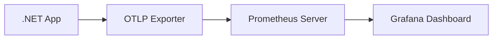

This guide will show you how to export OpenTelemetry metrics to Prometheus and
visualize them in Grafana.

## Prerequisites

- [.NET SDK](https://dotnet.microsoft.com/download) installed on your computer
- [Prometheus](https://prometheus.io/download/) downloaded (we'll cover
  installation)
- [Grafana](https://grafana.com/docs/grafana/latest/installation/) downloaded
  (we'll cover installation)

## Creating a .NET application with OTLP export

First, follow the
[Getting Started with Console](/docs/languages/dotnet/metrics/getting-started-console/)
guide to understand the basics of metrics collection.

Create a new console application:

```shell
dotnet new console --output getting-started-prometheus-grafana
cd getting-started-prometheus-grafana
```

Install the OpenTelemetry OTLP Exporter package:

```shell
dotnet add package OpenTelemetry.Exporter.OpenTelemetryProtocol
```

Update the `Program.cs` file with the following code:

```csharp
using System;
using System.Diagnostics.Metrics;
using System.Threading;
using OpenTelemetry;
using OpenTelemetry.Exporter;
using OpenTelemetry.Metrics;

// Define a meter
var myMeter = new Meter("MyCompany.MyProduct.MyLibrary", "1.0");

// Create a counter instrument
var myFruitCounter = myMeter.CreateCounter<long>("MyFruitCounter");

// Configure the OpenTelemetry MeterProvider with OTLP export
using var meterProvider = Sdk.CreateMeterProviderBuilder()
    .AddMeter("MyCompany.MyProduct.MyLibrary")
    .AddOtlpExporter((exporterOptions, metricReaderOptions) =>
    {
        exporterOptions.Endpoint = new Uri("http://localhost:9090/api/v1/otlp/v1/metrics");
        exporterOptions.Protocol = OtlpExportProtocol.HttpProtobuf;
        metricReaderOptions.PeriodicExportingMetricReaderOptions.ExportIntervalMilliseconds = 1000;
    })
    .Build();

Console.WriteLine("Press any key to exit");

// Keep generating metrics until user presses a key
while (!Console.KeyAvailable)
{
    myFruitCounter.Add(1, new("name", "apple"), new("color", "red"));
    myFruitCounter.Add(2, new("name", "lemon"), new("color", "yellow"));
    myFruitCounter.Add(1, new("name", "lemon"), new("color", "yellow"));
    myFruitCounter.Add(2, new("name", "apple"), new("color", "green"));
    myFruitCounter.Add(5, new("name", "apple"), new("color", "red"));
    myFruitCounter.Add(4, new("name", "lemon"), new("color", "yellow"));

    Thread.Sleep(300);
}

// Dispose meter provider before the application ends.
// This will flush the remaining metrics and shutdown the metrics pipeline.
meterProvider.Dispose();
```

When you run this application, it will attempt to export metrics to Prometheus
at `http://localhost:9090/api/v1/otlp/v1/metrics`. Initially, this will fail
because we haven't set up Prometheus yet, which we'll do next.

## Setting up Prometheus

Prometheus is an open source monitoring and alerting system that can scrape and
store metrics.

### Installing and running Prometheus

1. Download Prometheus from the [official site](https://prometheus.io/download/)
2. Extract it to a location on your machine
3. Run Prometheus with the OTLP receiver enabled:

```shell
./prometheus --web.enable-otlp-receiver
```

{} The `--web.enable-otlp-receiver` flag enables
Prometheus to receive metrics through the OpenTelemetry Protocol (OTLP).
{}

### Viewing metrics in Prometheus

1. Run your .NET application (it should now successfully export metrics to
   Prometheus)
2. Open a web browser and navigate to
   [http://localhost:9090/graph](http://localhost:9090/graph)
3. In the expression bar, type `MyFruitCounter_total` and click Execute

You should see a graph showing the increasing counter values for each
combination of fruit name and color.

## Setting up Grafana

Grafana provides more powerful visualization capabilities than the basic
Prometheus UI.

### Installing and running Grafana

1. Install Grafana following the
   [official instructions](https://grafana.com/docs/grafana/latest/installation/)
2. Start the Grafana server (command varies by OS)
3. Navigate to [http://localhost:3000](http://localhost:3000) in your browser
4. Log in with the default credentials (username: `admin`, password: `admin`)
   and set a new password when prompted

### Configuring Prometheus as a data source

1. In Grafana, hover over the Configuration (gear) icon in the left sidebar and
   click "Data sources"
2. Click "Add data source"
3. Select "Prometheus"
4. Set the URL to `http://localhost:9090`
5. Click "Save & Test" at the bottom

### Creating a dashboard

1. Click the "+" icon in the left sidebar and select "Dashboard"
2. Click "Add new panel"
3. In the query editor, enter a PromQL query such as
   `rate(MyFruitCounter_total[5m])` to see the per-second rate of increase over
   the past 5 minutes
4. Click "Apply" to add the panel to your dashboard
5. Save your dashboard by clicking the save icon in the top right

## Understanding the metrics flow



1. Your .NET application collects metrics using OpenTelemetry instruments
2. The OTLP Exporter sends these metrics to Prometheus using the OTLP protocol
3. Prometheus stores the metrics in its time-series database
4. Grafana queries Prometheus and visualizes the metrics in dashboards

## Learn more

- [Prometheus documentation](https://prometheus.io/docs/introduction/overview/)
- [Grafana documentation](https://grafana.com/docs/grafana/latest/)
- [PromQL cheat sheet](https://promlabs.com/promql-cheat-sheet/)
- [OpenTelemetry Protocol (OTLP) specification](/docs/specs/otel/protocol/otlp/)
