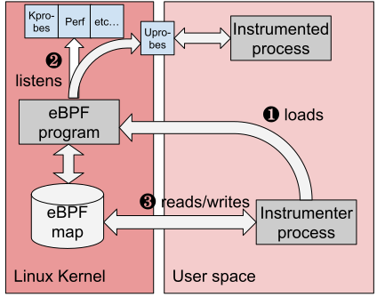

OpenTelemetry libraries provide telemetry collection for popular programming
languages and frameworks. However, getting started with distributed tracing can
be complex. In some compiled languages like Go or Rust, you must manually add
tracepoints to the code.

OpenTelemetry eBPF Instrumentation (OBI) is an auto-instrumentation tool to
easily get started with Application Observability. OBI uses eBPF to
automatically inspect application executables and the OS networking layer, and
capture trace spans related to web transactions and Rate Errors Duration (RED)
metrics for Linux HTTP/S and gRPC services. All data capture occurs without any
modifications to application code or configuration.

OBI offers the following features:

- **Wide language support**: Java, .NET, Go, Python, Ruby, Node.js, C, C++, and
  Rust
- **Lightweight**: No code changes required, no libraries to install, no
  restarts needed
- **Efficient instrumentation**: Traces and metrics are captured by eBPF probes
  with minimal overhead
- **Distributed tracing**: Distributed trace spans are captured and reported to
  a collector
- **Kubernetes-native**: Provides configuration-free auto-instrumentation for
  Kubernetes applications
- **Visibility into encrypted communications**: Capture transactions over
  TLS/SSL without decryption
- **Context propagation**: Propagate trace context across services automatically
- **Protocol support**: HTTP/S, gRPC, and gRPC-Web
- **Low cardinality metrics**: Prometheus-compatible metrics with low
  cardinality for cost reduction
- **Network observability**: Capture network flows between services
- **Database traces**: Capture database queries and connections

## Requirements

OBI requires the following to run:

- Linux kernel version 5.8 or later (or 4.18 for Redhat Enterprise Linux)
- An x86_64 or arm64 processor
- Runtime support for eBPF (most modern Linux distributions)
- Administrative privileges (root access) or the specific capabilities listed in
  the [configuration reference](security/)

## Compatibility

OBI is tested with the following Linux distributions:

- Ubuntu 20.04 LTS, 21.04, 22.04 LTS and 23.04
- CentOS 7, 8, and 9
- AlmaLinux 8, 9
- Rocky Linux 8, 9
- Red Hat Enterprise Linux 8, 9
- Debian 11, 12
- openSUSE Leap 15.3, 15.4
- SUSE Linux Enterprise Server 15 SP4

- OBI also supports RedHat-based distributions: RHEL8, CentOS 8, Rocky8,
  AlmaLinux8, and others, which ship a Kernel 4.18 that backports eBPF-related
  patches.

- For instrumenting Go programs, compile with at least Go 1.17. OBI support Go
  applications built with a major **Go version no earlier than 3 versions**
  behind the current stable major release.
- Administrative access rights to execute OBI.

## Limitations

OBI has its limitations too. It only provides generic metrics and transaction
level trace span information. Language agents and manual instrumentation is
still recommended, so that you can specify the custom attributes and events you
want to capture.

While most eBPF programs require elevated privileges, OBI allows you to specify
finer grained permissions to run with minimum required permissions, such as:
`CAP_DAC_READ_SEARCH`, `CAP_SYS_PTRACE`, `CAP_PERFMON`, `CAP_BPF`,
`CAP_CHECKPOINT_RESTORE`, and others.

Some OBI functionality requires further permissions, for example using the
network observability probes with Linux Traffic Control requires
`CAP_NET_ADMIN`, but it's a feature you have to optionally enable.

For a comprehensive list of capabilities required by OBI, refer to
[Security, permissions and capabilities](security/).

## Get started with OBI

- Follow the [setup](setup/) documentation to get started with OBI either with
  Docker or Kubernetes.
