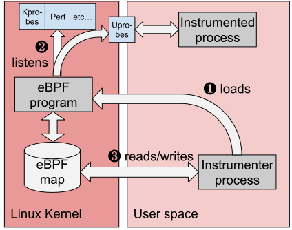

OpenTelemetry libraries provide telemetry collection for popular programming
languages and frameworks. However, getting started with distributed tracing can
be complex. In some compiled languages like Go or Rust, you must manually add
tracepoints to the code.

OpenTelemetry eBPF Instrumentation (OBI) is an auto-instrumentation tool to
easily get started with Application Observability. OBI uses eBPF to
automatically inspect application executables and the OS networking layer, and
capture trace spans related to web transactions and Rate Errors Duration (RED)
metrics for Linux HTTP/S and gRPC services. All data capture occurs without any
modifications to application code or configuration.

OBI offers the following features:

- **Wide language support**: Java (JDK 8+), .NET, Go, Python, Ruby, Node.js, C,
  C++, and Rust
- **Lightweight**: No code changes required, no libraries to install, no
  restarts needed
- **Efficient instrumentation**: Traces and metrics are captured by eBPF probes
  with minimal overhead
- **Distributed tracing**: Distributed trace spans are captured and reported to
  a collector
- **Log enrichment**: Enrich JSON logs with trace context for correlation
- **Kubernetes-native**: Provides configuration-free auto-instrumentation for
  Kubernetes applications
- **Visibility into encrypted communications**: Capture transactions over
  TLS/SSL without decryption
- **Context propagation**: Propagate trace context across services automatically
- **Protocol support**: HTTP/S, gRPC, gRPC-Web, JSON-RPC, MQTT, Memcached, and
  more
- **Database instrumentation**: PostgreSQL (including pgx driver), MySQL,
  MongoDB, Redis, Couchbase (N1QL/SQL++ and KV protocol)
- **GenAI instrumentation**: Trace and metrics for OpenAI, Anthropic Claude,
  Google AI Studio (Gemini), and AWS Bedrock API calls with automatic payload
  extraction
- **Low cardinality metrics**: Prometheus-compatible metrics with low
  cardinality for cost reduction
- **Network observability**: Capture network flows between services with
  host-level TCP RTT statistics
- **Enhanced service discovery**: Improved service name lookup with DNS
  resolution
- **Collector integration**: Run OBI as an OpenTelemetry Collector receiver
  component

## Recent highlights (v0.8.0)

OBI v0.8.0 expands protocol coverage, payload extraction, and deployment
documentation:

- **Generic Go tracing improvements**: Added generic Go protocol support,
  including context propagation for generic requests
- **Expanded protocol coverage**: Added JSON-RPC support across all languages
- **Deeper HTTP payload extraction**: Added full HTTP body extraction, with
  bounded decompression for response bodies
- **Broader GenAI coverage**: Added Google AI Studio (Gemini) and AWS Bedrock
  payload extraction, and fixed Vertex AI Gemini support
- **Named CIDR labels**: Network metrics can now label configured CIDR ranges
  with human-readable names
- **New example scenario**: Added an Apache HTTP Server example alongside the
  existing NGINX walkthroughs
- **Support documentation**: Added a project support matrix for release
  artifacts and supported environments

For a complete list of changes and upgrade notes, see the
[release notes](https://github.com/open-telemetry/opentelemetry-ebpf-instrumentation/releases/tag/v0.8.0).

If you want to explore the upstream examples, see the
[NGINX walkthrough](https://github.com/open-telemetry/opentelemetry-ebpf-instrumentation/tree/v0.8.0/examples/nginx)
and the
[Apache walkthrough](https://github.com/open-telemetry/opentelemetry-ebpf-instrumentation/tree/v0.8.0/examples/apache).

## How OBI works

The following diagram shows the high-level OBI architecture and where eBPF
instrumentation fits into the telemetry pipeline.

## Compatibility

OBI supports Linux environments that meet the following requirements:

| Requirement      | Supported                                                             |
| :--------------- | :-------------------------------------------------------------------- |
| CPU architecture | `amd64`, `arm64`                                                      |
| Linux kernel     | `5.8+`, or RHEL-family Linux `4.18+` with the required eBPF backports |
| Kernel features  | BTF                                                                   |
| Privileges       | Root, or the Linux capabilities required by the enabled OBI features  |

OBI publishes the following supported release artifacts:

| Artifact                                         | Supported platforms          |
| :----------------------------------------------- | :--------------------------- |
| `obi` binary archive                             | Linux `amd64`, Linux `arm64` |
| `k8s-cache` binary archive                       | Linux `amd64`, Linux `arm64` |
| `otel/ebpf-instrument` container image           | Linux `amd64`, Linux `arm64` |
| `otel/ebpf-instrument-k8s-cache` container image | Linux `amd64`, Linux `arm64` |

OBI can be deployed on standalone Linux hosts, in containers, and on Kubernetes
when the environment meets the requirements above.

OBI does not support non-Linux operating systems, Linux architectures other than
`amd64` and `arm64`, Linux environments without BTF, or kernel versions earlier
than Linux `5.8` outside the documented RHEL-family `4.18+` exception.

Feature-specific support details are documented in these guides:

- [Distributed traces](distributed-traces/): context propagation support,
  runtime-specific requirements, and distributed tracing limitations
- [Export data](configure/export-data/): protocol, database, messaging, GenAI,
  GPU, and Go library instrumentation support

## Limitations

OBI provides application and protocol observability without code changes, but it
does not replace language-level instrumentation in every scenario. Use language
agents or manual instrumentation when you need custom spans,
application-specific attributes, business events, or other in-process telemetry
that eBPF-based instrumentation cannot derive automatically.

OBI can automatically capture network and protocol activity, but it cannot
always recover application-specific details that are not visible from eBPF
observation points.

Some features also have additional caveats or narrower support than the core
platform requirements. For details, refer to the feature-specific documentation
for [distributed traces](distributed-traces/) and
[exported instrumentation](configure/export-data/).

For a comprehensive list of capabilities required by OBI, refer to
[Security, permissions and capabilities](security/).

## Get started with OBI

- Follow the [setup](setup/) documentation to get started with OBI either with
  Docker or Kubernetes.
- Learn about [trace-log correlation](./trace-log-correlation/) to connect
  traces with application logs and enrich JSON logs with trace context.
- Discover how to run
  [OBI as a Collector receiver](./configure/collector-receiver/) for centralized
  telemetry processing.

## Troubleshooting

- See the [troubleshooting](./troubleshooting) guide for help with common
  issues.
