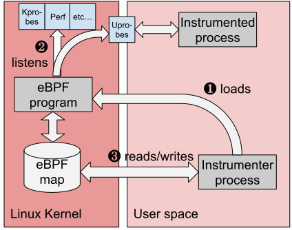

OpenTelemetry libraries provide telemetry collection for popular programming
languages and frameworks. However, getting started with distributed tracing can
be complex. In some compiled languages like Go or Rust, you must manually add
tracepoints to the code.

OpenTelemetry eBPF Instrumentation (OBI) is an auto-instrumentation tool to
easily get started with Application Observability. OBI uses eBPF to
automatically inspect application executables and the OS networking layer, and
capture trace spans, Rate Errors Duration (RED) metrics, runtime metrics, and
application and network relationships for supported Linux workloads. All data
capture occurs without any modifications to application code or configuration.

OBI offers the following features:

- **Wide language support**: Java (JDK 8+), .NET, Go, Python, Ruby, Node.js, C,
  C++, and Rust
- **Lightweight**: No code changes required, no libraries to install, no
  restarts needed
- **Efficient instrumentation**: Traces and metrics are captured by eBPF probes
  with minimal overhead
- **Distributed tracing**: Distributed trace spans are captured and reported to
  a collector
- **Log enrichment**: Enrich JSON and plain-text logs with trace context for
  correlation
- **Kubernetes-native**: Provides configuration-free auto-instrumentation for
  Kubernetes applications
- **Visibility into encrypted communications**: Capture transactions over
  TLS/SSL without decryption
- **Context propagation**: Propagate trace context across services automatically
- **Protocol support (client and server)**: HTTP/S, HTTP/2, gRPC, Kafka, NATS,
  MQTT, Memcached, SunRPC (including NFS), and JSON-RPC
- **Protocol support (client only)**: AMQP 1.0 and DNS queries
- **Database instrumentation (client and server)**: PostgreSQL (including the
  pgx driver), MySQL, MSSQL, and Redis
- **Database instrumentation (client only)**: MongoDB, Couchbase (N1QL/SQL++ and
  KV protocol), Aerospike, Elasticsearch, and OpenSearch
- **HTTP payload instrumentation**: Server-side GraphQL and client-side
  Elasticsearch, OpenSearch, AWS S3, and AWS SQS, plus MCP over JSON-RPC on both
  clients and servers
- **GenAI instrumentation**: Trace and metrics for OpenAI, OpenAI-compatible
  gateways, Ollama, Anthropic Claude, Google AI Studio (Gemini), AWS Bedrock,
  Qwen (DashScope), MCP over JSON-RPC, embedding and rerank APIs, and vector
  retrieval systems
- **Runtime metrics**: Collect Go, HotSpot JVM, and Node.js event-loop metrics
  without SDK changes
- **GPU instrumentation**: Capture supported CUDA runtime operations on Linux
- **Span and service graph metrics**: Export application span metrics and
  service-to-service relationships
- **Low cardinality metrics**: Prometheus-compatible metrics with low
  cardinality for cost reduction
- **Network observability**: Capture network flows between services with byte
  and packet counters, TCP RTT, retransmit, connection, and socket I/O metrics
- **Enhanced service discovery**: Improved service name lookup with DNS
  resolution
- **Collector integration**: Run OBI as an OpenTelemetry Collector receiver
  component

## Recent highlights (v0.14.0)

OBI v0.14.0 expands instrumentation and improves trace-context propagation:

- **Broader coverage**: Added AWS SNS instrumentation, MCP metrics, generic
  Python asyncio server support, and GPU and runtime metrics for more runtimes
- **Framework routes**: Harvests routes from Django, FastAPI, Flask, Rails,
  .NET, Symfony, Laravel, and Slim applications
- **Propagation**: Improves HTTP/2 and gRPC trace-context propagation
- **Permissions**: Most probes can attach without `CAP_SYS_ADMIN`; features that
  write to application memory still require it
- **Telemetry schema**: Publishes the full schema and promotes HTTP and SQL span
  groups to stable status

For behavior changes that may affect dashboards and trace processing, see the
[v0.14.0 upgrade notes](#upgrade-notes-for-v0140) and
[release notes](https://github.com/open-telemetry/opentelemetry-ebpf-instrumentation/releases/tag/v0.14.0).

If you want to explore the upstream examples, see the
[NGINX walkthrough](https://github.com/open-telemetry/opentelemetry-ebpf-instrumentation/tree/v0.14.0/examples/nginx)
and the
[Apache walkthrough](https://github.com/open-telemetry/opentelemetry-ebpf-instrumentation/tree/v0.14.0/examples/apache).

## Upgrade notes for v0.14.0

- HTTP duration and body-size metrics now include `error.type` by default on
  failed requests. Their Prometheus series gain an `error_type` label, with an
  empty value on successful requests. Review dashboards and alert queries that
  depend on the old series.
- The OTLP span metrics no longer copy `host.id` to each data point. The value
  remains a resource attribute and in `target_info`; OBI's Prometheus exporter
  is unchanged. Consumers that flatten OTLP resources into Prometheus labels
  should check their `host_id` queries.
- `service.peer.name`, `http.request.body.size`, `http.response.body.size`, and
  `obi.http.response.observed` are now opt-in span attributes. Select them with
  [`attributes.select.traces.include`](configure/metrics-traces-attributes/)
  when needed; service graph processors may need `service.peer.name`.
- The pinned `traces_ctx_v1` map is no longer populated by default. External
  trace-profile correlation and the Go channel handoff fallback can be restored
  with
  [`ebpf.populate_trace_context: true`](configure/metrics-traces-attributes/).
- Target declarations still take precedence over resource metadata. Resolved
  target metadata now takes precedence over the agent's own
  `OTEL_RESOURCE_ATTRIBUTES`, with values merged per key.
- Elastic Cloud client spans and database-operation metrics now include
  `db.namespace` from `X-Found-Handling-Cluster`. Existing metric series may
  split by cluster. AWS SQS spans no longer include `aws.extended_request_id`.

## How OBI works

The following diagram shows the high-level OBI architecture and where eBPF
instrumentation fits into the telemetry pipeline.

## Compatibility

OBI supports Linux environments that meet the following requirements:

| Requirement      | Supported                                                             |
| :--------------- | :-------------------------------------------------------------------- |
| CPU architecture | `amd64`, `arm64`                                                      |
| Linux kernel     | `5.8+`, or RHEL-family Linux `4.18+` with the required eBPF backports |
| Kernel features  | BTF                                                                   |
| Privileges       | Root, or the Linux capabilities required by the enabled OBI features  |

OBI publishes the following supported release artifacts:

| Artifact                                            | Supported platforms          |
| :-------------------------------------------------- | :--------------------------- |
| `obi` binary archive                                | Linux `amd64`, Linux `arm64` |
| `otel/ebpf-instrument` container image              | Linux `amd64`, Linux `arm64` |
| `otel/opentelemetry-ebpf-k8s-cache` container image | Linux `amd64`, Linux `arm64` |

OBI can be deployed on standalone Linux hosts, in containers, and on Kubernetes
when the environment meets the requirements above.

OBI does not support non-Linux operating systems, Linux architectures other than
`amd64` and `arm64`, Linux environments without BTF, or kernel versions earlier
than Linux `5.8` outside the documented RHEL-family `4.18+` exception.

Feature-specific support details are documented in these guides:

- [Distributed traces](distributed-traces/): context propagation support,
  runtime-specific requirements, and distributed tracing limitations
- [Trace context association](context-propagation/): parent-child association
  support for asynchronous and threaded request handling
- [Export data](configure/export-data/): protocol, database, messaging, GenAI,
  GPU, and Go library instrumentation support

## Limitations

OBI provides application and protocol observability without code changes, but it
does not replace language-level instrumentation in every scenario. Use language
agents or manual instrumentation when you need custom spans,
application-specific attributes, business events, or other in-process telemetry
that eBPF-based instrumentation cannot derive automatically.

OBI can automatically capture network and protocol activity, but it cannot
always recover application-specific details that are not visible from eBPF
observation points.

Some features also have additional caveats or narrower support than the core
platform requirements. For details, refer to the feature-specific documentation
for [distributed traces](distributed-traces/) and
[exported instrumentation](configure/export-data/).

For a comprehensive list of capabilities required by OBI, refer to
[Security, permissions and capabilities](security/).

## Get started with OBI

- Follow the [setup](setup/) documentation to get started with OBI either with
  Docker or Kubernetes.
- Learn about [trace-log correlation](./trace-log-correlation/) to connect
  traces with application logs and enrich JSON logs with trace context.
- Discover how to run
  [OBI as a Collector receiver](./configure/collector-receiver/) for centralized
  telemetry processing.

## Troubleshooting

- See the [troubleshooting](./troubleshooting) guide for help with common
  issues.
