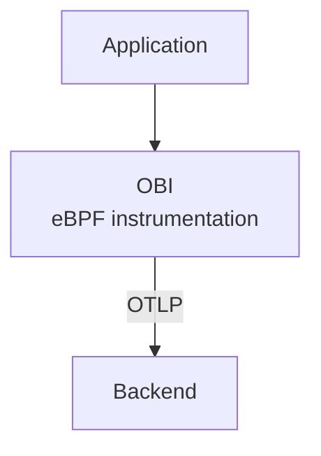
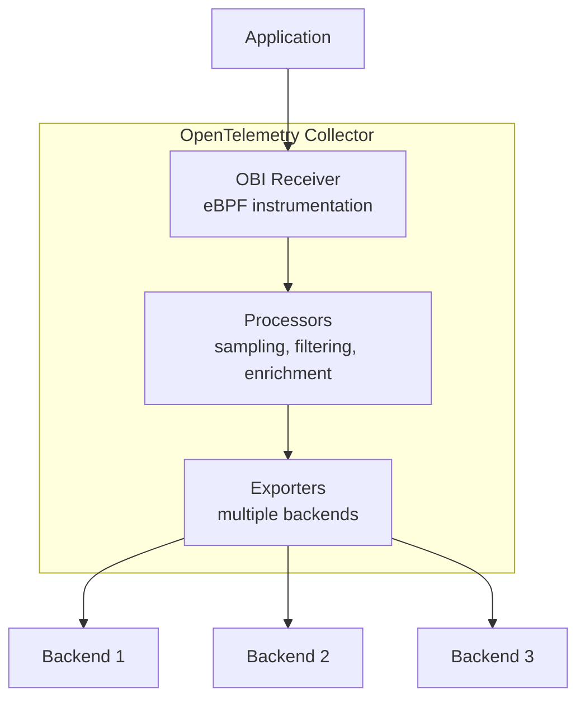

Starting with version v0.5.0, OBI can run as a receiver component within the
OpenTelemetry Collector. This integration enables you to leverage the
Collector's powerful processing pipeline while benefiting from OBI's zero-code
eBPF instrumentation.

## Overview

Running OBI as a Collector receiver combines the strengths of both tools:

**From OBI**:

- Zero-code instrumentation using eBPF
- Automatic service discovery
- Low overhead observability

**From OpenTelemetry Collector**:

- Unified telemetry pipeline
- Rich processors (sampling, filtering, transformation)
- Multiple exporters (backends, formats)
- Centralized configuration

## When to use collector receiver mode

### Good use cases

- **Centralized processing**: You want all telemetry to flow through a unified
  pipeline
- **Complex processing**: Need advanced sampling, filtering, or enrichment that
  the Collector provides
- **Multiple backends**: Sending data to multiple observability platforms
- **Compliance requirements**: Need telemetry processing for data redaction or
  PII removal
- **Simplified deployment**: Single binary instead of separate OBI + Collector
  processes

### When to use standalone OBI instead

- **Simple deployments**: Direct export to a single backend is sufficient
- **Edge environments**: Limited resources where running the full Collector is
  too heavy
- **Testing/development**: Quick setup without Collector configuration

## Architecture comparison

### Standalone OBI



### OBI as Collector receiver



## Configuration

### Build a custom Collector with OBI receiver

To use OBI as a Collector receiver, you need to build a custom Collector binary
that includes the OBI receiver component. This is done using the
[OpenTelemetry Collector Builder (OCB)](/docs/collector/extend/ocb/), a tool
that generates a custom Collector binary with your specified components. If you
don't have OCB installed, see the
[installation instructions](/docs/collector/extend/ocb/#install-the-opentelemetry-collector-builder).

**Requirements:**

- Go 1.25 or later
- OCB installed and available on your PATH
- A local checkout of the OBI source repository at v0.5.0 or later
- Docker (for generating eBPF files) or a C compiler, clang, and eBPF headers

**Build Steps:**

1. Generate eBPF files in your local OBI source directory:

   ```shell
   cd /path/to/obi
   make docker-generate
   # or if you have build tools installed locally:
   # make generate
   ```

   This step must be completed before building with `ocb`. It generates the
   necessary eBPF type bindings that the OBI receiver requires.

2. Create a `builder-config.yaml`:

   ```yaml
   dist:
     name: otelcol-obi
     description: OpenTelemetry Collector with OBI receiver
     output_path: ./dist

   exporters:
     - gomod: go.opentelemetry.io/collector/exporter/debugexporter v0.142.0
     - gomod: go.opentelemetry.io/collector/exporter/otlpexporter v0.142.0

   processors:
     - gomod: go.opentelemetry.io/collector/processor/batchprocessor v0.142.0

   receivers:
     - gomod: go.opentelemetry.io/obi v0.5.0
       import: go.opentelemetry.io/obi/collector

   providers:
     - gomod: go.opentelemetry.io/collector/confmap/provider/envprovider v1.18.0
     - gomod:
         go.opentelemetry.io/collector/confmap/provider/fileprovider v1.18.0
     - gomod:
         go.opentelemetry.io/collector/confmap/provider/httpprovider v1.18.0
     - gomod:
         go.opentelemetry.io/collector/confmap/provider/httpsprovider v1.18.0
     - gomod:
         go.opentelemetry.io/collector/confmap/provider/yamlprovider v1.18.0

   replaces:
     - go.opentelemetry.io/obi => /path/to/obi
   ```

   Replace `/path/to/obi` with the actual path to your OBI source directory. The
   `replaces:` section tells `ocb` to use your local OBI source instead of
   fetching from the public module repository, which is necessary because the
   published OBI module does not include the generated BPF code.

   **Version selection**: You must specify versions for each component. The
   example above uses versions that are known to be compatible with OBI v0.5.0.
   If you're using a different OBI version or want to use newer component
   versions, check your OBI repository's `go.mod` file to see which collector
   component versions it depends on, then update the versions in your builder
   config accordingly.

3. Build the custom Collector:

   ```shell
   ocb --config builder-config.yaml
   ```

   The compiled binary will be in `./dist/otelcol-obi`.

### Collector configuration with OBI receiver

Create an OpenTelemetry Collector configuration that includes the OBI receiver:

```yaml
# collector-config.yaml
receivers:
  # OBI receiver for eBPF instrumentation
  obi:
    # Listen on port 9999 for HTTP traffic to instrument
    open_port: '9999'

    # Enable metrics collection for network and application features
    meter_provider:
      features: [network, application]

    # Optional: Service discovery configuration
    # discovery:
    #   poll_interval: 30s

processors:
  # Batch telemetry for efficiency
  batch:
    timeout: 1s
    send_batch_size: 1024

exporters:
  # Export traces locally for debugging
  debug:
    verbosity: detailed

  # Export to generic OTLP backend
  otlp:
    endpoint: https://backend.example.com:4317
    headers:
      api-key: ${env:OTLP_API_KEY}

service:
  pipelines:
    # Traces pipeline with OBI instrumentation
    traces:
      receivers: [obi]
      processors: [batch]
      exporters: [debug, otlp]

    # Metrics pipeline
    metrics:
      receivers: [obi]
      processors: [batch]
      exporters: [debug, otlp]
```

### Run the Collector

```shell
sudo ./otelcol-obi --config collector-config.yaml
```

OBI requires elevated privileges to instrument processes using eBPF. The
collector must run with `sudo` or have the appropriate Linux capabilities
(CAP_DAC_READ_SEARCH, CAP_NET_RAW, CAP_SYS_PTRACE, CAP_PERFMON, CAP_BPF) to:

- Attach eBPF probes to running processes
- Access process memory and system information
- Set memory locks for eBPF programs
- Capture network and application telemetry

Without these permissions, OBI cannot instrument processes and will fail to
start.

## Feature comparison: Receiver mode vs Standalone

| Feature                  | Standalone OBI | OBI as Receiver       |
| ------------------------ | -------------- | --------------------- |
| eBPF instrumentation     | ✅ Yes         | ✅ Yes                |
| Service discovery        | ✅ Yes         | ✅ Yes                |
| Traces collection        | ✅ Yes         | ✅ Yes                |
| Metrics collection       | ✅ Yes         | ✅ Yes                |
| JSON log enrichment      | ✅ Yes         | ✅ Yes                |
| Direct OTLP export       | ✅ Yes         | ❌ No (via Collector) |
| Collector processors     | ❌ No          | ✅ Yes                |
| Multiple exporters       | ⚠️ Limited     | ✅ Full support       |
| Tail sampling for traces | ❌ No          | ✅ Yes                |
| Data transformation      | ⚠️ Basic       | ✅ Advanced           |
| Resource overhead        | Lower          | Moderate              |
| Configuration complexity | Simple         | More complex          |
| Single binary deployment | ✅ Yes         | ✅ Yes                |

## Advanced configurations

### Multi-namespace Kubernetes DaemonSet deployment

To deploy a Collector with OBI receiver on each node, you first need to package
the custom collector binary into a container image:

1. Create a `Dockerfile`:

   ```dockerfile
   FROM alpine:latest

   # Install required tools
   RUN apk --no-cache add ca-certificates

   # Copy the custom collector binary built with OCB
   COPY dist/otelcol-obi /otelcol-obi

   # Make it executable
   RUN chmod +x /otelcol-obi

   ENTRYPOINT ["/otelcol-obi"]
   ```

2. Build and push the image:

   ```shell
   docker build -t my-registry/otelcol-obi:v0.5.0 .
   docker push my-registry/otelcol-obi:v0.5.0
   ```

3. Deploy the DaemonSet:

   ```yaml
   # otel-collector-daemonset.yaml
   apiVersion: apps/v1
   kind: DaemonSet
   metadata:
     name: otel-collector-obi
     namespace: monitoring
   spec:
     selector:
       matchLabels:
         app: otel-collector-obi
     template:
       metadata:
         labels:
           app: otel-collector-obi
       spec:
         hostNetwork: true
         hostPID: true
         containers:
           - name: otel-collector
             image: my-registry/otelcol-obi:v0.5.0
             args:
               - --config=/conf/collector-config.yaml
             securityContext:
               privileged: true
               capabilities:
                 add:
                   - SYS_ADMIN
                   - SYS_PTRACE
                   - NET_ADMIN
             volumeMounts:
               - name: config
                 mountPath: /conf
               - name: sys
                 mountPath: /sys
                 readOnly: true
               - name: proc
                 mountPath: /host/proc
                 readOnly: true
             resources:
               limits:
                 memory: 1Gi
                 cpu: '1'
               requests:
                 memory: 512Mi
                 cpu: 500m
         volumes:
           - name: config
             configMap:
               name: otel-collector-config
           - name: sys
             hostPath:
               path: /sys
           - name: proc
             hostPath:
               path: /proc
   ```

### Filtering sensitive data

To use this configuration, you must add the `attributes` and `filter` processors
to your `builder-config.yaml`:

```yaml
processors:
  - gomod:
      github.com/open-telemetry/opentelemetry-collector-contrib/processor/attributesprocessor
      v0.142.0
  - gomod:
      github.com/open-telemetry/opentelemetry-collector-contrib/processor/filterprocessor
      v0.142.0
```

Then use Collector processors to redact PII before export:

```yaml
receivers:
  obi:
    discovery:
      poll_interval: 30s

processors:
  batch:
    timeout: 1s
    send_batch_size: 1024

  # Redact sensitive attributes
  attributes:
    actions:
      - key: http.url
        action: delete
      - key: user.email
        action: delete
      - key: credit_card
        pattern: \d{4}[- ]?\d{4}[- ]?\d{4}[- ]?\d{4}
        action: hash

  # Remove spans with sensitive operations
  filter:
    traces:
      span:
        - attributes["operation"] == "process_payment"
        - attributes["internal"] == true

exporters:
  debug:
    verbosity: detailed

  # Export to OTLP backend
  otlp:
    endpoint: backend.example.com:4317

service:
  pipelines:
    traces:
      receivers: [obi]
      processors: [attributes, filter, batch]
      exporters: [debug, otlp]
```

### Tail-based sampling

Implement intelligent sampling using the Collector. This example requires the
`tail_sampling` processor from contrib. Add it to your `builder-config.yaml`:

```yaml
processors:
  - gomod:
      github.com/open-telemetry/opentelemetry-collector-contrib/processor/tailsamplingprocessor
      v0.142.0
```

Configuration example:

```yaml
receivers:
  obi:
    open_port: '9999'

processors:
  batch:
    timeout: 1s
    send_batch_size: 1024

  # Tail-based sampler keeps:
  # - All traces with errors
  # - Slow traces (> 1s)
  # - 5% of successful fast traces
  tail_sampling:
    policies:
      - name: errors
        type: status_code
        status_code:
          status_codes: [ERROR]
      - name: slow_traces
        type: latency
        latency:
          threshold_ms: 1000
      - name: sample_success
        type: probabilistic
        probabilistic:
          sampling_percentage: 5

exporters:
  debug:
    verbosity: detailed

  otlp:
    endpoint: backend.example.com:4317

service:
  pipelines:
    traces:
      receivers: [obi]
      processors: [tail_sampling, batch]
      exporters: [debug, otlp]
```

## Performance considerations

### Resource usage

Resource usage for OBI as a Collector receiver varies significantly based on:

- **Telemetry volume**: Number of instrumented services and request rates
- **Pipeline complexity**: Number and type of processors configured
- **Exporter configuration**: Batch sizes, queue depths, and number of backends
- **Service discovery scope**: Number of processes being monitored

Like [standalone OBI](/docs/zero-code/obi/), the eBPF instrumentation provides
[minimal overhead](/docs/zero-code/obi/#requirements). The Collector pipeline
adds additional resource requirements that depend on your configuration.

**Recommendations**:

- Start with the resource limits shown in the
  [Kubernetes deployment example](#multi-namespace-kubernetes-daemonset-deployment)
  and adjust based on observed usage
- Enable [Collector self-monitoring](#optimization-tips) to track actual
  resource consumption
- Use the
  [performance tuning options](/docs/zero-code/obi/configure/tune-performance/)
  to optimize OBI's eBPF component
- Monitor memory and CPU usage in production and adjust resource requests/limits
  accordingly

### Optimization tips

1. **Use batch processor**: Always include the batch processor to reduce export
   overhead
2. **Limit pipeline processors**: Each processor adds latency and CPU usage

3. **Configure buffering**: Adjust queue sizes for high-volume environments:

   ```yaml
   exporters:
     otlp:
       sending_queue:
         enabled: true
         num_consumers: 10
         queue_size: 5000
   ```

4. **Monitor Collector metrics**: Enable Collector self-monitoring:

   ```yaml
   service:
     telemetry:
       metrics:
         address: :8888
   ```

## Limitations

- **Single node only**: OBI receiver instruments only local processes (same node
  as Collector)
- **Privileged access required**: Collector must run with eBPF capabilities
- **Linux only**: eBPF is Linux-specific; Windows and macOS not supported
- **Collector restart**: Changes to OBI configuration require Collector restart

## Troubleshooting

### Build Issues

#### Error: "API incompatibility" or unknown revision errors

If you encounter API incompatibility errors or "unknown revision" errors during
build:

1. Ensure your OBI source directory is up to date:

   ```shell
   cd /path/to/obi
   git pull origin main  # or your branch
   ```

2. Ensure version pins are not specified in your builder config for collector
   components, or that they match versions defined in your OBI `go.mod` file.

3. Check your OBI `go.mod` file to see which collector component versions it
   depends on:

   ```shell
   grep "go.opentelemetry.io/collector" go.mod
   ```

   Then add those same versions to your `builder-config.yaml` for other
   components.

### Runtime Issues

#### Error: "Required system capabilities not present" or "operation not

permitted"

OBI requires elevated privileges to run. You have two options:

##### Option 1: Run with sudo (simplest)

```shell
sudo ./otelcol-obi --config collector-config.yaml
```

##### Option 2: Grant capabilities to the binary (more secure)

Use `setcap` to grant only the required capabilities:

```shell
sudo setcap cap_sys_admin,cap_sys_ptrace,cap_dac_read_search,cap_net_raw,cap_perfmon,cap_bpf,cap_checkpoint_restore=ep ./otelcol-obi
```

Then run without sudo:

```shell
./otelcol-obi --config collector-config.yaml
```

Verify the capabilities were set:

```shell
getcap ./otelcol-obi
```

**In Kubernetes:**

Ensure the Pod's security context has the required Linux capabilities:

```yaml
securityContext:
  capabilities:
    add:
      - SYS_ADMIN
      - SYS_PTRACE
      - BPF
      - SYS_PTRACE
      - NET_RAW
      - CHECKPOINT_RESTORE
      - DAC_READ_SEARCH
      - PERFMON
```

#### Error: "failed to create OBI receiver: permission denied"

This means the Collector doesn't have the required capabilities. Ensure you're
running with `sudo` or the proper Kubernetes security context shown above.

#### No telemetry from instrumented apps

1. Check OBI receiver configuration:

   ```yaml
   receivers:
     obi:
       discovery:
         poll_interval: 30s
       instrument:
         - exe_path: /path/to/app # Verify path is correct
   ```

2. Verify service discovery in Collector logs:

   ```shell
   grep "discovered service" collector.log
   ```

3. Confirm eBPF programs are loaded using
   [bpftool](https://github.com/libbpf/bpftool):

   ```shell
   # In the Collector container
   bpftool prog show
   ```

#### High memory usage

**Causes**: Large telemetry volume or instrumenting too many processes

**Solutions**:

1. **Configure appropriate batch sizes** to reduce export overhead:

   ```yaml
   processors:
     batch:
       timeout: 200ms
       send_batch_size: 512
       send_batch_max_size: 1024
   ```

2. **Be more selective with instrumentation** - limit which services OBI
   instruments:

   ```yaml
   receivers:
     obi:
       instrument:
         targets:
           - service_name: 'web-app'
           - service_name: 'api-service'
   ```

   This reduces telemetry volume by only instrumenting specific services instead
   of all processes.

## Migration from standalone OBI

### Step 1: Build custom Collector

Follow the [configuration](#configuration) section to build a Collector with OBI
receiver.

### Step 2: Convert OBI config

Map your standalone OBI configuration to Collector format:

**Standalone OBI**:

```yaml
# obi-config.yaml
otel_traces_export:
  endpoint: http://backend:4318

open_port: 8080
```

**Collector with OBI receiver**:

```yaml
# collector-config.yaml
receivers:
  obi:
    instrument:
      - open_port: 8080

exporters:
  otlp:
    endpoint: backend:4317

service:
  pipelines:
    traces:
      receivers: [obi]
      processors: [batch]
      exporters: [otlp]
```

### Step 3: Deploy and verify

1. Stop standalone OBI
2. Start Collector with OBI receiver
3. Verify telemetry flow in your backend

## What's next?

- Explore
  [Collector processors](https://github.com/open-telemetry/opentelemetry-collector-contrib/tree/main/processor)
  for data transformation
- Learn about [Collector deployment patterns](/docs/collector/deploy)
- Configure [sampling strategies](/docs/zero-code/obi/configure/sample-traces/)
  for traces
- Set up [service discovery](/docs/zero-code/obi/configure/service-discovery/)
  to auto-instrument services
