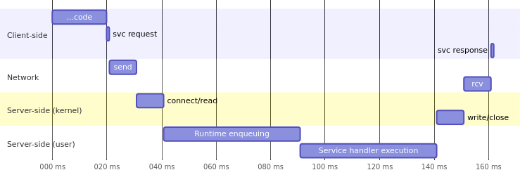
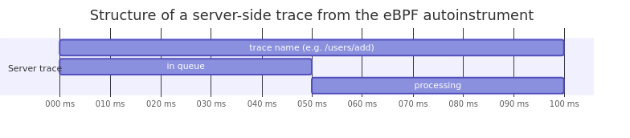

OpenTelemetry eBPF Instrumentation is an eBPF based application
auto-instrumentation tool that is able to track the total request time, for your
server side application code.

When performing a remote service request, the perceived client response time is
different from the measured response time at the server.

The following diagram illustrates the different delays that can occur from the
client perspective:

- **Total Request Time**: The time from the client's perspective, including
  latency from the network, load balancer, and time spent in the service.
- **Service Time**: The time from the service's perspective, which excludes
  network latency and load balancer overhead.

If you're only monitoring the service time, you might miss important performance
issues that affect the user experience. For example, a slow load balancer,
network congestion, or DNS resolution issues.

eBPF allows us to overcome the limitations of manual instrumentation tools. OBI
inserts tracepoints at the kernel connect/receive/write/close functions (also at
the Go runtime in the case of Go applications). This low level instrumentation
provides more accurate metrics and allows the capture of request times from the
perspective of the client.

OBI reports traces that are divided in different spans:

The above image shows the typical structure of a trace as reported by OBI:

- **Total Request Time**: The time from the client's perspective
- **Service Time**: The time from the service's perspective
- **SQL Time**: The time spent in SQL queries (if applicable)

The trace spans are generated at the kernel level and are able to capture the
total request time from the perspective of the client. This allows you to
identify issues that might not be visible from the service's perspective alone.
