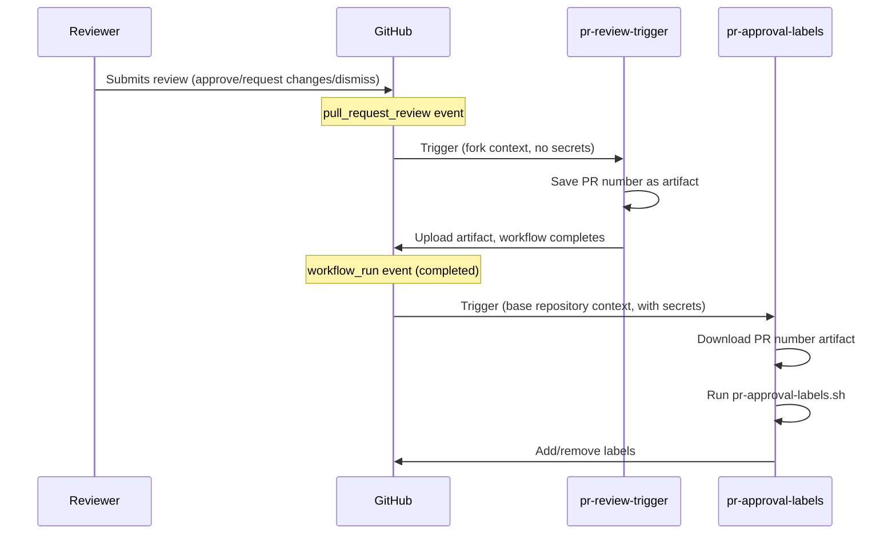
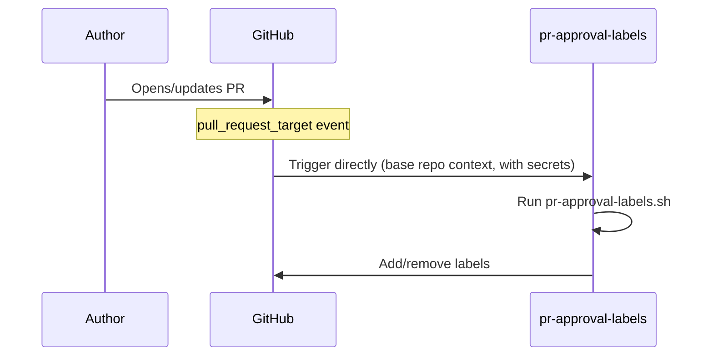
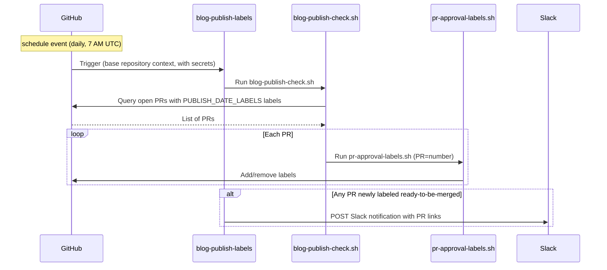

All workflow files live under
[`.github/workflows/`](https://github.com/open-telemetry/opentelemetry.io/tree/main/.github/workflows).

## PR approval labels {#pr-approval-labels}

The following workflows work together to automatically manage approval-related
labels on pull requests:

| Workflow file                      | Trigger                               | Privileges                                   |
| ---------------------------------- | ------------------------------------- | -------------------------------------------- |
| [`pr-review-trigger.yml`][trigger] | `pull_request_review`                 | Minimal (no secrets)                         |
| [`pr-approval-labels.yml`][labels] | `pull_request_target`, `workflow_run` | App token for label edits and org/team reads |
| [`blog-publish-labels.yml`][blog]  | `schedule` (daily 7 AM UTC)           | App token + `SLACK_WEBHOOK_URL` secret       |

[trigger]:
  https://github.com/open-telemetry/opentelemetry.io/blob/main/.github/workflows/pr-review-trigger.yml
[labels]:
  https://github.com/open-telemetry/opentelemetry.io/blob/main/.github/workflows/pr-approval-labels.yml
[blog]:
  https://github.com/open-telemetry/opentelemetry.io/blob/main/.github/workflows/blog-publish-labels.yml

### Labels managed

- **`missing:docs-approval`** — added when approval from the
  [`docs-approvers`][docs-approvers] team is pending; removed once a
  docs-approver approves.
- **`missing:sig-approval`** — added when approval from a SIG team is pending
  (determined by files changed and [`.github/component-owners.yml`][owners]);
  removed once a SIG member approves or when no SIG component is touched.
- **`ready-to-be-merged`** — added when all required approvals are present;
  removed otherwise. For PRs carrying any label in
  [`PUBLISH_DATE_LABELS`](#publish-date-gating) (currently: `blog`), this label
  is also gated on the publish date found in changed files.

[docs-approvers]: https://github.com/orgs/open-telemetry/teams/docs-approvers
[owners]:
  https://github.com/open-telemetry/opentelemetry.io/blob/main/.github/component-owners.yml

### Publish date gating {#publish-date-gating}

The script scans each changed file for a line beginning with `date:` (typically
from the front matter in Markdown content). If it finds a date in the future,
the `ready-to-be-merged` label is withheld until that date arrives (UTC). This
helps prevent content from being merged before its scheduled publication date.

The check applies to PRs carrying any label listed in the `PUBLISH_DATE_LABELS`
environment variable, set in each workflow YAML (currently: `blog`). Adding a
label extends the check to other PR types.

If a PR contains multiple files with different dates, the label is gated on the
latest date — all content must be ready before merging.

#### Script operating modes

The [`pr-approval-labels.sh`][script] script processes a single PR (set via the
`PR` environment variable). It is called by `pr-approval-labels.yml` on PR
events and by [`blog-publish-check.sh`][batch-script] in batch mode.

[script]:
  https://github.com/open-telemetry/opentelemetry.io/blob/main/.github/scripts/pr-approval-labels.sh
[batch-script]:
  https://github.com/open-telemetry/opentelemetry.io/blob/main/.github/scripts/blog-publish-check.sh

The [`blog-publish-check.sh`][batch-script] script handles batch iteration: it
queries all open PRs carrying any `PUBLISH_DATE_LABELS` label and calls
`pr-approval-labels.sh` for each one. Used by the
[`blog-publish-labels.yml`](#blog-publish-labels) `schedule` trigger (daily at 7
AM UTC), so a PR whose publish date arrives overnight receives
`ready-to-be-merged` automatically without requiring a new commit.

### Why two workflows?

GitHub's `pull_request_review` event has no `_target` variant. This means a
workflow triggered by a review on a **fork PR** runs in the fork's context and
cannot access the base repository's secrets.

To work around this limitation, the system uses a
[`workflow_run` chaining pattern](https://docs.github.com/en/actions/writing-workflows/choosing-when-your-workflow-runs/events-that-trigger-workflows#workflow_run):

1. **`pr-review-trigger`** runs on every review submission/dismissal. It saves
   the PR number as an artifact and exits — no secrets needed.
2. **`pr-approval-labels`** is triggered by `workflow_run` (when the trigger
   workflow completes). It runs in the base repository context with full access
   to the GitHub App token, downloads the artifact, and updates labels.

For content changes (`opened`, `reopened`, `synchronize`), the
`pr-approval-labels` workflow is triggered directly via `pull_request_target`.





### Security model

- **`pr-review-trigger`**: intentionally minimal — no secrets, no privileged
  permissions. Ignores `review.state == "commented"` since comments don't affect
  approvals.
- **`pr-approval-labels`**: runs with a GitHub App token (`OTELBOT_DOCS_APP_ID`
  / `OTELBOT_DOCS_PRIVATE_KEY`) that has permissions to read org/team membership
  and edit PR labels. Uses `pull_request_target` and `workflow_run` to ensure it
  always executes in the trusted base repository context.
- **`blog-publish-labels`**: runs on a schedule with a GitHub App token and the
  `SLACK_WEBHOOK_URL` secret. Always executes in the trusted base repository
  context (schedule events have no fork variant).

## Blog publish labels {#blog-publish-labels}

The [`blog-publish-labels.yml`][blog] workflow runs daily at 7 AM UTC. It
executes [`blog-publish-check.sh`][batch-script], which iterates over all open
PRs with `blog` label and calls `pr-approval-labels.sh` for each one. When
`ready-to-be-merged` is newly applied to any of them, a Slack notification is
posted. You can also trigger it manually via `workflow_dispatch` with the
`force_notify` input to send a test Slack notification. When `force_notify` is
`true`, the labeling step is skipped entirely (dry run) — only the test Slack
payload is sent.

| Workflow file                     | Trigger                                                                           | Secrets required                                |
| --------------------------------- | --------------------------------------------------------------------------------- | ----------------------------------------------- |
| [`blog-publish-labels.yml`][blog] | `schedule` (daily 7 AM UTC), `workflow_dispatch` (manual test via `force_notify`) | `OTELBOT_DOCS_PRIVATE_KEY`, `SLACK_WEBHOOK_URL` |

The Slack notification fires only when the label transitions from absent to
present on that run — repeated daily runs for an already-labeled PR do not
re-notify. When triggering the workflow manually, set `force_notify` to `true`
to send a one-off test notification (no labels are applied) so you can verify
the Slack formatting.

### Slack webhook setup {#slack-webhook-setup}

The workflow uses a **Slack Workflow Builder webhook trigger**, which allows
non-engineers to own the message format without touching workflow code.

**Create the webhook:**

1. In Slack: **Tools → Workflow Builder → New Workflow → Start from scratch**
2. Choose trigger: **Webhook**
3. Declare one variable — name: `pr_list`, type: **Text**
4. Add a step: **Send a message** to the desired channel, with body:

   ```text
   :newspaper: *Blog posts ready to publish*

   The following PRs have reached their publish date and all required
   approvals — they are ready to be merged:

   {{pr_list}}

   Have a great day! :sunny:
   ```

   Then click **Add button** and configure:
   - **Label**: `Review and merge`
   - **Color**: Primary (green)
   - **Action**: Open a link
   - **URL**:
     `https://github.com/open-telemetry/opentelemetry.io/issues?q=is%3Apr+state%3Aopen+label%3Ablog+label%3Aready-to-be-merged`

5. **Publish** the workflow and copy the webhook URL
6. Add it to the repository: **Settings → Secrets and variables → Actions → New
   repository secret**, name: `SLACK_WEBHOOK_URL`

**Payload sent by the workflow:**

```json
{
  "pr_list": "• #123: Add blog post: OTel 1.0 — https://github.com/.../pull/123\n• #456: Announce: new SIG — https://github.com/.../pull/456"
}
```

Each PR is a bulleted line with its title and URL. Slack auto-links bare URLs.
Multiple PRs labeled on the same day are batched into a single message — one
webhook call regardless of how many PRs are ready.



## PR fix directives {#pr-fix-directives}

The [`pr-actions.yml`][pr-actions] workflow lets contributors run selected `fix`
scripts by commenting on a PR:

- **`/fix`** runs `npm run fix`.
- **`/fix:<name>`** runs `npm run fix:<name>` (for example, `/fix:format`).
- **`/fix:all`** is mapped to `/fix` since the command semantics changed
  ([#9291][]).
- **`/fix:ALL`** is mapped to `fix:all` so that maintainers can run `fix:all`.

[#9291]: https://github.com/open-telemetry/opentelemetry.io/pull/9291

It runs as a two-stage pipeline:

1. **`generate-patch`** (untrusted): checks out the PR branch, runs the fix
   command, prunes the link refcache, and uploads a patch artifact
   (`pr-fix.patch`), up to 1024 KB.
2. **`apply-patch`** (trusted): runs with a GitHub App token, applies the patch,
   and pushes a commit to the PR branch.

If a directive produces no changes, a separate `notify-noop` job comments that
nothing needed to be committed.

[pr-actions]:
  https://github.com/open-telemetry/opentelemetry.io/blob/main/.github/workflows/pr-actions.yml

## Other workflows

The repository includes several other workflows:

| Workflow                   | Purpose                                       |
| -------------------------- | --------------------------------------------- |
| `check-links.yml`          | Sharded link checking using htmltest          |
| `check-text.yml`           | Textlint terminology checks                   |
| `check-i18n.yml`           | Localization front matter validation          |
| `check-spelling.yml`       | Spell checking                                |
| `auto-update-registry.yml` | Auto-update registry package versions         |
| `auto-update-versions.yml` | Auto-update OTel component versions           |
| `build-dev.yml`            | Development build and preview                 |
| `label-prs.yml`            | Auto-label PRs based on file paths            |
| `component-owners.yml`     | Assign reviewers based on component ownership |
