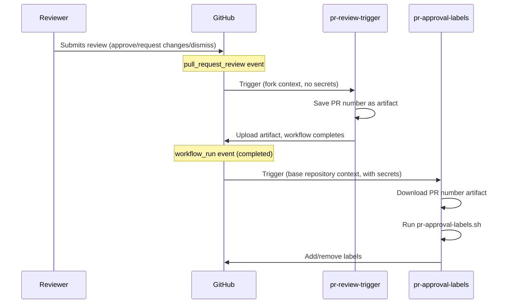
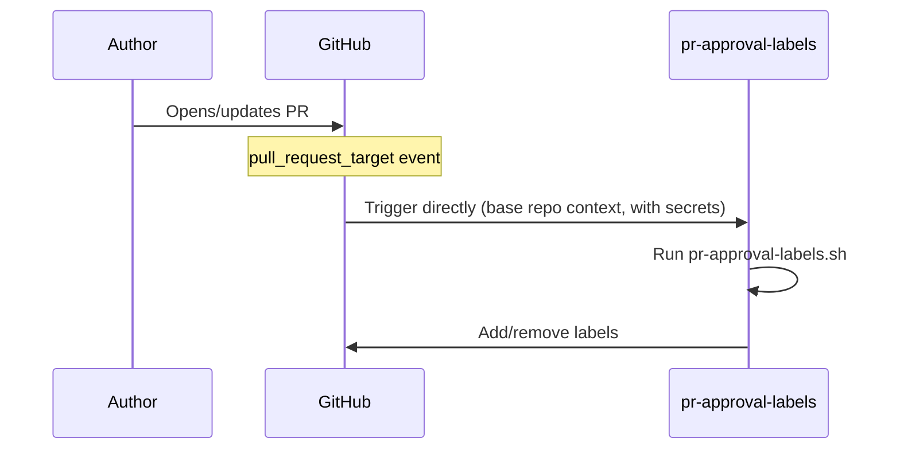
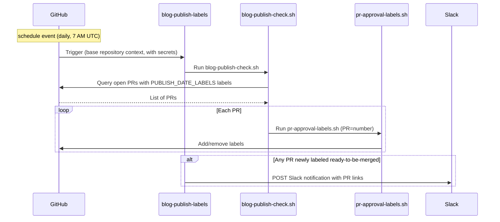

All workflow files live under
[`.github/workflows/`](https://github.com/open-telemetry/opentelemetry.io/tree/main/.github/workflows).

## PR approval labels {#pr-approval-labels}

The following workflows work together to automatically manage approval-related
labels on pull requests:

| Workflow file                      | Trigger                               | Privileges                                   |
| ---------------------------------- | ------------------------------------- | -------------------------------------------- |
| [`pr-review-trigger.yml`][trigger] | `pull_request_review`                 | Minimal (no secrets)                         |
| [`pr-approval-labels.yml`][labels] | `pull_request_target`, `workflow_run` | App token for label edits and org/team reads |
| [`blog-publish-labels.yml`][blog]  | `schedule` (daily 7 AM UTC)           | App token + `SLACK_WEBHOOK_URL` secret       |

[trigger]:
  https://github.com/open-telemetry/opentelemetry.io/blob/main/.github/workflows/pr-review-trigger.yml
[labels]:
  https://github.com/open-telemetry/opentelemetry.io/blob/main/.github/workflows/label-manager.yml
[blog]:
  https://github.com/open-telemetry/opentelemetry.io/blob/main/.github/workflows/blog-publish-labels.yml

### Labels managed

- **`missing:docs-approval`** — added when approval from the
  [`docs-approvers`][docs-approvers] team is pending; removed once a
  docs-approver approves.
- **`missing:sig-approval`** — added when approval from a SIG team is pending
  (determined by files changed and [`.github/component-owners.yml`][owners]);
  removed once a SIG member approves or when no SIG component is touched.
- **`ready-to-be-merged`** — added when all required approvals are present;
  removed otherwise. For PRs carrying any label in
  [`PUBLISH_DATE_LABELS`](#publish-date-gating) (currently: `blog`), this label
  is also gated on the publish date found in changed files.

[docs-approvers]: https://github.com/orgs/open-telemetry/teams/docs-approvers
[owners]:
  https://github.com/open-telemetry/opentelemetry.io/blob/main/.github/component-owners.yml

### Publish date gating {#publish-date-gating}

The script scans each changed file for a line beginning with `date:` (typically
from the front matter in Markdown content). If it finds a date in the future,
the `ready-to-be-merged` label is withheld until that date arrives (UTC). This
helps prevent content from being merged before its scheduled publication date.

The check applies to PRs carrying any label listed in the `PUBLISH_DATE_LABELS`
environment variable, set in each workflow YAML (currently: `blog`). Adding a
label extends the check to other PR types.

If a PR contains multiple files with different dates, the label is gated on the
latest date — all content must be ready before merging.

#### Script operating modes

The [`pr-approval-labels.sh`][script] script processes a single PR (set via the
`PR` environment variable). It is called by `pr-approval-labels.yml` on PR
events and by [`blog-publish-check.sh`][batch-script] in batch mode.

[script]:
  https://github.com/open-telemetry/opentelemetry.io/blob/main/.github/scripts/pr-approval-labels.sh
[batch-script]:
  https://github.com/open-telemetry/opentelemetry.io/blob/248cc6f/.github/scripts/blog-publish-check.sh

The [`blog-publish-check.sh`][batch-script] script handles batch iteration: it
queries all open PRs carrying any `PUBLISH_DATE_LABELS` label and calls
`pr-approval-labels.sh` for each one. Used by the
[`blog-publish-labels.yml`](#blog-publish-labels) `schedule` trigger (daily at 7
AM UTC), so a PR whose publish date arrives overnight receives
`ready-to-be-merged` automatically without requiring a new commit.

### Why two workflows?

GitHub's `pull_request_review` event has no `_target` variant. This means a
workflow triggered by a review on a **fork PR** runs in the fork's context and
cannot access the base repository's secrets.

To work around this limitation, the system uses a
[`workflow_run` chaining pattern](https://docs.github.com/en/actions/writing-workflows/choosing-when-your-workflow-runs/events-that-trigger-workflows#workflow_run):

1. **`pr-review-trigger`** runs on every review submission/dismissal. It saves
   the PR number as an artifact and exits — no secrets needed.
2. **`pr-approval-labels`** is triggered by `workflow_run` (when the trigger
   workflow completes). It runs in the base repository context with full access
   to the GitHub App token, downloads the artifact, and updates labels.

For content changes (`opened`, `reopened`, `synchronize`), the
`pr-approval-labels` workflow is triggered directly via `pull_request_target`.





### Security model

- **`pr-review-trigger`**: intentionally minimal — no secrets, no privileged
  permissions. Ignores `review.state == "commented"` since comments don't affect
  approvals.
- **`pr-approval-labels`**: runs with a GitHub App token (`OTELBOT_DOCS_APP_ID`
  / `OTELBOT_DOCS_PRIVATE_KEY`) that has permissions to read org/team membership
  and edit PR labels. Uses `pull_request_target` and `workflow_run` to ensure it
  always executes in the trusted base repository context.
- **`blog-publish-labels`**: runs on a schedule with a GitHub App token and the
  `SLACK_WEBHOOK_URL` secret. Always executes in the trusted base repository
  context (schedule events have no fork variant).

## Blog publish labels {#blog-publish-labels}

The [`blog-publish-labels.yml`][blog] workflow runs daily at 7 AM UTC. It
executes [`blog-publish-check.sh`][batch-script], which iterates over all open
PRs with `blog` label and calls `pr-approval-labels.sh` for each one. When
`ready-to-be-merged` is newly applied to any of them, a Slack notification is
posted. You can also trigger it manually via `workflow_dispatch` with the
`force_notify` input to send a test Slack notification. When `force_notify` is
`true`, the labeling step is skipped entirely (dry run) — only the test Slack
payload is sent.

| Workflow file                     | Trigger                                                                           | Secrets required                                |
| --------------------------------- | --------------------------------------------------------------------------------- | ----------------------------------------------- |
| [`blog-publish-labels.yml`][blog] | `schedule` (daily 7 AM UTC), `workflow_dispatch` (manual test via `force_notify`) | `OTELBOT_DOCS_PRIVATE_KEY`, `SLACK_WEBHOOK_URL` |

The Slack notification fires only when the label transitions from absent to
present on that run — repeated daily runs for an already-labeled PR do not
re-notify. When triggering the workflow manually, set `force_notify` to `true`
to send a one-off test notification (no labels are applied) so you can verify
the Slack formatting.

### Slack webhook setup {#slack-webhook-setup}

The workflow uses a **Slack Workflow Builder webhook trigger**, which allows
non-engineers to own the message format without touching workflow code.

**Create the webhook:**

1. In Slack: **Tools → Workflow Builder → New Workflow → Start from scratch**
2. Choose trigger: **Webhook**
3. Declare one variable — name: `pr_list`, type: **Text**
4. Add a step: **Send a message** to the desired channel, with body:

   ```text
   :newspaper: *Blog posts ready to publish*

   The following PRs have reached their publish date and all required
   approvals — they are ready to be merged:

   {{pr_list}}

   Have a great day! :sunny:
   ```

   Then click **Add button** and configure:
   - **Label**: `Review and merge`
   - **Color**: Primary (green)
   - **Action**: Open a link
   - **URL**:
     `https://github.com/open-telemetry/opentelemetry.io/issues?q=is%3Apr+state%3Aopen+label%3Ablog+label%3Aready-to-be-merged`

5. **Publish** the workflow and copy the webhook URL
6. Add it to the repository: **Settings → Secrets and variables → Actions → New
   repository secret**, name: `SLACK_WEBHOOK_URL`

**Payload sent by the workflow:**

```json
{
  "pr_list": "• #123: Add blog post: OTel 1.0 — https://github.com/.../pull/123\n• #456: Announce: new SIG — https://github.com/.../pull/456"
}
```

Each PR is a bulleted line with its title and URL. Slack auto-links bare URLs.
Multiple PRs labeled on the same day are batched into a single message — one
webhook call regardless of how many PRs are ready.



## PR fix directives {#pr-fix-directives}

The [`pr-actions.yml`][pr-actions] workflow lets contributors run selected `fix`
scripts by commenting on a PR:

- **`/fix`** runs `npm run fix`.
- **`/fix:<name>`** runs `npm run fix:<name>` (for example, `/fix:format`).
- **`/fix:all`** is mapped to `/fix` since the command semantics changed
  ([#9291][]).
- **`/fix:ALL`** is mapped to `fix:all` so that maintainers can run `fix:all`.

The directive must be the first line of the comment; any following lines are
ignored, so you can add an explanation after it. The workflow itself triggers on
any comment whose body starts with `/fix` (so for example `/fixup` enters the
pipeline and gets invalid-directive feedback, while a comment starting with a
space, or with `/fix` only on a later line, does not trigger the workflow at
all).

[#9291]: https://github.com/open-telemetry/opentelemetry.io/pull/9291

It runs as a four-stage pipeline:

1. **`ack`** (trusted): as soon as a directive is received, replies with a 🔄
   in-progress comment that links to the directive comment and to the run.
2. **`generate-patch`** (untrusted): checks out the PR branch, runs the fix
   command, prunes the link refcache, and uploads a patch artifact
   (`site.patch`), up to 1024 KB.
3. **`apply-patch`** (trusted): calls the [`reusable-apply-patch.yml`][]
   workflow — resolved from the default branch, never from the PR — which
   applies the patch with a GitHub App token and pushes a commit to the PR
   branch. Skipped when the command produced no changes.
4. **`report`** (trusted): replaces the acknowledgement with the final outcome
   when possible, or posts a new outcome comment when no acknowledgement exists,
   such as for closed PRs. Each directive thus normally maps to a single comment
   that links back to the directive and to the run that produced it. This covers
   every directive that triggers the workflow, including invalid directives
   (such as `/fixup` or `/fix please`), no-op runs, and failures that happen
   before any patch is produced.

Directives only run against open PRs (draft PRs included): on a closed or merged
PR the fix command never runs and the report job explains why. The PR state
comes from the trigger payload, so no runner is spent on the fix itself.

The pipeline only runs in the canonical `open-telemetry` repository, where the
bot app credentials exist. Fork PRs work normally — `issue_comment` events fire
in the base repository — but the workflow skips itself inside forks.

Directives follow latest-wins semantics: a new `/fix` comment on a PR cancels
that PR's in-flight run (which still reports a ⚠️ outcome), since concurrent fix
runs on the same branch serve no purpose — the second push would fail anyway
once the branch has moved.

The directive parser lives in [scripts/gh/pr-fix/][], patch generation is the
[npm-script-patch][] action, and the acknowledgement and outcome comments are
composed by [scripts/gh/patch-report/][]; all are unit tested via
`npm run test:local-tools`.

[pr-actions]:
  https://github.com/open-telemetry/opentelemetry.io/blob/main/.github/workflows/pr-actions.yml
[`reusable-apply-patch.yml`]:
  https://github.com/open-telemetry/opentelemetry.io/blob/main/.github/workflows/reusable-apply-patch.yml
[npm-script-patch]:
  https://github.com/open-telemetry/opentelemetry.io/tree/main/.github/actions/npm-script-patch
[scripts/gh/pr-fix/]:
  https://github.com/open-telemetry/opentelemetry.io/tree/main/scripts/gh/pr-fix
[scripts/gh/patch-report/]:
  https://github.com/open-telemetry/opentelemetry.io/tree/main/scripts/gh/patch-report

## Housekeeping {#housekeeping}

The [`housekeeping.yml`][housekeeping] workflow runs an approved fix command —
[`fix-and-test:all`](../npm-scripts/) by default, or an npm script given via
manual (maintainer-only) dispatch — daily at 7:37 UTC, and publishes any
resulting changes as a PR. It is the second caller of the reusable patch
actions, and the scheduled-maintenance flow that motivated [#6592][].

It runs as a three-stage pipeline:

1. **`generate-patch`**: runs the housekeeping command via the
   [npm-script-patch][] action and uploads the changes as a patch artifact.
   Unlike the `/fix` pipeline, the whole run is trusted: the schedule and
   dispatch triggers only ever execute default-branch code. A failing command
   fails the job, but any fixes it produced are still published.
2. **`publish-patch`**: calls the [`reusable-patch-pr.yml`][] workflow — the
   sibling of [`reusable-apply-patch.yml`][] for callers without a PR context —
   which force-pushes the patch to the stable `otelbot/housekeeping` branch,
   recreated from `main` on every run, and opens a PR for it unless one is
   already open. There is thus at most one housekeeping PR at a time, always
   carrying the latest results. Any commits pushed to the branch — manual or via
   `/fix` — are clobbered by the next run, so merge the PR promptly if you push
   commits to it. Skipped when the command produced no changes, leaving any open
   housekeeping PR as is. Auto-merge is safe to enable on housekeeping PRs
   provided that stale approvals are dismissed when commits are pushed: required
   reviews then remain the control over the machine- and internet-derived
   content, even across force-pushes.
3. **`report-failure`**: files a tracking issue on failure, via
   [workflow failure reporting](#workflow-failure-reporting).

> [!NOTE]
>
> The [`refcache-refresh.yml`][] workflow also runs daily and touches
> `refcache.json`, so the two bot PRs can conflict depending on merge order.
> Conflicts self-heal, since both branches sync from `main` on each run.
> Migrating refcache-refresh onto the reusable patch actions — eliminating such
> conflicts by construction — is tracked in the [project plan][].

[#6592]: https://github.com/open-telemetry/opentelemetry.io/issues/6592
[housekeeping]:
  https://github.com/open-telemetry/opentelemetry.io/blob/main/.github/workflows/housekeeping.yml
[project plan]:
  https://github.com/open-telemetry/opentelemetry.io/blob/main/projects/2026/pr-fix-reusable-actions.plan.md
[`refcache-refresh.yml`]:
  https://github.com/open-telemetry/opentelemetry.io/blob/main/.github/workflows/refcache-refresh.yml
[`reusable-patch-pr.yml`]:
  https://github.com/open-telemetry/opentelemetry.io/blob/main/.github/workflows/reusable-patch-pr.yml

## Locale auto-merge

The [locale-auto-merge.yml][] workflow lets a locale's maintainers enable
[GitHub auto-merge][] on a locale-only PR by commenting `/auto-merge` (or
`/auto-merge:disable`). It runs as the DOCS bot, which holds the privileges
needed to flip the "merge when ready" switch under branch protection; CODEOWNERS
and required checks remain the hard merge gate.

The thin workflow delegates to the testable helper in
[scripts/gh/locale-auto-merge/][locale-auto-merge-script], which enforces two
guards before acting: every changed file must be locale-owned, and the commenter
must be a member of the `docs-<loc>-maintainers` team for every locale the PR
touches. The helper's eligibility and authorization rules (and how to dry-run
them locally) are documented in its [README][locale-auto-merge-script]; its unit
and integration tests run with `npm run test:local-tools`. Contributor-facing
usage lives in the [localization guide][localization-auto-merge].

[GitHub auto-merge]:
  https://docs.github.com/en/pull-requests/collaborating-with-pull-requests/incorporating-changes-from-a-pull-request/automatically-merging-a-pull-request
[locale-auto-merge.yml]:
  https://github.com/open-telemetry/opentelemetry.io/blob/main/.github/workflows/locale-auto-merge.yml
[locale-auto-merge-script]:
  https://github.com/open-telemetry/opentelemetry.io/tree/main/scripts/gh/locale-auto-merge
[localization-auto-merge]: /docs/contributing/localization/#auto-merge

## Spec integration branches {#spec-integration-branches}

Two scheduled workflows track unreleased changes from upstream spec repositories
and keep a draft PR ("integration branch") current with the next development
version:

| Workflow file                             | Upstream repository           | Branch slug |
| ----------------------------------------- | ----------------------------- | ----------- |
| [update-spec-integration-branch.yml][]    | `opentelemetry-specification` | `spec`      |
| [update-semconv-integration-branch.yml][] | `semantic-conventions`        | `semconv`   |

[update-spec-integration-branch.yml]:
  https://github.com/open-telemetry/opentelemetry.io/blob/main/.github/workflows/update-spec-integration-branch.yml
[update-semconv-integration-branch.yml]:
  https://github.com/open-telemetry/opentelemetry.io/blob/main/.github/workflows/update-semconv-integration-branch.yml

Both workflows delegate the "pick the next version + branch" step to a shared
Node helper, [scripts/gh/specs/pick-branch/cli.mjs][]. The helper:

- Reuses an existing `otelbot/<slug>-integration-vX.Y.Z-dev` branch when one
  exists and the version has not yet been released; otherwise bumps the latest
  release tag's minor version.
- Writes `VERSION` and `BRANCH` to `$GITHUB_ENV` for downstream steps.
- Opens a tracking issue (label `<slug>-integration-warning`, deduplicated) when
  it detects problems such as multiple stale integration branches.

[scripts/gh/specs/pick-branch/cli.mjs]:
  https://github.com/open-telemetry/opentelemetry.io/tree/main/scripts/gh/specs/pick-branch

### Run modes

The helper auto-selects between dry-run and write mode and prints a `[mode]`
banner explaining its choice:

| Context               | Default behavior | Override            |
| --------------------- | ---------------- | ------------------- |
| GitHub Actions        | write            | pass `--dry-run`    |
| Local (anywhere else) | dry-run          | pass `--no-dry-run` |

Locally, dry-run still runs all read-only `git`/`gh` commands (so the issue
deduplication check executes), but skips writes. With `--no-dry-run` the helper
uses your local `gh` credentials; if `GITHUB_ENV` is unset, `VERSION`/`BRANCH`
are printed to stdout only. Try it:

```sh
node scripts/gh/specs/pick-branch/cli.mjs --spec=otel
node scripts/gh/specs/pick-branch/cli.mjs --spec=semconv --no-dry-run
node scripts/gh/specs/pick-branch/cli.mjs --help
```

Pure logic and CLI argument parsing live in `index.mjs` and are covered by
`*.test.mjs` files in the same folder (`npm run test:local-tools` to run them).

## Workflow failure reporting {#workflow-failure-reporting}

[`reusable-report-failure.yml`][report-failure] opens (or comments on) a
tracking issue when a caller workflow fails. How to wire it up, optional inputs,
and caller context behavior are documented in the workflow file header; issue
logic lives in [scripts/gh/report-failure/][report-failure-script]
(`npm run test:local-tools`).

[report-failure]:
  https://github.com/open-telemetry/opentelemetry.io/blob/main/.github/workflows/reusable-report-failure.yml
[report-failure-script]:
  https://github.com/open-telemetry/opentelemetry.io/tree/main/scripts/gh/report-failure

## Other workflows

The repository includes several other workflows:

| Workflow                   | Purpose                                       |
| -------------------------- | --------------------------------------------- |
| `check-links.yml`          | Sharded link checking using htmltest          |
| `check-text.yml`           | Textlint terminology checks                   |
| `check-i18n.yml`           | Localization front matter validation          |
| `check-spelling.yml`       | Spell checking                                |
| `test.yml`                 | Test (excludes `test:base`)                   |
| `auto-update-registry.yml` | Auto-update registry package versions         |
| `auto-update-versions.yml` | Auto-update OTel component versions           |
| `build-dev.yml`            | Development build and preview                 |
| `lint-scripts.yml`         | ShellCheck linting for `.github/scripts/`     |
| `label-manager.yml`        | PR labels (component labels & approval flow)  |
| `component-owners.yml`     | Assign reviewers based on component ownership |
