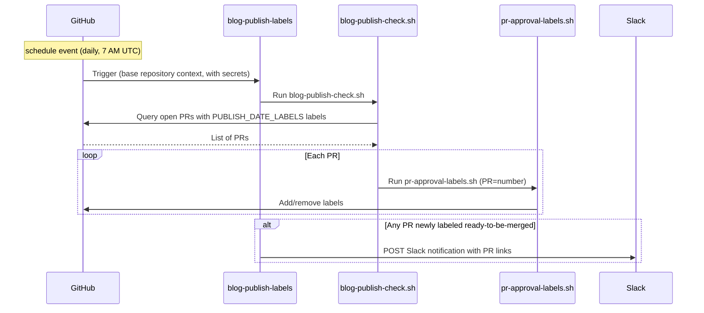

The [`blog-publish-labels.yml`][blog] workflow runs daily at 7 AM UTC. It
executes [`blog-publish-check.sh`][batch-script], which iterates over all open
PRs with the `blog` label and calls
[`pr-approval-labels.sh`](../label-gate/#script-operating-modes) for each one.
When `ready-to-be-merged` is newly applied to any of them, a Slack notification
is posted. The labeling step uses `continue-on-error: true`, so the Slack
notification step runs even if individual PR processing fails.

For details on the approval labels managed by the script, see
[Label gate](../label-gate/).

| Workflow file                     | Trigger                                                                           | Secrets / variables required                                                                        |
| --------------------------------- | --------------------------------------------------------------------------------- | --------------------------------------------------------------------------------------------------- |
| [`blog-publish-labels.yml`][blog] | `schedule` (daily 7 AM UTC), `workflow_dispatch` (manual test via `force_notify`) | `OTELBOT_DOCS_PRIVATE_KEY` (secret), `SLACK_WEBHOOK_URL` (secret), `OTELBOT_DOCS_APP_ID` (variable) |

The Slack notification fires only when the label transitions from absent to
present on that run --- repeated daily runs for an already-labeled PR do not
re-notify. The workflow can also be triggered manually via `workflow_dispatch`
with the `force_notify` input set to `true` to send a one-off test notification
without applying any labels (dry run).

## Workflow sequence {#workflow-sequence}



## Security model {#security-model}

The workflow runs on a schedule, which always executes in the trusted base
repository context (schedule events have no fork variant). It uses a GitHub App
token (`OTELBOT_DOCS_APP_ID` / `OTELBOT_DOCS_PRIVATE_KEY`) for label edits and
org/team reads, and the `SLACK_WEBHOOK_URL` secret to post notifications.

## Slack webhook setup {#slack-webhook-setup}

The workflow uses a **Slack Workflow Builder webhook trigger**, which allows
non-engineers to own the message format without touching workflow code.

**Create the webhook:**

1. In Slack: **Tools → Workflow Builder → New Workflow → Start from scratch**
2. Choose trigger: **Webhook**
3. Declare one variable --- name: `pr_list`, type: **Text**
4. Add a step: **Send a message** to the desired channel, with body:

   ```text
   :newspaper: *Blog posts ready to publish*

   The following PRs have reached their publish date and all required
   approvals — they are ready to be merged:

   {{pr_list}}

   Have a great day! :sunny:
   ```

   Then click **Add button** and configure:
   - **Label**: `Review and merge`
   - **Color**: Primary (green)
   - **Action**: Open a link
   - **URL**:
     `https://github.com/open-telemetry/opentelemetry.io/issues?q=is%3Apr+state%3Aopen+label%3Ablog+label%3Aready-to-be-merged`

5. **Publish** the workflow and copy the webhook URL
6. Add it to the repository: **Settings → Secrets and variables → Actions → New
   repository secret**, name: `SLACK_WEBHOOK_URL`

**Payload sent by the workflow:**

```json
{
  "pr_list": "• #123: Add blog post: OTel 1.0 — https://github.com/.../pull/123\n• #456: Announce: new SIG — https://github.com/.../pull/456"
}
```

Each PR is a bulleted line with its title and URL. Slack auto-links bare URLs.
Multiple PRs labeled on the same day are batched into a single message --- one
webhook call regardless of how many PRs are ready.

[blog]:
  https://github.com/open-telemetry/opentelemetry.io/blob/main/.github/workflows/blog-publish-labels.yml
[batch-script]:
  https://github.com/open-telemetry/opentelemetry.io/blob/main/.github/scripts/blog-publish-check.sh
