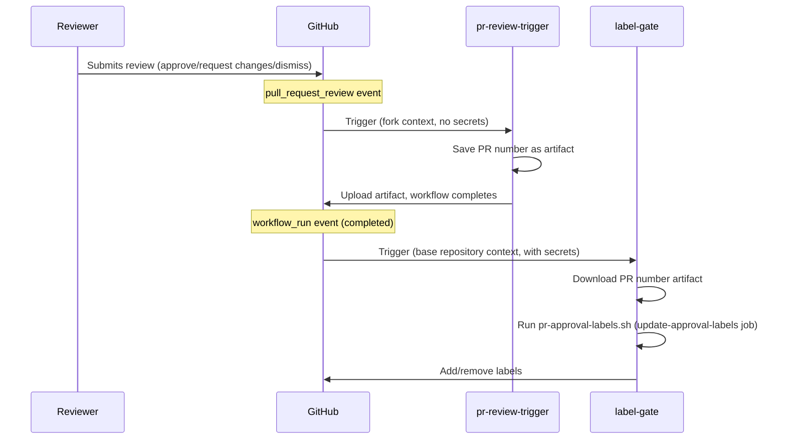
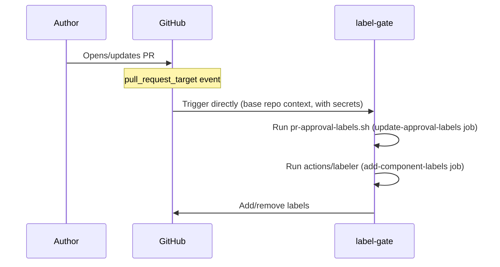

The label gate system ensures that every pull request receives the required
approvals before merging. It automatically adds component labels based on
changed files, tracks whether docs-approvers and SIG teams have approved, blocks
merging when changes are requested, and enforces publish-date embargoes on
date-sensitive content such as blog posts.

Two workflows collaborate to achieve this:

| Workflow file                      | Trigger                               | Privileges                                   |
| ---------------------------------- | ------------------------------------- | -------------------------------------------- |
| [`pr-review-trigger.yml`][trigger] | `pull_request_review`                 | Minimal (no secrets)                         |
| [`label-gate.yml`][labels]         | `pull_request_target`, `workflow_run` | App token for label edits and org/team reads |

## Labels managed {#labels-managed}

- **`missing:docs-approval`** --- added when approval from the
  [`docs-approvers`][docs-approvers] team is pending; removed once a
  docs-approver approves. Also force-added when any reviewer has an outstanding
  `CHANGES_REQUESTED` review, so that maintainers have visibility into blocked
  PRs.
- **`missing:sig-approval`** --- added when approval from a SIG team is pending
  (determined by files changed and [`.github/component-owners.yml`][owners]);
  removed once a SIG member approves or when no SIG component is touched. The
  `docs-maintainers` team is explicitly excluded from SIG team matching, since
  it is not a SIG team.
- **`ready-to-be-merged`** --- added when all required approvals are present;
  removed otherwise. This label is blocked when any reviewer has an outstanding
  `CHANGES_REQUESTED` review, regardless of other approval state. For PRs
  carrying any label in [`PUBLISH_DATE_LABELS`](#publish-date-gating)
  (currently: `blog`), the label is also gated on the publish date found in
  changed files.

## Component labels {#component-labels}

The `add-component-labels` job runs on `pull_request_target` events only. It
uses [`actions/labeler`][labeler] with the
[`.github/component-label-map.yml`][label-map] configuration to automatically
apply labels based on which files a PR changes. The labels fall into three
categories:

- **Content area** --- `blog`, `registry`
- **Localization** --- `lang:bn`, `lang:es`, `lang:fr`, `lang:ja`, `lang:pl`,
  `lang:pt`, `lang:ro`, `lang:uk`, `lang:zh`
- **SIG** --- `sig:cpp`, `sig:collector`, `sig:demo`, `sig:dotnet`,
  `sig:enduser`, `sig:erlang`, `sig:go`, `sig:helm`, `sig:java`,
  `sig:javascript`, `sig:obi`, `sig:operator`, `sig:php`, `sig:python`,
  `sig:ruby`, `sig:rust`, `sig:security`, `sig:spec`, `sig:swift`

## Publish date gating {#publish-date-gating}

The script scans each changed file for a line beginning with `date:` (typically
from the front matter in Markdown content). If it finds a date in the future,
the `ready-to-be-merged` label is withheld until that date arrives (UTC). This
prevents content from being merged before its scheduled publication date.

The check applies to PRs carrying any label listed in the `PUBLISH_DATE_LABELS`
environment variable, set in each workflow YAML (currently: `blog`). Adding a
label extends the check to other PR types.

If a PR contains multiple files with different dates, the label is gated on the
latest date --- all content must be ready before merging.

## Script operating modes {#script-operating-modes}

The [`pr-approval-labels.sh`][script] script processes a single PR (set via the
`PR` environment variable). It is called by `label-gate.yml` on PR events.

For batch mode (daily scheduled runs), see
[Blog publish labels](../blog-publish-labels/).

## Why two workflows? {#why-two-workflows}

GitHub's `pull_request_review` event has no `_target` variant. This means a
workflow triggered by a review on a **fork PR** runs in the fork's context and
cannot access the base repository's secrets.

To work around this limitation, the system uses a
[`workflow_run` chaining pattern](https://docs.github.com/en/actions/writing-workflows/choosing-when-your-workflow-runs/events-that-trigger-workflows#workflow_run):

1. **`pr-review-trigger`** runs on every review submission/dismissal. It saves
   the PR number as an artifact and exits --- no secrets needed.
2. **`label-gate`** is triggered by `workflow_run` (when the trigger workflow
   completes). It runs in the base repository context with full access to the
   GitHub App token, downloads the artifact, and updates labels.

For content changes (`opened`, `reopened`, `synchronize`), the `label-gate`
workflow is triggered directly via `pull_request_target`.

### Review flow (fork PRs) {#review-flow}

### Direct trigger flow {#direct-trigger-flow}

## Security model {#security-model}

- **`pr-review-trigger`**: intentionally minimal --- no secrets, no permissions
  declared. Ignores `review.state == "commented"` since comments don't affect
  approvals.
- **`label-gate`**: runs with a GitHub App token (`OTELBOT_DOCS_APP_ID` /
  `OTELBOT_DOCS_PRIVATE_KEY`) that has permissions to read org/team membership
  and edit PR labels. Uses `pull_request_target` and `workflow_run` to ensure it
  always executes in the trusted base repository context.

### Permission scopes {#permission-scopes}

| Job                      | `actions` | `contents` | `pull-requests` |
| ------------------------ | --------- | ---------- | --------------- |
| `update-approval-labels` | `read`    | `read`     | `write`         |
| `add-component-labels`   | ---       | `read`     | `write`         |

## Operational notes {#operational-notes}

- **Concurrency** --- the `update-approval-labels` job uses a per-PR concurrency
  group (`pr-approval-{pr_number}`) with `cancel-in-progress: true`. If multiple
  events arrive for the same PR in quick succession, only the latest run
  proceeds.
- **Continue on error** --- the "Update approval labels" step sets
  `continue-on-error: true`, so a transient GitHub API failure does not fail the
  entire workflow run.

[trigger]:
  https://github.com/open-telemetry/opentelemetry.io/blob/main/.github/workflows/pr-review-trigger.yml
[labels]:
  https://github.com/open-telemetry/opentelemetry.io/blob/main/.github/workflows/label-gate.yml
[docs-approvers]: https://github.com/orgs/open-telemetry/teams/docs-approvers
[owners]:
  https://github.com/open-telemetry/opentelemetry.io/blob/main/.github/component-owners.yml
[label-map]:
  https://github.com/open-telemetry/opentelemetry.io/blob/main/.github/component-label-map.yml
[labeler]: https://github.com/actions/labeler
[script]:
  https://github.com/open-telemetry/opentelemetry.io/blob/main/.github/scripts/pr-approval-labels.sh
