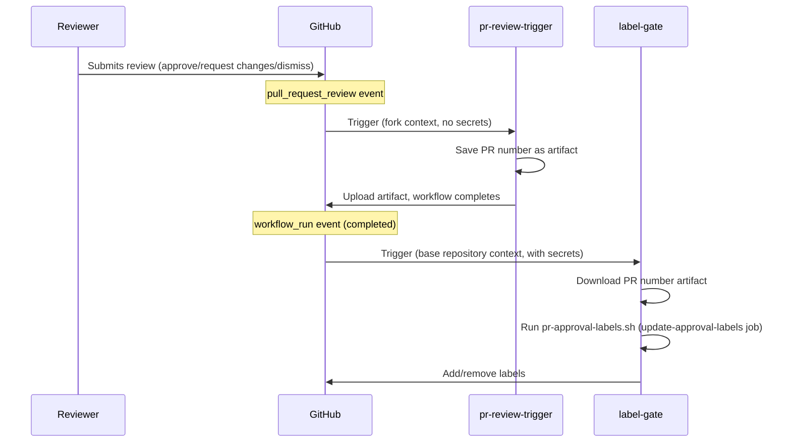
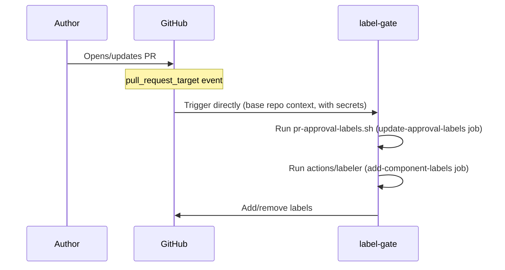

## Label gate {#label-gate}

The following workflows work together to automatically manage approval-related
labels on pull requests:

| Workflow file                      | Trigger                               | Privileges                                   |
| ---------------------------------- | ------------------------------------- | -------------------------------------------- |
| [`pr-review-trigger.yml`][trigger] | `pull_request_review`                 | Minimal (no secrets)                         |
| [`label-gate.yml`][labels]         | `pull_request_target`, `workflow_run` | App token for label edits and org/team reads |
| [`blog-publish-labels.yml`][blog]  | `schedule` (daily 7 AM UTC)           | App token + `SLACK_WEBHOOK_URL` secret       |

[trigger]:
  https://github.com/open-telemetry/opentelemetry.io/blob/main/.github/workflows/pr-review-trigger.yml
[labels]:
  https://github.com/open-telemetry/opentelemetry.io/blob/main/.github/workflows/label-gate.yml
[blog]:
  https://github.com/open-telemetry/opentelemetry.io/blob/main/.github/workflows/blog-publish-labels.yml

### Labels managed

- **`missing:docs-approval`** — added when approval from the
  [`docs-approvers`][docs-approvers] team is pending; removed once a
  docs-approver approves.
- **`missing:sig-approval`** — added when approval from a SIG team is pending
  (determined by files changed and [`.github/component-owners.yml`][owners]);
  removed once a SIG member approves or when no SIG component is touched.
- **`ready-to-be-merged`** — added when all required approvals are present;
  removed otherwise. For PRs carrying any label in
  [`PUBLISH_DATE_LABELS`](#publish-date-gating) (currently: `blog`), this label
  is also gated on the publish date found in changed files.

[docs-approvers]: https://github.com/orgs/open-telemetry/teams/docs-approvers
[owners]:
  https://github.com/open-telemetry/opentelemetry.io/blob/main/.github/component-owners.yml

### Publish date gating {#publish-date-gating}

The script scans each changed file for a line beginning with `date:` (typically
from the front matter in Markdown content). If it finds a date in the future,
the `ready-to-be-merged` label is withheld until that date arrives (UTC). This
helps prevent content from being merged before its scheduled publication date.

The check applies to PRs carrying any label listed in the `PUBLISH_DATE_LABELS`
environment variable, set in each workflow YAML (currently: `blog`). Adding a
label extends the check to other PR types.

If a PR contains multiple files with different dates, the label is gated on the
latest date — all content must be ready before merging.

#### Script operating modes

The [`pr-approval-labels.sh`][script] script processes a single PR (set via the
`PR` environment variable). It is called by `label-gate.yml` on PR events and by
[`blog-publish-check.sh`][batch-script] in batch mode.

[script]:
  https://github.com/open-telemetry/opentelemetry.io/blob/main/.github/scripts/pr-approval-labels.sh
[batch-script]:
  https://github.com/open-telemetry/opentelemetry.io/blob/248cc6f/.github/scripts/blog-publish-check.sh

The [`blog-publish-check.sh`][batch-script] script handles batch iteration: it
queries all open PRs carrying any `PUBLISH_DATE_LABELS` label and calls
`pr-approval-labels.sh` for each one. Used by the
[`blog-publish-labels.yml`](#blog-publish-labels) `schedule` trigger (daily at 7
AM UTC), so a PR whose publish date arrives overnight receives
`ready-to-be-merged` automatically without requiring a new commit.

### Why two workflows?

GitHub's `pull_request_review` event has no `_target` variant. This means a
workflow triggered by a review on a **fork PR** runs in the fork's context and
cannot access the base repository's secrets.

To work around this limitation, the system uses a
[`workflow_run` chaining pattern](https://docs.github.com/en/actions/writing-workflows/choosing-when-your-workflow-runs/events-that-trigger-workflows#workflow_run):

1. **`pr-review-trigger`** runs on every review submission/dismissal. It saves
   the PR number as an artifact and exits — no secrets needed.
2. **`label-gate`** is triggered by `workflow_run` (when the trigger workflow
   completes). It runs in the base repository context with full access to the
   GitHub App token, downloads the artifact, and updates labels.

For content changes (`opened`, `reopened`, `synchronize`), the `label-gate`
workflow is triggered directly via `pull_request_target`.

### Security model

- **`pr-review-trigger`**: intentionally minimal — no secrets, no privileged
  permissions. Ignores `review.state == "commented"` since comments don't affect
  approvals.
- **`label-gate`**: runs with a GitHub App token (`OTELBOT_DOCS_APP_ID` /
  `OTELBOT_DOCS_PRIVATE_KEY`) that has permissions to read org/team membership
  and edit PR labels. Uses `pull_request_target` and `workflow_run` to ensure it
  always executes in the trusted base repository context. Also adds component
  labels via `actions/labeler`.
- **`blog-publish-labels`**: runs on a schedule with a GitHub App token and the
  `SLACK_WEBHOOK_URL` secret. Always executes in the trusted base repository
  context (schedule events have no fork variant).
