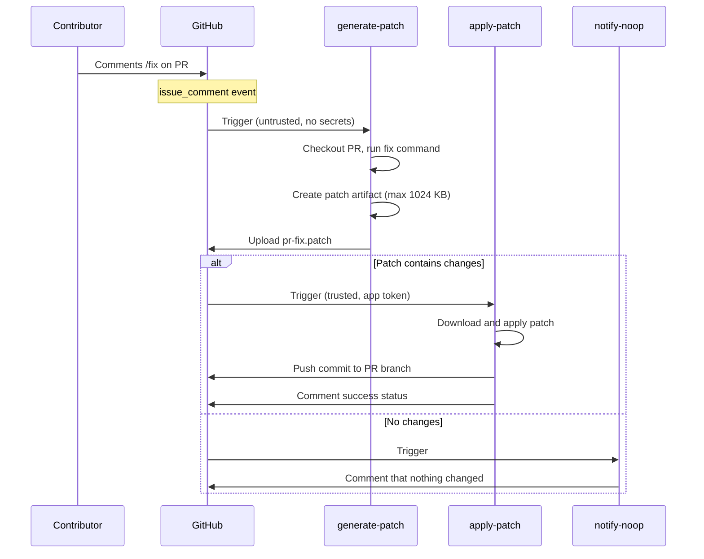

The [`pr-actions.yml`][pr-actions] workflow lets contributors run selected `fix`
scripts by commenting on a PR.

| Workflow file                  | Trigger                   | Privileges                         |
| ------------------------------ | ------------------------- | ---------------------------------- |
| [`pr-actions.yml`][pr-actions] | `issue_comment` (created) | App token for push and PR comments |

## Available directives {#available-directives}

| Directive     | Runs                 | Notes                                               |
| ------------- | -------------------- | --------------------------------------------------- |
| `/fix`        | `npm run fix`        | Default -- runs all standard fixes (skips i18n)     |
| `/fix:<name>` | `npm run fix:<name>` | Run a single fix script, e.g., `/fix:format`        |
| `/fix:all`    | `npm run fix`        | Mapped to `/fix` after semantics change ([#9291][]) |
| `/fix:ALL`    | `npm run fix:all`    | Full fix suite including i18n -- maintainers only   |

### Commonly used fix scripts {#commonly-used-fix-scripts}

The following scripts can be invoked individually via `/fix:<name>`:

- `fix:format` -- run Prettier and trim trailing whitespace
- `fix:text` -- auto-fix text lint issues
- `fix:markdown` -- auto-fix Markdown lint issues and trim trailing whitespace
- `fix:dict` -- sort cSpell dictionary files
- `fix:refcache` -- prune stale entries from the link reference cache and
  re-check links
- `fix:i18n` -- update i18n tracking (included only in `/fix:ALL`)
- `fix:filenames` -- rename files to kebab-case
- `fix:expired` -- delete expired content files
- `fix:submodule` -- pin submodule to latest commit

Run `npm run` locally to see the full list of available scripts.

## Pipeline stages {#pipeline-stages}

The workflow runs as a two-stage pipeline:

1. **`generate-patch`** (untrusted): checks out the PR branch, runs the fix
   command, prunes stale entries from the link reference cache
   (`static/refcache.json`), and uploads a patch artifact (`pr-fix.patch`)
   bounded to 1024 KB.
2. **`apply-patch`** (trusted): runs with a GitHub App token, downloads and
   applies the patch, and pushes a commit to the PR branch.

If a directive produces no changes, a separate **`notify-noop`** job comments
that nothing needed to be committed.

## Error handling {#error-handling}

- The fix command runs with `continue-on-error: true`, so file changes are
  captured even if the command exits non-zero. For example, refcache updates are
  committed even when some broken links remain.
- On success: the bot comments with a checkmark and a link to the workflow run.
- On failure: the bot comments with an error status and a link to the logs.
- If the patch exceeds 1024 KB (`MAX_PATCH_SIZE_KB`), the job fails before
  uploading the artifact.

## Security model {#security-model}

- **`generate-patch`**: runs with read-only permissions (untrusted). It cannot
  push code or access secrets -- it can only produce a patch artifact.
- **`apply-patch`**: uses a GitHub App token (`OTELBOT_DOCS_APP_ID` /
  `OTELBOT_DOCS_PRIVATE_KEY`) with `contents: write` and `pull-requests: write`
  permissions. It only applies a pre-generated diff bounded to 1024 KB.
- **`notify-noop`**: uses a separate, less-privileged App token
  (`OTELBOT_APP_ID` / `OTELBOT_PRIVATE_KEY`) scoped to PR comments only.

[#9291]: https://github.com/open-telemetry/opentelemetry.io/pull/9291
[pr-actions]:
  https://github.com/open-telemetry/opentelemetry.io/blob/main/.github/workflows/pr-actions.yml
