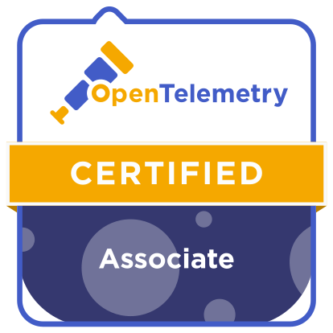

{}

## {}

This page showcases training resources for the OpenTelemetry project. Check back
often for updates!

### Certifications

Demonstrate your expertise in OpenTelemetry by becoming an OpenTelemetry
Certified Associate.

### Training programs

Coming soon!

{}
