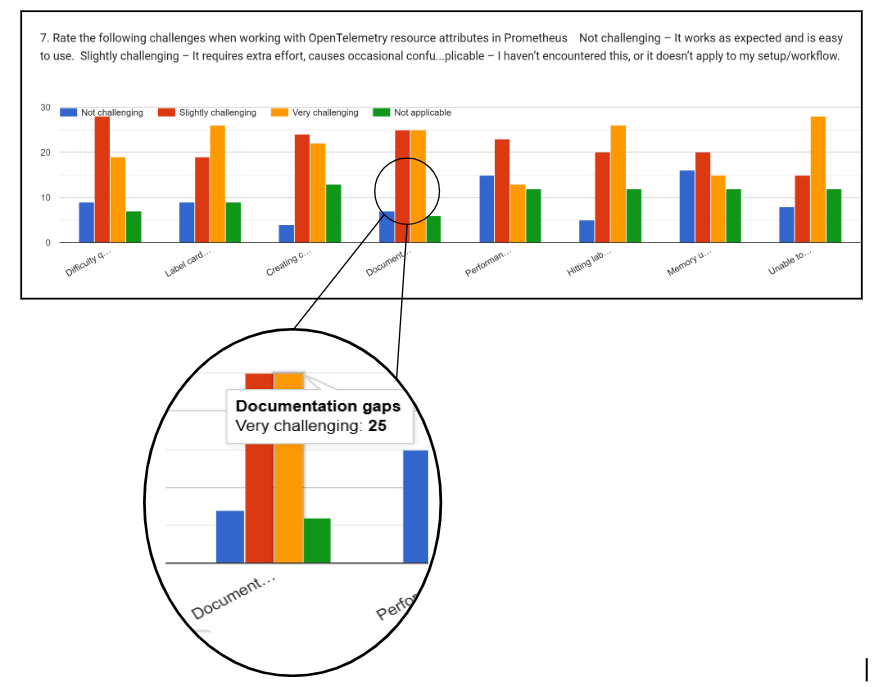

---
title:
  ¿Cómo debería manejar Prometheus los atributos de recursos de OpenTelemetry? - Un reporte
  de investigación de UX
linkTitle: ¿Cómo debería manejar Prometheus los atributos de recursos de OpenTelemetry?
date: 2025-10-01
author: >-
  [Victoria Nduka](https://github.com/nwanduka) Translation [Amin Espinoza](https://github.com/aminespinoza10)
sig: End User
# prettier-ignore
cSpell:ignore: 
---

En mayo 29 de 2025, finalizé mi mentoria con Prometheus a través del
[Programa de mentoría de la Linux Foundation](https://mentorship.lfx.linuxfoundation.org/project/36e3f336-ce78-4074-b833-012015eb59be).
Mi proyecto se enfocó en entender como Prometheus maneja los atributos de recursos
de OpenTelemetry y como esa experiencia podría ser mejorada para los usuarios. Mi trabajo
era conducir una investigación de usuarios para obtener sus perspectivas en este reto. En
tres meses, conduje entrevistas con usuarios y stakeholders, corrí una encuesta, y
analicé los resultados.

En este artículo, te mostraré como hice la investigación, que descubrí y donde
las comunidades involucradas podrían partir de aquí.

## Antecedentes del proyecto

OpenTelemetry tiene algo llamado atributos de
[recursos](/docs/concepts/resources/), que es información extra
acerca de la fuente de una métrica, como el servicio, host o ambiente que
la generó. Prometheus, una base de datos de tipo time-serires, usa etiquetas para identificar y
consultar las métricas. Si los atributos del recurso son convertidos a etiquetas, esto puede causar
lo que es conocido como "una explosión de cardinalidad", esencialmente crear demasiadas combinaciones
únicas que abrumen al sistema. Esto usualmente sucede si los atributos
cambian ocasionalmente o incluyen muchos valores únicos como user IDs o nombres de pod.

Actualmente, hay tres maneras diferentes de manejar este reto:

- **Mapear todos los atributos de recursos a etiquetas:** Esto crea problemas de
explosiones de cardinalidades, especialmente para aplicaciones con grandes números 
de atributos o frecuentemente cambiando los valores de los atributos.
- **Promoción selectiva:** Los usuarios manualmente eligen cuáles atributos de recrusos son
lo suficientemente importantes para ser convertidos a etiquetas en Prometheus.
- **Patrón de información precisa:** Pon todos los atributos de los recursos en una métrica
separada que se llame `target_info`. Cuando los usuarios necesiten consultar las métricas
que involucran diferentes atributos de registros deben hacer una unión (join) entre la información
apuntada y sus métricas actuales.

Estas no son malas soluciones técnicamente, pero no hacen lo mejor para la experiencia
de usuario. Así que, yo conduje esta investigación para entender lo que quienes mantienen a
Prometheus puedan estar dejando pasar acerca de la experiencia de usuario.

Los objetivos de la investigación fueron:

- Entender como los ingenieros usan los recursos de atributos de OpenTelemetry con
  Prometheus.
- Identificar los puntos débiles en la integración actual.
- Descubrir las expectativas para como los atributos de recursos deberían ser representados.

## Enfoque de la investigación

El enfoque de mi investigación fue una mezcla de investigación cuantitativa y cualitativa.
Comencé con entrevistas a stakeholders (las partes interesadas) para entender el contexto histórico y evaluar que
tan abiertos estaban a cambios que pudieran resultar de mi investigación.
Aquellos con quienes hablé representaron un rango de posiciones, de fundadores y
cofundadores de proyectos a quienes mantienen las cosas por mucho tiempo con un
contexto histórico asi como otros más directamente involucrados en los retos
emanados de manejar atributos de recursos.

Después, hice las entrevistas a los usuarios para escuchar directamente de las personas
que usan esas herramientas. Finalmente, corrí con una encuestra para alcanzar una audiencia
mayor y validar lo que he escuchado en entrevistas.

## Aprendizajes de las entrevistas con los stakeholders

Platiqué con 6 stakeholders, 3 de cada proyecto:

**Stakeholders de Prometheus:**

- [Julius Volz](https://github.com/juliusv) – Cofundador de Prometheus
- [Beorn Rabestein](https://github.com/beorn7) – Contribuidor de mucho tiempo de Prometheus
- [Richard Hartmann](https://github.com/RichiH) – Contribuidor de Prometheus y cofundador de OpenMetrics

**Stakeholders de OpenTelemetry:**

- [Juraci Paixão Kröhling](https://github.com/jpkrohling) – Miembro del comité de gobernanza de OpenTelemetry
- [Josh Suereth](https://github.com/jsuereth) – Miembro del comité técnico de OpenTelemetry
- [Austin Parker](https://github.com/austinlparker) – Cofundador de OpenTelemetry y miembro de su comité
de gobernanza

Mis conversaciones con los stakeholders trajeron muchos descubrimientos interesantes
a la luz:

- Las comunidades de Prometheus y OpenTelemetry no siempre se habían comunicado bien
  y eso les impidió colaborar desde temprano.
- Muchos de los problemas de interoperabilidad que existen ahora emanan de diferentes
  bases técnicas y filosóficas en las cuales cada proyecto está construido.

  > "Si nosotros pensamos acerca de situaciones exploratorias o casos de uso entonces
  > podemos justificar muchas de las decisiones detrás de OpenTelemetry. Y si pensamos
  > acerca de métricas y escalabilidad, monitoreo, para gran infraestructrura, entonces las
  > decisiones de diseño para Prometheus también están justificadas. Así que ambos tienen 
  > muy buenos argumentos.
  > _Juraci Paixão Kröhling_

  <!-- test -->

  > “Yo creo que uno de los más grandes (obstáculos de interoperabilidad) es la diferencia
  > entre un push y un pull.” — _Julius Volz_

  Julius después mencionó que su preocupación va más allá del mecanismo de entrega.
  En sus palabras:

  > "Una de las más grandes desventajas de usar OTLP ara enviar métricas a Prometheus es 
  > que terminas descartando una de las características principales de Prometheus como un
  > sistema de monitoreo: Su modelo de colección de métricas extraídas que está basado en
  > el servicio dinámico de descubrimiento de información (por eso Prometheus siempre sabe qué
  > puntos debería visitar recurrentemente), y el monitoreo de salud automático de objetivos
  > resultante vía la métrica sintética 'up' que es generada para cada "objetivo raspado"."

- Hay un reconocimiento compartido de la importancia de poner las necesidades del usuario
  primero, incluso cuando se mantienen algunas cosas no negociables (por ejemplo, Prometheus
  manteniendo su modelo de extracción y no margina a los usuarios existentes).

Una de las conclusiones clave de las entrevistas para mí fue darme cuenta de que los problemas
actuales de interoperabilidad no son fallos, sino consecuencias naturales de que diferentes
comunidades resolviendo problemas distintos en momentos distintos. Y es bueno ver que ambos
proyectos colaboran para mejorar la experiencia del usuario.

## Aprendizajes de las entrevistas de los usuarios

Las entrevistas con los usuarios fueron tan reveladoras como las conversaciones con los stakeholders.
Pensé hablar con unos 10 usuarios (aunque era ambicioso, cierto), pero logré entrevistar
a 7, y todos compartieron perspectivas increíblemente útiles.

El problema más común que compartieron los usuarios fue la complejidad de realizar uniones (joins) con la
integración actual. Otro problema mencionado fue la discrepancia en los nombres de las métricas
debido a las limitaciones del conjunto de caracteres, pero entiendo que ya se ha solucionado, ya
que las versiones recientes de Prometheus ahora admiten caracteres UTF-8 (aunque esto introduce
la necesidad de la sintaxis de selector entre comillas, más engorrosa, de PromQL).

En cuanto a los modelos mentales, muchos usuarios (tanto entrevistados como encuestados) no distinguen
entre los atributos de los recursos y las etiquetas de Prometheus. Suelen pensar que son lo mismo.

> "Yo esperaría que los atributos de recursos sean tratados exactamente de la misma manera
> que los atributos adjuntos a la trazabilidad, a las métricas como una regla. No dibujaría una
> frontera entre ellos" — _Interview Participant 1_

También aprendí sobre las diversas soluciones alternativas que se utilizan para gestionar problemas con
los atributos de recursos en sus casos de uso específicos. Algunos promueven atributos de recursos
seleccionados a etiquetas, otros manejan la conversión a nivel de OpenTelemetry-Collector para evitar
tener que lidiar con ella en Prometheus, y algunos convierten todos los atributos, aunque generalmente
solo cuando el número de atributos es pequeño.

## Aprendizaje de la encuesta

La encuesta me ayudó a cuantificar lo que escuchaba en las entrevistas y a llegar a un público más amplio.
Al momento de escribir esto, teníamos 134 respuestas, 61 de ellas de nuestro grupo objetivo: personas que usan OTel y Prometheus juntos.

Aquí están los hallazgos clave:

- Los usuarios no conceptualizan los atributos de recursos como diferentes de las etiquetas regulares, aunque
  la implementación actual los trate como metadatos separados.
- La sintaxis de unión (join) compleja es un gran obstáculo para la adopción, ya que los desarrolladores promedio
  no pueden escribir consultas básicas para acceder a los atributos de recursos.
- La promoción manual de atributos genera una sobrecarga operativa que no se adapta bien al tamaño y la
  complejidad del equipo.
- El 78 % de los encuestados considera que las lagunas en la documentación representan un desafío en el uso de
  los atributos de recursos.

Los patrones de la encuesta fueron consistentes con lo que emergió de mi investigación
cualitativa. Para resultados más detallados puedes ver las 
[respuestas anónimas de la encuesta](https://github.com/prometheus-community/ux-research/blob/main/prom-otel-research/survey-results.csv)

## Lo que no esperaba aprender (pero lo hice)

Comencé esta investigación para comprender los problemas de los usuarios con el manejo de atributos de
recursos, pero descubrí algunos hallazgos inesperados e importantes.

Uno de los más sorpendentes fue darme cuenta de que la
[característica de la detección de recursos de OpenTelemetry](/docs/specs/otel/resource/#telescoping)
permite a los usuarios mantener selectivamente o desechar los atributos de recursos basados en
relevancia usando un patrón conceptual que algunas veces es referido como "telescoping".
A pesar de su potencial, muchos usuarios, e incluso algunos miembros de la comunidad de Prometheus, parecen desconocerlo.
Esta falta de conocimiento puede haber contribuido a la adopción del patrón "join", que desde entonces
ha demostrado ser problemático.

Esto resalta un problema más amplio: las lagunas en la documentación y la educación constituyen un obstáculo
importante. En nuestra encuesta, el 78 % de los encuestados mencionó las lagunas en la documentación
como un desafío.

Otro hallazgo clave es que las decisiones de integración mas tempranas, como la dependencia de las uniones,
se tomaron sin comprender plenamente las capacidades de cada herramienta, una consecuencia inevitable de
la falta de colaboración y comunicación temprana entre las comunidades de Prometheus y OpenTelemetry.

## Soluciones recomendadas

Basándonos en conversaciones con los stakeholders y los usuarios finales, estas son algunas de las soluciones
propuestas, agrupadas según lo que es factible a corto plazo y lo que forma parte de una visión a largo plazo:

### Soluciones a corto plazo

- **Documentación mejorada para manejo de atributos:** Debido a que los usuarios encuentran más fácil
  promover los atributos en lugar de unir la información con joins, valdría la pena restar
  importancia (o incluso eliminar) a la documentación sobre las uniones al tiempo que se crean
  [documentos de promoción de atributos](https://prometheus.io/docs/guides/opentelemetry/#promoting-resource-attributes)
  más prominentes para aquellos que no están al tanto de la opción. El patrón "telescopio" de detección
  de recursos en OpenTelemetry también merece mayor visibilidad y documentación adecuada. Además, los usuarios han
  sugerido crear documentación consolidada de Prometheus y OpenTelemetry que explique claramente cómo
  ambos sistemas gestionan los atributos de los recursos.

### Visión a largo plazo

- **Entity framework:** El concepto de entidades en desarrollo de OpenTelemetry podría ayudar a
  Prometheus a distinguir entre atributos identificativos y descriptivos. Esto guiaría qué atributos
  se convierten en etiquetas y cuáles se almacenan o filtran.

- **Almacenamiento de metadatos:** Los stakeholders también debatieron la idea de añadir soporte de
  metadatos de primera clase a Prometheus. Esto permitiría almacenar ciertos atributos de recursos como
  metadatos (no etiquetas), evitando costos de cardinalidad y manteniendo la información disponible para
  consultas o uniones.

- **Expansión para telemetría exploratoria:** Puede que parezca exagerado, pero Prometheus podría considerar
  ampliar su alcance para ofrecer un mejor soporte a los casos de uso de telemetría exploratoria. Los stakeholders se
  mostraron abiertos al cambio, siempre y cuando la arquitectura principal de Prometheus se mantenga intacta y los usuarios
  existentes no se vean marginados. Esto sugiere que podría haber margen para la evolución, especialmente si las nuevas
  capacidades pueden complementar, en lugar de reemplazar, el comportamiento actual.

  > Yo veo OTel y Prometheus viniendo de muy suposiciones muy diferentes de como debería
  > trabajar la telemetría en general. Así que mientras Prometheus tiene una postura muy
  > firme sobre el almacenamiento de las series temporales, OTel, por el otro lado, viene
  > de ámbito del rastreo (tracing) lo que significa que es más exploratorio que Prometheus.
  > Así que (con) Prometheus, yo sé de antemano lo que necesito. (Con) OpenTelemetry, no sé
  > qué podría necesitar, así que lo almaceno todo. — _Juraci Paixão Kröhling_

- **Correlación de señales cruzadas** Los usuarios mencionan que el uso de plataformas que pueden recibir todo tipo de
  telemetría y correlacionar métricas, seguimientos (traces) y logs dentro de un solo sistema. Mientras que Prometheus
  se centre únicamente en las métricas, podría habilitar herramientas que correlacionen las métricas con la telemetría
  almacenada en otras bases de datos. Prometheus actualmente soporta
  [ejemplares](https://prometheus.io/docs/specs/om/open_metrics_spec/#exemplars),
  que permiten vincular métricas con seguimientos, pero ese es prácticamente el objetivo de su alcance. Dependen
  de la presencia de seguimiento, lo que los hace menos útiles en entornos donde los seguimientos
  no están disponibles o instrumentados.

  > "Una de las innovaciones clave de OpenCensus fue que se podía dividir el uso de CPU según
  > las solicitudes que lo usaban y obtener una métrica que dijera: "Aquí está el uso de CPU por
  > solicitud". Esto es algo que se podía lograr en OpenCensus porque todas las métricas se
  > basaban en el contexto."  — _Josh Suereth_

Aún hay mucho trabajo por hacerse. Las comunidades necesitarán tiempo para desarrollar y probar las soluciones. Pero
estoy orgullosa de que esta investigación ha probado una base centrada en el usuario para esta tarea.

Si estás interesado en las discusiones en curso, propuestas y retroalimentación alrededor de estas ideas,
puedes checar el repo de Github donde todo está documentado:
[OpenTelemetry Resource Attributes in Prometheus UX Research](https://github.com/prometheus-community/ux-research/tree/main/prom-otel-research)

## Reconocimientos

Este post estaría incompleto sin el reconocimiento de mis increíbles mentores:
[Amy Super](https://github.com/amy-super),
[Andrej Kiripolsky](https://github.com/AndrejKiri), y
[Arthur Silva Sens](https://github.com/ArthurSens) – gracias por confiar en mi
con este retador proyecto y preocuparse tanto acerca de mi camino profesional.
¡Son las verdaderas super estrellas!

Para todas las partes involucradas (stakeholders) y usuarios que me dieron su tiempo: 
Gracias por el compromiso con todo este trabajo y confiar en mi con su retroalimentación honesta. 
Sus perspectivas hicieron a esta investigación muy valiosa.

## ¿Que sigue para mi?

Estoy emocionada de seguir trabajando en la intersección de UX y sistemas nativos de la nube.
Si sabes acerca de oportunidades similares a esta mentoría ¡Me encantaría escuchar de ti!
Soy una trabajadora ardua (puedes preguntarle a mis mentores).
