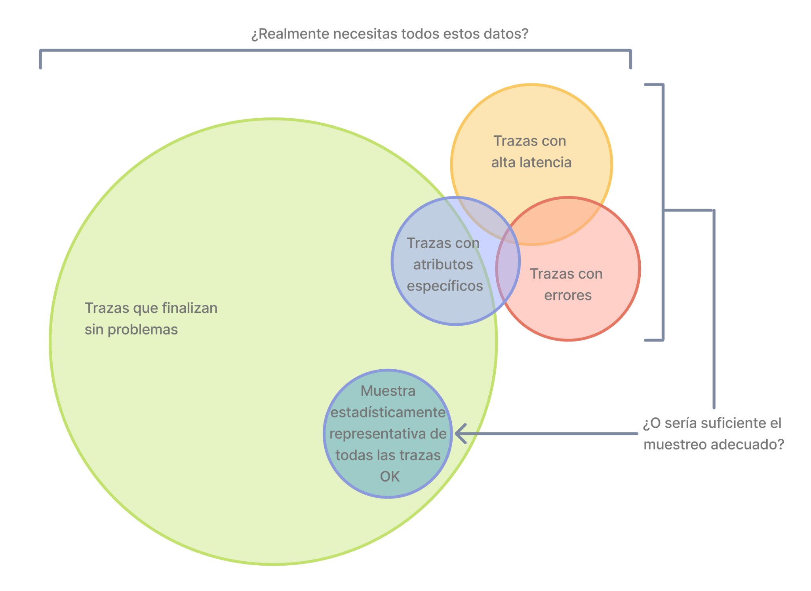
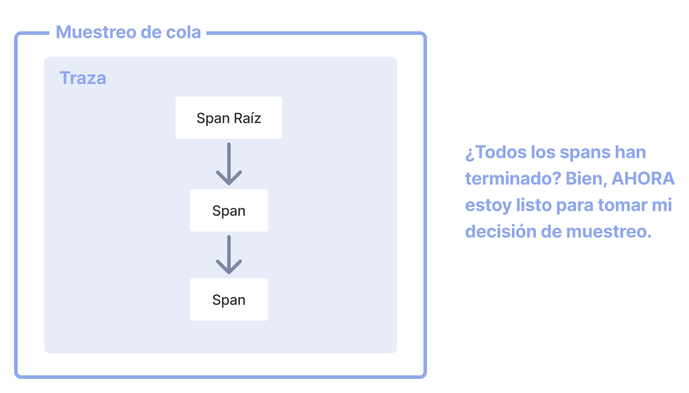

Con las [trazas](/docs/concepts/signals/traces) puedes seguir las solicitudes
entre servicios en un sistema distribuido. Las trazas (traces) son valiosas para
obtener tanto una visión general como un análisis detallado de los sistemas.

Sin embargo, si la gran mayoría de tus solicitudes tienen éxito y finalizan con
una latencia aceptable y sin errores, no necesitas el 100% de las trazas para
observar de forma significativa tus aplicaciones y sistemas. Lo que necesitas es
un muestreo adecuado.

## Terminología { #terminology }

Es importante usar una terminología consistente al hablar de muestreo. Una traza
o un span se puede considerar muestreado o no muestreado:

- **Muestreado**: Si una traza o un span se procesa y se exporta. Al ser elegido
  por el muestreador como representativo de la población, se considera
  "muestreado".
- **No muestreado**: Si una traza o un span no se procesa ni se exporta. Al no
  ser elegido por el muestreador, se considera "no muestreado".

Usar términos consistentes como muestreado y no muestreado evita confusiones;
evita decir extraer muestras (sampling out) cuando quieres indicar exclusión. Si
no se procesa ni se exporta, no está muestreado. Evita traducciones literales
confusas de _sampling out_.

## ¿Por qué muestrear? { #why-sampling }

El muestreo es una de las formas más efectivas de reducir los costes de
observabilidad sin perder visibilidad. Aunque existen otras maneras de bajar
costes, como filtrar o agregar datos, estos métodos no siempre respetan el
principio de representatividad, que es crucial para análisis detallados del
comportamiento de aplicaciones o sistemas.

La representatividad es el principio por el que un grupo más pequeño puede
representar con precisión a uno mayor. Además, la representatividad puede
verificarse matemáticamente, lo que permite tener alta confianza de que una
muestra pequeña representa bien al conjunto.

Además, cuanto más datos generes, menos datos necesitas realmente para tener una
muestra representativa. En sistemas de alto volumen, es común que una tasa de
muestreo del 1 % o incluso menor represente con precisión al 99 % de los datos
restantes.

### Cuándo muestrear { #when-to-sample }

Considera el muestreo si cumples cualquiera de los siguientes criterios:

- Generas 1000 o más trazas por segundo.
- La mayor parte de tus datos de trazas representan tráfico saludable con poca
  variación.
- Tienes criterios comunes, como errores o latencias altas, que suelen indicar
  que algo va mal.
- Tienes criterios específicos del dominio que puedes usar para determinar qué
  datos son relevantes más allá de errores y latencia.
- Puedes describir reglas comunes que determinen si los datos deben muestrearse
  o descartarse.
- Tienes una forma de distinguir entre servicios, de modo que los servicios de
  alto y bajo volumen se muestreen de forma diferente.
- Puedes enrutar datos no muestreados (para escenarios "por si acaso") a
  sistemas de almacenamiento de bajo coste.

Finalmente, considera tu presupuesto global. Si dispones de un presupuesto
limitado para observabilidad, pero puedes invertir tiempo en establecer un
muestreo efectivo, entonces generalmente merece la pena muestrear.

### Cuándo no muestrear { #when-not-to-sample }

El muestreo podría no ser apropiado para ti. Quizá debas evitar el muestreo si
cumples cualquiera de los siguientes criterios:

- Generas muy pocos datos (decenas de trazas pequeñas por segundo o menos).
- Solo usas los datos de observabilidad en agregados y por tanto puedes
  pre-agregarlos.
- Estás sujeto a regulaciones o circunstancias que prohíben eliminar datos (y no
  puedes enrutar datos no muestreados a almacenamiento de bajo coste).

Finalmente, considera los siguientes tres costes asociados al muestreo:

1. El coste directo de cómputo para muestrear eficazmente los datos, como un
   proxy de muestreo de cola (tail sampling).
2. El coste indirecto de ingeniería para mantener metodologías de muestreo
   eficaces a medida que se añaden aplicaciones, sistemas y datos.
3. El coste de oportunidad indirecto de perder información crítica con técnicas
   de muestreo ineficaces.

El muestreo, aunque eficaz para reducir costes de observabilidad, puede
introducir otros costes inesperados si no se realiza bien. Dependiendo de tu
backend de observabilidad, la naturaleza de tus datos y tus intentos de
muestrear de forma efectiva, puede ser más barato destinar más recursos a
observabilidad, con un proveedor o con cómputo propio, en lugar de implementar
muestreos complejos.

## Muestreo en cabecera (Head Sampling) { #head-sampling }

El muestreo en cabecera o en head-based es una técnica que toma la decisión de
muestrear lo antes posible. La decisión de muestrear o descartar un span o una
traza no se toma inspeccionando la traza en su totalidad.

Por ejemplo, la forma más común de muestreo en la cabecera es el
[muestreo probabilístico consistente](/docs/specs/otel/trace/tracestate-probability-sampling/#consistent-sampling-decision).
También se conoce como muestreo determinista. En este caso, la decisión de
muestrear se basa en el ID de la traza y en el porcentaje deseado de trazas a
muestrear. Esto garantiza que se muestreen trazas enteras —sin spans faltantes—
a una tasa consistente, por ejemplo el 5 % de todas las trazas.

Las ventajas del muestreo en cabecera son:

- Fácil de entender
- Fácil de configurar
- Eficiente
- Se puede aplicar en cualquier punto de la canalización de recopilación de
  trazas

La principal desventaja del muestreo en cabecera es que no es posible tomar una
decisión basada en los datos de la traza completa. Por ejemplo, no puedes
asegurar que todas las trazas que contienen un error se muestreen usando solo
muestreo en la cabecera. Para ese caso y muchos otros, necesitas el muestreo de
cola (tail sampling).

## Muestreo de cola (Tail Sampling) { #tail-sampling }

El muestreo de cola o tail-based, es cuando la decisión de muestrear una traza
se toma considerando la mayoría o la totalidad de los spans dentro de la traza.
El tail sampling permite muestrear trazas según criterios específicos derivados
de distintas partes de una traza, lo que no es posible con el muestreo en la
cabecera.

Algunos ejemplos de uso de muestreo de cola incluyen:

- Muestrear siempre las trazas que contienen un error.
- Muestrear trazas en función de la latencia global.
- Muestrear trazas según la presencia o el valor de atributos específicos en uno
  o más spans de una traza; por ejemplo, muestrear más trazas originadas en un
  servicio recién desplegado.
- Aplicar diferentes tasas de muestreo a trazas según ciertos criterios, como
  cuando las trazas provienen solo de servicios de bajo volumen frente a trazas
  que incluyen servicios de alto volumen.

Como puedes ver, el muestreo de cola permite un grado mucho mayor de
sofisticación en la forma de muestrear datos. Para sistemas grandes que deben
muestrear telemetría, casi siempre es necesario usar tail sampling para
equilibrar el volumen de datos con la utilidad de los mismos.

Hay tres desventajas principales del tail sampling hoy en día:

1. El muestreo de cola puede ser difícil de implementar. Dependiendo del tipo de
   técnicas de muestreo disponibles, no siempre es algo de "configurar y
   olvidar". A medida que cambian tus sistemas, cambiarán también tus
   estrategias de muestreo. En sistemas distribuidos grandes y complejos, las
   reglas que implementan la lógica de muestreo también pueden ser extensas y
   sofisticadas.
2. El muestreo de cola puede ser difícil de operar. Los componentes que
   implementan muestreo de cola deben ser sistemas con estado que puedan aceptar
   y almacenar gran cantidad de datos. Según los patrones de tráfico, esto puede
   requerir decenas o incluso cientos de nodos de cómputo que utilicen recursos
   de forma diversa. Además, un sampler de cola podría necesitar "reducir" la
   complejidad y usar técnicas de muestreo menos costosas si no consigue
   procesar el volumen entrante. Por estos motivos, es crítico monitorizar los
   componentes de muestreo de cola para asegurar que tienen los recursos
   necesarios para tomar las decisiones de muestreo correctas.
3. Los muestreos de cola a menudo terminan siendo tecnologías específicas de un
   proveedor. Si usas un proveedor de observabilidad, las opciones más efectivas
   de muestreo de cola disponibles pueden limitarse a lo que el proveedor
   ofrece.

Finalmente, en algunos sistemas el muestreo de cola puede usarse junto con el
muestreo en cabecera. Por ejemplo, un conjunto de servicios que generan un
volumen extremadamente alto de trazas podría usar primero muestreo en cabecera
para reducir las trazas a un pequeño porcentaje, y luego, más adelante en la
canalización de telemetría, aplicar muestreo de cola para tomar decisiones más
sofisticadas antes de exportar a un backend. Esto se hace a menudo para evitar
que la canalización de telemetría se sobrecargue.

## Soporte { #support }

### Collector { #collector }

El OpenTelemetry Collector incluye los siguientes procesadores de muestreo:

- [Probabilistic Sampling Processor](https://github.com/open-telemetry/opentelemetry-collector-contrib/tree/main/processor/probabilisticsamplerprocessor)
- [Tail Sampling Processor](https://github.com/open-telemetry/opentelemetry-collector-contrib/tree/main/processor/tailsamplingprocessor)

### SDKs por lenguaje { #language-sdks }

Para las implementaciones específicas por lenguaje de la API y el SDK de
OpenTelemetry, encontrarás soporte para el muestreo en las páginas de
documentación respectiva:

{}

### Proveedores { #vendors }

Muchos [proveedores](/ecosystem/vendors) ofrecen soluciones de muestreo
completas que incorporan muestreo en cabecera, en cola y otras funciones que
pueden cubrir necesidades sofisticadas de muestreo. Estas soluciones suelen
estar optimizadas específicamente para el backend del proveedor. Si envías
telemetría a un proveedor, considera usar sus soluciones de muestreo.
