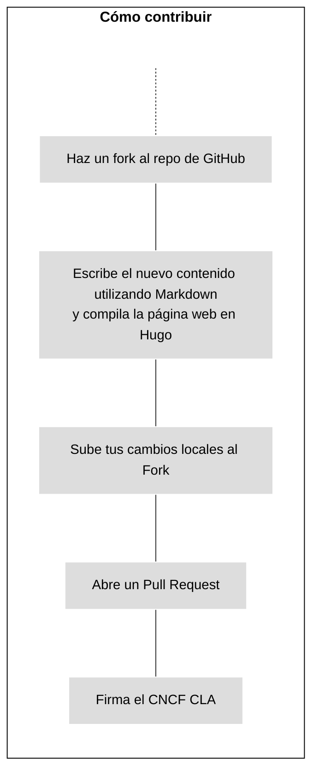
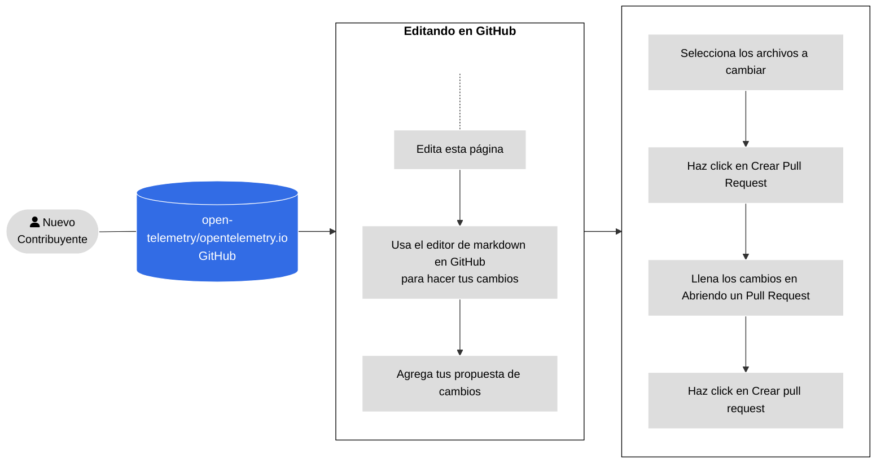
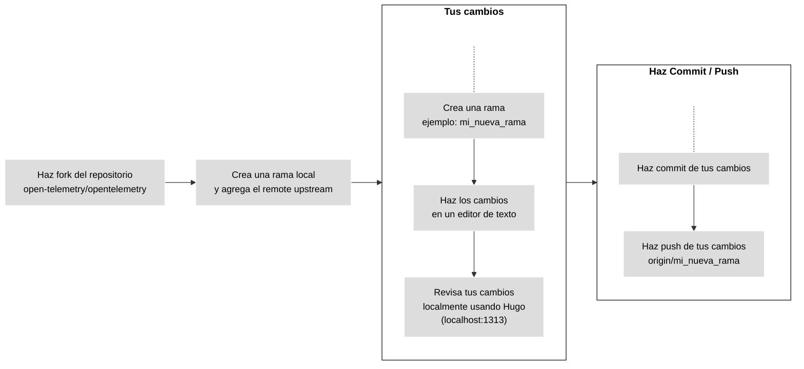
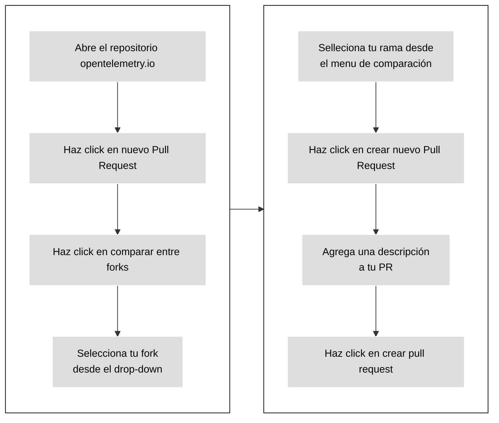

Para contribuir con nuevas páginas de contenido o mejorar las páginas de
contenido existentes, abre un Pull Request (PR):

- Si tu cambio es pequeño, o no estás familiarizado con Git, lee
  [Editar con GitHub](#changes-using-github) para aprender a editar la página
  desde la interfaz de GitHub.
- Si tu cambio es más complejo, lee
  [Editar desde una rama local](#fork-the-repo) para aprender cómo realizar
  cambios desde tu editor de código.

{}

Convierte tu Pull Request en borrador para indicar que el contenido aún no está
listo para su revisión. Los miembros aún pueden comentar o realizar revisiones
de alto nivel, aunque no revisarán el contenido en su totalidad hasta que
indiques que ya no es un borrador.

{}

La siguiente figura ilustra cómo contribuir con nueva documentación.



_Figura 1. Contribuyendo con nuevo contenido._

## Editar con GitHub {#changes-using-github}

Si no tienes mucha experiencia con Git, aquí tienes un método más sencillo para
abrir un Pull Request. La Figura 2 describe los pasos y los detalles a
continuación.



_Figura 2. Pasos para abrir un Pull Request desde GitHub._

1. En la página de la tarea en GitHub, selecciona **Editar esta página** en el
   panel de navegación en la derecha.

1. Si no eres miembro de este proyecto, puedes hacer fork al repositorio de
   GitHub. Selecciona **Fork**.

1. Haz tus cambios desde el editor de GitHub.

1. Llena el formulario de **Subir cambios**.

1. Selecciona **Proponer cambios**.

1. Selecciona **Crear pull request**.

1. Cuando la pantalla de **Abrir un pull request** aparezca. Agrega una
   descripción para que los supervisores puedan comprender tus cambios.

1. Selecciona **Crear pull request**.

Antes de hacer merge de tus cambios, Los miembros de la comunidad de
OpenTelemetry harán revisión de tus cambios y los aprobarán.

Si un miembro te pide hacer cambios:

1. Ve a la pestaña de **Archivos cambiados**.
1. Selecciona el icono del lápiz (Editar) en cualquiera de los archivos
   cambiados en tu pull request.
1. Haz los cambios solicitados. Si hay alguna sugerencia de código, aplícala.
1. Haz commit de tus cambios.

Cuando la revisión a terminado, un miembro de la comunidad hará merge de tu pull
request y tus cambios estarán disponibles al público en algunos minutos.

{}

Haz un comentario con `/fix:format` en tu pull request para realizar una
revisión automática de formateo de tus cambios.

{}

## Editar desde una rama local {#fork-the-repo}

Si eres un usuario más experimentado con Git, o tus cambios afectan varios
archivos a la vez, trabaja desde una rama local.

Asegúrate de que tienes
[Git](https://git-scm.com/book/en/v2/Getting-Started-Installing-Git) instalado
en tu computadora. También puedes usar una interfaz gráfica de Git.

La figura 3 muestra los pasos a seguir cuando se trabaja desde una rama local. A
continuación se detallan los pasos.



_Figura 3. Trabajando desde una rama local para hacer cambios._

### Haz fork al repositorio de opentelemetry.io

1. Navega al repositorio
   [`opentelemetry.io`](https://github.com/open-telemetry/opentelemetry.io/) .
1. Selecciona **Fork**.

### Crea un clon local y agrega el upstream

1. En tu terminal, clona tu fork y instala las dependencias:

   ```shell
   git clone git@github.com:<your_github_username>/opentelemetry.io.git
   cd opentelemetry.io
   npm install
   ```

1. Coloca el repositorio de `open-telemetry/opentelemetry.io` como el `upstream`
   remote:

   ```shell
   git remote add upstream https://github.com/open-telemetry/opentelemetry.io.git
   ```

1. Confirma los valores de los remotes `origin` y `upstream`:

   ```shell
   git remote -v
   ```

   La salida debe ser similar a:

   ```none
   origin	git@github.com:<your_github_username>/opentelemetry.io.git (fetch)
   origin	git@github.com:<your_github_username>/opentelemetry.io.git (push)
   upstream	https://github.com/open-telemetry/opentelemetry.io.git (fetch)
   upstream	https://github.com/open-telemetry/opentelemetry.io.git (push)
   ```

1. Actualiza los cambios de la rama `origin/main` en tu fork y la rama
   `upstream/main` del repositorio original `open-telemetry/opentelemetry.io`:

   ```shell
   git fetch origin
   git fetch upstream
   ```

Esto se asegura de que tu repositorio local está actualizado antes de que
empieces a hacer tus cambios localmente. Realiza esto frecuentemente para
mantener tu copia local sincronizada con la versión en el repositorio original.

### Crea una rama

1. Crea una rama. Este ejemplo asume que tomaremos de referencia la rama
   `upstream/main`:

   ```shell
   git checkout -b <mi_nueva_rama> upstream/main
   ```

1. Haz tus cambios en tu editor de código favorito.

Usa el comando `git status` con regularidad para visualizar los archivos que has
cambiado.

### Haz commit de tus cambios

Cuando estás listo para subir tu pull request, haz commit de tus cambios.

1. En tu repositorio local, revisa los cambios que quieres subir a GitHub:

   ```shell
   git status
   ```

   La salida debe ser similar a:

   ```none
   On branch <mi_nueva_rama>
   Your branch is up to date with 'origin/<mi_nueva_rama>'.

   Changes not staged for commit:
   (use "git add <file>..." to update what will be committed)
   (use "git checkout -- <file>..." to discard changes in working directory)

   modified:   content/en/docs/nombre_de_tu_archivo.md

   no changes added to commit (use "git add" and/or "git commit -a")
   ```

1. Agrega los archivos listados debajo de **Changes not staged for commit** al
   commit:

   ```shell
   git add <nombre_de_tu_archivo>
   ```

   Repite esto para cada uno de los archivos a subir.

1. Luego de modificar todos los archivos, crea un commit:

   ```shell
   git commit -m "Mensaje de tu commit"
   ```

1. Sube los cambios a tu rama local:

   ```shell
   git push origin <mi_nueva_rama>
   ```

1. Una vez tus cambios fueron subidos, GitHub te notifica si quieres crear un
   Pull Request (PR) de tus cambios.

### Abrir un Pull Request de tu Fork {#open-a-pr}

La Figura 4 muestra los pasos para abrir un PR desde tu rama a
[opentelemetry.io](https://github.com/open-telemetry/opentelemetry.io).



\_Figura 4. Pasos para abrir un PR desde tu fork a
[opentelemetry.io](https://github.com/open-telemetry/opentelemetry.io).

1. En un navegador web, ve al repositorio
   [`opentelemetry.io`](https://github.com/open-telemetry/opentelemetry.io) .
1. Selecciona **Nuevo Pull Request**.
1. Selecciona **Comparar ramas**.
1. En el menú desplegable **repositorio principal**, selecciona su rama.
1. En el menú desplegable **Comparar**, selecciona tu rama.
1. Selecciona **Crear Pull Request**.
1. Agrega una descripción para tu pull request:
   - **Título** (50 caracteres o menos): Resume la intención del cambio.
   - **Descripción**: Describe el cambio con más detalle.

   - Si hay un problema de GitHub relacionado, incluye `Fixes #12345` o
     `Closes #12345` en la descripción para que la automatización de GitHub
     cierre el problema mencionado después de fusionar el PR. Si hay otros PR
     relacionados, vincúlalos también.
   - Si quieres asesoramiento sobre algo específico, incluye cualquier pregunta
     que te gustaría que los miembros consideren en tu descripción.

1 Haz click en el botón **Crear pull request**.

Tu pull request estará disponible en
[pull Requests](https://github.com/open-telemetry/opentelemetry.io/pulls).

Después de abrir un PR, GitHub ejecuta pruebas automatizadas e intenta
implementar una vista previa usando [Netlify](https://www.netlify.com/).

- Si la compilación de Netlify falla, selecciona **Detalles** para obtener más
  información.
- Si la compilación de Netlify se realiza correctamente, selecciona **Detalles**
  para abrir una versión preparada del sitio web de OpenTelemetry con los
  cambios aplicados. Así es como los revisores verifican sus cambios.

También pueden fallar otras comprobaciones. Consulta la
[lista de todas las comprobaciones de PR](/docs/contributing/pr-checks).

### Soluciona problemas de contenido automáticamente {#fix-issues}

Antes de enviar un cambio al repositorio, ejecuta el siguiente comando y (i)
aborda los problemas informados, (ii) confirma los archivos modificados por el
script:

```sh
npm run test-and-fix
```

Para probar y solucionar por separado todos los problemas con tus archivos,
ejecuta:

```sh
npm run test    # Checks but does not update any files
npm run fix:all # May update files
```

Para enumerar los scripts NPM disponibles, ejecuta `npm run`. Consulta los
[Pre-requisitos de PR](/docs/contributing/pr-checks) para obtener más
información sobre las verificaciones de los Pull Request y cómo solucionar
errores automáticamente.

### Obtén una vista previa de tus cambios localmente {#preview-locally}

Obtén una vista previa de tus cambios localmente antes de enviarlos o abrir un
pull request. Una vista previa te permite detectar errores de compilación o
problemas de formato de Markdown.

Para crear y servir el sitio localmente con Hugo, ejecuta el siguiente comando:

```shell
npm run serve
```

Navega a `http://localhost:1313` en su navegador web para ver la vista previa
local. Hugo observa los cambios y reconstruye el sitio según sea necesario.

Para detener la instancia local de Hugo, vuelve a la terminal y escriba
`Ctrl+C`, o cierre la ventana de la terminal.

### Implementaciones del sitio y vistas previas de PR

Si envías una PR, Netlify crea una [Vista Previa de Implementación][] para que
puedas revisar sus cambios. Una vez que se fusiona su PR, Netlify implementa el
sitio actualizado en el servidor de producción.

> **Nota**: Las vistas previas de PR incluyen _páginas de borrador_, pero las
> compilaciones de producción no.

Para ver los registros de implementación y más, visita el [Panel de Control][]
del proyecto. Se requiere inicio de sesión en Netlify.

### Pautas de PR

Antes de fusionar un PR, a veces se requieren algunas iteraciones de revisión y
edición. Para ayudarnos a nosotros y a ti mismo a hacer que este proceso sea lo
más sencillo posible, te pedimos que respetes lo siguiente:

- Si su PR no es una solución rápida, entonces **trabaja desde una copia**:
  selecciona el botón
  [Fork](https://github.com/open-telemetry/opentelemetry.io/fork) en la parte
  superior del repositorio y clone el repositorio localmente. Cuando esté listo,
  genere un PR al repositorio original.
- **No trabajes desde la rama `main`** de su fork: crea una rama específica para
  el PR.
- Asegúrate de que los mantenedores tengan permiso para
  [aplicar cambios a tu solicitud de incorporación de cambios](https://docs.github.com/es/pull-requests/collaborating-with-pull-requests/working-with-forks/allowing-changes-to-a-pull-request-branch-created-from-a-fork).

### Cambios de los revisores

A veces, los revisores suben cambios en tu pull request. Antes de realizar
cualquier otro cambio, actualiza tu rama.

1. Actualiza los commits de tu fork y haz rebase de tu rama actual:

   ```shell
   git fetch origin
   git rebase origin/<nombre-de-tu-rama>
   ```

1. Luego de hacer rebase, sube tus nuevos cambios a tu fork:

   ```shell
   git push --force-with-lease origin <nombre-de-tu-rama>
   ```

También puedes resolver conflictos de fusión desde la interfaz de usuario de
GitHub.

### Conflictos en ramas y git rebase

Si otro colaborador realiza cambios en el mismo archivo en otro pull request,
puedes crear un merge. Es tu responsabilidad resolver todos los conflictos en tu
Pull Request.

1. Actualiza tu fork y haz git rebase de tu rama local:

   ```shell
   git fetch origin
   git rebase origin/<nombre-de-tu-rama>
   ```

   Luego haz force-push de tus cambios a tu fork:

   ```shell
   git push --force-with-lease origin <nombre-de-tu-rama>
   ```

1. Actualiza los cambios de la rama `upstream/main` en
   `open-telemetry/opentelemetry.io` y haz git rebase a tu rama actual:

   ```shell
   git fetch upstream
   git rebase upstream/main
   ```

1. Inspecciona los resultados del git rebase:

   ```shell
   git status
   ```

   Esto indicará la cantidad de archivos marcados con conflictos.

1. Abra cada archivo en conflicto y busque los marcadores de conflicto: `>>>`,
   `<<<`, y `===`. Resuelva el conflicto y elimine el marcador de conflicto.

Para obtener más información, consulta
[Cómo se presentan los conflictos](https://git-scm.com/docs/git-merge#_how_conflicts_are_presented).

1. Agrega los archivos al conjunto de cambios:

   ```shell
   git add <filename>
   ```

1. Haz force push de los cambios en tu rama a tu fork:

   ```shell
   git push --force-with-lease origin <nombre-de-tu-rama>
   ```

   El pull request ya no muestra ningún conflicto.

### Requisitos para hacer merge

Los pull request se hacen merge cuando cumplen con los siguientes criterios:

- Todas las revisiones realizadas por aprobadores, mantenedores, miembros del
  comité técnico o expertos en la materia tienen el estado "Aprobado".
- No hay conversaciones sin resolver.
- Aprobado por al menos un aprobador.
- No hay comprobaciones de PR fallidas.
- La rama de PR está actualizada con la rama base.

> **Importante**
>
> No te preocupes demasiado por las comprobaciones de PR fallidas. Los miembros
> de la comunidad te ayudarán a solucionarlas, ya sea proporcionándote
> instrucciones sobre cómo solucionarlas o solucionándolas en tu nombre.

[Panel de Control]: https://app.netlify.com/sites/opentelemetry/overview
[Vista Previa de Implementación]:
  https://www.netlify.com/blog/2016/07/20/introducing-deploy-previews-in-netlify/
