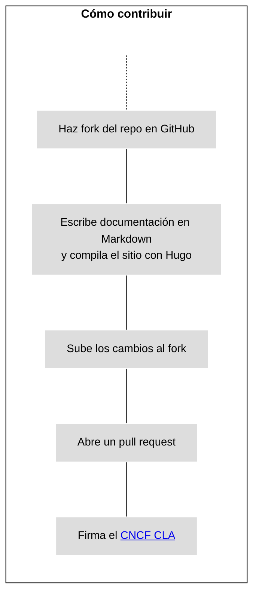
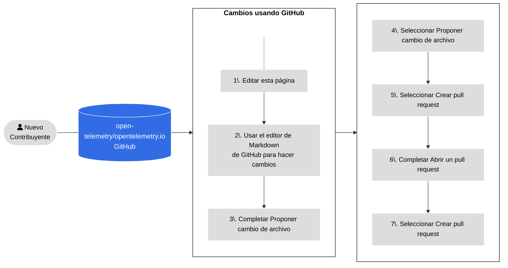
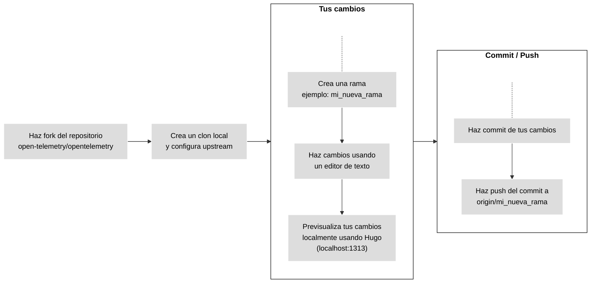
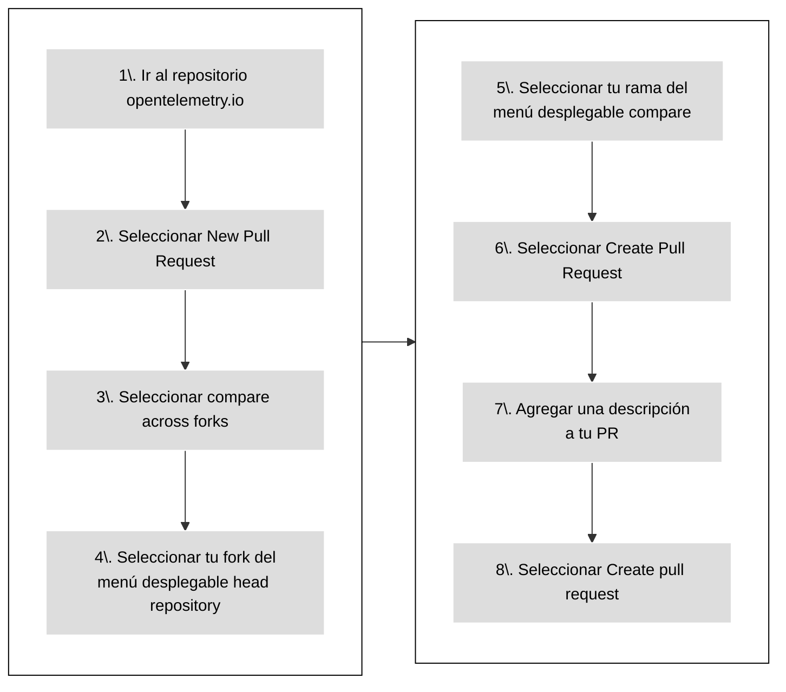

Para contribuir con nueva documentación o mejorar la existente, envía un [pull
request][PR] (PR):

- Si tu cambio es pequeño, o no estás familiarizado con [Git][], consulta
  [Usando GitHub](#changes-using-github) para aprender a editar una página.
- De lo contrario, consulta [Trabajar localmente](#fork-the-repo) para aprender
  cómo hacer cambios en tu propio entorno de desarrollo local.

## Política de contribución con IA generativa {#using-ai}

> [!WARNING] **Nuevos contribuyentes**, ¡presten atención!
>
> Si eres un [contribuyente nuevo][], ten en cuenta lo siguiente:
>
> Tus primeras 3 contribuciones a nuestro repositorio deben ser principalmente
> escritas por humanos, con solo asistencia menor de IA permitida
> ([AIL1](https://danielmiessler.com/blog/ai-influence-level-ail)). Esto
> significa que tu código debe estar escrito a mano, pero la IA puede ayudar con
> autocompletado, formateo, linting y seguimiento de buenas prácticas. La
> descripción de tu PR debe estar completamente escrita por humanos, sin
> participación de IA (AIL0).
>
> Por supuesto, puedes usar herramientas de IA para hacer preguntas y aprender
> sobre nuestro repositorio, nuestro proyecto, cómo contribuir y más.
>
> Implementamos este requisito para ayudarte a aprender mientras contribuyes y
> para ayudar a los mantenedores y aprobadores a proteger su tiempo y ancho de
> banda, que es un recurso escaso.
>
> Los mantenedores pueden hacer una excepción si queda claro que tu contribución
> es una corrección rápida y puede fusionarse sin mucho esfuerzo adicional de su
> parte.

La IA generativa está permitida, pero **tú eres responsable** de **revisar y
_validar_** todo el contenido generado por IA &mdash; si no lo entiendes, ¡no lo
envíes!

Para más detalles, consulta nuestra [Política de contribución con IA
generativa][].

[contribuyente nuevo]: ../#first-time-contributing
[Política de contribución con IA generativa]:
  https://github.com/open-telemetry/community/blob/main/policies/genai.md

## Cómo contribuir

La siguiente figura ilustra cómo contribuir con nueva documentación.



_Figura 1. Contribuyendo con nuevo contenido._

> [!TIP]
>
> Establece el estado de tu pull request como **Borrador** para que los
> mantenedores sepan que el contenido aún no está listo para revisión. Los
> mantenedores aún pueden comentar o hacer revisiones de alto nivel, aunque no
> revisarán el contenido en su totalidad hasta que elimines el estado de
> borrador.

## Usando GitHub {#changes-using-github}

### Editar y enviar cambios desde tu navegador {#page-edit-from-browser}

Si tienes menos experiencia con los flujos de trabajo de Git, aquí tienes un
método más sencillo para preparar y abrir un nuevo pull request (PR). La Figura
2 describe los pasos y los detalles siguen a continuación.



_Figura 2. Pasos para abrir un PR usando GitHub._

1. En la página donde ves el issue, selecciona la opción **Editar esta página**
   en el panel de navegación del lado derecho.

1. Si no eres miembro del proyecto, GitHub te ofrece crear un fork del
   repositorio. Selecciona **Fork this repository**.

1. Haz tus cambios en el editor de GitHub.

1. Completa el formulario de **Proponer cambio de archivo**.

1. Selecciona **Proponer cambio de archivo**.

1. Selecciona **Crear pull request**.

1. Aparece la pantalla **Abrir un pull request**. Tu descripción ayuda a los
   revisores a entender tu cambio.

1. Selecciona **Crear pull request**.

Antes de fusionar un pull request, los miembros de la comunidad de OpenTelemetry
lo revisan y aprueban.

Si un revisor te pide que hagas cambios:

1. Ve a la pestaña **Archivos cambiados**.
1. Selecciona el icono del lápiz (editar) en cualquier archivo modificado por el
   pull request.
1. Haz los cambios solicitados. Si hay una sugerencia de código, aplícala.
1. Haz commit de los cambios.

Cuando tu revisión esté completa, un revisor fusiona tu PR y tus cambios estarán
disponibles unos minutos después.

### Corregir fallos en las verificaciones del PR {#fixing-prs-in-github}

Después de enviar un PR, GitHub ejecuta algunas verificaciones de compilación.
Ciertos fallos en las verificaciones, como problemas de formato, pueden
corregirse automáticamente.

Agrega el siguiente comentario a tu PR:

```text
/fix:all
```

Esto activará el bot de OpenTelemetry para intentar corregir los problemas de
compilación. O puedes emitir uno de los siguientes comandos de corrección para
abordar un fallo específico:

```text
fix:dict
fix:expired
fix:filenames
fix:format
fix:htmltest-config
fix:i18n
fix:markdown
fix:refcache
fix:submodule
fix:text
```

> [!TIP] Consejo profesional
>
> También puedes ejecutar los comandos `fix` localmente. Para ver la lista
> completa de comandos de corrección, ejecuta `npm run -s '_list:fix:*'`.

## Trabajar localmente {#fork-the-repo}

Si tienes más experiencia con Git, o si tus cambios son más grandes que unas
pocas líneas, trabaja desde un fork local.

Asegúrate de tener [`git` instalado][] en tu computadora. También puedes usar
una interfaz de usuario para Git.

La Figura 3 muestra los pasos a seguir cuando trabajas desde un fork local. Los
detalles de cada paso siguen a continuación.



_Figura 3. Trabajando desde un fork local para hacer tus cambios._

### Hacer fork del repositorio

1. Navega al repositorio
   [`opentelemetry.io`](https://github.com/open-telemetry/opentelemetry.io/).
1. Selecciona **Fork**.

### Clonar y configurar upstream

1. En una ventana de terminal, clona tu fork e instala los requisitos:

   ```shell
   git clone git@github.com:<tu_usuario_de_github>/opentelemetry.io.git
   cd opentelemetry.io
   npm install
   ```

1. Configura el repositorio `open-telemetry/opentelemetry.io` como el remoto
   `upstream`:

   ```shell
   git remote add upstream https://github.com/open-telemetry/opentelemetry.io.git
   ```

1. Confirma tus repositorios `origin` y `upstream`:

   ```shell
   git remote -v
   ```

   La salida es similar a:

   ```none
   origin	git@github.com:<tu_usuario_de_github>/opentelemetry.io.git (fetch)
   origin	git@github.com:<tu_usuario_de_github>/opentelemetry.io.git (push)
   upstream	https://github.com/open-telemetry/opentelemetry.io.git (fetch)
   upstream	https://github.com/open-telemetry/opentelemetry.io.git (push)
   ```

1. Obtén los commits de `origin/main` de tu fork y de `upstream/main` de
   `open-telemetry/opentelemetry.io`:

   ```shell
   git fetch origin
   git fetch upstream
   ```

   Esto asegura que tu repositorio local esté actualizado antes de comenzar a
   hacer cambios. Sube los cambios de upstream a origin regularmente para
   mantener tu fork sincronizado con upstream.

### Crear una rama

1. Crea una nueva rama. Este ejemplo asume que la rama base es `upstream/main`:

   ```shell
   git checkout -b <mi_nueva_rama> upstream/main
   ```

1. Haz tus cambios usando un editor de código o texto.

En cualquier momento, usa el comando `git status` para ver qué archivos has
modificado.

### Hacer commit de tus cambios

Cuando estés listo para enviar un pull request, haz commit de tus cambios.

1. En tu repositorio local, verifica qué archivos necesitas incluir en el
   commit:

   ```shell
   git status
   ```

   La salida es similar a:

   ```none
   On branch <mi_nueva_rama>
   Your branch is up to date with 'origin/<mi_nueva_rama>'.

   Changes not staged for commit:
   (use "git add <file>..." to update what will be committed)
   (use "git checkout -- <file>..." to discard changes in working directory)

   modified:   content/en/docs/archivo-que-estas-editando.md

   no changes added to commit (use "git add" and/or "git commit -a")
   ```

1. Agrega los archivos listados bajo **Changes not staged for commit** al
   commit:

   ```shell
   git add <nombre_de_tu_archivo>
   ```

   Repite esto para cada archivo.

1. Después de agregar todos los archivos, crea un commit:

   ```shell
   git commit -m "Tu mensaje de commit"
   ```

1. Sube tu rama local y su nuevo commit a tu fork remoto:

   ```shell
   git push origin <mi_nueva_rama>
   ```

1. Una vez que los cambios se suben, GitHub te informa que puedes crear un PR.

### Abrir un nuevo PR {#open-a-pr}

La Figura 4 muestra los pasos para abrir un PR desde tu fork a
[opentelemetry.io](https://github.com/open-telemetry/opentelemetry.io).



_Figura 4. Pasos para abrir un PR desde tu fork a_
[opentelemetry.io](https://github.com/open-telemetry/opentelemetry.io).

1. En un navegador web, ve al repositorio
   [`opentelemetry.io`](https://github.com/open-telemetry/opentelemetry.io).
1. Selecciona **New Pull Request**.
1. Selecciona **compare across forks**.
1. Del menú desplegable **head repository**, selecciona tu fork.
1. Del menú desplegable **compare**, selecciona tu rama.
1. Selecciona **Create Pull Request**.
1. Agrega una descripción para tu pull request:
   - **Título** (50 caracteres o menos): Resume la intención del cambio.
   - **Descripción**: Describe el cambio con más detalle.
     - Si hay un issue de GitHub relacionado, incluye `Fixes #12345` o
       `Closes #12345` en la descripción para que la automatización de GitHub
       cierre el issue mencionado después de fusionar el PR. Si hay otros PRs
       relacionados, vincúlalos también.
     - Si quieres consejo sobre algo específico, incluye cualquier pregunta que
       te gustaría que los revisores consideren en tu descripción.

1. Selecciona el botón **Create pull request**.

Tu pull request está disponible en
[Pull requests](https://github.com/open-telemetry/opentelemetry.io/pulls).

Después de abrir un PR, GitHub ejecuta pruebas automatizadas e intenta desplegar
una vista previa usando [Netlify](https://www.netlify.com/).

- Si la compilación de Netlify falla, selecciona **Details** para más
  información.
- Si la compilación de Netlify tiene éxito, selecciona **Details** para abrir
  una versión preparada del sitio web de OpenTelemetry con tus cambios
  aplicados. Así es como los revisores verifican tus cambios.

Otras verificaciones también pueden fallar. Consulta la
[lista de todas las verificaciones de PR](../pr-checks).

### Corregir problemas {#fix-issues}

Antes de enviar un cambio al repositorio, ejecuta el siguiente comando y (i)
aborda cualquier problema reportado, (ii) haz commit de cualquier archivo
modificado por el script:

```sh
npm run test-and-fix
```

Para probar y corregir por separado todos los problemas con tus archivos,
ejecuta:

```sh
npm run test    # Verifica pero no actualiza ningún archivo
npm run fix:all # Puede actualizar archivos
```

Para listar los scripts NPM disponibles, ejecuta `npm run`. Consulta
[Verificaciones de PR](../pr-checks) para más información sobre las
verificaciones de pull request y cómo corregir errores automáticamente.

### Previsualizar tus cambios {#preview-locally}

Previsualiza tus cambios localmente antes de subirlos o abrir un pull request.
Una vista previa te permite detectar errores de compilación o problemas de
formato de Markdown.

Para compilar y servir el sitio localmente con Hugo, ejecuta el siguiente
comando:

```shell
npm run serve
```

Navega a <http://localhost:1313> en tu navegador web para ver la vista previa
local. Hugo observa los cambios y reconstruye el sitio según sea necesario.

Para detener la instancia local de Hugo, vuelve a la terminal y escribe
`Ctrl+C`, o cierra la ventana de la terminal.

### Despliegues del sitio y vistas previas de PR

Si envías un PR, Netlify crea una [vista previa de despliegue][] para que puedas
revisar tus cambios. Una vez que tu PR se fusiona, Netlify despliega el sitio
actualizado en el servidor de producción.

> **Nota**: Las vistas previas de PR incluyen _páginas de borrador_, pero las
> compilaciones de producción no.

Para ver los registros de despliegue y más, visita el [panel de control][] del
proyecto. Se requiere inicio de sesión en Netlify.

### Pautas para PRs

Antes de que un PR se fusione, a veces requiere algunas iteraciones de
revisión-y-edición. Para ayudarnos a nosotros y a ti mismo a hacer que este
proceso sea lo más fácil posible, te pedimos que cumplas con lo siguiente:

- Si tu PR no es una corrección rápida, entonces **trabaja desde un fork**: Haz
  clic en el botón
  [Fork](https://github.com/open-telemetry/opentelemetry.io/fork) en la parte
  superior del repositorio y clona el fork localmente. Cuando estés listo, crea
  un PR con el repositorio upstream.
- **No trabajes desde la rama `main`** de tu fork, sino crea una rama específica
  para el PR.
- Asegúrate de que los mantenedores tengan permiso para
  [aplicar cambios a tu pull request](https://docs.github.com/es/pull-requests/collaborating-with-pull-requests/working-with-forks/allowing-changes-to-a-pull-request-branch-created-from-a-fork).

### Cambios de los revisores

A veces los revisores hacen commits en tu pull request. Antes de hacer cualquier
otro cambio, obtén esos commits.

1. Obtén los commits de tu fork remoto y haz rebase de tu rama de trabajo:

   ```shell
   git fetch origin
   git rebase origin/<nombre-de-tu-rama>
   ```

1. Después del rebase, haz force-push de los nuevos cambios a tu fork:

   ```shell
   git push --force-with-lease origin <nombre-de-tu-rama>
   ```

También puedes resolver conflictos de fusión desde la interfaz de GitHub.

### Conflictos de fusión y rebase

Si otro contribuyente hace commits de cambios en el mismo archivo en otro PR,
puede crear un conflicto de fusión. Debes resolver todos los conflictos de
fusión en tu PR.

1. Actualiza tu fork y haz rebase de tu rama local:

   ```shell
   git fetch origin
   git rebase origin/<nombre-de-tu-rama>
   ```

   Luego haz force-push de los cambios a tu fork:

   ```shell
   git push --force-with-lease origin <nombre-de-tu-rama>
   ```

1. Obtén los cambios de `upstream/main` de `open-telemetry/opentelemetry.io` y
   haz rebase de tu rama:

   ```shell
   git fetch upstream
   git rebase upstream/main
   ```

1. Inspecciona los resultados del rebase:

   ```shell
   git status
   ```

   Esto resulta en varios archivos marcados como en conflicto.

1. Abre cada archivo en conflicto y busca los marcadores de conflicto: `>>>`,
   `<<<`, y `===`. Resuelve el conflicto y elimina el marcador de conflicto.

   Para más información, consulta
   [Cómo se presentan los conflictos](https://git-scm.com/docs/git-merge#_how_conflicts_are_presented).

1. Agrega los archivos al conjunto de cambios:

   ```shell
   git add <nombre_archivo>
   ```

1. Continúa el rebase:

   ```shell
   git rebase --continue
   ```

1. Repite los pasos 2 a 5 según sea necesario.

   Después de aplicar todos los commits, el comando `git status` muestra que el
   rebase está completo.

1. Haz force-push de la rama a tu fork:

   ```shell
   git push --force-with-lease origin <nombre-de-tu-rama>
   ```

   El pull request ya no muestra ningún conflicto.

### Requisitos para fusionar

Los pull requests se fusionan cuando cumplen con los siguientes criterios:

- Todas las revisiones de aprobadores, mantenedores, miembros del comité técnico
  o expertos en la materia tienen el estado "Aprobado".
- No hay conversaciones sin resolver.
- Aprobado por al menos un aprobador.
- No hay verificaciones de PR fallidas.
- La rama del PR está actualizada con la rama base.
- Los cambios en páginas de documentación [no abarcan múltiples locales][].

[no abarcan múltiples locales]: ../localization/#prs-should-not-span-locales

> **Importante**
>
> No te preocupes demasiado por las verificaciones de PR fallidas. Los miembros
> de la comunidad te ayudarán a corregirlas, ya sea proporcionándote
> instrucciones sobre cómo corregirlas o corrigiéndolas en tu nombre.

[panel de control]: https://app.netlify.com/sites/opentelemetry/overview
[vista previa de despliegue]:
  https://www.netlify.com/blog/2016/07/20/introducing-deploy-previews-in-netlify/
[Git]: https://docs.github.com/es/get-started/using-git/about-git
[`git` instalado]: https://git-scm.com/book/en/v2/Getting-Started-Installing-Git
[PR]: https://docs.github.com/es/pull-requests
