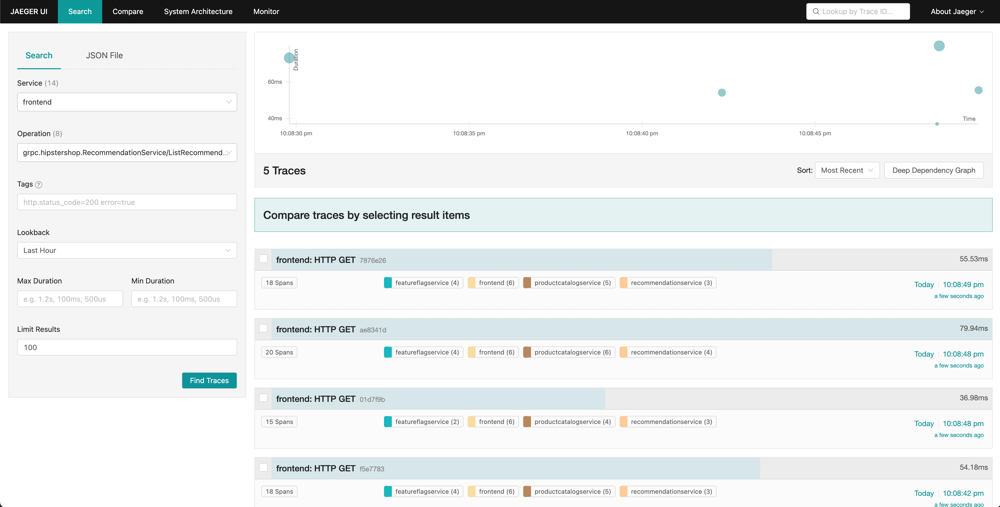

La telemetría de aplicaciones, como la que OpenTelemetry puede proporcionar, es
muy útil para diagnosticar problemas en un sistema distribuido. En este
escenario, recorreremos un escenario que demuestra cómo pasar de métricas y
trazas de alto nivel para determinar la causa de una fuga de memoria.

## Configuración

Para ejecutar este escenario, necesitarás desplegar la aplicación de
demostración y habilitar el feature flag `recommendationServiceCacheFailure`.
Deja la aplicación ejecutándose durante unos 10 minutos después de habilitar el
feature flag para permitir que los datos se acumulen.

## Diagnóstico

El primer paso para diagnosticar un problema es determinar que existe un
problema. A menudo la primera parada será un dashboard de métricas proporcionado
por una herramienta como Grafana.

Una [carpeta de dashboards de demostración](http://localhost:8080/grafana/dashboards)
debería existir después de lanzar la demo con dos dashboards; uno es para
monitorear tu OpenTelemetry Collector, y el otro contiene varias consultas y
gráficos para analizar latencia y tasa de solicitudes de cada servicio.

Este dashboard contendrá varios gráficos, pero algunos deberían parecer
interesantes:

- Recommendation Service (CPU% y Memoria)
- Latencia del Servicio (de SpanMetrics)
- Tasa de Errores

Los gráficos del Recommendation Service se generan a partir de Métricas de
OpenTelemetry exportadas a Prometheus, mientras que los gráficos de Latencia del
Servicio y Tasa de Errores se generan a través del procesador Span Metrics del
OpenTelemetry Collector.

Desde nuestro dashboard, podemos ver que parece haber un comportamiento anómalo
en el servicio de recomendaciones -- utilización de CPU con picos, así como
latencia de cola larga en nuestros histogramas p95, 99 y 99.9. También podemos
ver que hay picos intermitentes en la utilización de memoria de este servicio.

Sabemos que estamos emitiendo datos de trazas desde nuestra aplicación también,
así que pensemos en otra forma en que podríamos determinar que existe un
problema.

Jaeger nos permite buscar trazas y mostrar la latencia de extremo a extremo de
una solicitud completa con visibilidad en cada parte individual de la solicitud
general. Quizás notamos un aumento en la latencia de cola en nuestras
solicitudes del frontend. Jaeger nos permite entonces buscar y filtrar nuestras
trazas para incluir solo aquellas que incluyen solicitudes al servicio de
recomendaciones.

Ordenando por latencia, podemos encontrar rápidamente trazas específicas que
tomaron mucho tiempo. Haciendo clic en una traza en el panel derecho, podemos
ver la vista de cascada.

Podemos ver que el servicio de recomendaciones está tomando mucho tiempo para
completar su trabajo, y ver los detalles nos permite tener una mejor idea de lo
que está pasando.

## Confirmando el Diagnóstico

Podemos ver en nuestra vista de cascada que el atributo `app.cache_hit` está
establecido en false, y que el valor de `app.products.count` es extremadamente
alto.

Volviendo a la UI de búsqueda, selecciona `recommendation` en el desplegable de
Servicio, y busca `app.cache_hit=true` en el cuadro de Tags. Nota que las
solicitudes tienden a ser más rápidas cuando hay un hit de caché. Ahora busca
`app.cache_hit=false` y compara la latencia. Deberías notar algunos cambios en
la visualización en la parte superior de la lista de trazas.

Ahora, como este es un escenario creado artificialmente, sabemos dónde encontrar
el bug subyacente en nuestro código. Sin embargo, en un escenario del mundo
real, podríamos necesitar realizar más búsquedas para descubrir qué está pasando
en nuestro código, o las interacciones entre servicios que lo causan.
