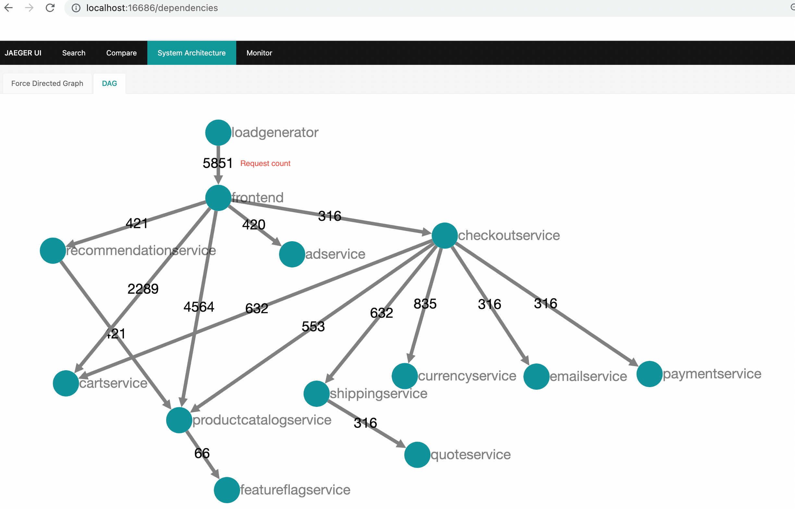
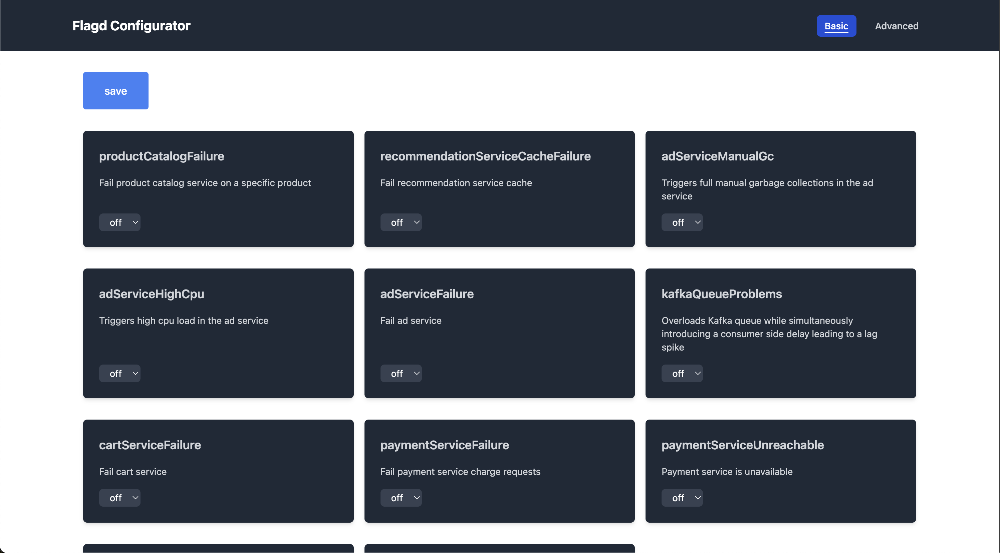

## Tienda web

| Página de Inicio              | Pantalla de Checkout          |
| ----------------------------- | ----------------------------- |
|  |  |

## Jaeger

| UI de Jaeger                | Vista de Traza                              |
| --------------------------- | ------------------------------------------- |
|  |  |

| Arquitectura del Sistema                                      |
| ------------------------------------------------------------- |
|  |

## Prometheus

## Grafana

| Fuente de Datos Prometheus                    | Fuente de Datos Jaeger                |
| --------------------------------------------- | ------------------------------------- |
|  |  |

## UI del Generador de Carga

## Configurador de Flagd

| Vista básica                                         | Vista avanzada                                             |
| ---------------------------------------------------- | ---------------------------------------------------------- |
|  |  |
