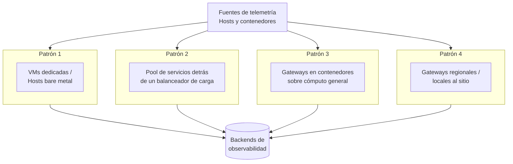
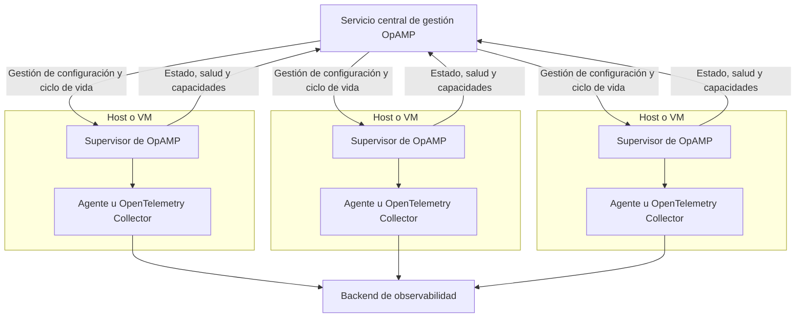
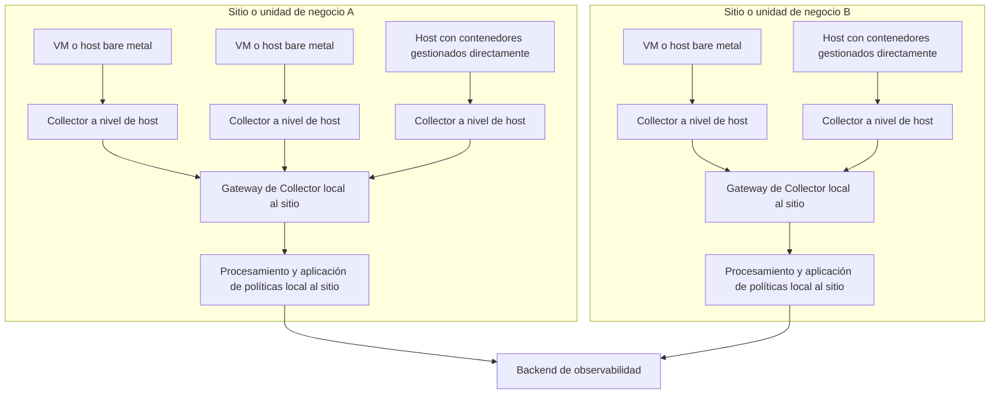

## Resumen {#summary}

Este blueprint describe una referencia estratégica para los equipos de Platform
Engineering y SRE que operan en entornos tradicionales de máquinas virtuales
(VM), bare metal y on-premises, incluidos los escenarios en los que los
contenedores se ejecutan directamente sobre un sistema operativo sin un
orquestador como Kubernetes.

Aborda la fricción que suele encontrarse al intentar establecer una
observabilidad coherente en infraestructuras heterogéneas, procesos heredados y
cargas de trabajo en contenedores.

Al implementar los patrones de este blueprint, las organizaciones pueden esperar
lograr los siguientes resultados:

- Telemetría de alta calidad y lista para usar en aplicaciones y servicios que
  se ejecutan en entornos no Kubernetes, incluidos los contenedores gestionados
  directamente.
- Gestión coherente del ciclo de vida de los agentes de OpenTelemetry, junto con
  patrones estandarizados de arranque y configuración para la instrumentación
  basada en SDK.
- Observabilidad unificada en infraestructuras mixtas: VMs, bare metal y
  contenedores sin orquestador.
- Mejor gobernanza sobre la calidad de las señales de telemetría, el
  enriquecimiento de datos, el enrutamiento y las canalizaciones de exportación.
- Menor esfuerzo manual y carga cognitiva para desarrolladores y operadores.

## Contexto {#background}

Muchas organizaciones mantienen una combinación de infraestructura heredada,
VMs, servidores bare metal y despliegues de contenedores directos al runtime,
además de Kubernetes o en lugar de este. Estos entornos pueden ser complejos y,
a menudo, carecen de la automatización y estandarización que ofrecen los
orquestadores. Garantizar una observabilidad coherente y de alta calidad en
estos escenarios es fundamental, pero con frecuencia se ve obstaculizado por
herramientas fragmentadas y procesos manuales.

El [Open Agent Management Protocol (OpAMP)](/docs/specs/opamp/) proporciona una
forma estandarizada de gestionar, configurar y monitorizar de forma remota los
agentes de OpenTelemetry en infraestructuras diversas donde esté soportado. En
el momento de escribir esto, la especificación de OpAMP está en fase Beta, por
lo que las organizaciones deben evaluar la madurez de la implementación y el
soporte operativo antes de estandarizar en torno a una solución concreta. Cuando
OpAMP aún no sea adecuado, las bibliotecas compartidas, las imágenes
preconstruidas, los artefactos de configuración mantenidos de forma centralizada
y las herramientas existentes de despliegue o gestión de configuración pueden
seguir proporcionando una gestión coherente del ciclo de vida para la
instrumentación basada en SDK y en agentes.

## Retos comunes {#common-challenges}

Las organizaciones que operan en entornos no Kubernetes suelen enfrentarse a una
serie de retos que dificultan una observabilidad eficaz. Sin automatización
integrada, estandarización y gestión centralizada, estos entornos a menudo
tienen dificultades para garantizar una telemetría coherente y de alta calidad
en un panorama diverso de infraestructura y aplicaciones. Muchos de estos retos
de observabilidad no son exclusivos de los entornos no Kubernetes. Sin embargo,
en los entornos no Kubernetes, los equipos suelen contar con menos mecanismos de
plataforma integrados para la gestión de despliegues progresivos, el
descubrimiento de servicios, el enriquecimiento de metadatos y la distribución
centralizada de políticas.

### 1. Automatización limitada para el despliegue y la gestión de la telemetría {#1-limited-automation-for-telemetry-deployment-and-management}

La instrumentación y el despliegue de agentes en VMs, bare metal y contenedores
gestionados directamente suele ser manual o basado en scripts, y la
configuración continua es difícil de gestionar a escala. Este enfoque
descentralizado y ad hoc suele requerir que los operadores o desarrolladores
instalen, configuren y actualicen los agentes de OpenTelemetry individualmente
en cada host o carga de trabajo.

Esto conduce a:

- **Alto esfuerzo manual:** las nuevas cargas de trabajo o hosts requieren pasos
  de configuración repetidos y propensos a errores.
- **Ciclos lentos de despliegue y actualización:** las actualizaciones de la
  instrumentación o la configuración son lentas y difíciles de propagar en toda
  la flota.
- **Riesgo operativo:** los retornos a versiones anteriores, el control de versiones y la
  monitorización del estado son más difíciles de realizar de forma coherente en
  toda la infraestructura.

Esta brecha de automatización también sienta las bases para la fragmentación
descrita en el Reto 2: cuando cada host o carga de trabajo se configura
manualmente, los equipos tienden a tomar decisiones independientes sobre
agentes, SDKs y exportadores que luego resultan difíciles de conciliar.

### 2. Enfoques de instrumentación fragmentados {#2-fragmented-instrumentation-approaches}

Partiendo de la falta de automatización descrita en el Reto 1, la ausencia de
patrones estandarizados de despliegue y gestión lleva a los equipos a adoptar
distintos agentes, SDKs o exportadores de OpenTelemetry para las cargas de
trabajo basadas en hosts y en contenedores.

Esto conduce a:

- **Convenciones semánticas inconsistentes:** las señales de telemetría pueden
  carecer de atributos de recurso estándar como `service.name`, `host.id`,
  `host.name`, `container.id` y `deployment.environment`, lo que dificulta la
  correlación entre sistemas.
- **Comportamiento de instrumentación divergente:** distintos equipos pueden
  aplicar valores predeterminados diferentes para el muestreo, la propagación,
  la detección de recursos o la exportación, lo que produce una calidad de
  telemetría desigual.
- **Desviación de configuración manual:** los agentes basados en hosts y en
  contenedores suelen requerir configuración manual, lo que provoca desviaciones
  y un mayor riesgo de errores.

### 3. Procesamiento y exportación de datos aislados {#3-siloed-data-processing-and-export}

La brecha de automatización (Reto 1) y la consiguiente fragmentación (Reto 2) se
agravan en la capa de la canalización de datos: las canalizaciones de
recopilación y exportación de datos suelen configurarse por aplicación, por host
o por equipo. Ante la ausencia de una gestión centralizada, los equipos
individuales pueden configurar de forma independiente agentes de telemetría,
exportadores y lógica de procesamiento de datos para cada carga de trabajo o
entorno.

Esto conduce a:

- **Esfuerzo duplicado:** los equipos pueden duplicar la lógica de
  enriquecimiento, filtrado y enrutamiento de datos en distintos entornos.
- **Aplicación inconsistente de políticas:** las políticas de redacción,
  comportamiento de reintentos, agrupación (batching) y enrutamiento pueden
  variar entre equipos.
- **Falta de visibilidad:** los equipos de operaciones y gobernanza carecen de
  un control unificado sobre qué telemetría se recopila y cómo se procesa o
  exporta.

## Directrices generales {#general-guidelines}

Para abordar los retos descritos anteriormente, las organizaciones deben adoptar
un conjunto de directrices estratégicas diseñadas para optimizar las prácticas
de observabilidad en entornos diversos. Estas directrices ofrecen una base para
estandarizar la instrumentación, automatizar la gestión de agentes y garantizar
una calidad de datos coherente.

### 1. Gestionar de forma centralizada el ciclo de vida de los agentes permitiendo una personalización controlada {#1-centrally-manage-agent-lifecycle-while-allowing-controlled-customization}

**Retos abordados:** 1, 2

Usa OpAMP, donde esté soportado y sea operativamente adecuado, para gestionar de
forma centralizada los agentes de OpenTelemetry que se ejecutan como servicios
del sistema o contenedores de servicio.

Dado que la especificación de OpAMP está actualmente en fase Beta, las
organizaciones deben evaluar la madurez y el nivel de soporte de las
implementaciones disponibles en su entorno antes de estandarizar en torno a una
solución concreta. Donde OpAMP no esté soportado o aún no sea adecuado, las
organizaciones deben usar otros mecanismos de gestión centralizada, como
herramientas de gestión de configuración, imágenes doradas (golden images) o
artefactos de despliegue estandarizados, para mantener un despliegue,
configuración y gestión del ciclo de vida de los agentes coherentes.

Independientemente del mecanismo de gestión, los equipos de plataforma deben ser
responsables de la distribución base del agente, los procesadores y exportadores
requeridos, la configuración de seguridad, el reporte de estado y el
comportamiento predeterminado de detección de recursos.

Al mismo tiempo, las organizaciones deben definir explícitamente cómo se permite
la personalización específica de entorno o de carga de trabajo. Un modelo
práctico consiste en usar un **enfoque de configuración por capas**:

- Una **base propiedad de la plataforma**, normalmente a cargo de **ingeniería
  de plataforma**, para los valores predeterminados obligatorios, los controles
  de seguridad y los procesadores/exportadores de toda la organización.
- Una **capa de entorno (overlay)**, normalmente a cargo de **infraestructura u
  operadores de entorno**, para diferencias como endpoints, tenencia (tenancy),
  entorno de despliegue, metadatos específicos del sitio o configuraciones
  específicas de red.
- Una **capa de carga de trabajo (overlay)**, normalmente a cargo de **equipos
  de aplicación** dentro de los límites definidos por la plataforma, para
  variaciones aprobadas como receptores opcionales (opt-in), atributos de
  recurso adicionales o parámetros de ajuste seguros.

Esto crea un límite claro entre la estandarización y la flexibilidad: los
equipos pueden extender las partes aprobadas de la configuración sin crear
despliegues puntuales y no gestionados.

Al implementar esta directriz, las organizaciones pueden esperar lograr:

- Configuración de telemetría automatizada y coherente en todos los entornos.
- Menos errores manuales y una incorporación simplificada para nuevas cargas de
  trabajo.
- Actualizaciones y reversiones más rápidas y seguras de las configuraciones de
  los agentes.
- Un mecanismo controlado para la personalización local sin sacrificar la
  gobernanza central.

### 2. Centralizar la recopilación y el procesamiento de telemetría a través de una capa de gateway de OpenTelemetry Collector {#2-centralize-telemetry-collection-and-processing-through-an-opentelemetry-collector-gateway-layer}

**Retos abordados:** 2, 3

Despliega uno o más
[gateways de OpenTelemetry Collector](/docs/collector/deploy/gateway/) como
puntos de agregación para la telemetría procedente de hosts y contenedores
gestionados directamente. En este contexto, «centralizado» no significa
necesariamente un único despliegue global. Dependiendo de la estructura
organizativa, los límites de red, los requisitos de aislamiento y los patrones
de tráfico, la capa de gateway puede implementarse en distintos niveles, como
por región, por sitio, por entorno o por cuenta en la nube, a la vez que
proporciona una aplicación de políticas centralizada dentro de ese ámbito.

En entornos no Kubernetes, estos gateways pueden desplegarse usando varios
patrones, según la escala y el modelo operativo, entre ellos:

- VMs o hosts bare metal dedicados.
- Un pool de servicios detrás de un balanceador de carga.
- Servicios de gateway en contenedores que se ejecutan en cómputo de propósito
  general.
- Gateways regionales o locales al sitio para entornos distribuidos.

El siguiente diagrama muestra el nivel de gateway con sus patrones de despliegue
alternativos. Cada recuadro representa una forma distinta de implementar el rol
de gateway; una organización normalmente elige un patrón, o combina patrones
entre sitios:

Al implementar esta directriz, las organizaciones pueden esperar lograr:

- Control unificado sobre el procesamiento de datos, el enriquecimiento y las
  canalizaciones de exportación.
- Gobernanza simplificada y una implementación más sencilla de las políticas de
  toda la organización.
- Menos conexiones directas de hosts o aplicaciones a backends de observabilidad
  externos, lo que puede simplificar la gestión de firewalls y políticas de red.
- Mayor resiliencia y escalabilidad que las topologías de exportación por host o
  por aplicación.
- Una separación clara entre la recopilación local y la aplicación de políticas
  centralizada.

### 3. Estandarizar la atribución de recursos y distribuir bloques de instrumentación reutilizables {#3-standardize-resource-attribution-and-distribute-reusable-instrumentation-building-blocks}

**Retos abordados:** 2

Define un estándar de telemetría a nivel de organización para la atribución de
recursos y asegúrate de que se aplique de forma coherente en todas las cargas de
trabajo. Esto no debe depender únicamente de la documentación; debe entregarse a
través de bloques de construcción reutilizables como:

- Imágenes de agente preconstruidas.
- Agentes de lenguaje empaquetados y artefactos de auto-instrumentación cuando
  corresponda.
- Binarios o distribuciones estandarizadas de OpenTelemetry Collector.
- Bibliotecas compartidas o paquetes iniciales para la instrumentación basada en
  SDK.
- Wrappers de inicialización estándar o convenciones de variables de entorno.
- Fragmentos o plantillas de configuración mantenidos de forma centralizada.

El modelo de recursos recomendado para entornos no Kubernetes debe alinearse con
las
[convenciones semánticas de recursos de OpenTelemetry](/docs/specs/semconv/resource/)
y basarse en la detección automática de recursos siempre que sea posible. En
OpenTelemetry, un recurso identifica la entidad que produjo la telemetría, como
un host, una VM, un proceso, un contenedor o una instancia de servicio. En la
práctica, las organizaciones deben asegurarse de que la telemetría pueda
correlacionarse en los siguientes dominios de recursos, usando atributos
detectados automáticamente cuando estén soportados:

- **[Host](/docs/specs/semconv/resource/host/)**
- **[Dispositivo](/docs/specs/semconv/resource/device/)** (cuando corresponda)
- **[Proceso](/docs/specs/semconv/resource/process/)**
- **[Runtime del proceso](/docs/specs/semconv/resource/process/#process-runtimes)**
- **[Sistema operativo](/docs/specs/semconv/resource/os/)**
- **[Contenedor](/docs/specs/semconv/resource/container/)** (cuando corresponda)
- **[Identidad del servicio](/docs/specs/semconv/resource/#service)**

En lugar de mantener manualmente todos los atributos correspondientes, las
organizaciones deben preferir la instrumentación existente y la detección de
recursos para los metadatos de host, proceso, runtime, SO y contenedor, y usar
configuración compartida o artefactos de inicialización para mantener esa detección
habilitada de forma coherente.

El área que suele requerir la estandarización más deliberada es la **identidad
del servicio**. Las organizaciones deben asegurarse de que la telemetría del
servicio use las
[convenciones semánticas de servicio](/docs/specs/semconv/registry/attributes/service/)
adecuadas, con atributos como `service.name` y, cuando sea relevante,
`service.version`, `service.namespace`, `service.instance.id` y
`deployment.environment`.

Qué atributos de servicio deben estar presentes depende de cómo se despliegan e
identifican las cargas de trabajo en el entorno. Por ejemplo,
`service.namespace` puede ser útil para distinguir servicios entre límites
organizativos o de plataforma, mientras que `service.instance.id` puede ser
necesario para distinguir instancias replicadas del mismo servicio.

La telemetría de la aplicación debe incluir suficiente contexto de servicio e
infraestructura para admitir la correlación con la telemetría a nivel de host e
infraestructura, usando las convenciones semánticas como fuente de verdad sobre
qué atributos identificativos se aplican a cada tipo de recurso.

Al implementar esta directriz, las organizaciones pueden esperar lograr:

- Mejor correlación y capacidad de búsqueda de los datos de telemetría entre
  sistemas.
- Análisis y resolución de problemas más sencillos, independientemente del tipo
  de infraestructura.
- Calidad de metadatos coherente sin requerir que cada equipo reinvente los
  patrones de instrumentación.
- Adopción más rápida gracias a bloques de construcción reutilizables y
  soportados.

## Implementación {#implementation}

Llevar estas directrices a la práctica requiere una combinación de
automatización, herramientas estandarizadas y gestión centralizada. Los pasos de
implementación a continuación se presentan como elementos de una hoja de ruta,
con acciones al estilo de una lista de verificación que las organizaciones
pueden planificar y ejecutar en secuencia.

### 1. Definir un estándar base de telemetría y un modelo de configuración por capas {#1-define-a-baseline-telemetry-standard-and-layered-configuration-model}

**Directrices respaldadas:** 1, 3

Define el estándar mínimo de telemetría requerido para la organización y
documenta qué partes de la configuración de telemetría son propiedad central y
cuáles son personalizables localmente. Esto incluye la configuración soportada
para agentes de host o servicio, agentes de lenguaje cuando corresponda,
instrumentación basada en SDK y OpenTelemetry Collectors usados para la
recopilación o el reenvío local. Cuando se use OpAMP, debe alinearse con este
modelo para que la configuración de agentes gestionada de forma centralizada
siga la misma base y las capas aprobadas. Esta es la base para la coherencia a
escala.

Lista de verificación:

- Define los atributos de recurso obligatorios y las convenciones de señal que
  todas las cargas de trabajo deben emitir.
- Define la configuración base para los componentes de telemetría soportados,
  incluidos agentes, agentes de lenguaje cuando corresponda, SDKs y
  OpenTelemetry Collectors.
- Estandariza exportadores, autenticación, TLS, reporte de estado y procesadores
  predeterminados según el rol de cada componente.
- Define los puntos de extensión permitidos para la personalización específica
  de entorno y de carga de trabajo.
- Versiona todas las configuraciones base y de capas para que puedan desplegarse
  y revertirse de forma segura.
- Publica los límites de propiedad para que los equipos sepan qué pueden y qué
  no pueden modificar.

Documentación:

- [Especificación de OpAMP](/docs/specs/opamp/)
- [Convenciones semánticas de OpenTelemetry](/docs/specs/semconv/)

### 2. Establecer un plano de gestión de OpAMP para los agentes {#2-stand-up-an-opamp-management-plane-for-agents}

**Directrices respaldadas:** 1

Proporciona una capacidad central de gestión de OpAMP para gestionar la
configuración de agentes, el reporte de estado, la monitorización de salud y los
despliegues progresivos controlados para los agentes soportados. Este blueprint
recomienda el patrón de gestión, no ninguna implementación de servidor de
ejemplo específica; las organizaciones deben usar una solución lista para
producción adecuada a su entorno.

Lista de verificación:

- Decide qué agentes o despliegues de OpenTelemetry Collector se gestionarán a
  través de OpAMP, según las capacidades de las distribuciones usadas en tu
  entorno (por ejemplo, si son upstream o específicas de un proveedor, si
  integran un cliente de OpAMP, si usan un
  [Supervisor de OpAMP para el OpenTelemetry Collector](https://github.com/open-telemetry/opentelemetry-collector-contrib/tree/main/cmd/opampsupervisor),
  y si OpAMP está compilado de forma integrada o empaquetado por separado), y
  los componentes que quieres gestionar de forma centralizada.
- Establece o adopta un servidor de OpAMP o un endpoint de gestión listo para
  producción, siguiendo la
  [documentación de gestión del Collector](/docs/collector/management/#opamp),
  con la autenticación, autorización y seguridad de transporte adecuadas.
- Configura los agentes o supervisores para que se registren en el servicio de
  gestión e informen su identidad, capacidades, estado de salud y estado de
  configuración efectiva, según lo definido por la
  [especificación de OpAMP](/docs/specs/opamp/).
- Organiza los agentes en grupos lógicos como desarrollo, staging, producción,
  región o entorno para que los cambios de configuración puedan desplegarse por
  etapas.
- Define cómo se promueven las actualizaciones de configuración entre los grupos
  de despliegue y cómo se detectan y revierten los cambios fallidos.
- Monitoriza la salud del plano de gestión, la conectividad de los agentes, el
  estado de las actualizaciones y la desviación de configuración para asegurar
  que la flota permanezca bajo control.

OpAMP puede integrarse con el OpenTelemetry Collector de dos formas, con
distintos alcances de capacidad:

- Usando un **Supervisor de OpAMP**: un proceso separado y local al host que
  gestiona el ciclo de vida del Collector y aplica la configuración remota,
  además de reportar estado, salud y capacidades. Esta es la integración más
  completa y es adecuada cuando OpAMP es el mecanismo principal para la gestión
  de configuración y ciclo de vida.

- Usando la **extensión de OpAMP integrada del Collector**: una integración
  ligera que reporta estado, salud y capacidades al servicio de gestión, pero no
  gestiona la entrega de configuración remota ni el ciclo de vida. Esto es
  adecuado cuando la configuración y el ciclo de vida ya son gestionados por
  otras herramientas (por ejemplo, gestión de configuración, imágenes doradas o
  distribuciones empaquetadas) y OpAMP se usa principalmente para la
  observabilidad centralizada de la flota de agentes.

En un despliegue basado en Supervisor, el servicio de gestión se comunica con el
Supervisor local al host, que luego gestiona el ciclo de vida y la configuración
del agente o Collector local. El siguiente diagrama ilustra el patrón de
Supervisor; el patrón de solo extensión se ve similar, pero sin el recuadro del
Supervisor y con el servicio de gestión comunicándose directamente con el
Collector solo para el reporte de estado.

Documentación:

- [Especificación de OpAMP](/docs/specs/opamp/)
- [Guía de introducción a OpAMP](/docs/collector/management/)
- [Configuración del OpenTelemetry Collector](/docs/collector/configuration/)

### 3. Empaquetar y desplegar agentes estandarizados y artefactos de inicialización de SDK {#3-package-and-deploy-standardized-agents-and-sdk-bootstrap-artifacts}

**Directrices respaldadas:** 1, 3

Usa la gestión de configuración y el empaquetado de imágenes para entregar los
componentes de telemetría soportados de forma coherente en hosts y cargas de
trabajo en contenedores. Prefiere la
[configuración declarativa](/docs/specs/otel/configuration/#declarative-configuration)
para la instrumentación basada en SDK cuando esté soportada. Cuando no esté
disponible, estandariza las variables de entorno, las opciones de inicialización o los
patrones de
[configuración específica del SDK](/docs/languages/sdk-configuration/) para que
los equipos hereden valores predeterminados coherentes con una configuración
manual mínima.

Los patrones de empaquetado comunes incluyen paquetes de servicio de sistema
estándar para agentes basados en host, imágenes de contenedor preconstruidas
para despliegues de Collector o agente, y artefactos de inicialización de SDK
compartidos como paquetes iniciales o wrappers de arranque. Por ejemplo:

- Un Collector basado en host puede instalarse como un servicio de sistema
  estándar con un archivo de configuración y un archivo de entorno gestionados
  de forma centralizada.
- Un despliegue en contenedores puede usar una imagen preconstruida que incluya
  el binario del Collector aprobado, las extensiones y la configuración
  predeterminada.
- La instrumentación basada en SDK puede distribuirse a través de wrappers de
  arranque compartidos, [agentes de lenguaje](/docs/zero-code/) o paquetes
  iniciales que apliquen automáticamente los valores predeterminados aprobados
  por la organización.

Lista de verificación:

- Empaqueta los agentes basados en host como servicios de sistema estándar.
- Proporciona imágenes preconstruidas o definiciones de contenedores de servicio
  para los despliegues en contenedores.
- Publica bibliotecas compartidas, paquetes iniciales o wrappers de arranque
  para los lenguajes de SDK soportados.
- Prefiere la configuración declarativa del SDK cuando esté soportada, y de lo
  contrario estandariza las convenciones de variables de entorno, arranque y
  archivos de configuración en todos los entornos.
- Valida que las nuevas cargas de trabajo hereden la configuración base de forma
  predeterminada.

Documentación:

- [Configuración del OpenTelemetry Collector](/docs/collector/configuration/)
- [SDKs y APIs de lenguaje de OpenTelemetry](/docs/languages/)
- [Instrumentación sin código de OpenTelemetry](/docs/zero-code/)
- [Instrumentación sin código de Java](/docs/zero-code/java/)
- [Configuración del agente de Java](/docs/zero-code/java/agent/configuration/)

### 4. Desplegar una capa de gateway de OpenTelemetry Collector {#4-deploy-an-opentelemetry-collector-gateway-layer}

**Directrices respaldadas:** 2

Despliega uno o más gateways de OpenTelemetry Collector como el nivel central de
procesamiento y exportación. Elige una topología adecuada para el entorno, como
VMs dedicadas, pools de servicios detrás de un balanceador de carga o nodos de
gateway regionales.

Lista de verificación:

- Selecciona la topología de despliegue del gateway para cada entorno.
- Define cómo los agentes locales descubren y se conectan a los gateways.
- Configura procesadores para agrupación (batching), protección de memoria,
  enriquecimiento, reintentos y enrutamiento.
- Separa la ingesta ligera del procesamiento centralizado más pesado cuando la
  escala lo requiera.
- Define el comportamiento de alta disponibilidad y conmutación por error
  (failover) para los gateways.
- Valida el enrutamiento de extremo a extremo hacia los backends de
  observabilidad.

Un patrón común en entornos no Kubernetes es ejecutar Collectors a nivel de host
en hosts individuales y reenviar la telemetría a un gateway de Collector local
al sitio o a la región. Esa capa de gateway debe ser escalable horizontalmente y
de alta disponibilidad, usando mecanismos adecuados de balanceo de carga y
conmutación por error para el entorno, como patrones de escalado nativos de la
nube o configuraciones de alta disponibilidad equivalentes en infraestructura no
basada en la nube.

Documentación:

- [Patrones de despliegue del OpenTelemetry Collector](/docs/collector/deploy/)
- [Configuración del OpenTelemetry Collector](/docs/collector/configuration/)

### 5. Aplicar los estándares de atribución de recursos y correlación {#5-enforce-resource-attribution-and-correlation-standards}

**Directrices respaldadas:** 1, 3

Asegúrate de que toda la telemetría incluya los metadatos necesarios para la
correlación entre las capas de infraestructura y aplicación.

Lista de verificación:

- Define qué recursos de host, proceso, runtime, sistema operativo y contenedor
  deben detectarse y correlacionarse, y habilita la detección automática de
  recursos de forma coherente para ellos mediante configuración compartida,
  artefactos de arranque o plantillas mantenidas de forma centralizada.
- Asegúrate de que la telemetría de la aplicación incluya suficiente contexto de
  infraestructura para la correlación, como `host.id` o `host.name` cuando
  corresponda, por ejemplo mediante configuración de SDK, agentes de lenguaje,
  wrappers de arranque o detección automática de recursos cuando esté soportada.
- Habilita y valida los detectores de recursos siempre que estén soportados,
  para que los metadatos de host, SO, proceso, runtime y contenedor se completen
  de forma automática y coherente, y complementa la salida de los detectores con
  atributos definidos centralmente cuando sea necesario.
- Valida la telemetría emitida frente al estándar de atributos definido,
  revisando telemetría representativa de hosts y aplicaciones antes de un
  despliegue amplio.
- Añade comprobaciones de conformidad a las canalizaciones de despliegue o a los
  pasos de validación posteriores al despliegue para que las nuevas cargas de
  trabajo puedan verificarse frente al conjunto de atributos esperado.

Este blueprint se centra en los requisitos de atributos y las prácticas a nivel
de carga de trabajo necesarias para emitirlos de forma coherente. Los patrones
más detallados de aplicación y normalización centralizada quedan fuera del
alcance de esta sección y pueden tratarse por separado.

Documentación:

- [Convenciones semánticas de OpenTelemetry](/docs/specs/semconv/)
- [Convenciones semánticas de recursos de OpenTelemetry](/docs/specs/semconv/resource/)

### 6. Centralizar la gobernanza, la aplicación de políticas y la gestión de cambios {#6-centralize-governance-policy-enforcement-and-change-management}

**Directrices respaldadas:** 2, 3

Usa la capa de gateway del Collector y la configuración de propiedad central
para aplicar reglas de toda la organización para el procesamiento, enrutamiento
y exportación de la telemetría.

Lista de verificación:

- Define los exportadores y destinos de backend aprobados.
- Centraliza las políticas de redacción, filtrado, enriquecimiento y
  enrutamiento.
- Define políticas estándar de reintentos, agrupación (batching) y muestreo.
- Establece un proceso de excepción para las cargas de trabajo que necesiten un
  comportamiento distinto al predeterminado.
- Revisa periódicamente la calidad de la telemetría y el cumplimiento de las
  políticas.

Documentación:

- [Configuración del OpenTelemetry Collector](/docs/collector/configuration/)
- [Despliegues de gateway del OpenTelemetry Collector](/docs/collector/deploy/gateway/)

## Arquitecturas de referencia {#reference-architectures}

Los patrones descritos en este blueprint se han implementado con éxito en las
siguientes organizaciones usuarias finales:

_¡Próximamente!_

¿Has implementado una arquitectura para este blueprint? Comparte tu experiencia
o un enlace a tu artículo abriendo un issue en el repositorio de GitHub del
[End User SIG](https://github.com/open-telemetry/sig-end-user/issues).
