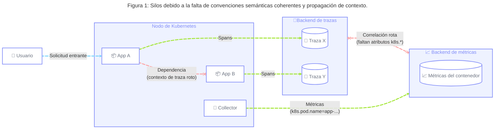
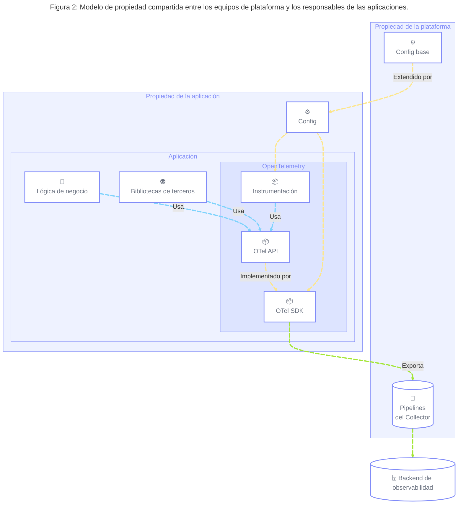
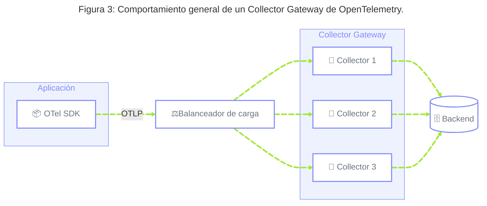
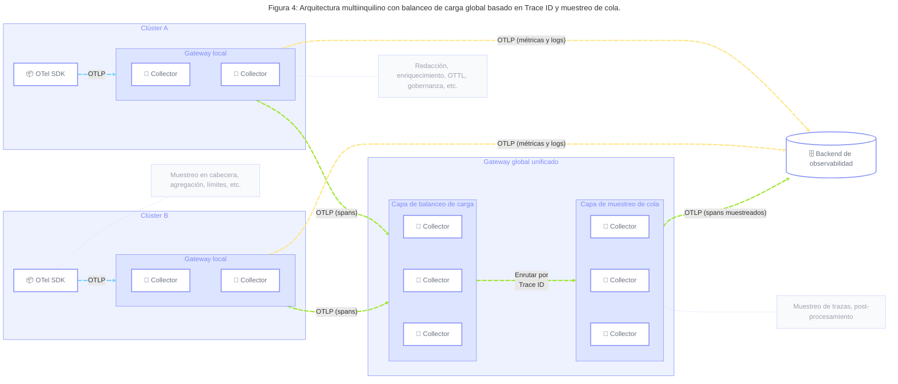

---
title:
  'Plataformas de telemetría gestionadas para cargas de trabajo en Kubernetes'
linkTitle: 'Plataformas de telemetría gestionadas para K8s'
default_lang_commit: 48d3ff356dc39a3b1323637f3163d435dc751228
cSpell:ignore: Autoscaler kube OTTL rollouts SDLC Skyscanner statefulset
---

## Resumen {#summary}

Este blueprint ofrece una guía estratégica para las organizaciones que buscan
adoptar prácticas de Platform Engineering para facilitar la adopción de las
herramientas y los estándares de OpenTelemetry en sus equipos de ingeniería.
Esto incluye el uso de SDKs, bibliotecas de instrumentación, patrones de
configuración y arquitecturas de Collector para ofrecer plataformas de
telemetría gestionadas de forma centralizada, combinadas con herramientas de
autoservicio diseñadas para consumirse "as-a-service".

Está dirigido a organizaciones que operan en entornos de nube y Kubernetes, que
desean ofrecer una plataforma de telemetría coherente, escalable y gobernada en
cargas de trabajo que son propiedad de equipos de producto altamente autónomos,
logrando los siguientes resultados:

- Configuración coherente de SDK e instrumentación, que mejora el tiempo de
  obtención de valor (time-to-value) al facilitar la adopción de estándares
  específicos de la organización en todas las cargas de trabajo, reduciendo la
  carga cognitiva de los equipos de producto.
- Convenciones semánticas cohesivas que permiten la correlación de telemetría
  entre señales, aplicaciones y dominios, desde el lado del cliente hasta la
  infraestructura, proporcionando telemetría de alta calidad que puede
  utilizarse en análisis manuales o automáticos.
- Eliminación de la proliferación descontrolada de configuraciones de Collector,
  reduciendo el esfuerzo operativo manual mediante la consolidación de las
  canalizaciones de telemetría.
- Canalizaciones de ingesta resilientes, escalables y fiables para todas las
  señales de telemetría, evitando puntos únicos de fallo.
- Gobernanza centralizada de la telemetría y optimización de datos para reducir
  los costos operativos y las emisiones de carbono, minimizando los requisitos
  de almacenamiento, transferencia de red y cómputo del procesamiento de
  telemetría.
- Canalizaciones de telemetría preparadas para el futuro que protegen a los
  equipos de producto de los cambios en el backend de observabilidad subyacente,
  permitiendo migraciones de datos o estrategias multiproveedor con cambios
  mínimos en la instrumentación de la aplicación o en la infraestructura de
  recopilación.

## Contexto {#background}

A medida que las organizaciones aumentan la velocidad de adopción de los
estándares cloud native y las prácticas modernas de entrega de software, suelen
adoptar modelos federados en los que los equipos, o unidades de negocio, operan
con alta autonomía y son responsables de todo el Ciclo de Vida de Desarrollo de
Software (SDLC) de sus sistemas, desde el diseño hasta la operación del software
en producción.

Este modelo de «tú lo construyes, tú lo operas» está diseñado para potenciar la
entrega de producto, pero puede crear de forma inadvertida prácticas
fragmentadas de gestión de servicios y panoramas de observabilidad desordenados
que no logran aprovechar los beneficios de OpenTelemetry y las herramientas
modernas de observabilidad. Los equipos de producto priorizan la entrega de
funcionalidades sobre los Requisitos No Funcionales (NFR), como la
instrumentación de telemetría, y ven estas tareas como una carga para sus
objetivos de entrega.

Para abordar esto, las organizaciones están adoptando ampliamente modelos de
Platform Engineering cloud native para reducir la carga cognitiva y abstraer la
complejidad. Al tratar la observabilidad como un [producto de plataforma][1]
interno y curado, las organizaciones pueden ofrecer un camino allanado, o golden
path, que garantiza una observabilidad contextual de alta calidad con una
fricción mínima, permitiendo a los equipos seguir centrados en instrumentar
conceptos específicos de su dominio que resulta imposible capturar en la
telemetría lista para usar.

## Retos comunes {#common-challenges}

Las organizaciones que operan en estos entornos federados y distribuidos suelen
enfrentarse a un conjunto particular de retos que dificultan una observabilidad
eficaz y la madurez cloud native.

### 1. Configuración inconsistente y baja adopción de estándares organizacionales {#challenge-1}

En entornos donde los equipos de producto operan con autonomía, pueden coexistir
distintas formas de configurar aplicaciones y servicios individuales para la
observabilidad, aun operando bajo una capa de cómputo compartida. Esto incluye
la configuración de los SDKs de OpenTelemetry para las aplicaciones, la
configuración de paquetes y bibliotecas de instrumentación, o la decisión de
cómo propagar el contexto de observabilidad desde y hacia sus dependencias.

Las organizaciones pueden contar con un conjunto de estándares de ingeniería
documentados que desean que todos los ingenieros sigan, pero a menudo dependen
de la implementación manual de estos estándares por parte de cada equipo
individual, incluyendo cambios de configuración y a nivel de código. Los equipos
suelen tratar esto como algo secundario, que no forma parte del proceso de
diseño del software, y centrado en una aplicación concreta sin considerar el
sistema distribuido en su conjunto de forma holística.



Esto conduce a:

- **[Convenciones Semánticas][2] inconsistentes:** la telemetría carece de
  atributos comunes de [recurso][3] (por ejemplo, `service.version`,
  `k8s.cluster.name`, `example.cost.center`), lo que rompe la correlación entre
  distintas señales, aplicaciones y capas del sistema, y limita la utilidad de
  los datos de observabilidad para el análisis automático.
- **Silos de contexto:** sin una [propagación de contexto][4] coherente (por
  ejemplo, W3C Trace Context) integrada en cada SDK, las trazas distribuidas se
  rompen en los límites entre servicios, lo que hace imposible vincular las
  regresiones de rendimiento del backend con el impacto en el negocio de cara al
  cliente.
- **Fragmentación de versiones de SDK:** versiones muy distintas de los SDKs de
  OpenTelemetry ejecutándose en producción, lo que genera problemas de
  mantenimiento y seguridad.
- **Alta carga cognitiva:** los desarrolladores deben configurar manualmente los
  SDKs y los paquetes de instrumentación para cada nuevo servicio, lo que
  aumenta el esfuerzo manual y el riesgo de una configuración incorrecta.
- **Menor velocidad:** cualquier cambio en los estándares de ingeniería
  relacionados con la instrumentación de telemetría, o cualquier cambio en el
  backend de observabilidad subyacente, como migraciones de datos o de
  protocolo, genera fricción y reduce la velocidad general de la organización,
  ya que la adopción de tecnología termina viéndose obstaculizada por la
  implementación manual.

### 2. Proliferación descontrolada de configuraciones de Collector entre clústeres {#challenge-2}

A medida que la adopción de OpenTelemetry crece en escala, y las organizaciones
despliegan en decenas o cientos de clústeres de Kubernetes, gestionar
manualmente las configuraciones individuales del OpenTelemetry Collector en
estos entornos genera una carga de mantenimiento. Esto resulta especialmente
difícil en organizaciones donde distintos equipos gestionan distintos
despliegues de Collector.

Esto conduce a:

- **Desviación de configuración:** distintos clústeres terminan con reglas de
  parseo, lógica de filtrado y configuraciones de endpoint diferentes, lo que
  provoca un comportamiento impredecible de la telemetría.
- **Falta de separación de responsabilidades:** no existe una distinción clara
  entre los distintos tipos de procesamiento de telemetría realizados en las
  diferentes capas de Collectors (por ejemplo, dónde transformar, dónde
  muestrear), lo que puede generar datos inconsistentes o incompletos.
- **Esfuerzo manual:** los equipos de plataforma dedican una cantidad excesiva
  de tiempo a tareas de configuración repetitivas y actualizaciones manuales, en
  lugar de construir soluciones escalables.
- **Despliegues poco fiables:** sin despliegues auditables y controlados por
  versiones, aplicar una corrección o una nueva configuración en toda la flota
  se vuelve muy arriesgado y propenso a errores.

### 3. Canalizaciones de datos no optimizadas para los requisitos de los datos de observabilidad {#challenge-3}

En algunos modelos de instrumentación heredados, las aplicaciones o los agentes
de instrumentación suelen exportar la telemetría directamente a los backends de
telemetría. Este modelo carece de una forma de procesar y transformar la
telemetría entre la aplicación y el backend, lo que reduce la soberanía de los
datos. También puede añadir complejidad adicional si el backend es un proveedor
externo, o cualquier endpoint que requiera tráfico público o autenticación.
Gestionar credenciales en miles de aplicaciones puede ser difícil, y los
problemas esporádicos de conectividad de red entre un único exportador y un
endpoint público pueden provocar interrupciones del servicio.

Por el contrario, en entornos donde las canalizaciones de datos están
centralizadas, los requisitos de los datos de telemetría a menudo se mezclan con
los de otros tipos de datos. Esto puede derivar en soluciones optimizadas para
la completitud (por ejemplo, el registro de auditoría o los informes de datos
financieros) en lugar de transformaciones sensibles al contexto y un
procesamiento de baja latencia. Esto aumenta el tiempo que transcurre entre la
emisión de los datos y la obtención de información accionable, necesaria para
mantener operaciones fiables.

Esto conduce a:

- **Puntos únicos de fallo:** la salida directa a internet desde cientos de
  aplicaciones individuales priva a la organización de la gobernanza de red
  centralizada y de exportaciones balanceadas.
- **Latencia y valor operativo:** en última instancia, los datos de
  observabilidad obsoletos son casi tan inútiles como no tener datos de
  observabilidad. Las canalizaciones de logs demasiado complejas pueden
  introducir un retraso significativo, dejando inútiles las alertas operativas
  en tiempo real durante un incidente importante.
- **Falta de control central:** los equipos de plataforma no pueden redirigir
  fácilmente los datos, cambiar de proveedor o aplicar políticas de red globales
  cuando las configuraciones están profundamente incrustadas en aplicaciones
  individuales.

> [!NOTE] Se busca ayuda
>
> El alcance de este blueprint está definido por los retos comunes que enfrentan
> los equipos de plataforma para ofrecer canalizaciones optimizadas para baja
> latencia y un uso eficiente de los recursos. En ciertos escenarios, como los
> que requieren registro de auditoría o informes de negocio, equilibrar la
> completitud o las garantías de durabilidad resulta fundamental. Estos retos
> quedan fuera del alcance de este blueprint y podrían abordarse en un blueprint
> independiente. Consulta nuestra [guía][5] si te interesa contribuir.

### 4. Falta de gobernanza de la telemetría y bajo ROI {#challenge-4}

Sin una gobernanza centralizada y una adopción medible de los estándares de
observabilidad, los equipos autónomos pueden generar grandes cantidades de datos
de bajo valor, reduciendo la relación señal-ruido. Las señales de OpenTelemetry
a menudo no se usan para su propósito previsto, lo que en última instancia
dificulta su mantenimiento para los equipos de plataforma (por ejemplo, tener
que garantizar consultas rápidas y precisas sobre días o semanas de logs
individuales simplemente para calcular el número de solicitudes de un
determinado servicio). A medida que el tráfico crece y aumenta el volumen de
telemetría, los equipos responsables de la observabilidad no cuentan con una
forma escalable de garantizar la calidad de los datos en todo su panorama.

Esto conduce a:

- **Problemas de calidad de datos no atribuidos:** al no aplicarse convenciones
  semánticas coherentes, los equipos de plataforma no pueden asociar el gasto en
  telemetría o la calidad de los datos con unidades de negocio o equipos de
  ingeniería específicos.
- **Tipos de datos ineficientes:** las organizaciones incurren en altos costos
  de almacenamiento e indexación para logs sin procesar u otras señales cuando
  no se usan para su propósito previsto, a la vez que reducen la calidad general
  de la información extraída de los datos de observabilidad.
- **Costos innecesarios:** el aumento de los costos asociados al almacenamiento
  de datos, la salida de red o la ingesta en un backend determinado, derivados
  de datos que no siempre mejoran la información necesaria para operar los
  sistemas de forma fiable.
- **Emisiones de carbono:** el procesamiento de datos de bajo valor puede
  perjudicar el cumplimiento de los objetivos de software verde, incluidas las
  emisiones de alcance 3 derivadas del carbono incorporado en los dispositivos
  necesarios para la recuperación rápida de datos de observabilidad, como los
  SSD.
- **Alta carga cognitiva:** los grandes volúmenes de datos no solo generan
  costos innecesarios, sino que también pueden aumentar el ruido, obligando a
  usuarios y agentes a filtrar datos de baja calidad para encontrar la
  telemetría relevante.

> [!NOTE] Se busca ayuda
>
> Los entornos multiinquilino (multi-tenant) suelen lidiar con requisitos de
> cumplimiento estrictos (GDPR, HIPAA, PCI) y aspectos de seguridad como la
> autenticación y el cifrado entre las capas de la canalización. Estos retos
> quedan fuera del alcance de este blueprint y podrían abordarse en un blueprint
> independiente. Consulta nuestra [guía][5] si te interesa contribuir.

### 5. Baja observabilidad y eficiencia operativa de los SDKs y las canalizaciones de datos {#challenge-5}

Uno de los retos de operar SDKs y Collectors de OpenTelemetry en producción es
identificar si, y cuándo, la configuración predeterminada aplicada a aspectos
como el encolado, los reintentos o la agrupación (batching) de los datos de
telemetría no es óptima para un entorno concreto. Los valores predeterminados
razonables de OpenTelemetry pueden no ser adecuados ni para implementar un
enfoque más eficiente en el uso de recursos, ni para lograr mayores garantías de
fiabilidad. Esto puede depender de los patrones arquitectónicos en uso; por
ejemplo, exportar a un endpoint de clúster local puede requerir menos
almacenamiento en búfer que un endpoint público de internet.

Esto conduce a:

- **Pérdidas silenciosas de datos y fallos de exportación:** las exportaciones
  de datos sufren fallos al exportar a los backends o a los Collectors, lo que
  finalmente descarta datos, sin que esos errores se observen o generen alertas.
- **Uso innecesario de recursos:** los operadores sobreaprovisionan recursos en
  los SDKs y los Collectors, aumentando el uso de recursos y afectando
  potencialmente la sobrecarga de rendimiento y el costo.

## Directrices generales {#general-guidelines}

### 1. Centralizar la configuración predeterminada y extensible para SDKs y paquetes de instrumentación {#guideline-1}

**Retos abordados:** [1](#challenge-1), [4](#challenge-4) | **Acciones de
implementación:** [1](#action-1), [2](#action-2)

Recomendamos que los equipos responsables de las herramientas de observabilidad
mantengan un conjunto de recursos (ver [Acción 1](#action-1)) para proporcionar
una configuración básica y lista para usar para los [SDKs][6] y las [bibliotecas
de instrumentación][7]. El objetivo es que las aplicaciones desplegadas en un
clúster de Kubernetes emitan un nivel básico de telemetría y propaguen el
contexto desde y hacia sus dependencias, con una intervención mínima por parte
de los responsables de las aplicaciones, por ejemplo, como máximo añadiendo una
anotación o llamando a una biblioteca interna compartida.

Los equipos de plataforma deben garantizar que esta configuración base siga
siendo extensible, permitiendo a los responsables de las aplicaciones controlar
distintos aspectos del SDK (por ejemplo, el tamaño de los búferes, los
reintentos del exportador) y de las bibliotecas de instrumentación, para
satisfacer los requisitos específicos de sus aplicaciones.

Al implementar esta directriz, las organizaciones pueden esperar lograr:

- **Estándares organizacionales cohesivos:** los estándares específicos de la
  organización (por ejemplo, atributos de recurso, endpoint del exportador,
  etc.) se aplican automáticamente en toda la pila.
- **Propagación de contexto coherente:** el Trace Context se propaga entre
  servicios usando configuraciones de propagador compatibles.
- **Menor carga cognitiva:** los responsables de las aplicaciones pueden
  abstraerse de la configuración de bajo nivel, como la relacionada con la
  configuración del SDK de OpenTelemetry.
- **Mantenimiento más sencillo:** se minimiza el esfuerzo necesario para adoptar
  estándares de ingeniería y buenas prácticas en observabilidad, ya que los
  nuevos estándares pueden implementarse mediante actualizaciones de versión de
  las herramientas internas.

### 2. Establecer una propiedad compartida para la producción de telemetría {#guideline-2}

**Retos abordados:** [4](#challenge-4), [5](#challenge-5) | **Acciones de
implementación:** [1](#action-1), [2](#action-2), [5](#action-5)

Para equilibrar la gobernanza y la autonomía, los equipos de plataforma que
operan en los entornos descritos en este blueprint deben aplicar el "shift left"
en la instrumentación, garantizando que los responsables de las aplicaciones
tengan control total y propiedad sobre la telemetría emitida por sus
aplicaciones. Las configuraciones predeterminadas mencionadas en la
[Directriz 1](#guideline-1) deben garantizar la procedencia de los datos,
incluyendo atributos técnicos (por ejemplo, clúster, deployment, pod) e
información organizacional (por ejemplo, equipo, dominio de negocio), con el
objetivo de que sea trivial identificar el origen de la telemetría y el equipo
propietario.

Los [principios de diseño de clientes][8] de OpenTelemetry establecen una
separación clara entre la API, que por defecto es una implementación no-op, y el
SDK, que proporciona una implementación de esa API cuando se registra. Esto
ofrece una separación clara de responsabilidades y permite a los responsables de
las aplicaciones apoyarse únicamente en la API de OpenTelemetry, centrando sus
esfuerzos en enriquecer la telemetría con contexto específico del dominio (por
ejemplo, transacciones de negocio, IDs de usuario) que resulta imposible
capturar de forma genérica, mientras confían en la configuración predeterminada
proporcionada para producir telemetría lista para usar.



Este modelo se apoya en el diseño de la API de OpenTelemetry para abstraer los
detalles de implementación. Recomendamos considerar el uso directo de las
distintas APIs de señal y evitar construir abstracciones adicionales sobre
ellas, a menos que aporten más valor que simplemente ocultar los detalles de
implementación. Cuando sea necesario, se pueden utilizar características del SDK
(por ejemplo, [Metric Views][9] o [Span Processors][10]) para transformar la
telemetría a nivel de aplicación (ver [Directriz 4](#guideline-4)).

> [!NOTE] Se busca ayuda
>
> [Weaver][11] puede ayudar a los equipos a gestionar registros de convenciones
> semánticas específicos de la organización, y a medir y validar su
> cumplimiento, garantizando la calidad de la instrumentación por diseño. Obtén
> más información sobre Weaver en [este artículo del blog][12]. La gobernanza de
> las convenciones semánticas queda fuera del alcance de este blueprint y podría
> abordarse en un blueprint futuro. Consulta nuestra [guía][5] si te interesa
> contribuir.

En definitiva, los responsables de las aplicaciones deben seguir siendo
propietarios de los datos de telemetría emitidos por sus aplicaciones (tanto las
instrumentadas manualmente como las instrumentadas automáticamente), y
responsables de su calidad y resiliencia. Esto incluye monitorizar y alertar
sobre la [telemetría del SDK][13], configurada automáticamente por el equipo de
plataforma en los lenguajes que lo permiten, y optimizar su configuración según
las necesidades específicas de cada aplicación. Esto implica ajustar componentes
del SDK como el `BatchSpanProcessor` o el `PeriodicMetricReader` para cambiar el
tamaño de los búferes, las colas de reintento, los límites de cardinalidad o los
tiempos de espera, según lo requieran sus volúmenes de telemetría.

Al implementar esta directriz, las organizaciones pueden esperar lograr:

- **Correlación con los resultados de negocio:** la telemetría emitida por las
  aplicaciones contiene el contexto de dominio y lógica de negocio necesario
  para correlacionar la experiencia del usuario con los componentes técnicos y
  la infraestructura.
- **Propiedad y responsabilidades claras:** se garantiza la procedencia de los
  datos, lo que permite a los equipos medir la calidad de la telemetría y
  asegurar que los estándares se adopten a escala.
- **Mejor uso de las señales de telemetría:** a medida que los responsables de
  las aplicaciones se familiarizan más con las señales de OpenTelemetry, guiados
  por los estándares de la organización, mejora el uso óptimo de las APIs de
  OpenTelemetry.
- **Producción de telemetría fiable:** monitorizar las métricas internas del SDK
  proporciona a los responsables de las aplicaciones o de la plataforma la
  información necesaria para optimizar aspectos como el encolado, los reintentos
  o la agrupación (batching) de los datos de telemetría.

### 3. Mantener un conjunto de Collector Gateways gestionados de forma centralizada {#guideline-3}

**Retos abordados:** [2](#challenge-2), [3](#challenge-3), [4](#challenge-4) |
**Acciones de implementación:** [1](#action-1), [3](#action-3), [5](#action-5)

Recomendamos que la telemetría en este tipo de entorno de Kubernetes se ingiera
automáticamente en una capa centralizada, desplegada como un [Collector
Gateway][14] de OpenTelemetry. La configuración base proporcionada como parte de
la [Directriz 1](#guideline-1) debe garantizar que la telemetría se exporte a
esta capa mediante OTLP.



En entornos multiinquilino, puede ser necesario encadenar varios Collector
Gateways para adaptarse a distintos escenarios. Por ejemplo, configuraciones
multiclúster con Gateways locales por clúster y un Gateway global para el
muestreo de cola (tail sampling) (ver [Directriz 4](#guideline-4)), o Gateways
delimitados por namespace y gestionados por equipos independientes, que
alimentan a un Gateway de todo el clúster en entornos muy federados.

Idealmente, la configuración base del SDK debe seleccionar automáticamente el
endpoint de Collector más óptimo y las credenciales necesarias según la
información disponible en el entorno de la aplicación (por ejemplo, el
enrutamiento de tráfico basado en la localidad, cambiando condicionalmente la
dirección del servidor según el nombre del entorno, etc.).

Por último, dependiendo de condiciones específicas de la organización, las
distintas señales de OpenTelemetry pueden recibir distintos requisitos no
funcionales. Por ejemplo, debido a sus volúmenes de telemetría estables y su uso
en alertas críticas, las métricas pueden tener requisitos de fiabilidad más
altos que los spans, favoreciendo el descarte de datos en estos últimos antes de
afectar a las primeras. Para adaptarse a estas condiciones, los equipos de
plataforma pueden considerar distintas opciones, entre ellas:

- **Gateways aislados por señal:** desplegar Gateways separados para logs,
  métricas y spans. Los despliegues aislados simplifican la asignación de
  recursos de cómputo y la planificación de capacidad por señal, pero la
  configuración de procesadores compartida debe duplicarse entre los Gateways.
  Esto puede gestionarse mediante herramientas externas de plantillado, como
  Kapitan o Kustomize, o usando múltiples [ubicaciones][61] de configuración que
  se sobrescriban entre sí. Sin embargo, puede aumentar el esfuerzo de
  mantenimiento.
- **Varios memory limiters en un único Gateway:** definir configuraciones de
  [memory_limiter][15] separadas por señal, con distintos umbrales. Esto depende
  de que el receptor OTLP situado delante de un `memory_limiter` devuelva un
  código de error reintentable a los clientes OTLP (por ejemplo, SDKs u otros
  Collectors) cuando se rechaza la telemetría, aplicando contrapresión
  (backpressure) según sea necesario. Las canalizaciones con menor prioridad
  pueden configurarse entonces con umbrales de memory limiter más bajos para
  aplicar la contrapresión antes, dejando margen de memoria para las
  canalizaciones de mayor prioridad.

Los ingenieros de plataforma deben aprovechar la [telemetría interna del
Collector][16] para garantizar la fiabilidad de los datos ingeridos, procesados
y exportados por sus canalizaciones, y optimizar su configuración en
consecuencia. Esto incluye configurar componentes como el `memory_limiter`, u
opciones de OTLP como `sending_queue` o `retry_on_failure`. Estas métricas deben
usarse para evitar el autoescalado predeterminado basado en CPU de los Collector
Gateways, escalando las flotas según la profundidad de la cola de la
canalización o el consumo de memoria, para manejar picos repentinos de
telemetría.

Al implementar esta directriz, las organizaciones pueden esperar lograr:

- **Canalizaciones optimizadas para los requisitos de los datos de
  observabilidad:** al combinar configuraciones de exportador y receptor OTLP
  con canalizaciones de Collector fiables y balanceadas, los equipos pueden
  cumplir sus requisitos de fiabilidad por señal.
- **Uso eficiente de los recursos de cómputo:** los Gateways centralizados y
  escalados horizontalmente utilizan los recursos de cómputo de forma más
  eficiente que los DaemonSets por nodo o los Sidecars por pod en entornos
  heterogéneos y multiinquilino. Los DaemonSets normalmente deben
  sobreaprovisionarse para manejar tamaños de nodo variables (es decir, un solo
  nodo puede servir a 4 o 40 pods de aplicación) y un volumen de telemetría por
  pod variable que fluctúa con el tiempo. Mantener una huella pequeña por nodo
  es importante, ya que los equipos a menudo tienen dificultades para programar
  cargas de trabajo en nodos más pequeños. Un nivel de Gateway central escala de
  forma independiente, dimensionado según el volumen total de telemetría.
- **Configuración de Collector consolidada:** como se describe en la
  [Acción 3](#action-3), este modelo permite un despliegue consolidado de la
  configuración del Collector en múltiples capas, minimizando el esfuerzo de
  mantenimiento y reduciendo el riesgo de fallos por cambios.

### 4. Agregar, procesar y muestrear la telemetría de forma eficiente en distintas capas {#guideline-4}

**Retos abordados:** [3](#challenge-3), [4](#challenge-4) | **Acciones de
implementación:** [2](#action-2), [4](#action-4)

A nivel de aplicación, el diseño de clientes de OpenTelemetry desacopla las APIs
de instrumentación de sus implementaciones en el SDK. Esto permite a los autores
de la instrumentación (incluidos los responsables de aplicaciones o bibliotecas)
usar la API para [registrar mediciones][17], [crear spans][18] o [emitir
registros de log][19], sin tener que definir cómo se agregarán en memoria,
procesarán y finalmente exportarán. Esta decisión puede posponerse hasta el
momento en que se crean los proveedores de [meter][20], [tracer][21] y
[logger][22] como parte de la configuración del SDK. La configuración de estos
aspectos debe ser compartida, con los equipos de plataforma proporcionando una
capa básica de configuración, y los responsables de las aplicaciones extendiendo
esa configuración para sus casos de uso particulares.

A nivel de sistema distribuido, se pueden usar distintas técnicas de [muestreo
de trazas][23] para almacenar de forma eficiente y coherente las trazas más
valiosas. Consulta el [Apéndice 1](#appendix-1) para una introducción a estas
técnicas.

Cuando se implementa el muestreo de trazas, el uso coherente de las convenciones
semánticas se vuelve fundamental. Las métricas ofrecen vistas completas (aunque
agregadas) de la telemetría, usando [Exemplars][27] para correlacionarse con
spans de traza de alta granularidad para una operación determinada, que a su vez
pueden enlazarse con logs y otras señales de telemetría (por ejemplo, perfiles).
El uso de convenciones semánticas estándar y atributos de _recurso_ coherentes
también potencia la correlación entre estas señales, permitiendo a los
operadores «acercarse» desde flujos de métricas agregadas a largo plazo hasta
trazas contextuales de alta granularidad.

El siguiente diagrama ofrece un resumen de las distintas capas en las que se
puede configurar la agregación, el procesamiento y el muestreo en un escenario
multiclúster con muestreo de cola.



Por lo general, el procesamiento de la telemetría debe realizarse lo más cerca
posible de la capa de aplicación, evitando costos de cómputo y transferencia.
Sin embargo, posponer las decisiones de procesamiento a distintas capas del
Collector puede ser deseable en ciertas situaciones, como facilitar el
mantenimiento, aplicar estándares, realizar filtrados o transformaciones
avanzadas con [OTTL][28], o asegurar las canalizaciones con reglas de
[redacción][31] para garantizar que la información sensible nunca llegue a un
backend determinado.

Al combinar el muestreo inteligente, la agregación de métricas en distintas
capas y procesadores centrales de transformación/filtrado para reducir la
telemetría ruidosa, esta arquitectura puede reducir los costos de transferencia
y cómputo, preservando a la vez la visibilidad operativa para los equipos de
ingeniería.

Al implementar esta directriz, las organizaciones pueden esperar lograr:

- **Volúmenes de telemetría eficientes:** el uso óptimo de las señales de
  OpenTelemetry, el muestreo y la agregación proporcionan volúmenes de
  telemetría que permiten a las organizaciones equilibrar entre la alta
  granularidad, el costo y los requisitos de observabilidad.
- **Uso eficiente de los recursos de cómputo:** ubicar el procesamiento de datos
  en distintos niveles limita la transferencia de datos y los recursos de
  cómputo asociados a datos que pueden agregarse o filtrarse en etapas
  tempranas.
- **Gobernanza central y guardrails:** los equipos de plataforma cuentan con un
  punto central para controlar la emisión de datos, lo que les permite filtrar,
  transformar, redactar o bloquear por completo la telemetría que no siga los
  estándares de la organización o no respete los límites de volumen de datos,
  protegiendo a la organización de enviar datos no deseados a los backends.

## Implementación {#implementation}

### 1. Usar el OpenTelemetry Operator, o paquetes internos compartidos, para la configuración a nivel de aplicación {#action-1}

**Directrices implementadas:** [1](#guideline-1)

Si el entorno en cuestión se encuentra dentro de las [versiones de
Kubernetes][32] y los [lenguajes instrumentados][33] soportados, recomendamos
priorizar el uso del [OpenTelemetry Operator para Kubernetes][34] para la
[auto-instrumentación][35]. Esto implica:

- Instalar el OpenTelemetry Operator.
- Crear los CRs de `Instrumentation` correspondientes para configurar los SDKs y
  la instrumentación.
- Añadir anotaciones a pods individuales o a namespaces (para instrumentar todos
  los pods de un namespace).

Si desplegar el OpenTelemetry Operator no es posible o compatible, recomendamos
proporcionar a los responsables de las aplicaciones recursos en tiempo de build
para configurar fácilmente el SDK de OpenTelemetry y las bibliotecas de
instrumentación. Esto puede implementarse siguiendo dos modelos principales:

- Para los lenguajes soportados por la [instrumentación sin código][36],
  recomendamos proporcionar imágenes de contenedor base para descargar
  agentes/bibliotecas de instrumentación, ofrecer una configuración
  predeterminada y configurar el `CMD` base en la imagen de contenedor
  resultante para utilizar estos ajustes.
- Para los lenguajes no soportados por la instrumentación sin código,
  recomendamos proporcionar [bibliotecas específicas de lenguaje][37]
  compartidas que se encarguen de configurar el SDK de OpenTelemetry y las
  bibliotecas de instrumentación de forma programática, ofreciendo hooks para
  que los usuarios de dichas bibliotecas extiendan esta configuración según sea
  necesario.

Este modelo sin Operator pone a los responsables de las aplicaciones a cargo de
usar estas imágenes de contenedor base o bibliotecas compartidas en su código.
Aunque inicialmente puede requerir más esfuerzo que la instrumentación adjuntada
automáticamente, proporciona un mecanismo para que los equipos de plataforma
gestionen actualizaciones escalonadas o cambios de configuración mediante
incrementos de versión menores de sus bibliotecas internas, sin requerir más
cambios de código por parte de los responsables de las aplicaciones.

Al gestionar la configuración centralizada en imágenes de contenedor base o
bibliotecas internas, y cuando el lenguaje lo permita, recomendamos estandarizar
el uso de la [configuración declarativa][38]. Aunque actualmente no está
totalmente soportada por todos los lenguajes, este modelo de configuración
basado en YAML aporta coherencia a la configuración del SDK y de la
instrumentación.

### 2. Incluir los estándares de la organización en la configuración predeterminada y extensible a nivel de aplicación {#action-2}

**Directrices implementadas:** [1](#guideline-1), [2](#guideline-2),
[4](#guideline-4)

Independientemente de cómo se entregue la configuración como parte de la
[Acción 1](#action-1), recomendamos que el equipo de plataforma incluya la
siguiente configuración base mínima como parte de su oferta:

- **Exportadores:** OTLP HTTP/protobuf (predeterminado) u OTLP gRPC configurado
  para exportar al Collector más óptimo (por ejemplo, un Gateway local en el
  mismo clúster). Consulta el [Apéndice 2](#appendix-2) y la
  [Acción 3](#action-3) para más detalles sobre los efectos secundarios de usar
  OTLP gRPC con Services estándar de Kubernetes.
  - **Nota:** los endpoints de backend/SaaS o las claves de API no deben
    incluirse en la configuración a nivel de aplicación, ya que recomendamos
    gestionarlos en un Collector Gateway.
- **Propagadores:** W3C Trace Context (`tracecontext`) para garantizar que las
  trazas distribuidas no se rompan en los límites entre servicios. Si es
  necesario, incluye formatos heredados como opciones secundarias (la API de
  Propagators priorizará en el orden en que se configuren).
- **Detectores de recurso:** auto-detectores para la infraestructura subyacente
  (por ejemplo, proveedor de nube, Kubernetes, SO, contenedor) para lograr
  coherencia sin intervención manual.
- **Bibliotecas de instrumentación**: asegúrate de que un conjunto mínimo de
  bibliotecas de instrumentación esté configurado de forma predeterminada. Si se
  usa la auto-instrumentación, los equipos de plataforma no deben habilitar
  todas las bibliotecas de instrumentación por defecto, sino seleccionar
  cuidadosamente las más críticas para su entorno, priorizando la
  instrumentación de cliente y servidor (por ejemplo, gRPC, HTTP, mensajería,
  base de datos).
- **Procesadores, readers y views**: ajustes específicos del backend en uso (por
  ejemplo, temporalidad de agregación, intervalos de exportación, límites de
  atributos) o estándares de toda la organización (por ejemplo, atributos de
  span/métrica).
  - **Nota:** dependiendo de la implementación de cada lenguaje, los
    exportadores OTLP pueden reintentar al recibir errores reintentables como
    HTTP `429`, `503`, o gRPC `UNAVAILABLE` con `RetryInfo` opcional. Sin
    embargo, estos exportadores no tienen las mismas capacidades que los
    Collectors en términos de colas de envío, y descartarán lotes de datos si no
    tienen éxito. Los equipos de plataforma deben gestionar valores
    predeterminados razonables para el tamaño de estos búferes y priorizar la
    exportación a Collectors locales (por ejemplo, un Gateway local al clúster)
    para sacar la telemetría del proceso de la aplicación de la forma más rápida
    y fiable posible. Los responsables de las aplicaciones deben monitorizar la
    [telemetría del SDK][13], cuando esté disponible, y reaccionar en
    consecuencia.

- **Atributos de recurso específicos de la organización:** convenciones estándar
  críticas para el enrutamiento, la facturación y la propiedad. Como mínimo,
  recomendamos:
  - `service.name`, idealmente extraído de variables de entorno existentes o de
    labels inyectados mediante herramientas de CI/CD.
  - `service.version` para identificar el origen de la telemetría durante
    despliegues blue/green o rollouts progresivos.
  - `service.namespace` o `service.owner` para la propiedad del recurso.
  - `deployment.environment.name` (por ejemplo, `production`, `staging`).
  - Otros atributos inyectados como variables de entorno mediante la [Downward
    API][39] de Kubernetes (es decir, `valueFrom.fieldRef.fieldPath`),
    estandarizados en todas las plantillas de despliegue de aplicaciones.

Los equipos de plataforma deben proporcionar formas para que los responsables de
las aplicaciones sobrescriban y extiendan esta configuración predeterminada. El
mecanismo para hacerlo dependerá de los métodos establecidos en la
[Acción 1](#action-1) para proporcionar la configuración de OTel. Las posibles
opciones se documentan en el [Apéndice 3](#appendix-3)

### 3. Usar el OpenTelemetry Operator o Helm Charts para desplegar Collector Gateways {#action-3}

**Directrices implementadas:** [3](#guideline-3)

Para desplegar niveles de Gateway centralizados, los equipos de plataforma deben
estandarizar en el [OpenTelemetry Operator][34] o en los [OpenTelemetry Helm
Charts][44] oficiales. Ambos soportan flujos de trabajo GitOps, pero requieren
consideraciones arquitectónicas específicas para cargas de trabajo
empresariales:

- **OpenTelemetry Operator:** ideal si el Operator ya se usa para la
  auto-instrumentación de aplicaciones ([Acción 1](#action-1)). El Gateway puede
  desplegarse creando un CR de `OpenTelemetryCollector` y estableciendo
  `mode: deployment` o `mode: statefulset` (según los requisitos). El Operator
  abstrae gran parte del boilerplate de Kubernetes. Consulta la
  [documentación][45] del Operator para más orientación sobre cómo habilitar el
  autoescalado.
- **Helm Charts oficiales**: una mejor opción si los equipos de infraestructura
  prefieren un control granular sobre los manifiestos nativos de Kubernetes (por
  ejemplo, configuraciones específicas de `Ingress`, `PodDisruptionBudgets`, o
  reglas de afinidad complejas) sin depender de CRDs.

Independientemente de la herramienta de despliegue elegida, el nivel de Gateway
es un punto crítico, y sus responsables deben garantizar que la resiliencia se
configure desde el inicio:

- **Configurar [memory_limiter][15]**: al configurarse como el primer procesador
  en cada canalización del Collector, esto previene fallos por falta de memoria
  (OOM) durante picos masivos de telemetría, obligando al Collector a descartar
  datos y/o aplicar contrapresión cuando el uso de memoria alcanza un umbral
  configurado. Como se menciona en la [Directriz 3](#guideline-3), pueden ser
  necesarios distintos procesadores `memory_limiter` por señal.
- **Configurar el exportador [otlp][46] o [otlp_http][47]:** asegúrate de que
  las colas y los reintentos estén alineados con las expectativas de fiabilidad
  frente al consumo de recursos, manejando fallos transitorios del backend antes
  de descartar datos. En particular, considera opciones de `sending_queue` como
  `batch`, que permite una transferencia de red eficiente y la propagación de
  contrapresión, y `block_on_overflow`, que controla si el Collector debe
  descartar datos o esperar hasta que haya espacio disponible cuando la cola
  (persistente o en memoria) esté llena.
- **Considerar la extensión [file_storage][48]**: si el descarte de datos
  durante interrupciones prolongadas del servicio del backend de observabilidad
  es crítico para el funcionamiento del negocio, considera configurar
  `sending_queue.storage` en tu exportador OTLP con la extensión
  [file_storage][48]. Con esta extensión configurada, si el backend no está
  disponible o limita la tasa de exportaciones, el Collector almacenará los
  datos en disco de forma temporal y reintentará automáticamente, evitando la
  pérdida de datos. Consulta el [Apéndice 4](#appendix-4) para conocer notas
  sobre el despliegue de la extensión `file_storage`.
- **Balanceo de carga de gRPC**: OTLP/gRPC puede ser muy eficiente, pero el
  enrutamiento estándar de Services de Kubernetes puede hacerlo ineficiente.
  Consulta el [Apéndice 2](#appendix-2) para implementar el balanceo de carga de
  gRPC, o considera OTLP/HTTP (el predeterminado para la mayoría de los SDKs).
- **Escalar según la memoria y la telemetría interna:** utiliza el Horizontal
  Pod Autoscaler (HPA) de Kubernetes combinado con métricas personalizadas (ver
  [Acción 5](#action-5)). Configura el clúster para escalar las réplicas del
  Gateway según el uso de memoria, las conexiones activas o la profundidad de la
  cola de la canalización.
- **Configuración como código**: almacena los values de Helm o los CRs del
  Operator en un repositorio Git central y usa herramientas como ArgoCD o Flux
  para desplegarlos. Esto proporciona un registro de auditoría y permite
  despliegues escalonados y reversiones instantáneas.

### 4. Configurar los procesadores del Collector para volúmenes de telemetría eficientes {#action-4}

**Directrices implementadas:** [4](#guideline-4)

Para enriquecer la telemetría con contexto de infraestructura, reducir los
costos de transferencia e ingesta de datos de telemetría de bajo valor, y
aplicar el cumplimiento normativo antes de que los datos salgan de la red
corporativa, el equipo de plataforma debe considerar configurar las
canalizaciones en los Collector Gateways para ejecutar los siguientes pasos de
procesamiento (en orden):

- **Procesador [k8s_attributes][49]:** aunque algunos detalles de recursos de
  Kubernetes (como el ID del pod o el nombre del namespace) pueden añadirse a
  nivel de aplicación (ver [Acción 2](#action-2)), el equipo de plataforma debe
  garantizar un cumplimiento del 100 % para las cargas de trabajo no
  gestionadas. Esto incluye campos no disponibles a través de la Downward API.
  Configura este procesador para extraer y añadir atributos como
  `k8s.deployment.name`, `k8s.statefulset.name`, etc., según la IP del pod de la
  conexión entrante. Consulta el [Apéndice 5](#appendix-5) para conocer detalles
  a tener en cuenta al usar el procesador `k8s_attributes`.
- **Procesadores para filtrar y transformar datos:** como medida de respaldo
  para aplicaciones que no pudieron aplicar estos ajustes a nivel de SDK antes
  de enviarlos al Collector, usa procesadores como [attributes][50],
  [filter][51], [redaction][31], [resource][52], o [transform][53] para definir
  reglas que:
  - Descarten trazas de un solo span y logs de acceso para endpoints rutinarios
    (`/health`, `/metrics`, `/ready`) o logs de depuración no accionables
    (`level=DEBUG` o `level=TRACE`).
  - Eliminen atributos ruidosos específicos (por ejemplo,
    `process.command_line`) que pueden ser menos útiles en entornos de
    Kubernetes donde estos atributos están presentes en las canalizaciones de
    CI/CD.
  - Cualquier otro procesamiento para eliminar telemetría ruidosa y de bajo
    valor.
- **Procesador [tail_sampling][25]:** define políticas de retención estrictas,
  por ejemplo, conservando el 100 % de las trazas que contienen errores o
  superan un umbral de latencia, y una pequeña base (por ejemplo, el 5 %) de
  solicitudes exitosas y de duración normal. Como se documenta en la
  [Directriz 4](#guideline-4), esto requiere dos capas de collectors, usando el
  exportador [load_balancing][26] en la primera capa para enrutar las trazas a
  la segunda capa según el Trace ID. Consulta más información sobre la
  exportación con balanceo de carga en nuestra [documentación][26].

Esta no es una lista exhaustiva, y los Collectors de OpenTelemetry cuentan con
muchos [procesadores][54] y [connectors][55] que permiten a las organizaciones
extraer más valor de sus datos de telemetría.

### 5. Monitorizar SDKs y Collectors para garantizar los requisitos de fiabilidad {#action-5}

**Directrices implementadas:** [2](#guideline-2), [3](#guideline-3)

Los SDKs y Collectors de OpenTelemetry exportan telemetría estándar que describe
el estado interno de sus componentes en funcionamiento. Los responsables de las
aplicaciones y los equipos de plataforma deben garantizar que esta telemetría se
produzca de forma fiable, se monitorice y se actúe sobre ella según sea
necesario.

Para identificar y monitorizar la pérdida de datos que ocurre incluso antes de
que la telemetría salga del proceso de la aplicación (por ejemplo, si la cola
interna del SDK se llena), recomendamos:

- Cuando el ecosistema del lenguaje lo soporte (por ejemplo, Java mediante la
  biblioteca de instrumentación `opentelemetry-sdk`, o Go mediante el paquete
  `sdk/metric`), habilita las métricas propias del SDK (self-metrics) para
  exponer las capacidades internas de la cola, los spans descartados y la
  latencia del exportador. Las [convenciones semánticas del SDK de
  OpenTelemetry][56] definen la telemetría que deben producir los SDKs, pero el
  soporte varía según el lenguaje.
- Los lenguajes que carecen de soporte nativo de métricas del SDK para la
  telemetría interna pueden seguir soportando diagnósticos internos de otras
  formas (por ejemplo, `EventSource` de .NET, `java.util.logging` de Java, o
  `diag` de Node.js). Los usuarios deben consultar las implementaciones
  específicas para configurarlas según sus necesidades particulares y nivel de
  detalle.

Para monitorizar la salud de los niveles de agregación y procesamiento, el
equipo de plataforma debe capturar activamente la [telemetría interna del
Collector][16] y generar alertas sobre ella. Recomendamos seguir estos pasos:

- **Exportar la telemetría interna mediante OTLP:** configura el bloque
  `service.telemetry` para emitir métricas internas mediante OTLP al backend de
  observabilidad, siguiendo los estándares de toda la empresa. Además de para la
  monitorización, estas métricas también deben usarse como fuente de datos para
  las decisiones de autoescalado (ver [Acción 3](#action-3)). Ten en cuenta que
  esta configuración de OTLP es independiente del exportador OTLP configurado en
  las canalizaciones del Collector.
- **Monitorizar y solucionar problemas:** sigue las recomendaciones presentes en
  las secciones de [monitorización][16] y [solución de problemas][57] de la
  documentación del Collector, y crea las alertas de alta prioridad necesarias
  para detectar el agotamiento de recursos y los fallos de recepción/exportación
  antes de que los datos se descarten en réplicas individuales.

## Implementaciones de referencia {#reference-implementations}

- [Adobe: un pipeline de OpenTelemetry diseñado para la simplicidad a
  escala][58]
- [Mastodon: ejecución de Collectors de OpenTelemetry en producción con un
  equipo pequeño][59]
- [Skyscanner: gestión de Collectors de OpenTelemetry en 24 clústeres de
  producción][60]

## Apéndice {#appendix}

### 1. Técnicas de muestreo de trazas distribuidas {#appendix-1}

A un nivel muy general, el muestreo puede configurarse principalmente en dos
capas distintas:

- **SDK:** el muestreo en cabecera (head sampling) configurado a nivel de SDK
  proporciona un uso eficiente de los recursos de cómputo, ya que las trazas no
  muestreadas nunca se registran ni se exportan desde una aplicación
  determinada. Sin embargo, las decisiones de muestreo deben tomarse en el
  momento de crear el span, lo que normalmente resulta en un muestreo
  probabilístico que podría pasar por alto trazas críticas (por ejemplo, las que
  contienen errores).
- **Collector**: los Collectors habilitan dos técnicas de muestreo principales:
  - _Muestreo [probabilístico][24]:_ se puede configurar en cualquier capa del
    Collector y no requiere coordinación entre Collectors, siempre que se use el
    mismo algoritmo y semilla para una misma traza.
  - _Muestreo de [cola][25] (tail sampling):_ una única réplica del Collector
    debe almacenar en memoria todos los spans de una traza determinada antes de
    tomar una decisión. Dado que el despliegue de una sola réplica no se
    recomienda en entornos de producción, este modelo normalmente requiere una
    capa de Collectors para [balancear la carga][26] de los spans según el Trace
    ID, y otra capa para realizar el muestreo.

El muestreo de cola requiere más recursos para operar y mantener. Sin embargo,
ofrece una forma más rica de definir políticas de muestreo que permiten a las
organizaciones almacenar de forma eficiente solo las trazas críticas para la
operación de sus servicios. Por ejemplo, trazas con duraciones superiores a un
umbral determinado, o aquellas que contienen errores en cualquier span de una
traza dada.

> [!NOTE] Se busca ayuda
>
> El muestreo de trazas distribuidas es un tema complejo en sí mismo, que
> implica diseñar una arquitectura de muestreo en todas las capas. Estos retos
> quedan fuera del alcance de este blueprint y podrían abordarse en un blueprint
> independiente. Consulta nuestra [guía][5] si te interesa contribuir.

### 2. Balanceo de carga de gRPC {#appendix-2}

gRPC se apoya en HTTP/2, multiplexando muchas solicitudes sobre una única
conexión TCP de larga duración. Los Services estándar de Kubernetes operan en la
Capa 4 (TCP) usando `kube-proxy`, por lo que balancean _conexiones_, no
_solicitudes_ individuales. Cuando un SDK, un Collector local o una aplicación
se conecta a un Gateway a través de un Service estándar de Kubernetes, establece
una conexión TCP y la mantiene abierta indefinidamente. Como resultado, el 100 %
de la telemetría de ese agente fluirá hacia un único pod del Gateway.

En entornos de alto rendimiento, esto crea puntos calientes (hot spots) en
réplicas específicas del Gateway, ya que los pods recién escalados no reciben
tráfico, lo que socava el autoescalado horizontal de pods y arriesga el
agotamiento de recursos en los pods de larga duración.

Para distribuir la telemetría de forma equitativa, los equipos de plataforma
deben considerar uno de los siguientes tres patrones:

#### Balanceo de carga en el lado del cliente {#client-side-load-balancing}

Los exportadores OTLP gRPC pueden realizar el balanceo de carga en el lado del
cliente, consultando el DNS de Kubernetes para descubrir las IPs de todos los
pods de Gateway disponibles y distribuyendo las solicitudes entre ellos en modo
round-robin.

Para lograr esto, el nivel de Gateway debe desplegarse con un Headless Service,
de modo que las consultas DNS devuelvan una lista de IPs de pods en lugar de una
única IP virtual.

- **OpenTelemetry Operator:** si despliegas un CR de `OpenTelemetryCollector` en
  modo `statefulset`, el Operator genera automáticamente un servicio headless
  llamado `{collector-name}-collector-headless.{namespace}.svc.cluster.local`.
  Si se despliega como `deployment`, tendrás que crear manualmente un Service
  headless de Kubernetes con `ClusterIP: None`.
- **Helm Chart:** establece `service.clusterIP: None` al desplegar el Gateway.

El exportador OTLP emisor debe configurarse para usar el resolvedor de DNS y el
balanceador round-robin. Al configurar el exportador OTLP en el Collector (por
ejemplo, desde un Collector local hacia un Gateway):

- **`endpoint`** debe comenzar con `dns:///` para indicar al cliente gRPC que
  realice una resolución de DNS continua.
- **`balancer_name`** debe establecerse en `round_robin` (predeterminado en el
  Collector desde la versión `v0.105.0`).

Los distintos SDKs cliente pueden configurar los clientes gRPC de formas
diferentes. Consulta las implementaciones específicas de cada cliente para
configurar el balanceo de carga de gRPC en el lado del cliente.

#### Proxy de capa 7 / Service Mesh {#layer-7-proxy-service-mesh}

En este enfoque, se coloca un proxy de Capa 7 compatible con HTTP/2 entre el
exportador OTLP gRPC y el nivel de Gateway. Dado que el proxy opera en la Capa
7, comprende los frames de HTTP/2. Acepta la única conexión TCP de larga
duración, inspecciona las solicitudes gRPC individuales y las distribuye de
forma equitativa entre todos los pods de Gateway del backend.

**Métodos de implementación:**

- **Service Mesh (por ejemplo, Istio, Linkerd):** si el clúster ya ejecuta un
  service mesh, el balanceo de carga de gRPC se gestiona automáticamente. El
  sidecar del mesh (o equivalente) intercepta el tráfico de salida del agente
  perimetral y lo balancea entre los pods del Gateway.
- **Proxy independiente (por ejemplo, Envoy, NGINX):** despliega un proxy Envoy
  o NGINX (configurado para `grpc_pass`) directamente delante del nivel de
  Gateway. Los agentes perimetrales apuntan al Service de Kubernetes del proxy,
  y el proxy balancea el tráfico hacia los Gateways.
- **Ingress Controllers:** si los SDKs o Collectors locales envían telemetría
  desde fuera del clúster (o entre clústeres), asegúrate de que el Ingress
  Controller (por ejemplo, NGINX Ingress, Traefik, AWS ALB) esté configurado
  explícitamente para soportar gRPC y el enrutamiento de backend con HTTP/2.

#### Reciclaje de conexiones en el lado del servidor {#server-side-connection-recycling}

Por último, el receptor OTLP gRPC del Gateway puede configurarse para cerrar las
conexiones de larga duración después de un tiempo determinado usando
`keepalive.server_parameters.max_connection_age`. Cuando una conexión alcanza
esa antigüedad, el servidor envía un frame `GoAway`, obligando al cliente a
reconectarse. Al reconectarse, el enrutamiento estándar de Service de Kubernetes
redistribuye al cliente entre los pods de Gateway disponibles.

Esta opción no requiere ningún cambio en el lado del cliente: solo es necesario
actualizar la configuración del receptor del Gateway:

```yaml
receivers:
  otlp:
    protocols:
      grpc:
        keepalive:
          server_parameters:
            max_connection_age: 60s
            max_connection_age_grace: 10s
```

Este enfoque es menos preciso que el balanceo por solicitud (el tráfico solo se
redistribuye al reconectarse, no por solicitud), y los pods recién escalados no
recibirán tráfico hasta que expiren las conexiones existentes. Sin embargo, es
la opción más simple, ya que no requiere Services headless, resolvedores de DNS
ni proxies de Capa 7.

#### Recomendación {#recommendation}

Si la organización ya ejecuta un Service Mesh, la opción de proxy de Capa 7 no
requiere ninguna configuración adicional del lado de OpenTelemetry. Si no hay un
Service Mesh y el tráfico permanece dentro del mismo clúster, el balanceo de
carga en el lado del cliente ofrece la distribución más precisa. El reciclaje de
conexiones en el lado del servidor es el punto de partida más simple cuando
ninguna de las dos opciones anteriores está disponible. Alternativamente,
incluyendo los casos en los que los operadores no tienen control sobre el
backend receptor (por ejemplo, conexiones enrutadas a través de internet
público), considera usar OTLP/HTTP (ver [Acción 2](#action-2)), que opera sobre
HTTP/1.1 o conexiones HTTP/2 de corta duración y no sufre el mismo
comportamiento de fijación (pinning).

### 3. Sobrescrituras de configuración del SDK {#appendix-3}

Dependiendo de los métodos establecidos en la [Acción 1](#action-1) para
proporcionar la configuración de OTel, el equipo de plataforma debe documentar
exactamente cómo los desarrolladores heredan la base y cómo pueden extenderla:

- **OpenTelemetry Operator:** el equipo de plataforma aprovisiona un CR central
  de `Instrumentation` en el clúster. Los responsables de las aplicaciones
  pueden habilitarlo o deshabilitarlo mediante anotaciones a nivel de pod o
  namespace.
  - _Sobrescrituras básicas:_ los responsables de las aplicaciones pueden
    sobrescribir propiedades específicas de la base inyectando [variables de
    entorno][40] estándar directamente en el spec de su Pod. La [matriz de
    compatibilidad][41] detalla el soporte para las distintas variables de
    entorno según el lenguaje. Además, algunas implementaciones de lenguaje (por
    ejemplo, [Java][42]) permiten configurar las bibliotecas de instrumentación
    mediante variables de entorno específicas de la biblioteca.
  - _Sobrescrituras complejas:_ si los equipos necesitan modificar el propio CR
    de `Instrumentation` (por ejemplo, para añadir samplers personalizados o
    bibliotecas de auto-instrumentación específicas), el equipo de plataforma
    debe gestionar el CR mediante Helm o Kustomize. Esto permite a la plataforma
    mantener una plantilla base mientras los responsables de las aplicaciones
    proporcionan sobrescrituras locales o archivos de values que se fusionan
    antes del despliegue en el clúster.
- **Imágenes de contenedor base**: de forma similar a lo anterior, los equipos
  pueden sobrescribir aspectos específicos mediante variables de entorno que
  sobrescriben los valores predeterminados establecidos en la imagen base.
- **Bibliotecas internas:** las bibliotecas internas compartidas deben
  proporcionar los hooks necesarios para que los usuarios puedan pasar bloques
  de configuración estándar según se requiera. Por ejemplo, en JavaScript, una
  biblioteca wrapper para configurar un Node SDK debe permitir al usuario
  proporcionar configuraciones estándar de [NodeSDKConfiguration][43] como
  `resource` o `traceExporter`.
- **Configuración declarativa**: los equipos de plataforma pueden aprovechar las
  funciones de interpolación de variables de entorno de la configuración basada
  en archivos y permitir que los responsables de las aplicaciones establezcan
  variables de entorno locales que el archivo YAML base lea, o bien, a medida
  que madure el estándar de configuración basada en archivos, usar la fusión de
  configuraciones para combinar un `custom-otel.yaml` proporcionado por el
  desarrollador con el `base-otel.yaml` de la plataforma.

### 4. Notas de despliegue sobre la extensión `file_storage` {#appendix-4}

Si bien el uso de la extensión [file_storage][48] y `sending_queue.storage` del
exportador OTLP proporciona garantías adicionales de completitud, esto aleja al
despliegue de un modelo stateless, requiriendo que el Gateway se despliegue como
un `StatefulSet` con `PersistentVolumeClaims`. Al igual que con los ajustes del
exportador OTLP, los operadores deben considerar el equilibrio entre la
criticidad de descartar datos (en este caso, potencialmente datos obsoletos) y
el costo del esfuerzo de mantenimiento y soporte (por ejemplo, gestionar la
presión de disco, el redimensionamiento de volúmenes, etc.).

Además, habilitar colas persistentes retrasa la propagación de la contrapresión
hacia los clientes downstream. Los datos se almacenan en búfer en disco antes de
que se acumule presión de memoria, lo que significa que el `memory_limiter` no
activará la contrapresión de forma temprana. Una vez que la cola persistente se
llena, la canalización se bloquea y el receptor devolverá errores reintentables
(por ejemplo, `429`) a los clientes, señalando la contrapresión.

Los operadores deben dimensionar la cola persistente y monitorizar el uso de
disco en consecuencia.

### 5. Notas de despliegue sobre el procesador `k8s_attributes` {#appendix-5}

Si se coloca un proxy entre el pod que emite la telemetría y el Collector que la
procesa, asegúrate de que el modo pass-through esté habilitado en el proxy, de
modo que el Gateway vea la IP de Pod original de la aplicación, y no la IP del
proxy. Alternativamente, inyecta campos disponibles mediante la Downward API
(por ejemplo, `k8s.pod.uid`) como atributos de recurso al configurar los SDKs de
OTel, y configura las reglas de asociación de pods de `k8s_attributes` para que
coincidan los atributos de recurso entrantes con un Pod determinado.

Al usar el procesador `k8s_attributes`, la `ServiceAccount` utilizada por el
Collector debe tener concedidos los permisos RBAC `get`, `watch` y `list` sobre
los recursos de Kubernetes correspondientes a los atributos que se extraen, por
ejemplo, `deployments` para `k8s.deployment.name` y `k8s.deployment.uid`. La
falta de cualquiera de estos permisos hará que el Collector omita
silenciosamente el enriquecimiento de los atributos afectados.

Por último, ejecutar este procesador en un Gateway provocará un mayor uso de
memoria en cada uno de los Collectors, que escala según el tamaño del clúster.
El procesador `k8s_attributes` mantiene en memoria metadatos relacionados con
los objetos del clúster, y cuantos más objetos haya que almacenar en caché, más
memoria consumirá el collector.

Cuando se ejecuta como un Gateway, cada pod del Deployment o StatefulSet del
collector debe recordar TODOS los metadatos de todo el clúster (a diferencia de
ejecutarse como un DaemonSet, donde el pod solo necesita conocer los metadatos
de su propio nodo). La documentación del componente contiene más detalles sobre
las [consideraciones de despliegue y escalado][62].

<!-- Link references -->

[1]: https://platformengineering.org/talks-library/platform-as-a-product
[2]: /docs/concepts/semantic-conventions/
[3]: /docs/concepts/resources/
[4]: /docs/concepts/context-propagation/
[5]: /docs/guidance/
[6]: /docs/languages/sdk-configuration/
[7]: /docs/concepts/instrumentation/libraries/
[8]: /docs/specs/otel/library-guidelines/#opentelemetry-client-generic-design
[9]: /docs/specs/otel/metrics/sdk/#view
[10]: /docs/specs/otel/trace/sdk/#span-processor
[11]: https://github.com/open-telemetry/weaver
[12]: /blog/2025/otel-weaver/
[13]: /docs/specs/semconv/otel/sdk-metrics/
[14]: /docs/collector/deploy/gateway/
[15]:
  https://github.com/open-telemetry/opentelemetry-collector/tree/main/processor/memorylimiterprocessor/README.md
[16]: /docs/collector/internal-telemetry/
[17]: /docs/specs/otel/metrics/#programming-model
[18]: /docs/specs/otel/trace/api/#span-creation
[19]: /docs/specs/otel/logs/api/#emit-a-logrecord
[20]: /docs/specs/otel/metrics/sdk/#meterprovider
[21]: /docs/specs/otel/trace/sdk/#tracer-provider
[22]: /docs/specs/otel/logs/sdk/#loggerprovider
[23]: /docs/concepts/sampling/
[24]:
  https://github.com/open-telemetry/opentelemetry-collector-contrib/tree/main/processor/probabilisticsamplerprocessor/README.md
[25]:
  https://github.com/open-telemetry/opentelemetry-collector-contrib/tree/main/processor/tailsamplingprocessor/README.md
[26]:
  https://github.com/open-telemetry/opentelemetry-collector-contrib/tree/main/exporter/loadbalancingexporter/README.md
[27]: /docs/specs/otel/metrics/sdk/#exemplar
[28]:
  https://github.com/open-telemetry/opentelemetry-collector-contrib/blob/main/pkg/ottl/README.md
[31]:
  https://github.com/open-telemetry/opentelemetry-collector-contrib/tree/main/processor/redactionprocessor/README.md
[32]:
  https://github.com/open-telemetry/opentelemetry-operator/blob/main/docs/getting-started/compatibility.md#compatibility-matrix
[33]:
  https://github.com/open-telemetry/opentelemetry-operator/blob/main/docs/auto-instrumentation/README.md
[34]: /docs/platforms/kubernetes/operator/
[35]: /docs/platforms/kubernetes/operator/automatic/
[36]: /docs/zero-code/
[37]: /docs/languages/
[38]: /docs/languages/sdk-configuration/declarative-configuration/
[39]: https://kubernetes.io/docs/concepts/workloads/pods/downward-api/
[40]: /docs/specs/otel/configuration/sdk-environment-variables/
[41]:
  https://github.com/open-telemetry/opentelemetry-specification/blob/main/spec-compliance-matrix.md#environment-variables
[42]: /docs/zero-code/java/agent/configuration/
[43]:
  https://github.com/open-telemetry/opentelemetry-js/blob/main/experimental/packages/opentelemetry-sdk-node/src/types.ts
[44]: /docs/platforms/kubernetes/helm/
[45]: /docs/platforms/kubernetes/operator/horizontal-pod-autoscaling/
[46]:
  https://github.com/open-telemetry/opentelemetry-collector/tree/main/exporter/otlpexporter/README.md
[47]:
  https://github.com/open-telemetry/opentelemetry-collector/blob/main/exporter/otlphttpexporter/README.md
[48]:
  https://github.com/open-telemetry/opentelemetry-collector-contrib/tree/main/extension/storage/filestorage/README.md
[49]:
  https://github.com/open-telemetry/opentelemetry-collector-contrib/tree/main/processor/k8sattributesprocessor/README.md
[50]:
  https://github.com/open-telemetry/opentelemetry-collector-contrib/tree/main/processor/attributesprocessor/README.md
[51]:
  https://github.com/open-telemetry/opentelemetry-collector-contrib/tree/main/processor/filterprocessor/README.md
[52]:
  https://github.com/open-telemetry/opentelemetry-collector-contrib/tree/main/processor/resourceprocessor/README.md
[53]:
  https://github.com/open-telemetry/opentelemetry-collector-contrib/tree/main/processor/transformprocessor/README.md
[54]: /docs/collector/components/processor/
[55]: /docs/collector/components/connector/
[56]: /docs/specs/semconv/otel/
[57]: /docs/collector/troubleshooting/
[58]: /docs/guidance/reference-implementations/adobe/
[59]: /docs/guidance/reference-implementations/mastodon/
[60]: /docs/guidance/reference-implementations/skyscanner/
[61]: /docs/collector/configuration/#location
[62]:
  https://github.com/open-telemetry/opentelemetry-collector-contrib/blob/main/processor/k8sattributesprocessor/README.md#production-deployment-guide
