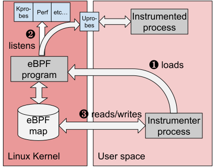

Las bibliotecas OpenTelemetry proporcionan una recopilación de telemetría para 
lenguajes de programación y frameworks populares. Sin embargo, empezar a 
utilizar el trazado distribuido puede resultar complejo. En algunos lenguajes 
compilados, como Go o Rust, es necesario añadir manualmente puntos de trazado 
(tracepoints) al código.

OpenTelemetry eBPF Instrumentation (OBI) es una herramienta de 
autoinstrumentación que facilita el inicio en la observabilidad de aplicaciones. 
OBI utiliza eBPF para inspeccionar automáticamente los ejecutables de las 
aplicaciones y la capa de red del sistema operativo, y capturar los intervalos 
de trazado relacionados con las transacciones web y las métricas de duración de 
los errores de tasa (RED) para los servicios HTTP/S y gRPC de Linux. Toda la 
captura de datos se realiza sin modificar el código o la configuración de la 
aplicación.

OBI ofrece las siguientes características:

- **Amplia compatibilidad con lenguajes**: Java, .NET, Go, Python, Ruby, Node.js,
  C, C++, y Rust.
- **Ligero**: no requiere cambios en el código, no hay que instalar bibliotecas 
  ni reiniciar.
- **Instrumentación eficiente**: las sondas (probes) eBPF capturan trazas y 
  métricas con una sobrecarga mínima.
- **Rastreo distribuído**: os intervalos de trazado distribuidos se capturan y se 
  envían a un collector.
- **Kubernetes-nativo**: proporciona instrumentación automática sin necesidad de
  volver a configurar para aplicaciones Kubernetes.
- **Visibilidad de las comunicaciones cifradas**: captura transacciones a través 
  de  TLS/SSL sin descifrado.
- **Propagación de contexto**: propaga el contexto de trazado entre servicios 
  automáticamente.
- **Compatibilidad con protocolos**: HTTP/S, gRPC y gRPC-Web.
- ***Métricas de baja cardinalidad**: métricas compatibles con Prometheus con baja  
  cardinalidad para reducir costos.
- **Observabilidad de la red**: captura los flujos de red entre servicios.
- **Trazas de bases de datos**: captura consultas y conexiones de bases de datos

## Requisitos {#requirements}

OBI requiere lo siguiente para pode ejecutarse:

- Linux kernel version 5.8 o posterior (o 4.18 para Redhat Enterprise Linux)
- Procesador x86_64 o arm64 
- Compatibilidad en tiempo de ejecución con eBPF (la mayoría de las 
  distribuciones modernas de Linux).
- Privilegios administrativos (root access) o las capacidades específicas 
  enumeradas en la [referencia de configuración](security/)

## Compatibilidad {#compatibility}

OBI fue probado con las siguientes distribuciones Linux:

- Ubuntu 20.04 LTS, 21.04, 22.04 LTS y 23.04
- CentOS 7, 8, y 9
- AlmaLinux 8, 9
- Rocky Linux 8, 9
- Red Hat Enterprise Linux 8, 9
- Debian 11, 12
- openSUSE Leap 15.3, 15.4
- SUSE Linux Enterprise Server 15 SP4

- OBI también soporta distribuciones basadas en RedHat: RHEL8, CentOS 8, 
  Rocky8, AlmaLinux8, y otros, que incluyen un kernel 4.18 que incorpora parches 
  relacionados con eBPF.

- Para instrumentar programas Go, compile con al menos Go 1.17. OBI es compatible 
  con aplicaciones Go creadas con una versión principal de Go que **no sea anterior 
  en más de tres versiones** a la versión principal estable actual.
- Accesos de administrador para ejecutar OBI.

## Limitaciones {#limitations}

OBI también tiene sus limitaciones. Solo proporciona métricas genéricas e 
información de trazado a nivel de transacción. Se sigue recomendando el uso de los 
agentes de lenguaje e instrumentación manual, para poder especificar los atributos y 
eventos personalizados que se deseen capturar. 

Mientras la mayoría de los programas eBPF requieren privilegios elevados, OBI le 
permite especificar permisos más detallados para ejecutarse con los permisos mínimos 
necesarios, tales como: `CAP_DAC_READ_SEARCH`, `CAP_SYS_PTRACE`, `CAP_PERFMON`, 
`CAP_BPF`, `CAP_CHECKPOINT_RESTORE`, entre otros.

Algunas funciones de OBI requieren permisos adicionales, por ejemplo, el uso de probes 
de observabilidad de red con Linux Traffic Control requiere `CAP_NET_ADMIN`, aunque es 
una función que se puede habilitar opcionalmente.

Para obtener una lista completa de las capacidades que requiere OBI, consulte [Seguridad, 
permisos y capacidades](security/).

## Empezar con OBI {#get-started-with-obi}

- Siga la documentación de [configuración](setup/) para empezar a utilizar OBI con 
  Docker o Kubernetes.
