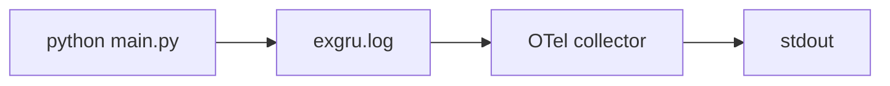
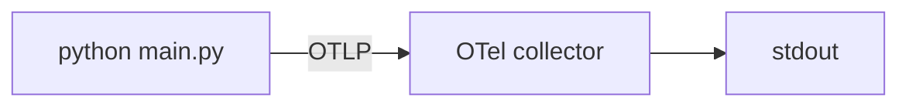

以下では、OpenTelemetry（OTel）を使った[ログ収集](/docs/concepts/signals/logs/)の方法を説明します。
わかりやすくするために、デモ用のプログラミング言語として Python を使いますが、執筆時点ではログサポートはまだ初期段階であるため、いくつかの更新が必要になるかもしれません。

print 文を使ったロギング（_Baby Grogu_ レベル）から、ファイルへのロギングと [OpenTelemetry Collector](/docs/collector/) の組み合わせ（_Expert Grogu_ レベル）、さらに OTel ログブリッジ API を使って [OTLP](/docs/specs/otlp/) で直接 Collector に取り込む方法（_Yoda_ レベル）まで、段階的に進化を見ていきます。

一緒に試してみたい場合は、Docker をインストールしたうえで、まず `git clone https://github.com/mhausenblas/ref.otel.help.git` を実行し、`how-to/logs-collection/` ディレクトリに移動してください。

## Baby Grogu レベル {#baby-grogu-level}

まずは Baby Grogu から始めましょう。
これは匿名を守るためのエイリアスです ;)
Baby Grogu は Python にある程度慣れたジュニア開発者ですが、テレメトリー、より正確にはロギングについてはまだ知らないし、気にもしていません。
ある日、Baby Grogu は不正な入力のキャッチを含む「Practice The Telemetry」のコードを書くよう依頼されます。
コードはどのようになり、Baby Grogu はコード実行の進捗やエラーケースをどう外部に伝えるのでしょうか。

まず、[baby-grogu/][repo-baby-grogu] ディレクトリに移動してください。

Baby Grogu の Python コード `baby-grogu/main.py` を例として使用します。
注目すべき部分は `practice()` 関数にあります。

```python
start_time = time.time()
try:
    how_long_int = int(how_long)
    print(f"Starting to practice The Telemetry for {how_long_int} second(s)")
    while time.time() - start_time < how_long_int:
        next_char = random.choice(string.punctuation)
        print(next_char, end="", flush=True)
        time.sleep(0.5)
    print("\nDone practicing")
except ValueError as ve:
    print(f"I need an integer value for the time to practice: {ve}")
    return False
except Exception as e:
    print(f"An unexpected error occurred: {e}")
    return False
return True
```

上記の Python コードは実際には特に有用なことはしておらず、指定された時間だけランダムな句読点を出力するだけで、これが「練習」を表現しています。
ただし、Baby Grogu がここで使っている `print()` 関数のセマンティクスの違いに注目してください。

たとえば、`print(next_char, end="", flush=True)` と書いたとき、実際には作業を実行していますが、`print("\nDone practicing")` と書いたときは、作業が完了したことを知らせる情報メッセージです。
これはログメッセージの良い候補になるでしょう！

同様に `print(f"I need an integer value for the time to practice: {ve}")` も、Baby Grogu がエラーの発生を伝えているものです。

コードを実行するには、`python3 main.py 3` で直接実行して Baby Grogu に 3 秒間練習させるか、コンテナ化されたバージョンを使用できます（Python 3.11 が必要です）。

コンテナ化されたバージョンでは、以下の `Dockerfile` を使用します。

```docker
FROM python:3.11
WORKDIR /usr/src/app
COPY . .
```

上記の Dockerfile は、以下の Docker Compose ファイル `docker-compose.yaml` のコンテキストで使用します。

```yaml
version: '3'
services:
  baby-grogu:
    build: .
    command: python main.py 3
    volumes:
      - .:/usr/src/app
```

この時点で `docker compose -f docker-compose.yaml` を実行すると、Baby Grogu の成果を確認できます。
以下のような出力が表示されるはずです（注：重要な部分に焦点を当てるために編集しています）。

```shell
baby-grogu-baby-grogu-1  | Starting to practice The Telemetry for 2 second(s)
baby-grogu-baby-grogu-1  | /)||
baby-grogu-baby-grogu-1  | Done practicing
baby-grogu-baby-grogu-1  | Practicing The Telemetry completed: True
```

OK、Baby Grogu はよくやりました。
さあ休憩の時間です。
立ち上がって水を飲み、リフレッシュした頭で戻ってきたら、レベルアップして OTel を使いましょう！

## Expert Grogu レベル {#expert-grogu-level}

時間が経つにつれ、Baby Grogu はオブザーバビリティとテレメトリーについて特に学びました。
Expert Grogu レベルに昇格したのです。
どうやって？聞いてくれてうれしいです。
お見せしましょう。

まず、[expert-grogu/][repo-expert-grogu] ディレクトリに移動してください。

このシナリオでは、Expert Grogu は Python アプリから（JSON 形式の）ファイルにログを記録します。
そして、OpenTelemetry Collector を使ってそのログファイルを読み取り、OTel Collector の [filelog レシーバー][filelog]でログレコードを解析し、最後に [debug エクスポーター][debug]を使って `stdout` に出力します。
理解できましたか？実際に動かしてみましょう…

全体的には以下のようなセットアップになります。



まず、Expert Grogu がロギングに関して何をしているか見てみましょう（`expert-grogu/main.py` の `practice()` 関数内）。

```python
start_time = time.time()
try:
    how_long_int = int(how_long)
    logger.info("Starting to practice The Telemetry for %i second(s)", how_long_int)
    while time.time() - start_time < how_long_int:
        next_char = random.choice(string.punctuation)
        print(next_char, end="", flush=True)
        time.sleep(0.5)
    logger.info("Done practicing")
except ValueError as ve:
    logger.error("I need an integer value for the time to practice: %s", ve)
    return False
except Exception as e:
    logger.error("An unexpected error occurred: %s", e)
    return False
return True
```

上記の関数では、Expert Grogu が `logger.xxx()` 関数を使ってステータス/進捗を伝え、練習時間に不正な入力値を提供した場合（`python main.py 5` ではなく `python main.py ABC` とした場合、前者は整数にパースできないため）などのエラー状態も伝えていることがわかります。

以下の `Dockerfile` を使用しています（依存関係 `python-json-logger==2.0.7` をインストールしています）。

```docker
FROM python:3.11
WORKDIR /usr/src/app
COPY requirements.txt requirements.txt
RUN pip3 install --no-cache-dir -r requirements.txt
COPY . .
```

以下の OTel Collector 設定を使用します（[OTelBin][otelbin-expert-grogu] で可視化）。

```yaml
receivers:
  filelog:
    include: [/usr/src/app/*.log]
    operators:
      - type: json_parser
        timestamp:
          parse_from: attributes.asctime
          layout: '%Y-%m-%dT%H:%M:%S'
        severity:
          parse_from: attributes.levelname
exporters:
  debug:
    verbosity: detailed
service:
  pipelines:
    logs:
      receivers: [filelog]
      exporters: [debug]
```

以下の Docker Compose ファイルで、上記のすべてを統合します。

```yaml
version: '3'
services:
  collector:
    image: otel/opentelemetry-collector-contrib:latest
    volumes:
      - ./otel-config.yaml:/etc/otelcol-contrib/config.yaml
      - ./:/usr/src/app
    command: ['--config=/etc/otelcol-contrib/config.yaml']
    ports:
      - '4317:4317'
  baby-grogu:
    build: .
    command: python main.py 10
    volumes:
      - .:/usr/src/app
```

`docker compose -f docker-compose.yaml` で実行すると、以下のような出力が表示されるはずです。

```log
expert-grogu-collector-1   | 2023-11-15T17:21:32.811Z   info    service@v0.88.0/telemetry.go:84 Setting up own telemetry...
expert-grogu-collector-1   | 2023-11-15T17:21:32.812Z   info    service@v0.88.0/telemetry.go:201        Serving Prometheus metrics      {"address": ":8888", "level": "Basic"}
expert-grogu-collector-1   | 2023-11-15T17:21:32.812Z   info    exporter@v0.88.0/exporter.go:275        Deprecated component. Will be removed in future releases.       {"kind": "exporter", "data_type": "logs", "name": "logging"}
expert-grogu-collector-1   | 2023-11-15T17:21:32.812Z   info    service@v0.88.0/service.go:143  Starting otelcol-contrib...     {"Version": "0.88.0", "NumCPU": 4}
expert-grogu-collector-1   | 2023-11-15T17:21:32.812Z   info    extensions/extensions.go:33     Starting extensions...
expert-grogu-collector-1   | 2023-11-15T17:21:32.812Z   info    adapter/receiver.go:45  Starting stanza receiver        {"kind": "receiver", "name": "filelog", "data_type": "logs"}
expert-grogu-collector-1   | 2023-11-15T17:21:32.813Z   info    service@v0.88.0/service.go:169  Everything is ready. Begin running and processing data.
expert-grogu-collector-1   | 2023-11-15T17:21:33.014Z   info    fileconsumer/file.go:182        Started watching file   {"kind": "receiver", "name": "filelog", "data_type": "logs", "component": "fileconsumer", "path": "/usr/src/app/exgru.log"}
expert-grogu-collector-1   | 2023-11-15T17:21:33.113Z   info    LogsExporter    {"kind": "exporter", "data_type": "logs", "name": "logging", "resource logs": 1, "log records": 4}
expert-grogu-collector-1   | 2023-11-15T17:21:33.113Z   info    ResourceLog #0
expert-grogu-collector-1   | Resource SchemaURL:
expert-grogu-collector-1   | ScopeLogs #0
expert-grogu-collector-1   | ScopeLogs SchemaURL:
expert-grogu-collector-1   | InstrumentationScope
expert-grogu-collector-1   | LogRecord #0
expert-grogu-collector-1   | ObservedTimestamp: 2023-11-15 17:21:33.01473246 +0000 UTC
expert-grogu-collector-1   | Timestamp: 2023-11-15 17:16:58 +0000 UTC
expert-grogu-collector-1   | SeverityText: INFO
expert-grogu-collector-1   | SeverityNumber: Info(9)
expert-grogu-collector-1   | Body: Str({"asctime": "2023-11-15T17:16:58", "levelname": "INFO", "message": "Starting to practice The Telemetry for 10 second(s)", "taskName": null})
expert-grogu-collector-1   | Attributes:
expert-grogu-collector-1   |      -> log.file.name: Str(exgru.log)
expert-grogu-collector-1   |      -> asctime: Str(2023-11-15T17:16:58)
expert-grogu-collector-1   |      -> levelname: Str(INFO)
expert-grogu-collector-1   |      -> message: Str(Starting to practice The Telemetry for 10 second(s))
expert-grogu-collector-1   |      -> taskName: Str(<nil>)
expert-grogu-collector-1   | Trace ID:
expert-grogu-collector-1   | Span ID:
expert-grogu-collector-1   | Flags: 0
expert-grogu-collector-1   | LogRecord #1
expert-grogu-collector-1   | ObservedTimestamp: 2023-11-15 17:21:33.014871669 +0000 UTC
expert-grogu-collector-1   | Timestamp: 2023-11-15 17:17:08 +0000 UTC
expert-grogu-collector-1   | SeverityText: INFO
expert-grogu-collector-1   | SeverityNumber: Info(9)
expert-grogu-collector-1   | Body: Str({"asctime": "2023-11-15T17:17:08", "levelname": "INFO", "message": "Done practicing", "taskName": null})
expert-grogu-collector-1   | Attributes:
expert-grogu-collector-1   |      -> log.file.name: Str(exgru.log)
expert-grogu-collector-1   |      -> asctime: Str(2023-11-15T17:17:08)
expert-grogu-collector-1   |      -> levelname: Str(INFO)
expert-grogu-collector-1   |      -> message: Str(Done practicing)
expert-grogu-collector-1   |      -> taskName: Str(<nil>)
expert-grogu-collector-1   | Trace ID:
expert-grogu-collector-1   | Span ID:
expert-grogu-collector-1   | Flags: 0
expert-grogu-collector-1   | LogRecord #2
expert-grogu-collector-1   | ObservedTimestamp: 2023-11-15 17:21:33.01487521 +0000 UTC
expert-grogu-collector-1   | Timestamp: 2023-11-15 17:17:08 +0000 UTC
expert-grogu-collector-1   | SeverityText: INFO
expert-grogu-collector-1   | SeverityNumber: Info(9)
expert-grogu-collector-1   | Body: Str({"asctime": "2023-11-15T17:17:08", "levelname": "INFO", "message": "Practicing The Telemetry completed: True", "taskName": null})
expert-grogu-collector-1   | Attributes:
expert-grogu-collector-1   |      -> message: Str(Practicing The Telemetry completed: True)
expert-grogu-collector-1   |      -> taskName: Str(<nil>)
expert-grogu-collector-1   |      -> asctime: Str(2023-11-15T17:17:08)
expert-grogu-collector-1   |      -> log.file.name: Str(exgru.log)
expert-grogu-collector-1   |      -> levelname: Str(INFO)
expert-grogu-collector-1   | Trace ID:
expert-grogu-collector-1   | Span ID:
expert-grogu-collector-1   | Flags: 0
expert-grogu-collector-1   | LogRecord #3
expert-grogu-collector-1   | ObservedTimestamp: 2023-11-15 17:21:33.01487771 +0000 UTC
expert-grogu-collector-1   | Timestamp: 2023-11-15 17:21:32 +0000 UTC
expert-grogu-collector-1   | SeverityText: INFO
expert-grogu-collector-1   | SeverityNumber: Info(9)
expert-grogu-collector-1   | Body: Str({"asctime": "2023-11-15T17:21:32", "levelname": "INFO", "message": "Starting to practice The Telemetry for 10 second(s)", "taskName": null})
expert-grogu-collector-1   | Attributes:
expert-grogu-collector-1   |      -> log.file.name: Str(exgru.log)
expert-grogu-collector-1   |      -> asctime: Str(2023-11-15T17:21:32)
expert-grogu-collector-1   |      -> levelname: Str(INFO)
expert-grogu-collector-1   |      -> message: Str(Starting to practice The Telemetry for 10 second(s))
expert-grogu-collector-1   |      -> taskName: Str(<nil>)
expert-grogu-collector-1   | Trace ID:
expert-grogu-collector-1   | Span ID:
expert-grogu-collector-1   | Flags: 0
```

## Yoda レベル {#yoda-level}

次はギアを切り替えて、テレメトリーマスターである Yoda の肩越しに覗いてみましょう。

まず、[yoda/][repo-yoda] ディレクトリに移動してください。

このシナリオでは、Yoda が Python アプリで OTel ログブリッジ API を使い、[OpenTelemetry Protocol][otlp]（OTLP）形式でログを直接 OTel Collector に取り込みます。
これは、まずファイルにログを記録してから Collector にそれを読み取らせるよりも、高速で信頼性が高いです！

Yoda が使用しているセットアップの全体像は以下の通りです。



以下の OTel Collector 設定を使用します（[OTelBin][otelbin-yoda] で可視化）。

```yaml
receivers:
  otlp:
    protocols:
      grpc:
exporters:
  debug:
    verbosity: detailed
service:
  pipelines:
    logs:
      receivers: [otlp]
      exporters: [debug]
```

Yoda のセットアップを `docker compose -f docker-compose.yaml` で実行すると、以下のような出力が表示されるはずです。

```shell
yoda-collector-1   | 2023-11-15T16:54:22.545Z   info    service@v0.88.0/telemetry.go:84 Setting up own telemetry...
yoda-collector-1   | 2023-11-15T16:54:22.546Z   info    service@v0.88.0/telemetry.go:201        Serving Prometheus metrics      {"address": ":8888", "level": "Basic"}
yoda-collector-1   | 2023-11-15T16:54:22.546Z   info    exporter@v0.88.0/exporter.go:275        Deprecated component. Will be removed in future releases.       {"kind": "exporter", "data_type": "logs", "name": "logging"}
yoda-collector-1   | 2023-11-15T16:54:22.547Z   info    service@v0.88.0/service.go:143  Starting otelcol-contrib...     {"Version": "0.88.0", "NumCPU": 4}
yoda-collector-1   | 2023-11-15T16:54:22.547Z   info    extensions/extensions.go:33     Starting extensions...
yoda-collector-1   | 2023-11-15T16:54:22.547Z   warn    internal@v0.88.0/warning.go:40  Using the 0.0.0.0 address exposes this server to every network interface, which may facilitate Denial of Service attacks    {"kind": "receiver", "name": "otlp", "data_type": "logs", "documentation": "https://github.com/open-telemetry/opentelemetry-collector/blob/main/docs/security-best-practices.md#safeguards-against-denial-of-service-attacks"}
yoda-collector-1   | 2023-11-15T16:54:22.549Z   info    otlpreceiver@v0.88.0/otlp.go:83 Starting GRPC server    {"kind": "receiver", "name": "otlp", "data_type": "logs", "endpoint": "0.0.0.0:4317"}
yoda-collector-1   | 2023-11-15T16:54:22.550Z   info    service@v0.88.0/service.go:169  Everything is ready. Begin running and processing data.
yoda-collector-1   | 2023-11-15T16:54:27.667Z   info    LogsExporter    {"kind": "exporter", "data_type": "logs", "name": "logging", "resource logs": 1, "log records": 1}
yoda-collector-1   | 2023-11-15T16:54:27.668Z   info    ResourceLog #0
yoda-collector-1   | Resource SchemaURL:
yoda-collector-1   | Resource attributes:
yoda-collector-1   |      -> telemetry.sdk.language: Str(python)
yoda-collector-1   |      -> telemetry.sdk.name: Str(opentelemetry)
yoda-collector-1   |      -> telemetry.sdk.version: Str(1.21.0)
yoda-collector-1   |      -> service.name: Str(train-the-telemetry)
yoda-collector-1   |      -> service.instance.id: Str(33992a23112e)
yoda-collector-1   | ScopeLogs #0
yoda-collector-1   | ScopeLogs SchemaURL:
yoda-collector-1   | InstrumentationScope opentelemetry.sdk._logs._internal
yoda-collector-1   | LogRecord #0
yoda-collector-1   | ObservedTimestamp: 1970-01-01 00:00:00 +0000 UTC
yoda-collector-1   | Timestamp: 2023-11-15 16:54:22.651675136 +0000 UTC
yoda-collector-1   | SeverityText: INFO
yoda-collector-1   | SeverityNumber: Info(9)
yoda-collector-1   | Body: Str(Starting to practice The Telemetry for 10 second(s))
yoda-collector-1   | Trace ID:
yoda-collector-1   | Span ID:
yoda-collector-1   | Flags: 0
yoda-collector-1   |    {"kind": "exporter", "data_type": "logs", "name": "logging"}
yoda-collector-1   | 2023-11-15T16:54:32.715Z   info    LogsExporter    {"kind": "exporter", "data_type": "logs", "name": "logging", "resource logs": 1, "log records": 2}
yoda-collector-1   | 2023-11-15T16:54:32.716Z   info    ResourceLog #0
yoda-collector-1   | Resource SchemaURL:
yoda-collector-1   | Resource attributes:
yoda-collector-1   |      -> telemetry.sdk.language: Str(python)
yoda-collector-1   |      -> telemetry.sdk.name: Str(opentelemetry)
yoda-collector-1   |      -> telemetry.sdk.version: Str(1.21.0)
yoda-collector-1   |      -> service.name: Str(train-the-telemetry)
yoda-collector-1   |      -> service.instance.id: Str(33992a23112e)
yoda-collector-1   | ScopeLogs #0
yoda-collector-1   | ScopeLogs SchemaURL:
yoda-collector-1   | InstrumentationScope opentelemetry.sdk._logs._internal
yoda-collector-1   | LogRecord #0
yoda-collector-1   | ObservedTimestamp: 1970-01-01 00:00:00 +0000 UTC
yoda-collector-1   | Timestamp: 2023-11-15 16:54:32.713701888 +0000 UTC
yoda-collector-1   | SeverityText: INFO
yoda-collector-1   | SeverityNumber: Info(9)
yoda-collector-1   | Body: Str(Done practicing)
yoda-collector-1   | Trace ID:
yoda-collector-1   | Span ID:
yoda-collector-1   | Flags: 0
yoda-collector-1   | LogRecord #1
yoda-collector-1   | ObservedTimestamp: 1970-01-01 00:00:00 +0000 UTC
yoda-collector-1   | Timestamp: 2023-11-15 16:54:32.714062336 +0000 UTC
yoda-collector-1   | SeverityText: INFO
yoda-collector-1   | SeverityNumber: Info(9)
yoda-collector-1   | Body: Str(Practicing The Telemetry completed: True)
yoda-collector-1   | Trace ID:
yoda-collector-1   | Span ID:
yoda-collector-1   | Flags: 0
yoda-collector-1   |    {"kind": "exporter", "data_type": "logs", "name": "logging"}
yoda-baby-grogu-1  | =`;*'+.|,+?):(*-<}~}
```

楽しいでしょう？Yoda のソースコードをいじって、コンテキスト情報を追加したり、プロセッサーを追加してログレコードが Collector を通過する際に操作したりできるようになりました。

_テレメトリー_ とともにあらんことを、若きパダワンよ！

## 次のステップ {#whats-next}

_テレメトリー_ とそのベストプラクティスに慣れたら、Yoda のコードを拡張して以下のことを試してみてください。

1. コンテキストを追加する。
   たとえば、[OTel リソース属性](/docs/concepts/resources/)と[セマンティック規約](/docs/concepts/semantic-conventions/)を使って、実行のコンテキストをより明示的にしてみてください。
1. [transform プロセッサーや attributes プロセッサー](/docs/collector/transforming-telemetry/)などのプロセッサーを使って、OTel Collector でログをエンリッチしたり、特定の重大度レベルをフィルタリングしたりする。
1. 適切な箇所にスパンを発行して、[トレース](/docs/concepts/signals/traces/)サポートを追加する。
1. セットアップに OpenSearch（と [Data Prepper][]）などのオブザーバビリティバックエンドを追加し、OTLP 形式でスパンとログを取り込めるようにする。
1. バックエンドにトレースとログを取り込んだら、Grafana などのフロントエンドと合わせて、この 2 つのテレメトリーシグナルタイプをバックエンドで相関させてみる。
1. [自動計装](/docs/concepts/instrumentation/zero-code/)を使って、テレメトリーをさらにエンリッチする。

コミュニティは現在 [Events API Interface][otel-logs-events] に取り組んでおり、研究を続けたりフィードバックを提供したりするのに良い場所です。

## 謝辞と参考資料 {#kudos-and-references}

Yoda レベルの実現に非常に辛抱強く付き合ってくれ、重要な役割を果たしてくれた [Severin Neumann][svrnm] と [Houssam Chehab][hossko] に感謝します。
お世話になりました！

OTel ログ収集（特に Python）についてさらに深く掘り下げたい場合は、以下のリソースを参照してください。

- [OpenTelemetry Logging][otel-logs-spec]（OTel ドキュメント）
- [Events API Interface][otel-logs-events]（OTel ドキュメント）
- [General Logs Attributes][otel-semconv-logs]（セマンティック規約）
- [OpenTelemetry Python][otel-python-repo]（GitHub リポジトリ）
- [A language-specific implementation of OpenTelemetry in Python][otel-python]（OTel ドキュメント）
- [OpenTelemetry Logging Instrumentation][py-docs-logs]（Python ドキュメント）
- [OpenTelemetry Logs SDK example][py-docs-logs-example]（Python ドキュメント）

[repo-baby-grogu]: https://github.com/mhausenblas/ref.otel.help/tree/6902fc3086c0e00c40094438f96ded5deaaa1d97/how-to/logs-collection/baby-grogu?from_branch=main
[repo-expert-grogu]: https://github.com/mhausenblas/ref.otel.help/tree/ccb846659399810c8479e92b8f4b69c540182b2f/how-to/logs-collection/expert-grogu?from_branch=main
[repo-yoda]: https://github.com/mhausenblas/ref.otel.help/tree/477deb72f855c5e14d031fb787c812afd05cbd45/how-to/logs-collection/yoda?from_branch=main
[filelog]: https://github.com/open-telemetry/opentelemetry-collector-contrib/tree/72087f655403778da46f4168dca2433fa0775098/receiver/filelogreceiver?from_branch=main
[debug]: https://github.com/open-telemetry/opentelemetry-collector/tree/d25efc7e2f31a3ba5347d0725a22d7bed1b4015d/exporter/debugexporter?from_branch=main
[otelbin-expert-grogu]: https://www.otelbin.io/?#config=receivers%3A*N__filelog%3A*N____include%3A_%5B_%2Fusr%2Fsrc%2Fapp%2F**.log_%5D*N____start*_at%3A_beginning*N____operators%3A*N____-_type%3A_json*_parser*N______timestamp%3A*N________parse*_from%3A_attributes.asctime*N________layout%3A_*%22*.Y-*.m-*.dT*.H%3A*.M%3A*.S*%22*N______severity%3A*N________parse*_from%3A_attributes.levelname*Nexporters%3A*N__logging%3A*N____verbosity%3A_detailed*Nservice%3A*N__pipelines%3A*N____logs%3A*N______receivers%3A_%5B_filelog_%5D*N______exporters%3A_%5B_logging_%5D%7E
[otlp]: /docs/specs/otlp/
[otelbin-yoda]: https://www.otelbin.io/?#config=receivers%3A*N__otlp%3A*N____protocols%3A*N______grpc%3A*Nexporters%3A*N__logging%3A*N____verbosity%3A_detailed*Nservice%3A*N__pipelines%3A*N____logs%3A*N______receivers%3A_%5B_otlp_%5D*N______exporters%3A_%5B_logging_%5D%7E
[data prepper]: https://opensearch.org/docs/latest/data-prepper/index/
[svrnm]: https://github.com/svrnm
[hossko]: https://github.com/hossko
[otel-logs-spec]: /docs/specs/otel/logs/
[otel-logs-events]: /docs/specs/otel/logs/event-api/
[otel-semconv-logs]: /docs/specs/semconv/general/logs/
[otel-python-repo]: https://github.com/open-telemetry/opentelemetry-python
[otel-python]: /docs/languages/python/
[py-docs-logs]: https://opentelemetry-python-contrib.readthedocs.io/en/latest/instrumentation/logging/logging.html
[py-docs-logs-example]: https://opentelemetry-python.readthedocs.io/en/latest/examples/logs/README.html
