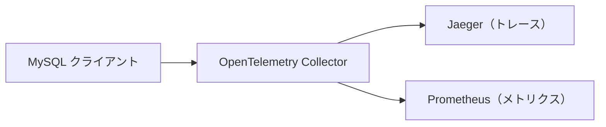

[otelsql](https://github.com/XSAM/otelsql) は、Go プログラミング言語の [`database/sql`](https://pkg.go.dev/database/sql) ライブラリ向けの計装ライブラリです。
アプリケーションがデータベースとやり取りする際に、トレースとメトリクスを生成します。
これにより、アプリケーションのパフォーマンスに影響を与える可能性のある SQL クエリのエラーやスローダウンを特定できます。

このライブラリの使い方を見ていきましょう！

## はじめに {#getting-started}

otelsql は `database/sql` のインターフェイスに対するラッパーレイヤーです。
ユーザーがラップされたデータベースインターフェイスを使用すると、otelsql がテレメトリーデータを生成し、操作を基盤のデータベースに渡します。

以下の例では、[Docker Compose](https://docs.docker.com/compose/) を使用して otelsql リポジトリの otel-collector サンプルを実行します。
このサンプルでは、otelsql 計装を使用した MySQL クライアントを使います。
生成されたテレメトリーは OpenTelemetry Collector にプッシュされます。
その後、トレースデータは Jaeger に、メトリクスデータは Prometheus サーバーに表示されます。

データフローは以下のとおりです。



otelsql リポジトリをクローンしてサンプルを実行し、最も重要なコード行を確認しましょう。

```sh
git clone https://github.com/XSAM/otelsql.git
```

otelsql フォルダー内で、git タグを `v0.29.0`（この記事執筆時点の最新タグ）にチェックアウトすることもできます。
サンプルの実行手順は将来変更される可能性があるため、これによりサンプルが確実に実行可能であることを保証します。

```sh
git checkout tags/v0.29.0
```

otel-collector サンプルのフォルダーに移動し、すべてのサービスを起動しましょう。

```sh
cd example/otel-collector
docker compose up -d
```

イメージのビルドとサービスの実行が完了したら、サービスログを確認して SQL クライアントが完了したことを確認しましょう。

```sh
docker compose logs client
```

その後、Jaeger UI に [localhost:16686](http://localhost:16686) から、Prometheus UI に [localhost:9090](http://localhost:9090) からアクセスして結果を確認できます。

ここでは Jaeger 上のトレースグラフを表示しています。
データベースとの各操作の所要時間やパラメーターを確認できます。


ここではメトリクス `db_sql_latency_milliseconds_sum` を Prometheus 上で表示しています。


otelsql が生成するメトリクスの詳細なオプションは [otelsql のドキュメント](https://github.com/XSAM/otelsql/blob/60175c288b74731b8f4b70d909c295efe7c2cc98/README.md?from_branch=main#metric-instruments) で確認できます。

## サンプルを理解する {#understand-the-example}

まず `docker-compose.yaml` ファイルを見てみましょう。

```yaml
version: '3.9'
services:
  mysql:
    image: mysql:8.3
    environment:
      - MYSQL_ROOT_PASSWORD=otel_password
      - MYSQL_DATABASE=db
    healthcheck:
      test: mysqladmin ping -h 127.0.0.1 -u root --password=$$MYSQL_ROOT_PASSWORD
      start_period: 5s
      interval: 5s
      timeout: 5s
      retries: 10

  otel-collector:
    image: otel/opentelemetry-collector-contrib:0.91.0
    command: ['--config=/etc/otel-collector.yaml']
    volumes:
      - ./otel-collector.yaml:/etc/otel-collector.yaml
    depends_on:
      - jaeger

  prometheus:
    image: prom/prometheus:v2.45.2
    volumes:
      - ./prometheus.yaml:/etc/prometheus/prometheus.yml
    ports:
      - 9090:9090
    depends_on:
      - otel-collector

  jaeger:
    image: jaegertracing/all-in-one:1.52
    ports:
      - 16686:16686

  client:
    build:
      dockerfile: $PWD/Dockerfile
      context: ../..\
    depends_on:
      mysql:
        condition: service_healthy
```

この Docker Compose ファイルには5つのサービスが含まれています。
`client` サービスは Dockerfile からビルドされた MySQL クライアントで、ソースコードはサンプルフォルダー内の main.go です。
`client` サービスは `mysql` サービスが起動した後に実行されます。
その後、OpenTelemetry クライアントと otelsql 計装を初期化し、`mysql` サービスに SQL クエリを発行し、メトリクスとトレースデータを [OpenTelemetry Protocol（OTLP）](/docs/specs/otel/protocol/) を通じて `otel-collector` サービスに送信します。

データを受信した後、`otel-collector` サービスはデータ形式を変換し、メトリクスデータを `prometheus` サービスに、トレースデータを `jaeger` サービスに送信します。

`main.go` を確認して、`client` サービスで何が行われているか見てみましょう。
以下がメイン関数です。

```go
func main() {
	ctx, cancel := signal.NotifyContext(context.Background(), os.Interrupt)
	defer cancel()

	conn, err := initConn(ctx)
	if err != nil {
		log.Fatal(err)
	}

	shutdownTracerProvider, err := initTracerProvider(ctx, conn)
	if err != nil {
		log.Fatal(err)
	}
	defer func() {
		if err := shutdownTracerProvider(ctx); err != nil {
			log.Fatalf("failed to shutdown TracerProvider: %s", err)
		}
	}()

	shutdownMeterProvider, err := initMeterProvider(ctx, conn)
	if err != nil {
		log.Fatal(err)
	}
	defer func() {
		if err := shutdownMeterProvider(ctx); err != nil {
			log.Fatalf("failed to shutdown MeterProvider: %s", err)
		}
	}()

	db := connectDB()
	defer db.Close()

	err = runSQLQuery(ctx, db)
	if err != nil {
		log.Fatal(err)
	}

	fmt.Println("Example finished")
}
```

この `main` 関数は非常にわかりやすい構造です。
まず `otel-collector` サービスとのコネクションを初期化し、それをトレーサープロバイダーとメータープロバイダーで使用します。
次に、`connection` とシャットダウンメソッドを使ってトレーサープロバイダーとメータープロバイダーを設定します。
これにより、アプリケーションの終了前にテレメトリーデータが `otel-collector` サービスに正しくプッシュされることが保証されます。
OpenTelemetry クライアントのセットアップが完了したら、`connectDB` メソッドを呼び出して otelsql ライブラリを使用し MySQL データベースとやり取りします。
詳細を見てみましょう。

```go
func connectDB() *sql.DB {
	// データベースに接続する
	db, err := otelsql.Open("mysql", mysqlDSN, otelsql.WithAttributes(
		semconv.DBSystemMySQL,
	))
	if err != nil {
		log.Fatal(err)
	}

	// DB の統計情報をメーターに登録する
	err = otelsql.RegisterDBStatsMetrics(db, otelsql.WithAttributes(
		semconv.DBSystemMySQL,
	))
	if err != nil {
		log.Fatal(err)
	}
	return db
}
```

Go が提供する [`sql.Open`](https://pkg.go.dev/database/sql#Open) メソッドのかわりに、[`otelsql.Open`](https://pkg.go.dev/github.com/XSAM/otelsql#Open) を使用して [`sql.DB`](https://pkg.go.dev/database/sql#DB) インスタンスを作成します。
`otelsql.Open` が返す `sql.DB` インスタンスは、すべての DB 操作を基盤の `sql.DB` インスタンス（`sql.Open` によって作成される）に転送および計装するラッパーです。
ユーザーがこのラッパーを使って SQL クエリを送信すると、`otelsql` がクエリを確認し、OpenTelemetry クライアントを使用してテレメトリーを生成できます。

`otelsql.Open` の他に、`otelsql` は計装を初期化するための3つの追加方法を提供しています。
`otelsql.OpenDB`、`otelsql.Register`、`otelsql.WrapDriver` です。
これらの追加メソッドは、一部のデータベースドライバーやフレームワークが `sql.DB` を直接作成する方法を提供していない場合など、さまざまなユースケースに対応しています。
場合によっては、手動で `sql.DB` を作成してそれらのデータベースドライバーに渡すために、これらの追加メソッドが必要になることがあります。
これらのメソッドの使い方は [otelsql ドキュメントのサンプル](https://pkg.go.dev/github.com/XSAM/otelsql#pkg-examples) で確認できます。

続いて、`otelsql.RegisterDBStatsMetrics` を使用して `sql.DBStats` からのメトリクスデータを登録します。
メトリクスの記録プロセスはバックグラウンドで実行され、登録後に必要に応じてメトリクスの値を更新するため、個別のスレッドを作成する必要はありません。

`otelsql` でラップした `sql.DB` を取得したら、それを使ってクエリを実行できます。

```go
func runSQLQuery(ctx context.Context, db *sql.DB) error {
	// 親スパンを作成する（任意）
	tracer := otel.GetTracerProvider()
	ctx, span := tracer.Tracer(instrumentationName).Start(ctx, "example")
	defer span.End()

	err := query(ctx, db)
	if err != nil {
		span.RecordError(err)
		return err
	}
	return nil
}

func query(ctx context.Context, db *sql.DB) error {
	// クエリを実行する
	rows, err := db.QueryContext(ctx, `SELECT CURRENT_TIMESTAMP`)
	if err != nil {
		return err
	}
	defer rows.Close()

	var currentTime time.Time
	for rows.Next() {
		err = rows.Scan(&currentTime)
		if err != nil {
			return err
		}
	}
	fmt.Println(currentTime)
	return nil
}
```

この `runSQLQuery` メソッドはまず親スパンを作成し（これは任意のステップで、クエリスパンに親を持たせトレースグラフ上で見やすくするためです）、その後 MySQL データベースから現在のタイムスタンプを取得します。

このメソッドの後、`client` アプリケーションは終了します。
これらがサンプルを理解するための最も重要なコード行です。

## サンプルをプレイグラウンドとして使う {#use-the-example-as-a-playground}

サンプルを理解した上で、少し複雑にしてプレイグラウンドとして使い、実際のシナリオでどのように使用されるかを見てみましょう。

以下のコードを使って、サンプルの `runSQLQuery` メソッドを置き換えてください。

```go
func runSQLQuery(ctx context.Context, db *sql.DB) error {
    // 親スパンを作成する（任意）
    tracer := otel.GetTracerProvider()
    ctx, span := tracer.Tracer(instrumentationName).Start(ctx, "example")
    defer span.End()

    runSlowSQLQuery(ctx, db)

    err := query(ctx, db)
    if err != nil {
        span.RecordError(err)
        return err
    }
    return nil
}

func runSlowSQLQuery(ctx context.Context, db *sql.DB) {
    db.QueryContext(ctx, `SELECT SLEEP(1)`)
}
```

今回はサンプルに新しいクエリを追加しました。
これは戻るまでに1秒かかる遅いクエリです。
何が起こるか、そしてこの遅いクエリをどのように特定できるかを見てみましょう。

この変更を反映するには、`client` サービスを再ビルドする必要があります。

```sh
docker compose build client
docker compose up client
```

クライアントが完了したら、Jaeger で先ほど生成したトレースのトレースグラフを確認できます。


このグラフから、サンプル全体の完了に1秒かかっていることがわかります。
この遅延の根本原因は、データベースとのネットワークレイテンシーやタイムスタンプクエリとは関係ありません。
遅延の原因は `SELECT SLEEP(1)` クエリです。

メトリクスによるデータベースの集計統計からも、この遅延について知ることができます。
これが otelsql が提供するオブザーバビリティであり、アプリケーションがデータベースに対して何を行っているかを把握できます。

## 互換性 {#compatibility}

他のデータベースやサードパーティのデータベースフレームワーク（ORM など）との互換性の問題を心配し、この計装がどの程度広く使用できるのか疑問に思うかもしれません。

実装の観点からは、データベースドライバーやデータベースフレームワークがコンテキスト付きで `database/sql` を通じてデータベース（SQL データベースに限らず、あらゆるデータベース）とやり取りする限り、`otelsql` は問題なく動作するはずです。

以下は、otelsql が Facebook のエンティティフレームワーク for Go と連携する方法を示す[サンプル](https://github.com/ent/ent/issues/1232#issuecomment-1200405070)です。

## その他の便利な機能 {#other-cool-features}

主要な機能を体験したところで、`otelsql` が提供するその他の便利な機能を見てみましょう。

### Sqlcommenter サポート {#sqlcommenter-support}

otelsql は [Sqlcommenter](https://google.github.io/sqlcommenter) を統合しています。
Sqlcommenter は、SQL 文にコメントを挿入することでデータベースのコンテキスト伝搬を可能にするオープンソースの ORM 自動計装ライブラリで、OpenTelemetry と統合されています。

`WithSQLCommenter` オプションを使用すると、otelsql は計装するすべての SQL 文にコメントを挿入します。

たとえば、データベースに送信される SQL クエリ

```sql
SELECT * from FOO
```

は次のようになります。

```sql
SELECT * from FOO /*traceparent='00-4bf92f3577b34da6a3ce929d0e0e4736-00f067aa0ba902b7-01',tracestate='congo%3Dt61rcWkgMzE%2Crojo%3D00f067aa0ba902b7'*/
```

Sqlcommenter をサポートするデータベースは、このクエリに対する操作を指定されたトレースで記録し、トレーススパンをトレースストアに公開できます。
これにより、アプリケーションのトレーススパンとデータベースからのクエリトレーススパンを1か所で関連付けて確認できます。


> 画像の出典:
> [Google Cloud ドキュメント](https://cloud.google.com/blog/products/databases/sqlcommenter-merges-with-opentelemetry)

### カスタムスパン名 {#custom-span-name}

デフォルトのスパン名が気に入らない場合は、`otelsql.WithSpanNameFormatter` を使用してスパン名をカスタマイズできます。

使用例を以下に示します。

```go
otelsql.WithSpanNameFormatter(func(ctx context.Context, method otelsql.Method, query string) string {
    return string(method) + ": " + query
})
```

これにより、スパン名は `{method}: {query}` の形式になります。
スパン名の例を以下に示します。

```text
sql.conn.query: select current_timestamp
```

### スパンのフィルタリング {#filter-spans}

`otelsql.SpanOptions` の `otelsql.SpanFilter` を使用して、生成したくないスパンをフィルタリングできます。
特定のスパンを破棄したい場合に便利です。

## 次のステップ {#whats-next}

このブログ記事で学んだことを、ご自身の otelsql のインストールに適用できるようになったはずです。

あなたの体験をぜひお聞かせください！
otelsql が役に立ったらぜひスターをつけてください！
問題が発生した場合は、遠慮なく[お問い合わせ](https://github.com/XSAM/otelsql?tab=readme-ov-file#communication)いただくか、[イシューを作成](https://github.com/XSAM/otelsql/issues)してください。
