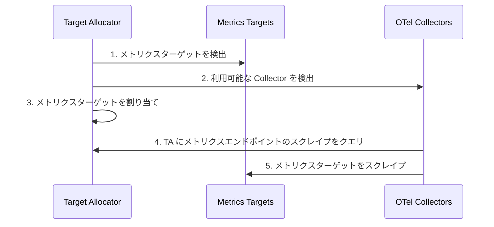
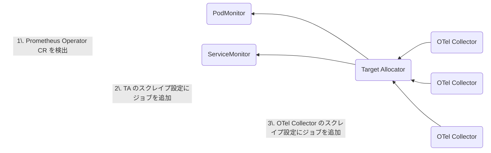

[Prometheus](https://prometheus.io/) や [OpenTelemetry](/docs/what-is-opentelemetry/) などのツールは、複雑な分散システムの健全性、パフォーマンス、可用性を監視するのに役立ちます。
どちらも [Cloud Native Computing Foundation（CNCF）](https://www.cncf.io/) の傘下にあるオープンソースプロジェクトですが、オブザーバビリティにおいてそれぞれどのような役割を果たしているのでしょうか。

OpenTelemetry（略して OTel）は、テレメトリーデータの計装、生成、収集、エクスポートのためのベンダー中立のオープン標準です。
Prometheus はオブザーバビリティの分野で不動の地位を築いており、組織内のモニタリングとアラートに広く活用されています。

Prometheus と OTel はどちらもメトリクスを出力しますが、両者の違いと共通点については多くのことがあり、この記事の範囲を超えています。
ここでは、特に Kubernetes 環境において OTel が Prometheus をどのようにサポートしているかをお見せしたいと思います。
以下のことを学べます。

- OTel Collector の
  [Prometheus レシーバー](https://github.com/open-telemetry/opentelemetry-collector-contrib/tree/dbdb56d285d860849323346d58c83b14c1ed6c62/receiver/prometheusreceiver?from_branch=main)
  を使って Prometheus メトリクスを取り込む方法。
- K8s クラスターレシーバーや Kubelet 統計レシーバーなど、OTel ネイティブなオプションによる Prometheus メトリクス収集の代替手段。

また、OTel Operator のターゲットアロケーター（TA）について技術的に深く掘り下げ、以下のことを学びます。

- Prometheus のサービスディスカバリーに使用する方法。
- Prometheus ターゲットの均等な分散を確保する方法。

## OTel と Prometheus {#otel-and-prometheus}

OTel は主にオブザーバビリティの計装部分に焦点を当てているため、テレメトリーを保存するためのバックエンドは提供していません。
データをストレージ、アラート、クエリのためにバックエンドベンダーに転送する必要があります。

一方、Prometheus は計装クライアントに加えて、メトリクスに使用できる時系列データストアを提供します。
グラフやチャートを表示したり、アラートを設定したり、Web ユーザーインターフェイスからデータをクエリしたりできます。
また、[Prometheus テキストベースのエクスポジションフォーマット](https://prometheus.io/docs/instrumenting/exposition_formats/#exposition-formats)として知られるデータフォーマットも含んでいます。

Prometheus の _データ_ はディメンショナル時系列として保存されます。
つまり、データには属性（たとえばラベルやディメンション）とタイムスタンプがあります。

Prometheus _サーバー_ は、設定ファイルに定義されたターゲットから Prometheus メトリクスデータを収集します。
ターゲットとは、Prometheus サーバーが保存するためのメトリクスを公開するエンドポイントのことです。

Prometheus はモニタリングの分野で非常に普及しているため、[Kubernetes](https://kubernetes.io/docs/concepts/cluster-administration/system-metrics/) や [HashiCorp の Nomad](https://developer.hashicorp.com/nomad/docs/operations/monitoring-nomad) など、多くのツールが Prometheus フォーマットでネイティブにメトリクスを出力しています。
また、そうでないツールに対しては、多数のベンダー製およびコミュニティ製の [Prometheus エクスポーター](https://prometheus.io/docs/instrumenting/exporters/)があり、データを集約して Prometheus にインポートできます。

Prometheus はさまざまなインフラストラクチャやアプリケーションのメトリクスを監視するために使用できますが、最も人気のあるユースケースの1つは Kubernetes の監視です。
この記事では、この Prometheus モニタリングの側面に焦点を当てます。

## OpenTelemetry を使った Prometheus メトリクス {#prometheus-metrics-with-opentelemetry}

このセクションでは、OTel と Prometheus の相互運用性を示す OTel Collector コンポーネントをいくつか紹介します。

まず、[Collector](/docs/collector/) について簡単におさらいしましょう。
Collector は、複数のソースからテレメトリーを収集し、複数の宛先にデータをエクスポートするために使用できる OTel コンポーネントです。
Collector は、データ属性の変更や個人を特定できる情報のスクラビングなど、テレメトリーの処理も行います。
たとえば、Prometheus SDK を使用してメトリクスを生成し、Collector で取り込み、処理（必要に応じて）を行い、選択したバックエンドに転送できます。


[Prometheus レシーバー](https://github.com/open-telemetry/opentelemetry-collector-contrib/tree/dbdb56d285d860849323346d58c83b14c1ed6c62/receiver/prometheusreceiver?from_branch=main)を使用すると、Prometheus メトリクスを公開するあらゆるソフトウェアからメトリクスを収集できます。
サービスをスクレイプするための Prometheus のドロップイン代替として機能し、`scrape_config` の[フルセット](https://github.com/prometheus/prometheus/blob/v2.28.1/docs/configuration/configuration.md#scrape_config)の構成をサポートしています。

OTel コンテキストをメトリクスイベントに関連付ける記録された値である[エグゼンプラー](/docs/specs/otel/metrics/data-model/#exemplars)に関心がある場合も、Prometheus レシーバーを使用できます。
エグゼンプラーは現在、[OpenMetrics](/docs/specs/otel/compatibility/prometheus_and_openmetrics/) フォーマットでのみ利用可能であることに注意してください。

このコンポーネントについて考慮すべき点は、現在も活発に開発中であるということです。
そのため、ステートフルなコンポーネントであることを含むいくつかの[制限事項](https://github.com/open-telemetry/opentelemetry-collector-contrib/blob/c9585747e97d1ba5a0aae3bee72eaf76438951f4/receiver/prometheusreceiver/README.md?from_branch=main#%EF%B8%8F-warning)があります。
さらに、_ターゲットアロケーターなしで_ Collector の複数のレプリカを実行する場合、このコンポーネントの使用は推奨されません。
この状態では次のような問題があるためです。

- Collector はスクレイピングを自動スケールできない
- レプリカが同じ設定で実行されている場合、ターゲットを複数回スクレイプしてしまう
- スクレイピングを手動でシャーディングしたい場合、各レプリカを異なるスクレイピング設定で構成する必要がある

OTel Collector から Prometheus にメトリクスをエクスポートするには、次のオプションがあります。
[Prometheus エクスポーター](https://github.com/open-telemetry/opentelemetry-collector-contrib/tree/635d4254a3018eb3ca8f1736e71fcb54f8ed6e5a/exporter/prometheusexporter?from_branch=main#prometheus-exporter)と [Prometheus Remote Write エクスポーター](https://github.com/open-telemetry/opentelemetry-collector-contrib/blob/f4661d486acbbef5c4fb071adafe5818035d2512/exporter/prometheusremotewriteexporter/README.md?from_branch=main)です。
また、Collector にデフォルトで付属する [OTLP HTTP エクスポーター](https://github.com/open-telemetry/opentelemetry-collector/tree/f306288b57856f7668e541a49d9945c3c707b7a3/exporter/otlphttpexporter?from_branch=main)を使用し、Prometheus のネイティブ OTLP エンドポイントを使用することもできます。
[Prometheus も OTLP をネイティブにサポートするようになった](https://prometheus.io/blog/2024/03/14/commitment-to-opentelemetry/)ことに注意してください。

Prometheus エクスポーターは、Prometheus フォーマットでデータを送出し、それを Prometheus サーバーがスクレイプします。
Prometheus のスクレイプ HTTP エンドポイント経由でメトリクスを報告するために使用されます。
この[サンプル](https://github.com/open-telemetry/opentelemetry-go-contrib/tree/7d7b6c6baf807d74ab3360a459ccbecebc0b1eef/examples/prometheus?from_branch=main)を試すことでさらに詳しく学べます。
ただし、すべてのメトリクスが1回のスクレイプで送信されるため、スクレイピングはあまりスケールしません。

スケーリングの懸念を回避するために、かわりに Prometheus Remote Write エクスポーターを使用できます。
これにより、複数の Collector インスタンスから問題なく Prometheus にデータをプッシュできます。
Prometheus は Remote Write による取り込みも受け入れるため、OTel メトリクスを生成していて Prometheus Remote Write 互換のバックエンドに送信したい場合にも、このエクスポーターを使用できます。

Prometheus Server の Prometheus Remote Write は現在、Help や Type などのメタデータをサポートしていないことに注意してください。
詳細については、[issue #13163](https://github.com/prometheus/prometheus/issues/13163) および [issue #12608](https://github.com/prometheus/prometheus/issues/12608) を確認してください。
これは [Prometheus Remote Write v2.0](https://prometheus.io/docs/specs/remote_write_spec_2_0/#io-prometheus-write-v2-request) で対処される予定です。

両方のエクスポーターのアーキテクチャについて詳しくは、[Use Prometheus Remote Write exporter](https://grafana.com/blog/2023/07/20/a-practical-guide-to-data-collection-with-opentelemetry-and-prometheus/#6-use-prometheus-remote-write-exporter) を参照してください。

## ターゲットアロケーターの使用 {#using-the-target-allocator}

スケーラビリティは Prometheus の一般的な課題です。
つまり、監視対象のターゲットとメトリクスの数が増加しても、パフォーマンスとリソース割り当てを効果的に維持する能力のことです。
これを解決する1つのオプションは、ラベルやディメンションに基づいてワークロードをシャーディングすることです。
[これは、特定のパラメーターに従ってメトリクスを処理するために複数の Prometheus インスタンスを使用することを意味します](https://medium.com/wish-engineering/horizontally-scaling-prometheus-at-wish-ea4b694318dd)。
これにより、個々のインスタンスの負荷を軽減できる可能性があります。
ただし、このアプローチには2つの考慮事項があります。

1つ目は、シャーディングされたインスタンスへのクエリを回避するために管理インスタンスが必要になることです。
つまり、N+1 個の Prometheus インスタンスが必要であり、+1 のメモリは N と同等であるため、メモリ要求が2倍になります。
2つ目は、Prometheus のシャーディングでは、ドロップされることになるターゲットであっても、各インスタンスがそのターゲットをスクレイプする必要があることです。

注意すべき点として、個々のインスタンスの合計メモリ量を持つ Prometheus インスタンスを1つ用意できる場合、シャーディングにはあまりメリットがありません。
より大きなインスタンスを使用して直接すべてをスクレイプできるからです。
シャーディングを行う理由は通常、ある程度のフォールトトレランスのためです。
たとえば、1つの Prometheus インスタンスがメモリ不足（OOM）になった場合、アラートパイプライン全体がオフラインになることを防げます。

幸いなことに、OTel Operator のターゲットアロケーター（TA）はこれらの問題のいくつかを解決できます。
たとえば、スクレイプされないことがわかっているターゲットを自動的にドロップできます。
TA はまた、ターゲットを自動的にシャーディングします。
一方、`hashmod` でシャーディングする場合は、[レプリカの数に基づいて設定を更新する](https://www.robustperception.io/scaling-and-federating-prometheus/)必要があります。
TA はさらに、PodMonitor や ServiceMonitor などのリソースを引き続き使用して、Kubernetes インフラストラクチャに関する Prometheus メトリクスの収集を継続できます。

ターゲットアロケーターは OTel Operator の一部です。
[OTel Operator](https://github.com/open-telemetry/opentelemetry-operator) は [Kubernetes Operator](https://kubernetes.io/docs/concepts/extend-kubernetes/operator/) であり、以下の機能を持ちます。

- [OpenTelemetry Collector](/docs/collector/) の管理
- Pod への[自動計装](https://www.honeycomb.io/blog/what-is-auto-instrumentation)の注入と設定

実際、Operator はこの機能をサポートするために Kubernetes に2つの新しい[カスタムリソース](https://kubernetes.io/docs/concepts/extend-kubernetes/api-extension/custom-resources/)（CR）タイプを作成します。
[OpenTelemetry Collector CR](https://github.com/open-telemetry/opentelemetry-operator#getting-started) と [Autoinstrumentation CR](https://github.com/open-telemetry/opentelemetry-operator#opentelemetry-auto-instrumentation-injection) です。

今回は、ターゲットアロケーターに焦点を当てます。
TA は Operator の OTel Collector 管理機能のオプションコンポーネントです。

簡単に言うと、ターゲットアロケーターは Prometheus のサービスディスカバリーとメトリクス収集の機能を分離し、それぞれを独立してスケールできるようにするメカニズムです。
OTel Collector は Prometheus をインストールすることなく Prometheus メトリクスを管理します。
TA は Collector の Prometheus レシーバーの設定を管理します。

ターゲットアロケーターは2つの機能を提供します。

- OTel Collector のプール間での Prometheus ターゲットの均等な分散
- Prometheus カスタムリソースの検出

それぞれについて詳しく見ていきましょう。

### Prometheus ターゲットの均等な分散 {#even-distribution-of-prometheus-targets}

ターゲットアロケーターの最初の仕事は、スクレイプするターゲットを発見し、ターゲットを割り当てる OTel Collector を見つけることです。
次のように動作します。

1. ターゲットアロケーターがスクレイプ対象のすべてのメトリクスターゲットを検出する
2. ターゲットアロケーターが利用可能なすべての Collector を検出する
3. ターゲットアロケーターがどの Collector がどのメトリクスをスクレイプするかを決定する
4. Collector がターゲットアロケーターにクエリして、スクレイプすべきメトリクスを確認する
5. Collector が割り当てられたターゲットをスクレイプする

これは、Prometheus のスクレイパーではなく、OTel Collector がメトリクスを収集することを意味します。

**ターゲット** とは、Prometheus が保存するためのメトリクスを提供するエンドポイントのことです。
**スクレイプ** とは、対象インスタンスから HTTP リクエストを通じてメトリクスを収集し、レスポンスを解析して、収集したサンプルをストレージに取り込むアクションのことです。



### Prometheus カスタムリソースの検出 {#discovery-of-prometheus-custom-resources}

ターゲットアロケーターの2つ目の仕事は、Prometheus Operator CR、すなわち [ServiceMonitor と PodMonitor](https://github.com/open-telemetry/opentelemetry-operator/tree/de81a64ae8d7d2f4f48945049d8ef9ad3509f89e/cmd/otel-allocator?from_branch=main#target-allocator) の検出を提供することです。

以前は、すべての Prometheus スクレイプ設定は Prometheus レシーバー経由で行う必要がありました。
ターゲットアロケーターのサービスディスカバリー機能が有効になると、TA はクラスターにデプロイされた PodMonitor および ServiceMonitor インスタンスから Prometheus レシーバーにスクレイプ設定を作成することで、Prometheus レシーバーの設定を簡素化します。



ターゲットアロケーターを Prometheus CR の検出に使用するために Kubernetes クラスターに Prometheus をインストールする必要はありませんが、TA には ServiceMonitor と PodMonitor のインストールが必要です。
これらの CR は Prometheus Operator にバンドルされていますが、スタンドアロンでもインストールできます。
最も簡単な方法は、[PodMonitor YAML](https://github.com/prometheus-community/helm-charts/blob/ad05cfdbbf20b84325f41018e55eddbd841ec9da/charts/kube-prometheus-stack/charts/crds/crds/crd-podmonitors.yaml?from_branch=main) と [ServiceMonitor YAML](https://github.com/prometheus-community/helm-charts/blob/ad05cfdbbf20b84325f41018e55eddbd841ec9da/charts/kube-prometheus-stack/charts/crds/crds/crd-servicemonitors.yaml?from_branch=main) のカスタムリソース定義（CRD）のコピーを入手することです。

OTel が PodMonitor と ServiceMonitor の Prometheus リソースをサポートしているのは、これらが Kubernetes インフラストラクチャモニタリングで広く使用されているためです。
その結果、OTel Operator の開発者はこれらを OTel エコシステムに簡単に追加できるようにしたいと考えました。

PodMonitor と ServiceMonitor は Pod からのメトリクス収集に限定されており、kubelet などの他のエンドポイントをスクレイプすることはできません。
その場合は、Collector の [Prometheus レシーバー](https://github.com/open-telemetry/opentelemetry-collector-contrib/blob/c9585747e97d1ba5a0aae3bee72eaf76438951f4/receiver/prometheusreceiver/README.md?from_branch=main)の Prometheus スクレイプ設定に頼る必要があります。

### 設定 {#configuration}

以下は OTel Collector CR の YAML 設定です。
この Collector は `opentelemetry` という名前空間で実行されていますが、お好みの名前空間で実行できます。

主なコンポーネントは以下のとおりです。

- **mode:** [Operator がサポートする4つの OTel Collector デプロイメントモード](https://github.com/open-telemetry/opentelemetry-operator?tab=readme-ov-file#deployment-modes)のうちの1つです。Sidecar、Deployment、StatefulSet、DaemonSet があります。
- **targetallocator:** ターゲットアロケーターを設定する場所です。[ターゲットアロケーターは Deployment、DaemonSet、StatefulSet モードでのみ動作する](https://www.youtube.com/watch?v=Uwq4EPaMJFM)ことに注意してください。
- **config:** OTel Collector の設定 YAML を設定する場所です。

```yaml
apiVersion: opentelemetry.io/v1alpha1
kind: OpenTelemetryCollector
metadata:
  name: otelcol
  namespace: opentelemetry
spec:
  mode: statefulset
  targetAllocator:
    enabled: true
    serviceAccount: opentelemetry-targetallocator-sa
    prometheusCR:
      enabled: true
  config: |
    receivers:
      otlp:
        protocols:
          grpc:
          http:
      prometheus:
        config:
          scrape_configs:
          - job_name: 'otel-collector'
            scrape_interval: 30s
            static_configs:
            - targets: [ '0.0.0.0:8888' ]
        target_allocator:
          endpoint: http://otelcol-targetallocator
          interval: 30s
          collector_id: "${POD_NAME}"
…
```

ターゲットアロケーターを使用するには、`spec.targetallocator.enabled` を `true` に設定する必要があります。
（サポートされているモードについては前述の注意を参照してください。）

次に、デプロイされた Collector の Prometheus レシーバーが、spec の Collector 設定セクションで `target_allocator.endpoint` を設定することにより、ターゲットアロケーターを認識するようにする必要があります。

```yaml
receivers:
  prometheus:
    config:
      scrape_configs:
        - job_name: 'otel-collector'
          scrape_interval: 30s
          static_configs:
            - targets: ['0.0.0.0:8888']
    target_allocator:
      endpoint: http://otelcol-targetallocator
      interval: 30s
      collector_id: '${POD_NAME}'
```

Prometheus レシーバー設定が指しているターゲットアロケーターのエンドポイントは、OTel Collector の名前（この場合は `otelcol`）と `-targetallocator` 接尾辞を連結したものです。

Prometheus のサービスディスカバリー機能を使用するには、`spec.targetallocator.prometheusCR.enabled` を `true` に設定して有効にする必要があります。

最後に、ターゲットアロケーターの Prometheus CR 機能を有効にしたい場合は、独自の ServiceMonitor と PodMonitor インスタンスを定義する必要があります。
以下は ServiceMonitor 定義のサンプルです。
ラベル `app: my-app` を持つサービスを見つけ、`prom` という名前のポートのエンドポイントを15秒ごとにスクレイプするという内容です。

```yaml
apiVersion: monitoring.coreos.com/v1
kind: ServiceMonitor
metadata:
  name: sm-example
  namespace: opentelemetry
  labels:
    app.kubernetes.io/name: py-prometheus-app
    release: prometheus
spec:
  selector:
    matchLabels:
      app: my-app
  namespaceSelector:
    matchNames:
      - opentelemetry
  endpoints:
    - port: prom
      interval: 15s
```

対応する `Service` 定義は、標準的な [Kubernetes Service](https://kubernetes.io/docs/concepts/services-networking/service/) 定義であり、以下のとおりです。

```yaml
apiVersion: v1
kind: Service
metadata:
  name: py-prometheus-app
  namespace: opentelemetry
  labels:
    app: my-app
    app.kubernetes.io/name: py-prometheus-app
spec:
  selector:
    app: my-app
    app.kubernetes.io/name: py-prometheus-app
  ports:
    - name: prom
      port: 8080
```

`Service` には `app: my-app` というラベルと `prom` という名前のポートがあるため、ServiceMonitor によって検出されます。

監視したいサービスごとに個別の ServiceMonitor を作成することも、すべてのサービスを包括する単一の ServiceMonitor を作成することもできます。
PodMonitor についても同様です。

ターゲットアロケーターがスクレイピングを開始する前に、Kubernetes のロールベースアクセス制御（RBAC）を設定する必要があります。
つまり、ターゲットアロケーターがメトリクスをプルするために必要なすべてのリソースにアクセスできるように、[ServiceAccount](https://kubernetes.io/docs/tasks/configure-pod-container/configure-service-account/) と対応するクラスターロールを用意する必要があります。

独自の ServiceAccount を作成し、OTel Collector CR で `spec.targetAllocator.serviceAccount` として参照できます。
次に、このサービスアカウントの [ClusterRole](https://kubernetes.io/docs/reference/access-authn-authz/rbac/#role-and-clusterrole) と [ClusterRoleBinding](https://kubernetes.io/docs/reference/access-authn-authz/rbac/#rolebinding-and-clusterrolebinding) を設定する必要があります。

ServiceAccount の設定を省略すると、ターゲットアロケーターが自動的に ServiceAccount を作成します。
ServiceAccount のデフォルト名は、Collector の名前と `-collector` 接尾辞を連結したものです。
デフォルトでは、この ServiceAccount にはポリシーが定義されていないため、独自の [ClusterRole](https://kubernetes.io/docs/reference/access-authn-authz/rbac/#role-and-clusterrole) と [ClusterRoleBinding](https://kubernetes.io/docs/reference/access-authn-authz/rbac/#rolebinding-and-clusterrolebinding) を作成する必要があります。

以下は、[OTel ターゲットアロケーターの readme](https://github.com/open-telemetry/opentelemetry-operator/tree/de81a64ae8d7d2f4f48945049d8ef9ad3509f89e/cmd/otel-allocator?from_branch=main#rbac) から引用した RBAC 設定の例です。
ServiceAccount、ClusterRole、ClusterRoleBinding の設定が含まれています。

```yaml
apiVersion: v1
kind: ServiceAccount
metadata:
  name: opentelemetry-targetallocator-sa
  namespace: opentelemetry
---
apiVersion: rbac.authorization.k8s.io/v1
kind: ClusterRole
metadata:
  name: opentelemetry-targetallocator-role
rules:
  - apiGroups:
      - monitoring.coreos.com
    resources:
      - servicemonitors
      - podmonitors
    verbs:
      - '*'
  - apiGroups: ['']
    resources:
      - namespaces
    verbs: ['get', 'list', 'watch']
  - apiGroups: ['']
    resources:
      - nodes
      - nodes/metrics
      - services
      - endpoints
      - pods
    verbs: ['get', 'list', 'watch']
  - apiGroups: ['']
    resources:
      - configmaps
    verbs: ['get']
  - apiGroups:
      - discovery.k8s.io
    resources:
      - endpointslices
    verbs: ['get', 'list', 'watch']
  - apiGroups:
      - networking.k8s.io
    resources:
      - ingresses
    verbs: ['get', 'list', 'watch']
  - nonResourceURLs: ['/metrics']
    verbs: ['get']
---
apiVersion: rbac.authorization.k8s.io/v1
kind: ClusterRoleBinding
metadata:
  name: opentelemetry-targetallocator-rb
subjects:
  - kind: ServiceAccount
    name: opentelemetry-targetallocator-sa
    namespace: opentelemetry
roleRef:
  kind: ClusterRole
  name: opentelemetry-targetallocator-role
  apiGroup: rbac.authorization.k8s.io
```

前述の [ClusterRole](https://kubernetes.io/docs/reference/access-authn-authz/rbac/#role-and-clusterrole) をもう少し詳しく見ると、以下のルールにより、ターゲットアロケーターが Prometheus の設定に基づいて必要なすべてのターゲットをクエリするための最小限のアクセス権が提供されます。

```yaml
- apiGroups: ['']
  resources:
    - nodes
    - nodes/metrics
    - services
    - endpoints
    - pods
  verbs: ['get', 'list', 'watch']
- apiGroups: ['']
  resources:
    - configmaps
  verbs: ['get']
- apiGroups:
    - discovery.k8s.io
  resources:
    - endpointslices
  verbs: ['get', 'list', 'watch']
- apiGroups:
    - networking.k8s.io
  resources:
    - ingresses
  verbs: ['get', 'list', 'watch']
- nonResourceURLs: ['/metrics']
  verbs: ['get']
```

OpenTelemetryCollector CR で `prometheusCR` を有効にする（`spec.targetAllocator.prometheusCR.enabled` を `true` に設定する）場合は、以下のロールも定義する必要があります。
これらは、ターゲットアロケーターに PodMonitor と ServiceMonitor の CR へのアクセス権を付与します。
また、PodMonitor と ServiceMonitor に対する名前空間へのアクセス権も付与します。

```yaml
- apiGroups:
    - monitoring.coreos.com
  resources:
    - servicemonitors
    - podmonitors
  verbs:
    - '*'
- apiGroups: ['']
  resources:
    - namespaces
  verbs: ['get', 'list', 'watch']
```

## Kubernetes 向けの追加 OTel コンポーネント {#additional-otel-components-for-kubernetes}

このセクションでは、Kubernetes メトリクスをキャプチャするために使用できる追加の OTel Collector コンポーネントについて説明します。

データの受信:

- [Kubernetes Cluster Receiver](https://github.com/open-telemetry/opentelemetry-collector-contrib/tree/635d4254a3018eb3ca8f1736e71fcb54f8ed6e5a/receiver/k8sclusterreceiver?from_branch=main): [Kubernetes API サーバー](https://kubernetes.io/docs/reference/command-line-tools-reference/kube-apiserver/)からクラスターレベルのメトリクスとエンティティイベントを収集します
- [Kubernetes Objects Receiver](https://github.com/open-telemetry/opentelemetry-collector-contrib/tree/635d4254a3018eb3ca8f1736e71fcb54f8ed6e5a/receiver/k8sobjectsreceiver?from_branch=main): Kubernetes API サーバーからオブジェクトを収集（プル/ウォッチ）します
- [Kubelet Stats Receiver](https://github.com/open-telemetry/opentelemetry-collector-contrib/tree/635d4254a3018eb3ca8f1736e71fcb54f8ed6e5a/receiver/kubeletstatsreceiver?from_branch=main): [Kubelet](https://kubernetes.io/docs/reference/command-line-tools-reference/kubelet/) からメトリクスをプルし、さらなる処理のためにメトリクスパイプラインに送信します
- [Host Metrics Receiver](https://github.com/open-telemetry/opentelemetry-collector-contrib/tree/635d4254a3018eb3ca8f1736e71fcb54f8ed6e5a/receiver/hostmetricsreceiver?from_branch=main): クラスターを構成するホストからシステムメトリクスをスクレイプします

データの処理:

- [Kubernetes Attributes Processor](https://github.com/open-telemetry/opentelemetry-collector-contrib/tree/635d4254a3018eb3ca8f1736e71fcb54f8ed6e5a/processor/k8sattributesprocessor?from_branch=main): Kubernetes コンテキストを追加し、それにより
- アプリケーションのテレメトリーと Kubernetes テレメトリーの相関が可能になります
- — OpenTelemetry で Kubernetes を監視するための最も重要なコンポーネントの1つとされています

Kubernetes Attributes Processor を使用して、Pod やネームスペースに追加した Kubernetes のラベルとアノテーションを使って、トレース、メトリクス、ログのカスタムリソース属性を設定することもできます。

Kubernetes を監視するために実装できる Collector コンポーネントは他にもいくつかあります。
Kubernetes 固有のものだけでなく、バッチ、メモリリミッター、リソースプロセッサーなどの汎用プロセッサーも含まれます。
詳しくは [Kubernetes の重要なコンポーネント](/docs/platforms/kubernetes/collector/components/)を参照してください。

Collector 設定ファイルでコンポーネントを設定した後、[パイプライン](/docs/collector/configuration/#pipelines)セクション内でそれらを有効にする必要があります。
データパイプラインにより、任意のソースからデータを[収集](/docs/collector/configuration/#receivers)し、[処理](/docs/collector/configuration/#processors)し、[1つ以上の宛先にルーティング](/docs/collector/configuration/#exporters)できます。

## メリットとデメリット {#pros-and-cons}

以下は、この記事で取り上げた構成のメリットとデメリットです。

**メリット:**

- Prometheus をデータストアとして維持する必要がなくなります。つまり、全体的に維持するインフラストラクチャが少なくなります。特に、OTel データ（トレース、メトリクス、ログ）を取り込むオールインワンのオブザーバビリティバックエンドを採用する場合は顕著です。
- ServiceMonitor と PodMonitor を維持する必要はありますが、Prometheus Operator を最新に保つよりもはるかに少ない作業で済みます。
- Prometheus メトリクスを取得しながら、完全な OTel ソリューションに移行できます。
- OTel はメトリクスに加えてトレースとログを提供でき、これらのシグナルの相関も可能であるため、Kubernetes 環境のオブザーバビリティが向上します。
- OTel はターゲットアロケーターや OTel Collector コンポーネントなどの便利なツールを提供し、設定とデプロイメントオプションの柔軟性を提供します。

**デメリット:**

- 新しいオブザーバビリティツールの採用と管理には、OTel の概念、コンポーネント、ワークフローに慣れていないユーザーにとって急な学習曲線があります。
- Prometheus の強力なクエリ言語である PromQL のユーザーは、Prometheus 互換のバックエンドにメトリクスを送信する **場合** は引き続き使用できます。
- OTel 自体にも多くの可動部分があり、スケーラビリティや採用に関する独自の課題があります。
- OTel 内の成熟度と安定性にはばらつきがあります。Prometheus には成熟したエコシステムがあります。
- OTel コンポーネントを維持するために追加の計算リソースと人的リソースが必要です。
- Prometheus と OTel の両方のコンポーネントを管理・維持することで、モニタリングインフラストラクチャに運用上の複雑さが生じます。

## まとめ {#conclusion}

Prometheus のメンテナーは、OTLP メトリクスのバックエンドとしてより簡単に使えるようにするために、Prometheus 側からも2つのプロジェクト間の相互運用性をさらに発展させています。
たとえば、Prometheus は OTLP を受け入れられるようになり、近い将来、Prometheus エクスポーターを使用して OTLP をエクスポートできるようになります。
つまり、Prometheus SDK で計装されたサービスがある場合、OTLP を _プッシュ_ し、OTel ユーザー向けの豊富な Prometheus エクスポーターエコシステムを活用できるようになります。
メンテナーはまた、デルタテンポラリティのサポート追加にも取り組んでいます。
この[コンポーネント](https://github.com/open-telemetry/opentelemetry-collector-contrib/issues/30479)は、デルタサンプルをそれぞれの累積カウンターパートに集約します。
Prometheus の OTel へのコミットメントについて詳しくは、[Our commitment to OpenTelemetry](https://prometheus.io/blog/2024/03/14/commitment-to-opentelemetry/) を参照してください。

Prometheus メトリクスを収集するために OTel をどのように使用することにしたとしても、最終的に組織にとって正しい選択はビジネスニーズによって異なります。
前述の OTel コンポーネントを使用すれば、すべてのメトリクスを Prometheus フォーマットに変換することも、Prometheus メトリクスを OTLP に変換することもできます。
Prometheus 自体は長期的なデータストレージ向けに構築されたものではなく、スケーリングの課題がありますが、[Mimir](https://grafana.com/oss/mimir/)、[Thanos](https://thanos.io/v0.10/thanos/getting-started.md/)、[Cortex](https://cortexmetrics.io/docs/guides/running-cortex-on-kubernetes/) などのオープンソースプロジェクトがこれらの懸念を解決するのに役立ちます。

これらのソリューションを組織に導入するかどうかにかかわらず、OTel と Prometheus によるオブザーバビリティの向上に向けた追加のオプションがあることを知っておくのは心強いことです。

_この記事のバージョンは、もともと New Relic のブログに[掲載されたもの][originally posted]です。_

[originally posted]: <{}>
