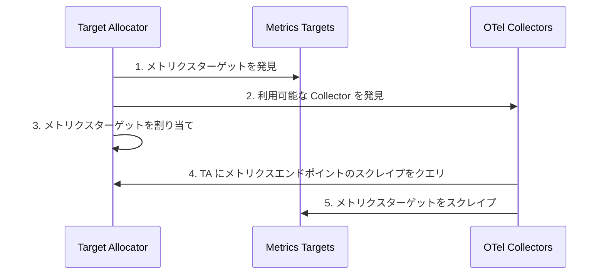

[Prometheus](https://prometheus.io/) や [OpenTelemetry](/docs/what-is-opentelemetry/) のようなツールは、複雑な分散システムの健全性、パフォーマンス、可用性の監視に役立ちます。
どちらも [Cloud Native Computing Foundation (CNCF)](https://www.cncf.io/) 傘下のオープンソースプロジェクトですが、オブザーバビリティにおいてそれぞれどのような役割を果たしているのでしょうか。

OpenTelemetry（略称 OTel）は、テレメトリーデータの計装、生成、収集、エクスポートのためのベンダー中立なオープン標準です。
Prometheus はオブザーバビリティの分野で定番のツールであり、組織内の監視とアラートに広く利用されています。

Prometheus と OTel はどちらもメトリクスを出力しますが、両者の違いと類似点については多くのことがあり、この記事の範囲外です。
ここでは、OTel がどのように Prometheus をサポートしているか、特に Kubernetes 環境での連携に焦点を当てて紹介します。
この記事で学べること：

- OTel Collector の [Prometheus レシーバー](https://github.com/open-telemetry/opentelemetry-collector-contrib/tree/dbdb56d285d860849323346d58c83b14c1ed6c62/receiver/prometheusreceiver?from_branch=main) を使って Prometheus メトリクスを取り込む方法。
- K8s クラスターレシーバーや Kubelet 統計レシーバーなど、OTel ネイティブのオプションによる Prometheus メトリクス収集の代替手段。

また、OTel Operator の Target Allocator（TA）について技術的に掘り下げ、以下を学びます：

- Prometheus のサービスディスカバリにどのように活用できるか。
- Prometheus ターゲットの均等な分配をどのように実現するか。

## OTel と Prometheus {#otel-and-prometheus}

OTel は主にオブザーバビリティの計装部分に焦点を当てているため、テレメトリーを保存するバックエンドは提供していません。
データの保存、アラート、クエリのためにバックエンドベンダーにデータを転送する必要があります。

一方、Prometheus は計装クライアントに加えて、メトリクス用の時系列データストアを提供します。
グラフやチャートの表示、アラートの設定、Web ユーザーインターフェイスを通じたデータのクエリが可能です。
また、[Prometheus テキストベースのエクスポジションフォーマット](https://prometheus.io/docs/instrumenting/exposition_formats/#exposition-formats)として知られるデータフォーマットも含んでいます。

Prometheus の _データ_ はディメンショナル時系列として保存されます。
つまり、データには属性（たとえばラベルやディメンション）とタイムスタンプがあります。

Prometheus _サーバー_ は、設定ファイルで定義されたターゲットから Prometheus メトリクスデータを収集します。
ターゲットとは、Prometheus サーバーが保存するメトリクスを公開するエンドポイントのことです。

Prometheus はモニタリングの分野で非常に普及しており、[Kubernetes](https://kubernetes.io/docs/concepts/cluster-administration/system-metrics/) や [HashiCorp の Nomad](https://developer.hashicorp.com/nomad/docs/operations/monitoring-nomad) など、多くのツールが Prometheus フォーマットでメトリクスをネイティブに出力しています。
それ以外のツールについても、データを Prometheus に集約・インポートするためのベンダーやコミュニティによる [Prometheus エクスポーター](https://prometheus.io/docs/instrumenting/exporters/)が多数あります。

Prometheus はさまざまなインフラストラクチャやアプリケーションのメトリクスの監視に利用できますが、最も一般的なユースケースの1つは Kubernetes の監視です。
この記事では、Prometheus による監視のこの側面に焦点を当てます。

## OpenTelemetry を使った Prometheus メトリクス {#prometheus-metrics-with-opentelemetry}

このセクションでは、OTel と Prometheus の相互運用性を示すいくつかの OTel Collector コンポーネントについて学びます。

まず、[Collector](/docs/collector/) について簡単におさらいしましょう。
Collector は、複数のソースからテレメトリーを収集し、複数の送信先にデータをエクスポートするために使用できる OTel コンポーネントです。
Collector はデータ属性の変更や個人を特定できる情報のスクラブなど、テレメトリーの処理も行います。
たとえば、Prometheus SDK を使ってメトリクスを生成し、Collector で取り込み、処理を行い（必要に応じて）、選択したバックエンドに転送できます。


[Prometheus レシーバー](https://github.com/open-telemetry/opentelemetry-collector-contrib/tree/dbdb56d285d860849323346d58c83b14c1ed6c62/receiver/prometheusreceiver?from_branch=main)を使うと、Prometheus メトリクスを公開するあらゆるソフトウェアからメトリクスを収集できます。
サービスをスクレイプするための Prometheus のドロップインリプレースメントとして機能し、`scrape_config` の[すべての設定](https://github.com/prometheus/prometheus/blob/v2.28.1/docs/configuration/configuration.md#scrape_config)をサポートしています。

OTel コンテキストをメトリクスイベントに関連付ける記録された値である[エグゼンプラー](/docs/specs/otel/metrics/data-model/#exemplars)に興味がある場合も、Prometheus レシーバーを使用できます。
なお、エグゼンプラーは現在 [OpenMetrics](/docs/specs/otel/compatibility/prometheus_and_openmetrics/) フォーマットでのみ利用可能です。

このコンポーネントに関して考慮すべき点は、活発に開発中であるということです。
そのため、ステートフルなコンポーネントであることを含め、いくつかの[制限事項](https://github.com/open-telemetry/opentelemetry-collector-contrib/blob/c9585747e97d1ba5a0aae3bee72eaf76438951f4/receiver/prometheusreceiver/README.md?from_branch=main#%EF%B8%8F-warning)があります。
また、_Target Allocator なしで_ Collector の複数レプリカを実行する場合、このコンポーネントの使用は推奨されません。
その状態では以下の問題が生じます：

- Collector がスクレイピングの自動スケールを行えない
- レプリカが同じ設定で実行されている場合、ターゲットが複数回スクレイプされる
- 手動でスクレイピングをシャーディングしたい場合、各レプリカに異なるスクレイピング設定を構成する必要がある

OTel Collector から Prometheus へメトリクスをエクスポートするには、以下のオプションがあります。
[Prometheus エクスポーター](https://github.com/open-telemetry/opentelemetry-collector-contrib/tree/635d4254a3018eb3ca8f1736e71fcb54f8ed6e5a/exporter/prometheusexporter?from_branch=main#prometheus-exporter)と [Prometheus Remote Write エクスポーター](https://github.com/open-telemetry/opentelemetry-collector-contrib/blob/f4661d486acbbef5c4fb071adafe5818035d2512/exporter/prometheusremotewriteexporter/README.md?from_branch=main)です。
また、Collector にデフォルトで付属する [OTLP HTTP エクスポーター](https://github.com/open-telemetry/opentelemetry-collector/tree/f306288b57856f7668e541a49d9945c3c707b7a3/exporter/otlphttpexporter?from_branch=main)を使用し、Prometheus のネイティブ OTLP エンドポイントを利用することもできます。
なお、[Prometheus も OTLP をネイティブにサポートするようになりました](https://prometheus.io/blog/2024/03/14/commitment-to-opentelemetry/)。

Prometheus エクスポーターを使うと、Prometheus フォーマットでデータを送信でき、その後 Prometheus サーバーによってスクレイプされます。
Prometheus のスクレイプ HTTP エンドポイントを通じてメトリクスをレポートするために使用されます。
この[例](https://github.com/open-telemetry/opentelemetry-go-contrib/tree/7d7b6c6baf807d74ab3360a459ccbecebc0b1eef/examples/prometheus?from_branch=main)を試して詳しく学べます。
ただし、すべてのメトリクスが単一のスクレイプで送信されるため、スクレイピングは実際にはスケールしません。

スケーリングの懸念を回避するために、かわりに Prometheus Remote Write エクスポーターを使用できます。
これにより、複数の Collector インスタンスから問題なく Prometheus にデータをプッシュできます。
Prometheus はリモートライトによる取り込みも受け付けるため、OTel メトリクスを生成して Prometheus リモートライト互換のバックエンドに送信したい場合にも、このエクスポーターを使用できます。

なお、Prometheus サーバーの Prometheus Remote Write は現在、Help や Type などのメタデータをサポートしていません。
詳しくは [issue #13163](https://github.com/prometheus/prometheus/issues/13163) および [issue #12608](https://github.com/prometheus/prometheus/issues/12608) をご確認ください。
これは [Prometheus Remote Write v2.0](https://prometheus.io/docs/specs/remote_write_spec_2_0/#io-prometheus-write-v2-request) で対応される予定です。

両エクスポーターのアーキテクチャの詳細については、[Use Prometheus Remote Write exporter](https://grafana.com/blog/2023/07/20/a-practical-guide-to-data-collection-with-opentelemetry-and-prometheus/#6-use-prometheus-remote-write-exporter) を参照してください。

## Target Allocator の活用 {#using-the-target-allocator}

スケーラビリティは Prometheus の一般的な課題です。
つまり、監視対象のターゲットやメトリクスが増加する中で、パフォーマンスとリソース割り当てを効果的に維持する能力のことです。
これに対処するための1つのオプションは、ラベルやディメンションに基づいてワークロードをシャーディングすることです。
[これは、特定のパラメーターに基づいてメトリクスを処理するために複数の Prometheus インスタンスを使用することを意味します](https://medium.com/wish-engineering/horizontally-scaling-prometheus-at-wish-ea4b694318dd)。
これにより、個々のインスタンスの負荷を軽減できる可能性があります。
ただし、このアプローチには2つの考慮事項があります。

1つ目は、シャーディングされたインスタンスへのクエリを回避するために管理インスタンスが必要になることです。
つまり、N+1 個の Prometheus インスタンスが必要であり、+1 のメモリは N と同等になるため、メモリ要求が倍増します。
2つ目は、Prometheus のシャーディングでは、最終的にドロップされるとしても、各インスタンスがターゲットをスクレイプする必要があることです。

なお、個々のインスタンスの合計メモリ量に相当する Prometheus インスタンスを用意できる場合、シャーディングのメリットはあまりありません。
より大きなインスタンスを使って直接すべてをスクレイプできるからです。
シャーディングを行う理由は通常、ある程度のフォールトトレランスのためです。
たとえば、1つの Prometheus インスタンスがメモリ不足（OOM）になった場合でも、アラートパイプライン全体がオフラインにならないようにするためです。

幸い、OTel Operator の Target Allocator（TA）はこれらの問題の一部を解決できます。
たとえば、スクレイプされないと分かっているターゲットを自動的にドロップできます。
TA はまた、ターゲットを自動的にシャーディングします。
`hashmod` でシャーディングする場合は[レプリカ数に基づいて設定を更新する必要があります](https://www.robustperception.io/scaling-and-federating-prometheus/)が、TA ではその必要がありません。
TA はまた、PodMonitor や ServiceMonitor などのリソースを引き続き使用して、Kubernetes インフラストラクチャに関する Prometheus メトリクスの収集を続けられます。

Target Allocator は OTel Operator の一部です。
[OTel Operator](https://github.com/open-telemetry/opentelemetry-operator) は、以下を行う [Kubernetes Operator](https://kubernetes.io/docs/concepts/extend-kubernetes/operator/) です：

- [OpenTelemetry Collector](/docs/collector/) の管理
- Pod への[自動計装](https://www.honeycomb.io/blog/what-is-auto-instrumentation)の注入と設定

実際に、Operator はこの機能をサポートするために、Kubernetes に2つの新しい[カスタムリソース](https://kubernetes.io/docs/concepts/extend-kubernetes/api-extension/custom-resources/)（CR）タイプを作成します。
[OpenTelemetry Collector CR](https://github.com/open-telemetry/opentelemetry-operator#getting-started) と [Autoinstrumentation CR](https://github.com/open-telemetry/opentelemetry-operator#opentelemetry-auto-instrumentation-injection) です。

今回は Target Allocator に焦点を当てます。
TA は、Operator の OTel Collector 管理機能のオプションコンポーネントです。

一言で言えば、Target Allocator は、Prometheus のサービスディスカバリとメトリクス収集の機能を分離し、それぞれを独立してスケーリングできるようにするメカニズムです。
OTel Collector は Prometheus をインストールすることなく Prometheus メトリクスを管理します。
TA は Collector の Prometheus レシーバーの設定を管理します。

Target Allocator は2つの機能を提供します：

- OTel Collector のプール間での Prometheus ターゲットの均等分配
- Prometheus カスタムリソースのディスカバリ

それぞれについて掘り下げていきましょう。

### Prometheus ターゲットの均等分配 {#even-distribution-of-prometheus-targets}

Target Allocator の最初の仕事は、スクレイプするターゲットを発見し、ターゲットを割り当てる OTel Collector を発見することです。
具体的には以下のように動作します：

1. Target Allocator がスクレイプするすべてのメトリクスターゲットを見つける
2. Target Allocator が利用可能なすべての Collector を見つける
3. Target Allocator がどの Collector がどのメトリクスをスクレイプするかを決定する
4. Collector が Target Allocator にクエリしてスクレイプするメトリクスを確認する
5. Collector が割り当てられたターゲットをスクレイプする

これは、Prometheus スクレイパーではなく、OTel Collector がメトリクスを収集することを意味します。

**ターゲット**とは、Prometheus が保存するメトリクスを提供するエンドポイントです。
**スクレイプ**とは、ターゲットインスタンスから HTTP リクエストを通じてメトリクスを収集し、レスポンスを解析して、収集したサンプルをストレージに取り込むアクションです。



### Prometheus カスタムリソースのディスカバリ {#discovery-of-prometheus-custom-resources}

Target Allocator の2つ目の仕事は、Prometheus Operator の CR、すなわち [ServiceMonitor と PodMonitor](https://github.com/open-telemetry/opentelemetry-operator/tree/de81a64ae8d7d2f4f48945049d8ef9ad3509f89e/cmd/otel-allocator?from_branch=main#target-allocator) のディスカバリを提供することです。

以前は、すべての Prometheus スクレイプ設定は Prometheus レシーバーを通じて行う必要がありました。
Target Allocator のサービスディスカバリ機能が有効化されると、TA はクラスターにデプロイされた PodMonitor と ServiceMonitor のインスタンスからスクレイプ設定を作成することで、Prometheus レシーバーの設定を簡素化します。


Target Allocator を Prometheus CR ディスカバリに使用するために、Kubernetes クラスターに Prometheus がインストールされている必要はありませんが、TA には ServiceMonitor と PodMonitor のインストールが必要です。
これらの CR は Prometheus Operator にバンドルされていますが、スタンドアロンでもインストールできます。
最も簡単な方法は、個別の [PodMonitor YAML](https://github.com/prometheus-community/helm-charts/blob/ad05cfdbbf20b84325f41018e55eddbd841ec9da/charts/kube-prometheus-stack/charts/crds/crds/crd-podmonitors.yaml?from_branch=main) と [ServiceMonitor YAML](https://github.com/prometheus-community/helm-charts/blob/ad05cfdbbf20b84325f41018e55eddbd841ec9da/charts/kube-prometheus-stack/charts/crds/crds/crd-servicemonitors.yaml?from_branch=main) のカスタムリソース定義（CRD）のコピーを取得することです。

OTel が PodMonitor と ServiceMonitor の Prometheus リソースをサポートしているのは、これらが Kubernetes インフラストラクチャ監視で広く使われているためです。
そのため、OTel Operator の開発者は、これらを OTel エコシステムに簡単に追加できるようにしたいと考えました。

PodMonitor と ServiceMonitor は Pod からのメトリクス収集に限定されており、kubelet などの他のエンドポイントのスクレイプはできません。
その場合は、Collector の [Prometheus レシーバー](https://github.com/open-telemetry/opentelemetry-collector-contrib/blob/c9585747e97d1ba5a0aae3bee72eaf76438951f4/receiver/prometheusreceiver/README.md?from_branch=main)のPrometheus スクレイプ設定に引き続き依存する必要があります。

### 設定 {#configuration}

以下は OTel Collector CR の YAML 設定です。
なお、この Collector は `opentelemetry` という名前の名前空間で実行されていますが、任意の名前空間で実行できます。

主なコンポーネントは以下のとおりです：

- **mode:** [Operator がサポートする4つの OTel Collector デプロイメントモード](https://github.com/open-telemetry/opentelemetry-operator?tab=readme-ov-file#deployment-modes)の1つです：Sidecar、Deployment、StatefulSet、DaemonSet。
- **targetallocator:** Target Allocator を設定する場所です。なお、[Target Allocator は Deployment、DaemonSet、StatefulSet モードでのみ動作します](https://www.youtube.com/watch?v=Uwq4EPaMJFM)。
- **config:** OTel Collector の設定 YAML を構成する場所です。

```yaml
apiVersion: opentelemetry.io/v1alpha1
kind: OpenTelemetryCollector
metadata:
  name: otelcol
  namespace: opentelemetry
spec:
  mode: statefulset
  targetAllocator:
    enabled: true
    serviceAccount: opentelemetry-targetallocator-sa
    prometheusCR:
      enabled: true
  config: |
    receivers:
      otlp:
        protocols:
          grpc:
          http:
      prometheus:
        config:
          scrape_configs:
          - job_name: 'otel-collector'
            scrape_interval: 30s
            static_configs:
            - targets: [ '0.0.0.0:8888' ]
        target_allocator:
          endpoint: http://otelcol-targetallocator
          interval: 30s
          collector_id: "${POD_NAME}"
…
```

Target Allocator を使用するには、`spec.targetallocator.enabled` を `true` に設定する必要があります（サポートされるモードについては前述の注記を参照してください）。

次に、デプロイされた Collector の Prometheus レシーバーが、spec の Collector 設定セクションで `target_allocator.endpoint` を設定することにより、Target Allocator を認識するようにする必要があります：

```yaml
receivers:
  prometheus:
    config:
      scrape_configs:
        - job_name: 'otel-collector'
          scrape_interval: 30s
          static_configs:
            - targets: ['0.0.0.0:8888']
    target_allocator:
      endpoint: http://otelcol-targetallocator
      interval: 30s
      collector_id: '${POD_NAME}'
```

Prometheus レシーバー設定が指し示す Target Allocator エンドポイントは、OTel Collector の名前（この例では `otelcol`）と `-targetallocator` 接尾辞の連結です。

Prometheus のサービスディスカバリ機能を使用するには、`spec.targetallocator.prometheusCR.enabled` を `true` に設定して有効化する必要があります。

最後に、Target Allocator の Prometheus CR 機能を有効にしたい場合は、独自の ServiceMonitor と PodMonitor のインスタンスを定義する必要があります。
以下は、`app: my-app` というラベルを持つサービスを探し、`prom` という名前のポートを持つエンドポイントを15秒ごとにスクレイプする、ServiceMonitor の定義例です。

```yaml
apiVersion: monitoring.coreos.com/v1
kind: ServiceMonitor
metadata:
  name: sm-example
  namespace: opentelemetry
  labels:
    app.kubernetes.io/name: py-prometheus-app
    release: prometheus
spec:
  selector:
    matchLabels:
      app: my-app
  namespaceSelector:
    matchNames:
      - opentelemetry
  endpoints:
    - port: prom
      interval: 15s
```

対応する `Service` 定義は、標準の [Kubernetes Service](https://kubernetes.io/docs/concepts/services-networking/service/) 定義であり、以下のとおりです：

```yaml
apiVersion: v1
kind: Service
metadata:
  name: py-prometheus-app
  namespace: opentelemetry
  labels:
    app: my-app
    app.kubernetes.io/name: py-prometheus-app
spec:
  selector:
    app: my-app
    app.kubernetes.io/name: py-prometheus-app
  ports:
    - name: prom
      port: 8080
```

`Service` には `app: my-app` というラベルと `prom` という名前のポートがあるため、ServiceMonitor によって検出されます。

監視したいサービスごとに個別の ServiceMonitor を作成することも、すべてのサービスを包含する単一の ServiceMonitor を作成することもできます。
PodMonitor についても同様です。

Target Allocator がスクレイプを開始する前に、Kubernetes のロールベースアクセス制御（RBAC）を設定する必要があります。
つまり、Target Allocator がメトリクスを取得するために必要なすべてのリソースにアクセスできるよう、[ServiceAccount](https://kubernetes.io/docs/tasks/configure-pod-container/configure-service-account/) と対応するクラスターロールが必要です。

独自の ServiceAccount を作成し、OTel Collector CR で `spec.targetAllocator.serviceAccount` として参照できます。
その後、このサービスアカウントの [ClusterRole](https://kubernetes.io/docs/reference/access-authn-authz/rbac/#role-and-clusterrole) と [ClusterRoleBinding](https://kubernetes.io/docs/reference/access-authn-authz/rbac/#rolebinding-and-clusterrolebinding) を設定する必要があります。

ServiceAccount の設定を省略した場合、Target Allocator は自動的に ServiceAccount を作成します。
ServiceAccount のデフォルト名は、Collector 名と `-collector` 接尾辞の連結です。
デフォルトでは、この ServiceAccount にはポリシーが定義されていないため、独自の [ClusterRole](https://kubernetes.io/docs/reference/access-authn-authz/rbac/#role-and-clusterrole) と [ClusterRoleBinding](https://kubernetes.io/docs/reference/access-authn-authz/rbac/#rolebinding-and-clusterrolebinding) を作成する必要があります。

以下は [OTel Target Allocator の readme](https://github.com/open-telemetry/opentelemetry-operator/tree/de81a64ae8d7d2f4f48945049d8ef9ad3509f89e/cmd/otel-allocator?from_branch=main#rbac) から取得した RBAC 設定の例です。
ServiceAccount、ClusterRole、ClusterRoleBinding の設定が含まれています：

```yaml
apiVersion: v1
kind: ServiceAccount
metadata:
  name: opentelemetry-targetallocator-sa
  namespace: opentelemetry
---
apiVersion: rbac.authorization.k8s.io/v1
kind: ClusterRole
metadata:
  name: opentelemetry-targetallocator-role
rules:
  - apiGroups:
      - monitoring.coreos.com
    resources:
      - servicemonitors
      - podmonitors
    verbs:
      - '*'
  - apiGroups: ['']
    resources:
      - namespaces
    verbs: ['get', 'list', 'watch']
  - apiGroups: ['']
    resources:
      - nodes
      - nodes/metrics
      - services
      - endpoints
      - pods
    verbs: ['get', 'list', 'watch']
  - apiGroups: ['']
    resources:
      - configmaps
    verbs: ['get']
  - apiGroups:
      - discovery.k8s.io
    resources:
      - endpointslices
    verbs: ['get', 'list', 'watch']
  - apiGroups:
      - networking.k8s.io
    resources:
      - ingresses
    verbs: ['get', 'list', 'watch']
  - nonResourceURLs: ['/metrics']
    verbs: ['get']
---
apiVersion: rbac.authorization.k8s.io/v1
kind: ClusterRoleBinding
metadata:
  name: opentelemetry-targetallocator-rb
subjects:
  - kind: ServiceAccount
    name: opentelemetry-targetallocator-sa
    namespace: opentelemetry
roleRef:
  kind: ClusterRole
  name: opentelemetry-targetallocator-role
  apiGroup: rbac.authorization.k8s.io
```

前述の [ClusterRole](https://kubernetes.io/docs/reference/access-authn-authz/rbac/#role-and-clusterrole) を詳しく見ると、以下のルールが、Target Allocator が Prometheus 設定に基づいて必要なすべてのターゲットをクエリするために最低限必要なアクセス権を提供します：

```yaml
- apiGroups: ['']
  resources:
    - nodes
    - nodes/metrics
    - services
    - endpoints
    - pods
  verbs: ['get', 'list', 'watch']
- apiGroups: ['']
  resources:
    - configmaps
  verbs: ['get']
- apiGroups:
    - discovery.k8s.io
  resources:
    - endpointslices
  verbs: ['get', 'list', 'watch']
- apiGroups:
    - networking.k8s.io
  resources:
    - ingresses
  verbs: ['get', 'list', 'watch']
- nonResourceURLs: ['/metrics']
  verbs: ['get']
```

OpenTelemetryCollector CR で `prometheusCR` を有効にした場合（`spec.targetAllocator.prometheusCR.enabled` を `true` に設定）、以下のロールも定義する必要があります。
これらは Target Allocator に PodMonitor と ServiceMonitor の CR へのアクセス権を付与します。
また、PodMonitor と ServiceMonitor への名前空間アクセスも付与します。

```yaml
- apiGroups:
    - monitoring.coreos.com
  resources:
    - servicemonitors
    - podmonitors
  verbs:
    - '*'
- apiGroups: ['']
  resources:
    - namespaces
  verbs: ['get', 'list', 'watch']
```

## Kubernetes 向けの追加 OTel コンポーネント {#additional-otel-components-for-kubernetes}

このセクションでは、Kubernetes メトリクスの収集に使用できる追加の OTel Collector コンポーネントについて説明します。

データの受信：

- [Kubernetes Cluster Receiver](https://github.com/open-telemetry/opentelemetry-collector-contrib/tree/635d4254a3018eb3ca8f1736e71fcb54f8ed6e5a/receiver/k8sclusterreceiver?from_branch=main)：[Kubernetes API サーバー](https://kubernetes.io/docs/reference/command-line-tools-reference/kube-apiserver/)からクラスターレベルのメトリクスとエンティティイベントを収集
- [Kubernetes Objects Receiver](https://github.com/open-telemetry/opentelemetry-collector-contrib/tree/635d4254a3018eb3ca8f1736e71fcb54f8ed6e5a/receiver/k8sobjectsreceiver?from_branch=main)：Kubernetes API サーバーからオブジェクトを収集（プル/ウォッチ）
- [Kubelet Stats Receiver](https://github.com/open-telemetry/opentelemetry-collector-contrib/tree/635d4254a3018eb3ca8f1736e71fcb54f8ed6e5a/receiver/kubeletstatsreceiver?from_branch=main)：[Kubelet](https://kubernetes.io/docs/reference/command-line-tools-reference/kubelet/) からメトリクスをプルし、さらなる処理のためにメトリクスパイプラインに送信
- [Host Metrics Receiver](https://github.com/open-telemetry/opentelemetry-collector-contrib/tree/635d4254a3018eb3ca8f1736e71fcb54f8ed6e5a/receiver/hostmetricsreceiver?from_branch=main)：クラスターを構成するホストからシステムメトリクスをスクレイプ

データの処理：

- [Kubernetes Attributes Processor](https://github.com/open-telemetry/opentelemetry-collector-contrib/tree/635d4254a3018eb3ca8f1736e71fcb54f8ed6e5a/processor/k8sattributesprocessor?from_branch=main)：Kubernetes コンテキストを追加し、これにより
- アプリケーションのテレメトリーと Kubernetes のテレメトリーを相関させることが可能になります。
- Kubernetes を OpenTelemetry で監視する上で最も重要なコンポーネントの1つと考えられています。

Kubernetes Attributes Processor を使用して、Pod や名前空間に追加した Kubernetes ラベルやアノテーションを利用して、トレース、メトリクス、ログのカスタムリソース属性を設定することもできます。

Kubernetes を監視するために実装できる Collector コンポーネントは他にもいくつかあります。
Kubernetes 固有のものに加え、バッチ、メモリリミッター、リソースプロセッサーなどの汎用プロセッサーもあります。
詳しくは [Kubernetes の重要なコンポーネント](/docs/platforms/kubernetes/collector/components/)を参照してください。

Collector 設定ファイルでコンポーネントを設定した後、[パイプライン](/docs/collector/configuration/#pipelines)セクションでそれらを有効化する必要があります。
データパイプラインにより、任意のソースからデータを[収集](/docs/collector/configuration/#receivers)、[処理](/docs/collector/configuration/#processors)し、[1つ以上の送信先にルーティング](/docs/collector/configuration/#exporters)できます。

## メリットとデメリット {#pros-and-cons}

以下は、この記事で取り上げた構成のメリットとデメリットです。

**メリット：**

- Prometheus をデータストアとして維持する必要がなく、全体的に維持すべきインフラストラクチャが削減されます。特に、OTel データ（トレース、メトリクス、ログ）を取り込むオールインワンのオブザーバビリティバックエンドを選択する場合はなおさらです。
- ServiceMonitor と PodMonitor の維持は必要ですが、Prometheus Operator を最新に保つことに比べれば作業量ははるかに少なくなります。
- Prometheus メトリクスを引き続き取得しながら、完全な OTel ソリューションに移行できます。
- OTel はメトリクスに加えてトレースとログを提供し、これらのシグナルの相関も可能にするため、Kubernetes 環境のオブザーバビリティが強化されます。
- OTel は Target Allocator や OTel Collector コンポーネントなどの便利なツールを提供し、設定やデプロイメントオプションに柔軟性をもたらします。

**デメリット：**

- 新しいオブザーバビリティツールの導入と管理には、OTel の概念、コンポーネント、ワークフローに不慣れなユーザーにとって急な学習曲線が伴います。
- Prometheus の強力なクエリ言語である PromQL のユーザーは、メトリクスを Prometheus 互換のバックエンドに送信する場合に**のみ**引き続き使用できます。
- OTel 自体に多くの可動部品があり、スケーラビリティと導入において独自の課題があります。
- OTel 内の成熟度と安定性にはばらつきがあります。Prometheus には成熟したエコシステムがあります。
- OTel コンポーネントの維持と管理に追加の計算リソースと人的リソースが必要です。
- Prometheus と OTel の両方のコンポーネントの管理と維持は、監視インフラストラクチャに運用上の複雑さをもたらします。

## まとめ {#conclusion}

Prometheus のメンテナーも、OTLP メトリクスのバックエンドとして使いやすくするために、Prometheus 側から両プロジェクト間の相互運用性をさらに発展させてきました。
たとえば、Prometheus は OTLP を受け入れられるようになり、近い将来、Prometheus エクスポーターを使って OTLP をエクスポートできるようになります。
つまり、Prometheus SDK で計装されたサービスがある場合、OTLP を _プッシュ_ して、OTel ユーザー向けの豊富な Prometheus エクスポーターエコシステムを活用できるようになります。
メンテナーはまた、デルタテンポラリティのサポートの追加にも取り組んでいます。
この[コンポーネント](https://github.com/open-telemetry/opentelemetry-collector-contrib/issues/30479)は、デルタサンプルをそれぞれの累積的な対応するものに集約します。
Prometheus の OTel へのコミットメントについて詳しくは、[Our commitment to OpenTelemetry](https://prometheus.io/blog/2024/03/14/commitment-to-opentelemetry/) を参照してください。

OTel を使って Prometheus メトリクスを収集する方法をどのように決定するにしても、最終的に組織にとって正しいものはビジネスニーズに依存します。
前述の OTel コンポーネントを使用して、すべてのメトリクスを Prometheus フォーマットに変換することも、Prometheus メトリクスを OTLP に変換することもできます。
Prometheus 自体は長期的なデータ保存向けに構築されておらず、スケーリングの課題もありますが、[Mimir](https://grafana.com/oss/mimir/)、[Thanos](https://thanos.io/v0.10/thanos/getting-started.md/)、[Cortex](https://cortexmetrics.io/docs/guides/running-cortex-on-kubernetes/) などのオープンソースプロジェクトがこれらの懸念に対処できます。

これらのソリューションを組織に実装するかどうかにかかわらず、OTel と Prometheus を使ってオブザーバビリティの素晴らしさに導く追加のオプションがあることを知っておくのは良いことです。

_この記事のバージョンは、もともと [New Relic のブログに投稿されたもの][originally posted]です。_

[originally posted]: <{}>
