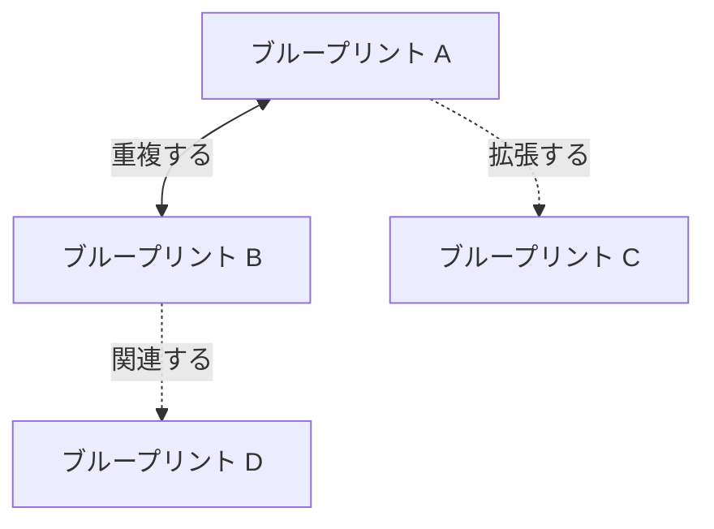
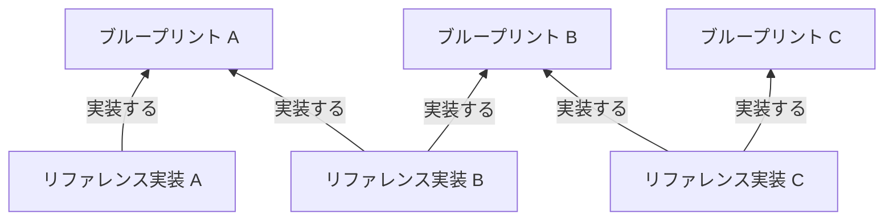

OpenTelemetry を導入するエンドユーザーが、その過程のどこかで _「なぜこんなに複雑なんだ?」_ と自問することは珍しくありません。
本格的な導入には、通常、SDK のさまざまな設定方法、複数のコレクターのデプロイメント、データパイプライン、計装ライブラリ、セマンティック規約レジストリ、多くの異なるプログラミング言語にわたる手動計装用 API、その他多数の可動部分を理解する必要があります。

これらの可動部分は単独で動作するわけでもありません。
組織のソフトウェアシステムを標準的で高品質なテレメトリーで記述するための統合ソリューションの一部として、互いに上手く連携する必要があります。
これに失敗すると、OpenTelemetry が解決しようとしていたまさにその問題、すなわちスタック全体で異なるセマンティック規約が使われた断片的なテレメトリー、サービスとシグナル間のコンテキスト伝搬の欠如、不必要に大量のデータ量……、要するに必要なものとは正反対の、品質の低いテレメトリーに行き着くリスクがあります。

プロジェクトが進化して安定するにつれて、また大規模な本番環境で OpenTelemetry を導入するエンドユーザーが増えるにつれて、同じフィードバックを耳にし続けてきました。
エンドユーザーは、プロジェクトとそのメンテナーが推奨する、規範的で意見の明確な「OpenTelemetry のデプロイ方法」(これが何を意味するかは解釈次第) を求めています。
彼らは、_自分たち_ のオブザーバビリティの課題を _最もシンプルな_ 方法で解決するのに必要なコンポーネントを構成するための一連の手順に従いたいのであって、それ以上を望んでいるわけではありません。

皆さんの声を聞き、私たちは耳を傾けました。
End User SIG が Developer Experience SIG と協力して推進する新しい取り組み、[ブループリントとリファレンス実装][2] を発表できることをうれしく思います。

## 複雑性の源とブループリントの必要性 {#the-source-of-complexity-and-the-need-for-blueprints}

最初の問いに戻りましょう。_「なぜこんなに複雑なんだ?」_。
1986 年に書かれた Fred Brooks の論文 [_銀の弾などない —ソフトウェア工学における本質と偶有_][3] で説明されている用語を用いると、OTel 導入の複雑性は 2 つに分けられます。_本質的_ なものと、より頻繁に見られる _偶有的_ なものです。

### 本質的な複雑性 {#essential-complexity}

OTel の複雑性の _本質的_ な部分、つまりその設計に内在する部分は、主にその幅広さと横断的な性質に起因します。
OpenTelemetry はスタックのほぼすべての部分、つまりクライアントサイド(ブラウザやモバイル)からアプリケーション、Kubernetes、インフラ、データベースなどに触れます。
私たちのドキュメントはこれらの各コンポーネントがどのように動作するかを説明するのに優れており、[宣言的設定][4]や[Injector][5]といった新しい開発、そして長年存在している [OpenTelemetry Operator][6] により、これらすべてのコンポーネントにわたる統合された設定を適用することは容易になりました。
しかし、依然としてこれは非常に大きなデプロイ対象であり、一貫性を達成する必要があり、ほとんどの場合、単一のチームでは扱えないという事実は変わりません。

OpenTelemetry はまた、単一のソリューションに限定されず、任意のバックエンドで動作するように設計されています。
スタックに事前構築済みのエージェントを投入してデータが流れるのを見るという古いモデルは魅力的かもしれませんが、データの主権を維持する必要のある現代のシステムに必要な柔軟性に欠けています。
OpenTelemetry の柔軟性により、エンドユーザーはデータがどのように生成され、最終的にどこに保存されるかにかかわらず、自分自身のデータを制御できますが、この柔軟性は幅広さとあいまってさらなる複雑性をもたらす可能性があります。

要約すると、OTel は大規模に適用すると _本質的_ に複雑になることがあり、これは通常もっともな理由によるものです。

### 偶有的な複雑性 {#accidental-complexity}

OTel 導入の複雑性の _偶有的_ な部分は、ほとんどのツール導入と同様に、主に人間に起因します。
複数のチームが共通の戦略やビジョンなしに、グループ間のコミュニケーションもなく、組織のさまざまな部分で OpenTelemetry を自発的に採用し始めると、標準は損なわれます。
あるチームが別のチームによってデプロイされたコレクターゲートウェイと互換性のない設定で SDK を構成していたり、依存先のサービスとは異なる方法でコンテキストを伝搬していたりして、双方のコンテキスト伝搬を壊してしまうことがあります。

残念ながら、AI はここでは私たちを救ってくれませんし、むしろ事態を悪化させる可能性さえあります。
AI 支援の開発が新しいファイルをここに、重複したメソッドをそこに、あるいは OTel の場合には、コンポーネントを構成・デプロイする新しい方法を追加することで、エントロピーと複雑性が _偶有的_ に制御不能なまま増大してしまったシステムの話は、誰もが聞いたことがあるでしょう。
結果として、システムはそれ自身を、すべての異なる層と依存関係にわたる高品質なテレメトリーで記述することにおいて、効果的でも効率的でもなくなります。

### 複雑性を飼いならすうえでのブループリントの役割 {#the-role-of-blueprints-in-taming-complexity}

現実には、Fred Brooks が述べたように、「銀の弾丸」は存在しません。
あらゆる環境と組織構造はそれぞれ異なるため、現代のオブザーバビリティツールの _本質的_ な複雑性を単純に取り除いて、_「これが OTel をデプロイする唯一の方法だ」_ と言うことはできません。
しかし、確実に、プロジェクトの広がりを整理して OTel 導入を進める人たちの助けとし、_偶有的_ な複雑性を皆で抑え込むことを目指せます!

ここで OTel ブループリントの出番です。
これらのブループリントの構造は戦略的思考のベストプラクティスに基づいており、その内容はエンドユーザーの経験(OTel 導入の過程のいずれかの時点で導入者によって共有されたリファレンス実装に含まれるものを含む)によって導かれます。

主な焦点は、特定の環境で解決すべき最も重要な課題を特定し、ソリューションをその課題のみに範囲限定することで、不要な複雑性を取り除くことにあります。

OTel ブループリントによって、私たちはさまざまなシナリオで組織が直面する最も一般的なオブザーバビリティの課題を分類し、それらを解決することが実証された一連の一般的な設計パターンとベストプラクティスを提案することを目指します。
たとえば、Kubernetes 環境で SDK 設定とコレクターゲートウェイの統合を提供すること、Kubernetes 以外の環境でインフラとアプリケーションを計装すること、または既知のコントロールプレーンワークロードと共に Kubernetes クラスタを監視することによって、エンドユーザーが解決したいと考える多くの一般的な課題があります。

エンドユーザー(AI 支援かどうかにかかわらず)にとって、ブループリントは識別可能な一般的なシナリオと環境のセットと、複数のコンポーネントにわたるベストプラクティスを統合戦略の一部としてデプロイする方法に関する即時実行可能なガイダンスを提供します。

OpenTelemetry のメンテナーは、強化されたツールによってさらに簡素化できる導入時の摩擦をどこに残しているかを特定する手段として、ブループリントとリファレンス実装を利用することもできます。

## ブループリントに期待できること {#what-to-expect-from-blueprints}

OTel ブループリントは既存のドキュメントを書き直すものではありません。
SDK を設定する方法や、コレクターを異なるデプロイパターンでデプロイする方法を説明するブループリントは登場しません。
それらはすでにドキュメント内で十分にカバーされています。

ブループリントの目的は、読者が自分のオブザーバビリティ戦略に役立てられる、コンポーネント、ソリューション、ベストプラクティスを結びつけ、必要に応じて関連ドキュメントへ案内する、包括的なアプローチを提供することです。

近日中に、ウェブサイトの新しい [ブループリント][11] セクションでブループリントを公開する予定です。
ただし、それまでの間、これから登場するブループリントから期待できる内容を示すために、標準の [ブループリントテンプレート][7] を利用できます。

要するに、ブループリントは次の構成要素を持ちます。

- **Summary**: エンドユーザーとして、自分がこのブループリントの対象読者かどうか、または自分の環境に適用されるかどうかをすばやく確認できます。
- **Common Challenges**: 特定の環境で解決すべき問題を範囲限定します。
  ある事柄が解決すべき問題として特定されていない場合、そのブループリントはそれに対する解決策を提案しません(他のブループリントが提案する場合があります)。
- **General Guidelines**: 範囲内の課題を解決するベストプラクティスと設計パターン。
  ここではアーキテクチャ図と、それらすべてがどのように組み合わさるのかの明確なビジョンが期待できます。
- **Implementation**: 規定されたガイドラインを実装するためのアクションのリストで、関連する既存のドキュメントを指し示します。

単一のブループリントが全員のニーズを解決することは期待していません。
そのかわりに、エンドユーザーに具体的な価値をもたらす、明確に範囲限定された実行可能な戦略を提供することを目指し、ブループリントが互いに接続されることを認識しています。

下の図に示すように、一部のブループリントは互いに **オーバーラップ** することがあり、たとえば OpenTelemetry Operator を使って Collector DaemonSet をデプロイするといった同じ設計パターンを含む可能性があります。
あるブループリントは、たとえば集中型オブザーバビリティプラットフォーム向けの監査ログのように、特定の問題を明確に範囲外と宣言し、別のブループリントによって **拡張** されることを期待することもあります。
より一般的には、ブループリント同士が **関連** することがあり、たとえば Kubernetes オブザーバビリティ向けのブループリントは、別のブループリントで提案された中央コレクターゲートウェイを前提とすることがあります。

最後に、ブループリントは時間とともに進化することも期待できます。
ツールが進化するにつれて、特定の問題へのアプローチ方法が変わる可能性があり、ブループリントはそれを行う最もシンプルで効率的な方法を反映し続けます。

### リファレンス実装にブループリントを根付かせる {#grounding-blueprints-in-reference-implementations}

ブループリントは突然湧いて出るものではありません(本当に、駄洒落のつもりはありません)。
ブループリントは、その分野の専門家、エンドユーザー、ソリューション/オブザーバビリティアーキテクトであって、OTel 導入を直接経験し、大規模に機能する設計パターンを共有できる人々によって提供されます。

ブループリントの性質は、できるだけ多くの個人や組織にとって有用であることです。
そのため、共通の経験を 1 つのナラティブにまとめる、ある程度の一般化が必要です。
しかし、ブループリントは単なる理論的な助言ではなく、事実に基づいていることが極めて重要だと考えています。
最初から、私たちはブループリントをリファレンス実装の形で裏付けたいと考えていました。

リファレンス実装は、現実世界の組織が OpenTelemetry の導入にどのように取り組んできたかを示す、ある時点でのスナップショットです。
それらは自然に、1 つ(または複数)のブループリントの助言の一部(またはすべて)を実装します。

[Adobe][8]、[Mastodon][9]、[Skyscanner][10] はすでに、自分たちの環境で OpenTelemetry 導入にどのように取り組んできたかを共有しています。
この作業は Developer Experience SIG が熱心に推進し、エンドユーザーが自身の物語を共有することを支援してきたものであり、OTel ブループリントが成功するための道筋を大きく整えました。
この取り組みに対し、DevEx SIG に個人的に感謝を申し上げます!

これらのリファレンス実装は、ウェブサイトの新しい [リファレンス実装][12] セクションで公開されました。
また、今後エンドユーザーが自身のストーリーを共有しやすくするための標準的な [テンプレート][13] も用意しました。
多ければ多いほど、にぎやかになります!

## 今こそ、皆さんの声が必要です! {#now-more-than-ever-we-want-your-input}

このすべての作業は、エンドユーザーが私たちにフィードバックを与え、導入の道のりを共有し、専門知識をプロジェクトに提供し、最終的にオブザーバビリティの未来を形作るのを助けてくれなければ、実現できませんでした。

しかし、エンドユーザーの皆さん、私たちはもう一度皆さんの支援を求めています!
まず、End-User SIG の現在の重点課題である進行中の 3 つのブループリント、[Kubernetes 以外の環境におけるインフラとプロセスの計装][14]、[Kubernetes オブザーバビリティ][15]、[集中型テレメトリープラットフォーム][16] に対して、皆さんが寄せたいと思うフィードバックがあれば、ぜひお寄せください。

次に、そして最も重要なこととして、皆さんの経験を共有してください!
私たちは、さまざまな業界や環境にわたるさらに多くのリファレンス実装と、他のエンドユーザーがオブザーバビリティのベストプラクティスを採用するのを助ける新しいブループリントの提案を望んでいます。
OpenTelemetry のベストプラクティス採用をスケールさせる手助けを続けたい場合は、ドキュメント内の [貢献方法][17] を参照してください。
貢献プロセスの簡単な要約を以下に示します。

エンドユーザーとしての皆さんの道のりを、OpenTelemetry の道のりの一部とする絶好の機会です!

[2]: /docs/guidance/
[3]: https://en.wikipedia.org/wiki/No_Silver_Bullet
[4]: /docs/languages/sdk-configuration/declarative-configuration/
[5]: https://github.com/open-telemetry/opentelemetry-injector
[6]: /docs/platforms/kubernetes/operator/
[7]: https://github.com/open-telemetry/sig-end-user/blob/887e20c58849d583e2e25bc25ef93ea146ce1d78/architecture/blueprint-template.md?plain=1&from_branch=main
[8]: /docs/guidance/reference-implementations/adobe/
[9]: /docs/guidance/reference-implementations/mastodon/
[10]: /docs/guidance/reference-implementations/skyscanner/
[11]: /docs/guidance/blueprints/
[12]: /docs/guidance/reference-implementations/
[13]: https://github.com/open-telemetry/sig-end-user/blob/c483a44b12e95c093e0a8b0d7542d470e82ff7fc/architecture/reference-implementation-template.md?plain=1&from_branch=main
[14]: https://github.com/open-telemetry/sig-end-user/issues/245
[15]: https://github.com/open-telemetry/sig-end-user/issues/247
[16]: https://github.com/open-telemetry/sig-end-user/issues/246
[17]: /docs/guidance/#how-to-contribute
