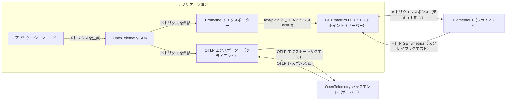

多くのアプリケーションは、メトリクスを直接 [Prometheus](https://prometheus.io/) にエクスポートしています。
Prometheus に馴染みがない方に向けて簡単に説明すると、カウンターやヒストグラムのようなメトリクスを保存するための時系列データベースです。
Prometheus にメトリクスを保存するアプリケーションは、通常、連携の一環として広く使われている Prometheus クライアントを使用しています。

OpenTelemetry が [CNCF の Graduated プロジェクト](/blog/2026/otel-graduates/)となった今、多くの企業がオブザーバビリティアーキテクチャにメトリクス以外のシグナルを追加するために、OpenTelemetry への移行を検討しています。
ログとトレースは、アプリケーションの挙動をより深く理解するための一般的な追加シグナルです。
プロファイルも、さらに深い理解を得るための4番目のテレメトリーシグナルとして注目を集めています。

ここで移行のハードルが生まれます。あるシステムから別のシステムへメトリクスを移行する際に、一括切り替えのイベントなしにどうすれば移行できるでしょうか。
移行のリスクを軽減するには、一定期間メトリクスを両方のシステムにエクスポートし、「移行前」と「移行後」の状態を比較・検証できるインクリメンタルなアプローチが望ましいです。
これにより、メトリクスの監視やアラートの駆動において、どちらのシステムでも本番環境の可視性が失われていないことを確認できます。

## .NET 用 OpenTelemetry Prometheus エクスポーターの使用 {#using-the-opentelemetry-prometheus-exporter-for-net}

.NET 用 OpenTelemetry Prometheus エクスポーターの[最新リリース](https://github.com/open-telemetry/opentelemetry-dotnet/releases/tag/coreunstable-1.18.0-beta.1)では、本番メトリクスでまさにこのアプローチを取ることができます。
アプリケーションやフレームワークのコードで [.NET Meter クラス](https://learn.microsoft.com/dotnet/core/diagnostics/metrics-instrumentation)を使用してメトリクスを収集し、Prometheus と、[`OpenTelemetry.Exporter.OpenTelemetryProtocol`](https://www.nuget.org/packages/OpenTelemetry.Exporter.OpenTelemetryProtocol) NuGet パッケージが提供する [OTLP エクスポーター](/docs/specs/otel/protocol/exporter/)などの別のエクスポーターの両方にエクスポートできます。

Prometheus エクスポーターは、事実上 OpenTelemetry SDK の上に構築された [Prometheus クライアントライブラリ](https://prometheus.io/docs/instrumenting/clientlibs/)であり、アプリケーション内に HTTP スクレイプエンドポイントを公開して、Prometheus サーバーが定期的にアプリケーションからメトリクスを収集できるようにします。
このエクスポーターは OpenTelemetry の [Prometheus 仕様](https://github.com/open-telemetry/opentelemetry-specification/blob/27b10516ad3a27c12a0ab5c63456ddc95766bc68/specification/metrics/sdk_exporters/prometheus.md)（[マトリクス](https://github.com/open-telemetry/opentelemetry-specification/blob/27b10516ad3a27c12a0ab5c63456ddc95766bc68/spec-compliance-matrix.md)）を実装し、[OpenMetrics との互換性](https://github.com/open-telemetry/opentelemetry-specification/blob/27b10516ad3a27c12a0ab5c63456ddc95766bc68/specification/compatibility/prometheus_and_openmetrics.md)を確保するために、[ドキュメント化されたすべてのテキストエクスポジションフォーマット](https://prometheus.io/docs/instrumenting/exposition_formats/)（まだ実験段階の [OpenMetrics 2.0](https://prometheus.io/docs/specs/om/open_metrics_spec_2_0/) を除く）を実装しています。



.NET アプリケーションコードで `Meter` クラスとともに `Counter<T>`、`Gauge<T>`、`Histogram<T>` の計装のみを使用することで、.NET OpenTelemetry SDK と専用の Prometheus クライアントの両方を使わずにメトリクスを収集できます。

```csharp
public class BlogPostComments
{
    private readonly Meter _meter;
    private readonly Counter<long> _likes;

    public BlogPostComments(IMeterFactory meterFactory)
    {
        _meter = meterFactory.Create("OpenTelemetry.Blog");
        _likes = _meter.CreateCounter<long>("blog_post_likes");
    }

    public void BlogPostLiked(long id) =>
        _likes.Add(1, new KeyValuePair<string, object?>("post_id", id));
}
```

OpenTelemetry をサポートするバックエンドに対して、Prometheus と OTLP の両方にメトリクスをエクスポートするよう OpenTelemetry SDK を設定するには、[`OpenTelemetry.Exporter.Prometheus.AspNetCore`](https://www.nuget.org/packages/OpenTelemetry.Exporter.Prometheus.AspNetCore) NuGet パッケージをプロジェクトに追加するだけで、わずかなコードで実現できます。

```csharp
using OpenTelemetry;
using OpenTelemetry.Exporter;
using OpenTelemetry.Metrics;

using var meterProvider = Sdk.CreateMeterProviderBuilder()
    .SetResourceBuilder(CreateResourceBuilder())
    .AddMeter("OpenTelemetry.Blog")
    .AddOtlpExporter()
    .AddPrometheusExporter()
    .Build();
```

また、Prometheus がアプリケーションからメトリクスを収集するために使用する HTTP スクレイプエンドポイントを公開する必要もあります。
これは、`Startup` クラスの `Configure` メソッド内で `IApplicationBuilder` に `UseOpenTelemetryPrometheusScrapingEndpoint` 拡張メソッドを追加することで実現できます。

例:

```csharp
var builder = WebApplication.CreateBuilder(args);

// ここでサービスを設定する

var app = builder.Build();

// ここで他のミドルウェアを設定する

app.MapPrometheusScrapingEndpoint();

app.Run();
```

`Meter` API を使用してメトリクスをエクスポートすることで、アプリケーションコードのポータビリティが向上し、Prometheus 固有の API との結合が解消されます。
これにより、Prometheus クライアントライブラリの依存関係をアプリケーションコードから削除できます。
OpenTelemetry エコシステムでの使用に備えるだけでなく、[`dotnet-counters`](https://learn.microsoft.com/dotnet/core/diagnostics/dotnet-counters) ツールなどの他の .NET エコシステムツールを使用してメトリクスを表示する機能も利用できるようになります。

アプリケーションが現在 [prometheus-net](https://github.com/prometheus-net/prometheus-net) のようなネイティブ Prometheus クライアントのみを使用している場合は、まず `Meter` API の使用に段階的に移行する必要があります。
この移行にどれくらいの時間がかかるかは、既存の Prometheus 計装の複雑さと、適切な変更を行うために利用可能なリソースに依存します。

この移行中に遭遇する可能性のある課題として、`Meter` API に直接的な対応がなく、そのためサポートされていない以下の Prometheus 機能があります。

- Prometheus のサマリーデータ型
- ネイティブヒストグラム

## OTLP を使用した Prometheus へのメトリクスのプッシュ {#pushing-metrics-to-prometheus-using-otlp}

あるいは、Prometheus サーバーのみを持ち、OTLP 互換のバックエンドがなく、メトリクスのエクスポートのみを行いたい場合、Prometheus 自体に OTLP 経由でプッシュされたメトリクスを取り込むオプトインサポートがあります。

まず、`--web.enable-otlp-receiver` コマンドラインフラグを指定して Prometheus を起動してください。

次に、上記のコードスニペットと同様に OTLP エクスポーターを設定しますが、この場合は Prometheus エクスポーターを併用する必要はありません。
また、OTLP エクスポーターがメトリクス OTLP エンドポイントのベースパスを指定し、OTLP エクスポーターのプロトコルとして HTTP/protobuf を使用していることにも注意してください。

```csharp
using OpenTelemetry;
using OpenTelemetry.Exporter;
using OpenTelemetry.Metrics;

using var meterProvider = Sdk.CreateMeterProviderBuilder()
    .SetResourceBuilder(CreateResourceBuilder())
    .AddMeter("OpenTelemetry.Blog")
    .AddOtlpExporter((options, _) =>
    {
        options.Endpoint = new Uri("http://prometheus:9090/api/v1/otlp/v1/metrics");
        options.Protocol = OtlpExportProtocol.HttpProtobuf;
    })
    .Build();
```

このアプローチにより、アプリケーションコードで Prometheus クライアントライブラリに依存することなく、OpenTelemetry .NET SDK で OTLP 経由で Prometheus にメトリクスをプッシュできます。

このアプローチの完全な例は、OpenTelemetry .NET リポジトリの [Getting Started with Prometheus and Grafana](https://github.com/open-telemetry/opentelemetry-dotnet/blob/fcd9fb6db19baf1d24373e517f6810126dd7d26a/docs/metrics/getting-started-prometheus-grafana/README.md) サンプルで確認できます。

## まとめ {#summary}

最小限のランタイムオーバーヘッドで、アプリケーションは OTLP メトリクスのプッシュと Prometheus メトリクスのプルの両方を行えるため、メトリクスに OpenTelemetry 互換のバックエンドを全面的に採用する決定を下すまで、両方のシステムを並行して使用できます。
